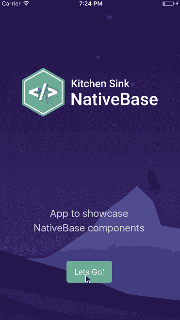
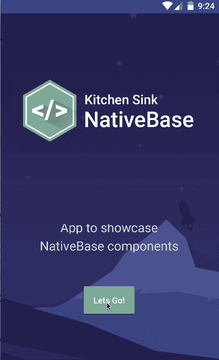
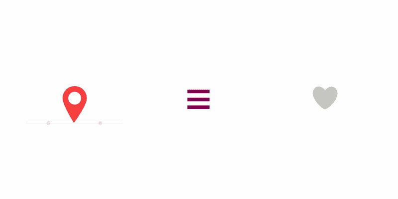
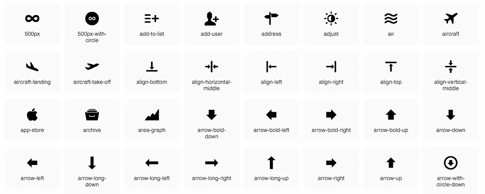
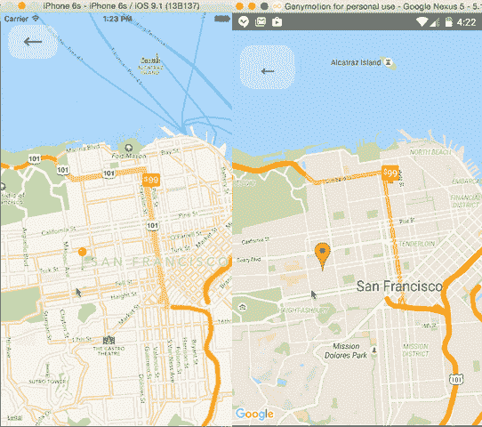
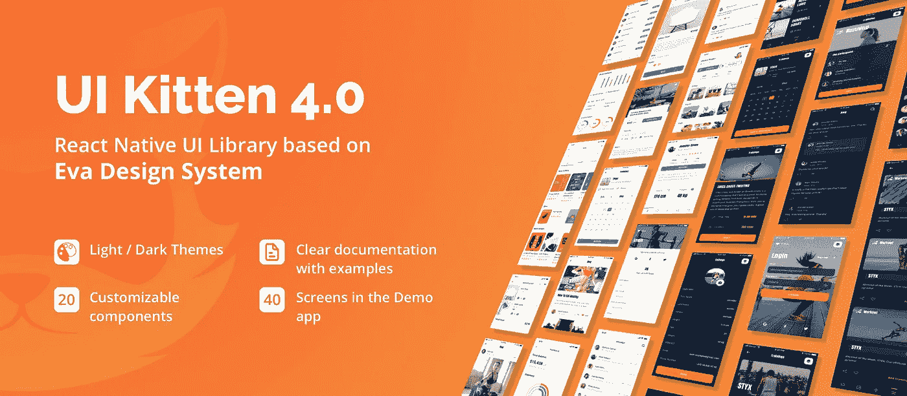
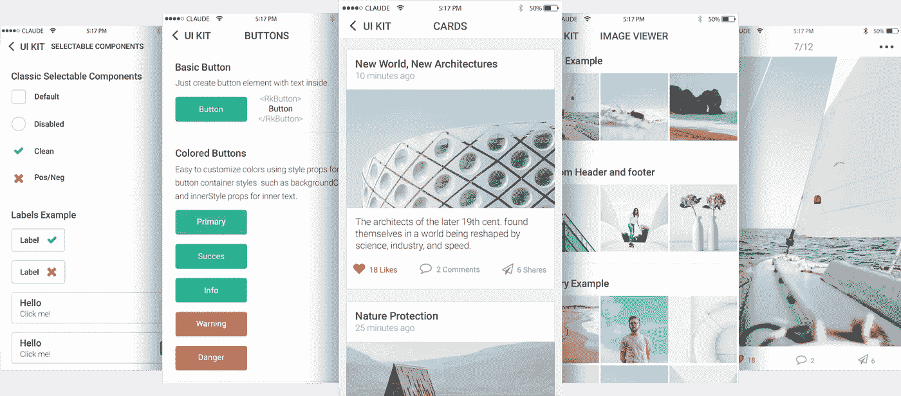
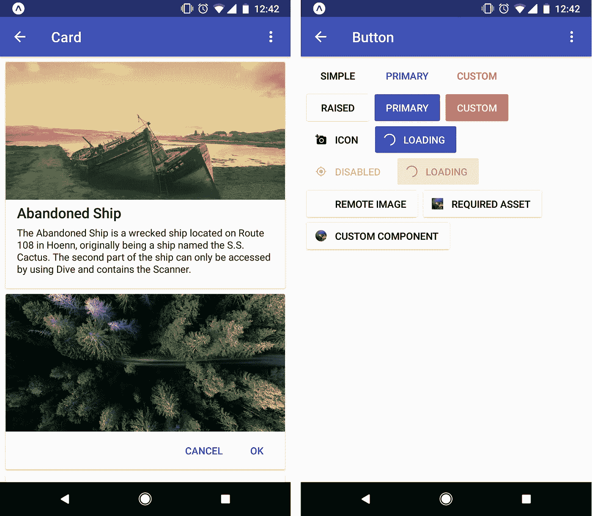
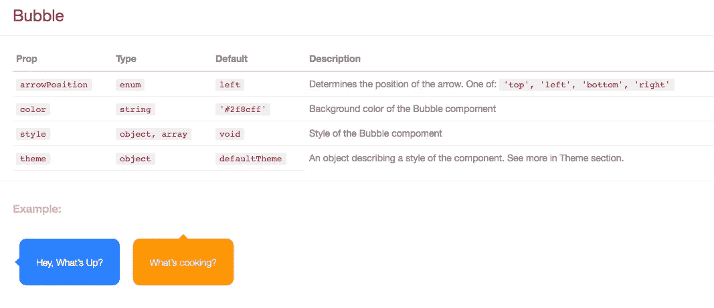
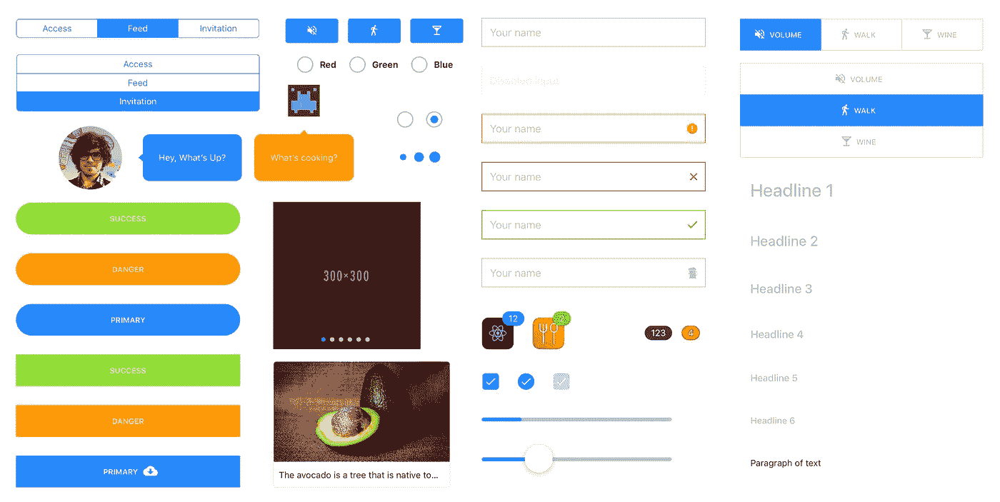

# 你应该知道的 10 个牛逼的 React 原生 UI 组件库

> 原文：<https://javascript.plainenglish.io/10-awesome-react-native-ui-component-libraries-you-should-know-cd3296d99c0b?source=collection_archive---------0----------------------->

随着移动应用需求的增加，大量企业正在将重点转向移动应用开发。新技术、平台和框架的引入使得移动应用程序开发者能够创建革命性的移动应用程序。最近，跨平台应用程序开发越来越受欢迎，因为它使开发人员能够使用单一代码库为 Android、iOS、Windows 等多个平台开发应用程序。React Native 是脸书推出的最著名的跨平台移动应用开发平台之一，拥有最大的活跃开发者社区。随着 React 越来越受欢迎，以及原生移动应用开发(和 PWA)的兴起，React-Native 每天都在社区中获得更多的采用就不足为奇了。

与 React 本身非常相似，React Native 鼓励您使用隔离的组件来构建 UI。组件库和 UI 工具包使用一组预制的组件，帮助您节省时间并更快地构建应用程序。

**反应过来的特征**

*   **组件—**它可以帮助你在大型项目中维护你的代码。React 是关于组件的。
*   **单向数据流和 Flux—**React 使用 Flux 实现单向数据流，Flux 是一种有助于保持数据单向的应用架构。

下面是一个有用的(已维护的)React-native UI 库列表，可以帮助您入门。该列表没有对任何框架进行排名，并且是以随机方式列出的。欢迎评论，补充自己的建议！

**提示**:使用 Enappd，您可以随时使用由 UI/UX 开发专家构建的优雅应用模板。Enappd 已经建立了世界上最大的应用程序模板库，只要说出你的需求，你就有机会找到为它建立的模板。所有应用程序模板的演示 apk 都可以免费下载，看看吧。

# 1.反应本地元素

超过 17k 的 stars react-native-elements 是一个完全用 Javascript 构建的高度可定制的跨平台 UI 工具包。该库的作者[表示](https://medium.com/react-native-training/introducing-react-native-elements-e3d78389b7ea)"*React Native Elements 的想法更多的是关于组件结构，而不是实际的设计，这意味着在设置某些元素时减少了样板文件，但可以完全控制它们的设计"*，这应该对新开发人员和经验丰富的老手都有吸引力。这是一个展示所有组件的 Expo 应用程序的例子。请随意加入。

 [## 反应-原生-训练/反应-原生-元素

### 跨平台 React 原生 UI 工具包按照以下说明安装 React 原生元素！开始使用…

github.com](https://github.com/react-native-training/react-native-elements?source=post_page-----71d2a8e33312----------------------) 

# 2.NativeBase

在 12k stars 和超过 1.5k forks NativeBase 是一个广泛流行的 UI 组件库，为 React native 提供了几十个跨平台组件。当使用 NativeBase 时，你可以使用任何现成的原生第三方库，项目本身带有丰富的生态系统，从有用的[初学者工具包](https://reactnativeseed.com/?utm_source=nativebase&utm_medium=website+fold&utm_campaign=nativebase)到[可定制的主题模板](https://nativebase.io/nativebase-customizer)。

 [## GeekyAnts/NativeBase

### React 原生更新文档的基本跨平台 UI 组件在此！NativeBase 是一款时尚、巧妙且充满活力的…

github.com](https://github.com/GeekyAnts/NativeBase?source=post_page-----71d2a8e33312----------------------) 

# 3.反应本地的洛蒂包装

lottie-react-native 拥有近 12k 的星星和 1.2k 的叉子，使开发人员能够在他们的应用程序中发布美丽的动画，而无需重新创建它们。Lottie 是一个移动库，可以在移动设备上解析 Adobe After Effects 动画。

 [## 反应本地社区/洛蒂反应本地

### Lottie 组件用于 React Native (iOS 和 Android) Lottie 是一个用于 Android 和 iOS 的移动库，可以解析 Adobe…

github.com](https://github.com/react-native-community/lottie-react-native) 

# 4.反应原生矢量图标

这个库有近 12k 个星号和 1372 个分支，是 React native 的一组可定制图标，支持 NavBar/TabBar/ToolbarAndroid、图像源和完整样式。不出所料，它非常有用，被成千上万的应用程序和其他 UI 组件库(如 react-native-paper)使用。该库提供现成的捆绑图标集，这里是库中所有图标的[完整示例](https://oblador.github.io/react-native-vector-icons/)。这些矢量图标易于扩展，也易于集成到您的应用程序项目中。

 [## 扁圆形/反应原生向量图标

### 非常适合按钮、徽标和导航/标签栏。易于扩展、设计和集成到您的项目中。运行:$ npm 安装…

github.com](https://github.com/oblador/react-native-vector-icons) 

# 5.反应原生地图

react-native-maps 拥有超过 10k 颗星星和 3297 个分支，为您的 Android 或 iOS 应用程序提供地图组件。该套件提供了不同类型的组件 API，如 MapView、Marker、Callout、Polygon、Polyline、Circle、Overlay。

Draggable Markers

 [## 反应本地社区/反应本地地图

### react iOS+Android 的原生地图组件见安装说明。请参阅随附的设置说明…

github.com](https://github.com/react-native-community/react-native-maps) 

# 6.REACT NATIVE 天才聊天

react-native-gifted-chat 拥有近 8k 颗星和 2354 个分叉，是您的应用程序的完整聊天 UI 解决方案。它提供完全可定制的组件，多行文本输入，头像，复制信息到剪贴板，附件选项等。

 [## farid safi/react-native-天赋-聊天

### 由 Farid Safi 在巴黎共同创建的 React Native 和 Web 演示编码训练营的最完整的聊天 UI 单击了解…

github.com](https://github.com/FaridSafi/react-native-gifted-chat) 

# 7.REACT 原生 UI 小猫

拥有近 5k 颗星和 606 个分支，React Native UI Kitten 是一个提供轻松定制元素的移动框架。虽然有很多独立的组件可用，但很少有框架可以将常用的组件作为一个具有相同 UI 设计的包来提供。UI Kitten 旨在填补这一空白，推动移动应用开发，以便您可以将更多精力放在业务上，而不是视图合成上。该库基于 Eva 设计系统，在设计和开发过程中带来了一致性和可扩展性。它包含一组以类似方式设计的通用 UI 组件。最棒的是:主题可以在运行时更改，不需要重新加载应用程序。

 [## akveo/react-native-ui-kitten

### 文档 UI Kitten 是一个 React 本机 UI 库，允许您创建令人惊叹的多品牌跨平台…

github.com](https://github.com/akveo/react-native-ui-kitten) 

# 8.Shoutem

在 3.5k stars Shoutem 是一个 React 原生 UI 套件，由 3 部分组成: [UI 组件](https://github.com/shoutem/ui)、[主题](https://github.com/shoutem/theme)和组件[动画](https://github.com/shoutem/animation)。该库为 iOS 和 Android 提供了一组跨平台组件，所有组件都是可组合和可定制的。每个组件还有一个与其他组件一致的预定义样式，这使得无需手动定义复杂样式就可以构建复杂的组件。

 [## Shoutem UI 工具包

### 编写跨平台的 React 原生组件很难。Shoutem UI Toolkit 让 UI 变得尽可能简单。基本…

shoutem.github.io](https://shoutem.github.io/ui/?source=post_page-----71d2a8e33312----------------------) 

# 9.反应原生纸

将近 1.5K 的 stars React Native Paper 是一个跨平台的 UI 组件库，它遵循材料设计指南，具有[全局主题化支持](https://callstack.github.io/react-native-paper/theming.html)和一个可选的 babel 插件来减少包的大小。这里有一个 [Expo 示例 app](https://expo.io/@satya164/react-native-paper-example) 可以帮助你快速获得思路。

 [## 调用堆栈/react-native-paper

### React Native 的材料设计。reactnativepaper.com 目前支持的 React 原生版本:> = 0.50.3 运行…

github.com](https://github.com/callstack/react-native-paper?source=post_page-----71d2a8e33312----------------------) 

# 10.玉米片用户界面套件

拥有 1752 颗星星和 103 个叉子，React Native 的 Nachos UI 套件提供了预编码的 30+ UI 可定制组件，随时可用，由于 [react-native-web](https://github.com/necolas/react-native-web/) ，这些组件也可以在 web 上工作。这些组件完全可以根据您的要求定制。Nachos UI 套件提供的不同组件包括徽章、气泡、按钮、卡片、转盘、复选框、输入、滑块、微调按钮等等。与 jest 快照测试，漂亮和纱线支持这个精心制作的库提供了一个辛辣的设计和一个全球主题管理器。

 [## 玉米片界面/玉米片界面

### Nachos UI 是一个 React 本地组件库。阅读更多关于我们如何在介质上构建它的信息。需要 React 原生 0.40…

github.com](https://github.com/nachos-ui/nachos-ui) 

# 结论

这些是为你的快速参考精选的一些最好的 UI 组件库。考虑在你的下一个项目中使用它们，并在下面的评论中告诉我效果如何。保持牛逼！！

本文原载于 [Enappd](https://enappd.com) 。