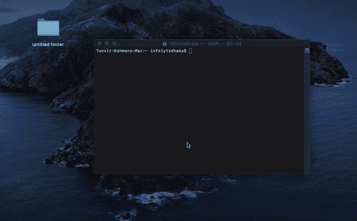

# 10 个高频终端命令

> 原文：<https://javascript.plainenglish.io/10-high-frequency-terminal-commands-11fc3d2b543?source=collection_archive---------4----------------------->

## 必须知道开发人员应该知道的终端命令！


Photo by [Goran Ivos](https://unsplash.com/@goran_ivos?utm_source=unsplash&utm_medium=referral&utm_content=creditCopyText) on [Unsplash](https://unsplash.com/s/photos/computer-terminal?utm_source=unsplash&utm_medium=referral&utm_content=creditCopyText)

软件开发人员经常需要在终端上做一些事情，比如 sdk 设置、模块安装等。

这里我列出了一些你必须知道的高频终端命令。随着时间的推移，这份清单会越来越丰富。

注意:如果我错过了什么重要的东西，请写在评论里！

## 在终端命令中注释一些东西

```
# this is a comment
```

## 在终端中打印一些东西

```
echo "Hello World"  # print new line after Commandprintf "Hello World\n"
```

## cd 到根目录

```
cd ~ # move to Home directory of your Machine# Or simplycd
```

## 显示当前路径

```
pwd # My Current Path
```

## 列出文件和文件夹

```
ls # list all folders and filesls -l# List the contents of the directory, including file date, size, #permissions and other informationls -1
# Display the contents of the directory in list mode, only the file #name is displayedls -a#Show all files and directories, including hidden files 
#(file/directory names starting with.)
```

## 创建新文件

```
touch app.js 
# create file **app.js** in your current path. **ls** to checkrm app.js
# remove file **app.js** from current directory
```

## 创建新文件夹

```
mkdir myFolder 
# create folder named **myFolder** in current path. **ls** to checkmkdir myFolder\ with\ space 
# if you have space in folder name like **myFolder with space**
```

## 全部删除

```
rm *
// remove all files is current path/dir
```

## 删除文件夹

```
rm -rf myFolder
# remove folder i.e **myFolder** from current dir.rm -rf myFolder\ with\ space
# Remove folder named **myFolder with space**
```

注意: **-rf** 将删除一个目录下的所有文件和子目录。所以要小心。

## 在查找路径中打开

```
open ./ 
# Open **current** directory in **Finder App**
```

## 复制文件并粘贴到另一个文件夹中

```
cp **fileName** destinationPath/**fileName****Example**mkdir app && cd app && touch app.js# Create a folder named **app**, move to **app** and create a file named **app.js** inside itcp app.js ../app.js# copy the file **app.js** and paste it in **previous** path
```

## 移动文件

```
mv **fileName** destinationPath/**fileName****Example**mkdir app && cd app && touch app.js# Create a folder named **app**, move to **app** and create a file named **app.js** inside itmv app.js ../app.js# move the file **app.js** and paste it in **previous** path
```

## 重命名文件

```
mv app.js newApp.js# Rename app.js to newApp.js
```

## 列出正在运行的计算机进程

```
top# Show all running process in your machine. hit **q** to stop.
```

## 在终端编辑文件中

```
nano YourfileName.YourfileType # open **YourFileName.YourFileType** in terminal for edit
```

## 更改目录

```
cd ./YourPath # Change directory to **YourPath**
```

去 path 的简单方法



Easy drag/drop approach

## 如果语句

```
if true;then
 echo something is true
fi# output **something is true**
```

## 从“终端”打开应用程序

```
nano ~/.bash_profile # open bash profile in editoralias AndroidStudio="open -a /Applications/Android\ Studio.app"# here I have set AndroidStudio command to open android studioAndroidStudio ./androidProjectPath# will open android project in **androidProjectPath** in android studio
```

## 编写自定义脚本并执行

```
touch myScript.sh # create script file in current path
```

写下类似

```
PATH="i am in `pwd` path" # pwd = your current path# this will set PATH with string "I am in **YOUR_CURRENT_PATH** path"echo $PATH # will print the string
```

通过以下方式使其可执行

```
chmod +x myScript.sh
```

运行 myScript.sh 的方式

```
./myScript.sh
```

# 感谢阅读！🍻