# 10 个 JavaScript 面试问题

> 原文：<https://javascript.plainenglish.io/10-javascript-interview-question-c050a357161c?source=collection_archive---------6----------------------->

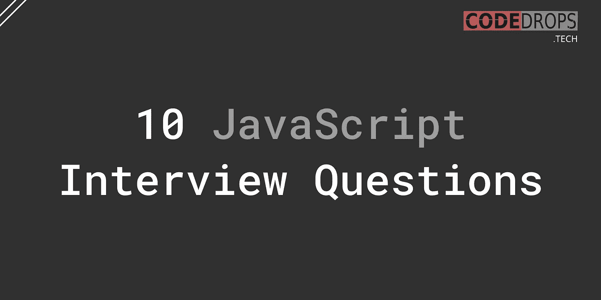

# Q1。

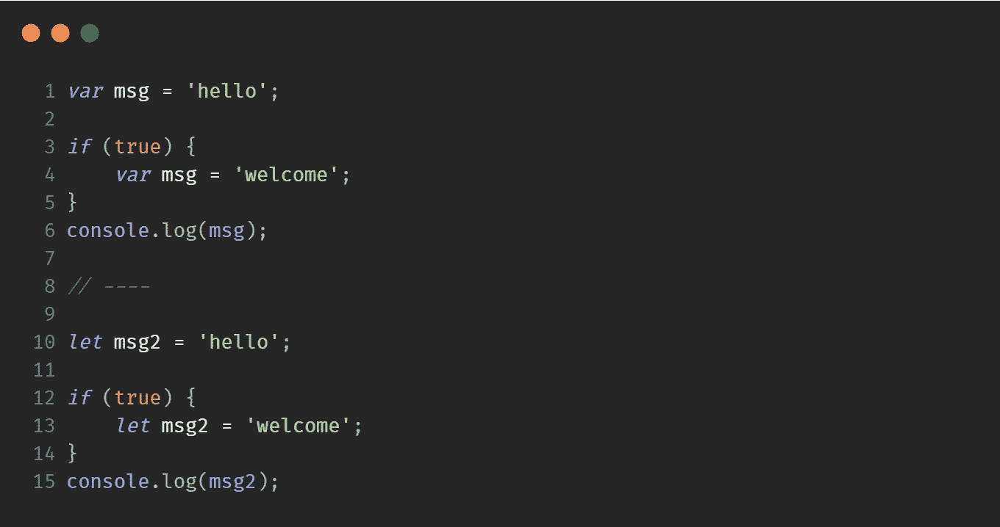

## 输出

```
welcome
hello
```

## 说明

`var`是函数作用域的，因此，当`msg`在`if`块中声明时，它会覆盖全局作用域中的`msg`。在`let`中不会发生这种情况，因为它是块范围的。

# Q2。

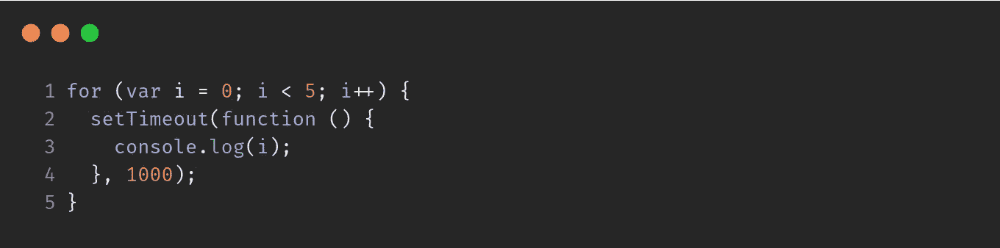

## 输出

```
5
5
5
5
5
```

## 说明

因为`var`是函数作用域，所以`i`变量在循环结束后保存值`5`。`setTimeout`中的回调函数每次出现都获得相同的值。

## 解决办法

*   将`var`转换为`let`，为每次迭代创建一个范围。

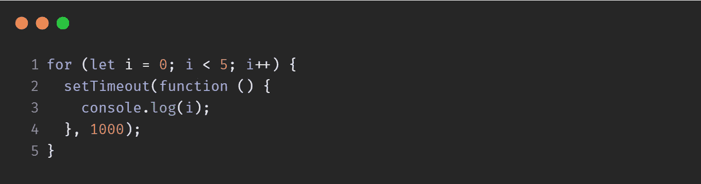

*   将`setTimeout`包装在一个匿名函数中。将`i`作为参数传递会将它限定在匿名函数的范围内，因此值不会丢失。

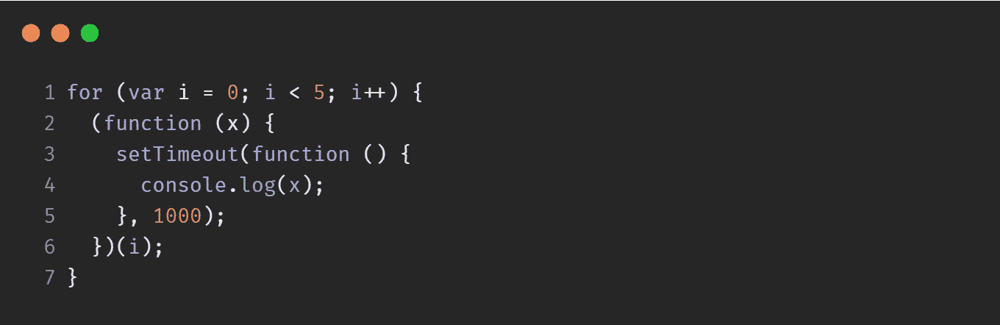

# Q3。

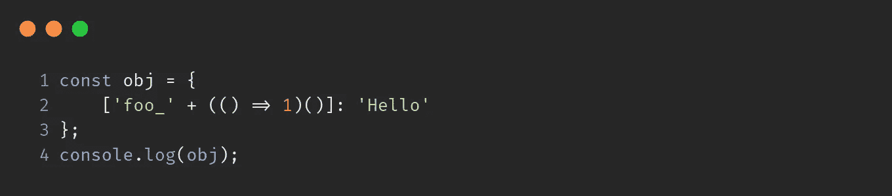

## 输出

```
{ foo_1: 'Hello' }
```

# Q4。

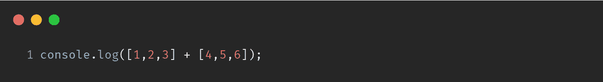

## 输出

```
1,2,34,5,6
```

## 说明

`String([1,2,3]);`是`"1,2,3"`

因此，`"1,2,3" + "4,5,6"`就是`"1,2,34,5,6"`

# Q5。执行的顺序是什么？


## 输出

```
1
4
3
2
```

## 说明

**事件循环的优先级是:调用堆栈>微任务>宏任务**

首先执行所有同步代码

因此，日志`1`、`4`

接下来，还有一个`Promise`和一个`setTimeout`

承诺回调存储在`microtask queue`中&设置超时回调存储在`macrotask queue`中

`microtask`的优先级高于`macrotask`。因此，它先记录`3`，然后记录`2`

# Q6。

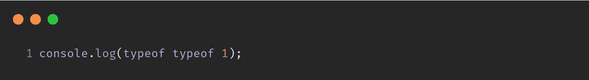

## 输出

```
string
```

## 说明

从右向左评估

1.  `typeof 1`退货数量
2.  `typeof 'number'`返回字符串

# Q7。

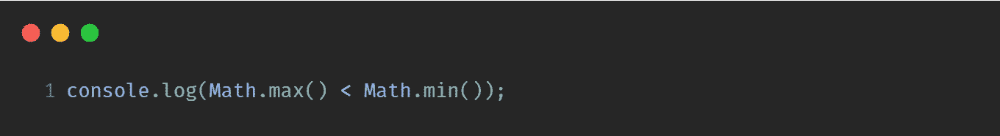

## 解决办法

```
true
```

## 说明

`Math.max()`的默认值为`-Infinity`&`Math.min()`的默认值为`Infinity`

因此，`-Infinity < Infinity`就是`true`

# Q8。


# 输出

```
function
```

# 说明

由于一轮解析(提升),代码看起来像这样

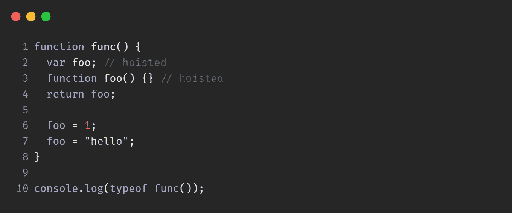

因此，foo 的最后一个可用值是`function`

# Q9。

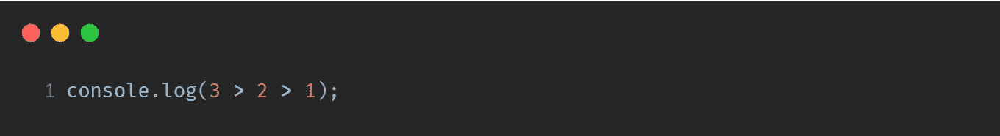

## 输出

```
false
```

## 说明

它从左到右开始，所以`3 > 2`等于`true`

`true > 1`相当于`1 > 1`，也就是`false`

# Q10。

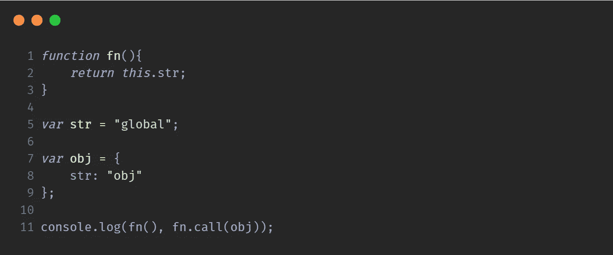

## 输出

```
global obj
```

## 说明

执行`fn()`时，`this`的值为`window`，而`window.str`为`global`。

`.call()`将`this`分配给`obj`并且`obj.str`是`obj`

**注意** : *该方案在* `*non-strict*` *模式下工作。*

**感谢阅读**💙

关注 **@codedrops.tech** 了解更多

[insta gram](https://www.instagram.com/codedrops.tech/)●[Twitter](https://twitter.com/codedrops_tech)●[脸书](https://www.facebook.com/codedrops.tech/) ● [Linkedin](https://www.linkedin.com/company/codedrops-tech/)

[**codedrops . tech**](https://www.codedrops.tech/)

[](https://marketplace.visualstudio.com/items?itemName=mehullakhanpal.file-ops) [## 文件操作- Visual Studio 市场

### 轻松标记/别名文件和快速切换文件。1.文件标签-标签/别名/书签文件 2。快速切换-快速…

marketplace.visualstudio.com](https://marketplace.visualstudio.com/items?itemName=mehullakhanpal.file-ops)