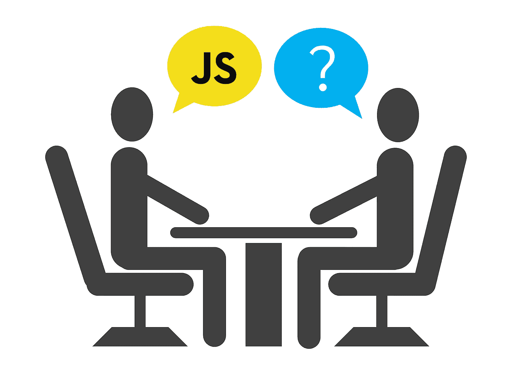

# 2020 年 10 个 JavaScript 面试问题

> 原文：<https://javascript.plainenglish.io/10-javascript-interview-questions-for-2020-697b40de9480?source=collection_archive---------0----------------------->

JavaScript 正在成为世界上最流行的编程语言。随着对 JS 开发人员需求的增长，你必须做好准备。以下是十大 JavaScript 问题，帮助你在下一次面试中获得理想工作。

# var 和 let 有什么区别？

虽然这看起来很简单，但你不会相信我不得不拒绝了多少候选人，仅仅因为他们不能回答这个问题。区别在于范围的级别。`var`是函数范围的，但是`let`(和`const`)是块范围的。要理解其中的区别，请看这个例子:

# ==和===有什么区别？

如果你的答案是“`==`按值比较，`===`也按类型比较”，那就不对了。JS 引擎的理解是，`==`允许类型强制，`===`不允许。类型强制是解释器自动进行的类型转换。这是 JS 中大多数混乱的来源(就像`[] == ![]`是真的)。您可以在以下代码片段中观察到不同之处:

# “this”关键字是什么意思？

你可能会回答说这指向了类体内部的实例，但这也是不对的。首先，JS 中的[类是语法糖](https://everyday.codes/javascript/please-stop-using-classes-in-javascript/)，没有引入任何新特性。`this`关键字在任何函数中都可用，并指向包含该函数的对象。举个例子可能更容易理解:

# 什么是构造函数？

JS 中的构造函数也不是与类相关的函数，而是与`this`关键字紧密联系在一起。用关键字`new`调用构造函数，并返回`this`的值。注意，在构造函数中`this`并不指向外部对象，而是用作占位符对象:

# 将这种基于回拨的呼叫转换为基于承诺的呼叫

这与其说是一个问题，不如说是一个练习，但不管怎样，这是你必须知道的事情。回调只是你打算以后调用的函数。当你不得不等待某些东西(例如来自 API 的响应)时，它们最常用。但是，基于回调的代码太复杂了，这就是引入承诺的原因。我不打算在这里深入探讨，但是如果你现在知道什么是承诺，请看这篇文章。在下一个例子中，要求您将`getData`回调函数转换为承诺:

Promise 构造函数接受一个回调，该回调接收两个函数:`resolve`和`reject`。在回调中，你执行耗时的任务，并根据结果调用“解决”或“拒绝”。

# NaN === NaN？

假的。这是无休止的争论的来源，也是关于 JS 的最令人困惑的部分之一。简而言之，`NaN`代表的不是数字，仅仅因为一个值不是数字，另一个值不是数字，并不意味着它们相等。不利的一面是，你不能用`myVariable === NaN`真正检查一个变量是否是`NaN`。您可以使用`Number.isNaN`功能或`myVariable !== myVariable`进行检查。

# 0.1 + 0.2 === 0.3?

假的。这个技巧不仅适用于 JS:它在任何语言的浮点运算中都很常见。这与 CPU 处理浮点数的方式有关。`0.1 + 0.2`的实际值类似于`0.300000001`，为了检查是否相等，您应该编写`Math.abs(0.3 - (0.2 + 0.1)) <= EPS`，其中 EPS 是一个任意的小值(例如 0.00001)。

# JS 中的原始数据类型有哪些？

JS 中的原始数据类型不是对象，也没有方法。以下是 JS 中原始数据类型的列表:

*   布尔代数学体系的
*   空
*   不明确的
*   数字
*   BigInt
*   线
*   标志

# 什么是“严格”模式？

在 JS 中，通过将`"use strict";`放在文件的开头来启用严格模式。严格模式支持代码中更严格的错误检查，并使调试更容易。例如，这个代码片段可以在常规 JS 中工作，但不是严格的:

# 这段代码的输出是什么？

`undefined`。发生这种情况是因为 JS 将在第 2 行的“return”后插入分号，并将第 3-5 行视为作用域而不是对象定义。

感谢您的阅读，祝您在面试中好运！更多有趣的内容，请查看我的其他文章:

 [## 不使用 TypeScript 的 7 个非常好的理由

### 有很多理由使用 TypeScript，但我会给你 7 个不使用的理由。

medium.com](https://medium.com/javascript-in-plain-english/7-really-good-reasons-not-to-use-typescript-166af597c466)  [## 使用 JavaScript 代理 API 无限超越

### 代理 API 是一个高级的概念，但是如果你想掌握 JavaScript，代理 API 是你绝对需要的…

medium.com](https://medium.com/javascript-in-plain-english/to-infinity-and-beyond-with-javascript-proxy-api-8d4f7a26c8dc)  [## 在没有类的情况下用 JavaScript 实现构建器模式

### 在 JavaScript 中使用高级设计模式的力量，而没有类的开销

medium.com](https://medium.com/javascript-in-plain-english/implementing-the-builder-pattern-in-javascript-without-classes-eaf41f93b9c0) 