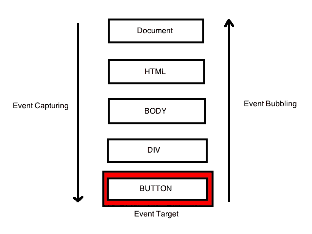

# 10 个 Javascript 面试问答

> 原文：<https://javascript.plainenglish.io/10-javascript-interview-theoretical-questions-and-answers-9cb946ced642?source=collection_archive---------1----------------------->


根据 **Stack Overflow 的年度**[**2019**](https://insights.stackoverflow.com/survey/2019)开发者调查，几乎有 **90，000 人参与**， **Javascript** 是最受欢迎的网络编程语言。所以这意味着每个人都在寻找 JavaScript 开发者，对吗？找到一份工作会有多难？嗯，如果你在技术面试中表现不好，你的机会几乎为零！

在这篇文章中，我将尝试展示我发现自己遇到的一些问题。这里有一些问题，我希望你会觉得有用，我不会深入解释这些话题。我希望您熟悉 Javascript，以便从本文中获得最大收益…

## 问题 1——var，let，const 关键字有什么区别？

ES2015 (ES6)带来了许多闪亮的新功能，由于现在是 2019 年，我们几乎所有人都以这样或那样的方式熟悉这些关键词。但是他们到底是什么，为什么`var`还不够简单，我们已经被介绍给`let`和`const`

1.  当我们在代码中声明变量时，范围可能是一个很大的问题，尤其是当我们使用第三方库或者与其他开发人员合作时。`var`声明是全局作用域或函数作用域，而`let`和`const`是块作用域。
2.  变量可以通过值来更新，并且可以在它们的作用域内重新声明；`let`变量也可以通过值更新，但不能重新声明；`const`变量既不能更新也不能重新声明。
3.  所有这三个关键字都被提升到它们作用域的顶部，但是当`var`变量用`undefined`初始化时，`let`和`const`变量没有被初始化。
4.  虽然`var`和`let`可以不初始化就声明，但是`const`在声明时必须初始化。

## **问题 JavaScript 中的“严格”模式是什么，如何启用它？**

这里最重要的答案是,`use strict`是一种在运行时自愿对 JavaScript 代码执行更严格的解析和错误处理的方法。本来会被忽略或者会无声地失败的代码错误现在会生成错误或引发异常。一般来说，这是一个很好的做法。

严格模式的一些主要优点如下:

*   **让调试更容易。**潜在的代码错误原本会被忽略或失败，现在会生成错误或抛出异常，这将导致您更快地得到警告。
*   **防止意外全局变量。**如果没有 ***严格模式，*** 给未声明的变量赋值会自动创建一个同名的全局变量。在 ***严格模式*** 下，尝试执行会抛出错误。
*   **消除了** `**this**` **的威压。**如果没有 ***严格模式，*** 对空或未定义的`this`值的引用会自动强制到全局，这可能会产生令人讨厌的错误。在 ***严格模式*** 中，引用一个为空或未定义的`this`值会抛出错误。
*   **不允许重复的参数值。**在 ***严格模式*** 中，当检测到函数的重复命名参数时抛出错误(`function foo(**val1**, val2, **val1**){}`)，这几乎可以捕捉到代码中的某个 bug。
*   **对** `**delete**` **的无效用法抛出错误。**`delete`操作符不能用于对象的不可配置属性。如果没有 ***严格模式，*** 代码将在试图删除不可配置的属性时无声地失败，但是在 ***严格模式*** 中，代码将抛出错误。

## 问题 3——= =和===运算符有什么区别？

因为 JavaScript 支持严格相等和类型转换相等，所以知道哪个操作符用于哪个操作很重要。简单来说`===`考虑变量的类型，而`==`根据变量的值进行类型修正。

```
**0**==**false**   // true, because false is equivalent of 0
**0**===**false**  // false, because both operands are of different type
**2**=="2"     // true, auto type coercion, string converted into number
**2**==="2"    // false, since both operands are not of same type
```

**这里需要注意的是，右边的* `*==*` *运算符会被强制转换成左边的类型。*

```
NaN === NaN // false
NaN == NaN  // false
```

**你要记住* `NaN` *(不是数字)不等于任何东西，包括它本身，* `NaN`

总是使用严格的等式运算符。使用`===`并避免使用`==`操作符，即使你需要类型强制，而是自己转换类型以使其更具可读性。

## 问题 4——`null`和`undefined`有什么区别？

## **未定义**

`undefined`表示，变量的值没有定义。JavaScript 有一个全局变量`undefined`，它的值是“undefined”`typeof undefined`也是“undefined”。请记住，undefined 不是一个常量或关键字。 **undefined 是一个只有一个值的类型:undefined** 。

## 空

`null`表示空值或不存在的值，程序员用来表示“无值”。null 是一个原始值，您可以将 null 赋给任何变量。null 不是一个对象，它是一个原始值。例如，您不能向其添加属性。有时人们会错误地认为它是一个对象，因为 **typeof null 返回的是“object”。** `null == undefined`

```
typeof undefined   // undefined
typeof null        // object

null === undefined // false
null == undefined  // true; /*
The reason ***null*** *is equal to* ***undefined*** is because of JavaScript's type system and equality checking. In JavaScript, both **null** and **undefined** have a **falsy** value so when you do an equality check with **==** they are considered the same. If you use a strict equality check with === they are considered different.
*/
```

## 问题 5 -这到底是什么？

`this`第一眼看上去，关键字可能是一个非常令人困惑的概念。在大多数语言中，`this`是对由类实例化的当前对象的引用。在 JavaScript 中，`this`通常指的是“拥有”该方法的对象，但更多的是取决于函数是如何被调用的。

在执行每个函数时，JavaScript 引擎为函数设置一个属性`this`，该属性引用当前的执行上下文。`this`总是引用一个对象，取决于函数如何被调用。`this`的值变化有 7 种不同的情况。

1.  在全局上下文或函数内部，这指的是窗口对象。
2.  在 IIFE 内部(直接调用函数)如果你使用“use strict ”,这个值是未定义的。要通过“使用严格”的生命之窗，你必须通过这个。
3.  在对象的上下文中执行函数时，对象成为此的值。
4.  在 setTimeout 函数中，这个的值是 window 对象。
5.  如果您使用构造函数(通过使用 new 关键字)来创建一个对象，该值将引用新创建的对象。
6.  通过将对象作为 bind、call 或 apply 的第一个参数进行传递，可以将此的值设置为任意对象。
7.  对于 dom 事件处理程序，这个值将是触发事件的元素。

## 问题 JavaScript 中的闭包是什么？

最简单的答案是。闭包是一个**内部**函数，它可以访问**外部**函数的变量。

```
var outerNum = 100function outerFn() {
  var innerNum = 50 function innerFn() {
      return outerNum + innerNum
    }
   return innerFn()
}outerFn() //prints 150
```

**如上例所述，一个** `**closure**` **基本上是另一个函数内部的一个函数。**

独特之处在于内部函数`**innerFn**`可以访问外部函数`**outerFn**`范围内的变量，在我们的例子中是变量`**outerNum**`

```
function fullName(firstName) {
  const greeting = 'Hello'

  function mergeNames(lastName) {
    return `${greeting} ${firstName} ${lastName}!`
  }
  return mergeNames
}
const getFullName = fullName('Agent')
getFullName(); //prints "Hello Agent undefined!"
getFullName('Smith'); //prints "Hello Agent Smith!"
```

`const getFullName = fullName('Agent')`表示外部函数`fullName`将被调用并返回。

> ****即使函数已经返回，内部函数仍然可以访问外部函数变量。***

在我们的例子中，内部函数是`mergeNames`。它仍然可以访问外部函数变量`firstName === 'Agent’`，尽管外部函数`fullName`已经被调用并返回。

因此，当我在控制台`const getFullName = fullName('Agent')`中编写时，`getFullName`变量现在包含了内部函数`mergeNames`，以及对外部函数`firstName`变量的引用。

因此，当我调用`getFullName()`时，我会看到下面的文本:“你好，代理未定义！”

但是当我打电话给`getFullName("Smith")`时，我看到了下面的短信:“你好，特工史密斯！”

## **闭包可以访问三个范围内的变量:**

*   变量在*中声明自己的作用域*
*   在*父函数作用域*中声明的变量
*   在*全局命名空间*中声明的变量

## 问题 JavaScript 中的提升是什么？

最简单的回答是，**提升**是一种 JavaScript 机制，在代码执行之前，变量和函数声明被移动到它们作用域的顶部。

这确实是看起来正在发生的事情，但重要的是从根本上理解真正正在发生的事情。如您所见，您的代码没有移动(令人惊讶！)它不会被神奇地移动到文件的顶部。真正发生的是**你的函数和变量声明在编译阶段被添加到“内存”中。**

> **重要的是要知道: *JavaScript 只提升声明，初始化不会被提升。***

让我们举一个简单的例子，

```
console.log(message); //output : undefined
var message = ’The variable Has been hoisted’;
```

对于解释器来说，上面的代码如下所示，

```
var message;
console.log(message);
message = ’The variable Has been hoisted’;
```

***最佳实践:*** 由于提升的原因，总是在各自作用域的顶部声明变量被认为是最佳实践。在声明时尝试初始化变量总是好的。这将提供更清晰的代码，并有助于避免`undefined`变量。

## 问题 JavaScript 中的异步编程是什么？

JavaScript 以非阻塞的方式运行代码，默认情况下它是同步的和单线程的。这意味着代码不能创建新线程并并行运行。需要一些时间来完成的代码(从本地文件系统读取数据或访问 Web API 等。)正在后台执行，并且并行地继续代码执行。这种编程行为被称为异步编程。

因为 JavaScript 是以非阻塞的方式执行的，所以如果需要在执行更多代码之前得到结果，就必须采取进一步的措施来处理代码。

JavaScript 通过**回调**(es 2015 之前的次数)、p **承诺** (ES2015)和**异步/等待** (ES2017)提供了处理异步编程的各种可能性。

## 问题 9 -什么是 JavaScript 事件委托、传播、冒泡和捕获？

***事件委托*** 是一种监听事件的技术，其中你*委托*一个父元素作为其内部发生的所有事件的监听器。

例如，如果您想检测特定表单(例如，带有 class="job-application "的表单)中任何字段值的任何时间变化，您可以这样做:

```
var form = document.querySelector('.job-application');// event listener for changes inside the form
form.addEventListener('input', function (event) { // Log the field that was changed
	console.log(event.target);}, false); // false here indicates event bubbling, true event    capturing (I will explain about that soon)
```

***事件传播*** 实际上是对事件冒泡和事件捕获的统称。我们可以认为这是一个双向链，从窗口到事件目标，然后再返回。

***事件冒泡*** 和 ***事件捕获*** 是 HTML DOM API 中 ***事件传播*** *两种方式。在 JavaScript 中，事件传播(流)过程由三个概念完成:*

1.  从窗口到事件目标父级:这是*捕获阶段*
2.  事件目标本身:这是*目标阶段*
3.  从事件目标父项返回到窗口:气泡阶段

**事件* ***冒泡*** *和* ***捕捉*** *是*当一个事件发生在另一个元素内的一个元素中，并且两个元素都注册了该事件的句柄时……****通过冒泡*** 时，该事件是*首先被最里面的元素捕捉和处理，然后传播到最外面的元素。* ****通过捕捉*** 、*事件首先被最外层元素捕捉并传播到内层元素。**

****冒泡*** 是事件本身所做的。事件冒泡是指事件从最深的元素或目标元素开始到它的父元素，然后是所有从下到上的祖先元素。目前，所有的现代浏览器都将事件冒泡作为事件流的默认方式。*

*事件开始是触发它的元素。然后，它*冒泡*到它的每个父元素，直到它到达`html`元素。*

*以表单域为例，事件会冒泡到父表单，然后是表单所在的任何容器或 div，然后是`body`，然后是`html`元素，然后是`document`，然后是`window`。*

*这些父元素上的任何侦听器都会在它冒泡时被触发。*

***捕捉**在事件的流向和相关回调方面基本上是相反的！*

**

*This diagram should help grasping the concept better*

***TL；** **事件*委托*** *是手法，* ***繁殖*** *是冒泡和捕捉的总称。* ***冒泡*** *是事件本身所做的事情，而* ***捕捉*** *是对不冒泡的事件使用事件委托的一种方式。**

*   ***提示**:默认情况下，javascript 将事件传播设置为冒泡。如果我们想使用 capture，我们必须将 addEventListener 函数中的第三个参数设置为 true。*

## *问题 10-JavaScript 中的一级、一阶、高阶、一元 Currying 和纯函数是什么？*

****一级函数*** 是指当一个函数和其他变量一样对待时。例如，函数可以作为参数传递给其他函数，可以由另一个函数返回，也可以作为值赋给变量。例如，在下面的示例中，分配给侦听器的处理函数*

```
*const handler = () => console.log ('This is a click handler function');
document.addEventListener ('click', handler);*
```

****一阶函数*** 是不接受其他函数作为自变量，也不返回一个函数作为其返回值的函数。*

```
*const firstOrder = () => console.log ('I am a first order function!');*
```

****高阶函数*** 是接受其他函数作为自变量或者返回一个函数作为返回值的函数。*

```
*const firstOrderFunc = () => console.log ('Hello I am a First order function');
const higherOrder = ReturnFirstOrderFunc => ReturnFirstOrderFunc();
higherOrder(firstOrderFunc); // logs "Hello I am a First order function"*
```

****一元函数*** (即一元)是只接受一个参数的函数。让我们举一个一元函数的例子。它代表函数接受的单个参数。*

```
*const unaryFunction = a => console.log (a + 10); //Add 10 to the given argument and display the value*
```

**curry 是将一个有多个参数的函数转化为一系列只有一个参数的函数的过程。柯林是以数学家哈斯克尔·库里的名字命名的。通过应用 currying，一元函数将其转换为一元函数。让我们举一个一元函数的例子，看看它是如何变成 currying 函数的**

```
**const multiArgFunction = (a, b, c) => a + b + c;
const curryUnaryFunction = a => b => c => a + b + c;
curryUnaryFunction (1); // returns a function: b => c =>  1 + b + c
curryUnaryFunction (1) (2); // returns a function: c => 3 + c
curryUnaryFunction (1) (2) (3); // returns the number 6**
```

**Curried 函数对于提高代码的可重用性和功能组合非常有用。**

*****纯函数*** 是返回值仅由其自变量决定而没有任何副作用的函数。也就是说，如果你用相同的参数调用一个函数 n 次，并且在应用程序中有 n 个位置，那么它将总是返回相同的值。让我们举个例子来看看纯函数和不纯函数的区别，**

```
**//Impure
let numberArray = [];
const impureAddNumber = number => numberArray.push (number);
//Pure
const pureAddNumber = number => argNumberArray =>
  argNumberArray.concat ([number]);//Display the results
console.log (impureAddNumber (6)); // returns 6
console.log (numberArray); // returns [6]
console.log (pureAddNumber (7) (numberArray)); // returns [6, 7]
console.log (numberArray); // returns [6]**
```

# **结论**

**虽然一次编码面试可能包含不同的挑战；理论问题、作业、数据结构和算法等。掌握你面试的主要编程语言的基础是非常重要的。我试图涵盖其中的一些概念…**

**感谢您的阅读，祝您面试顺利！**