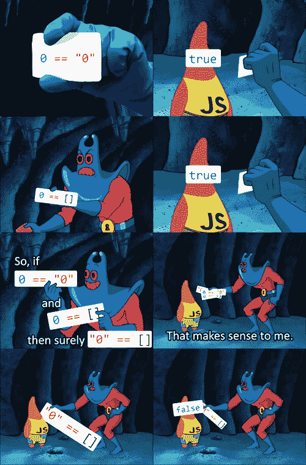
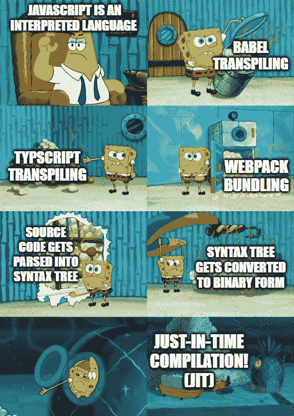
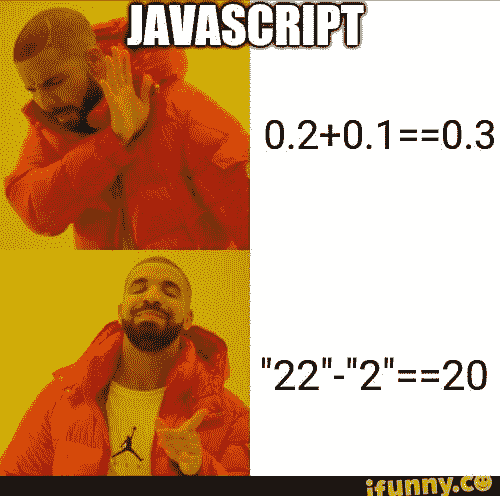
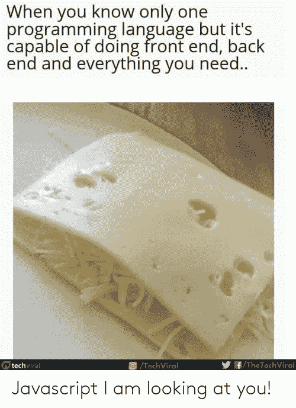
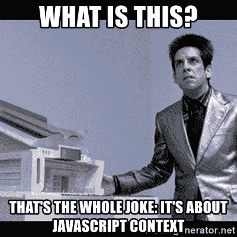

# 点亮你一天的 10 个 JavaScript 迷因

> 原文：<https://javascript.plainenglish.io/10-javascript-memes-to-lighten-up-your-day-a0372e01ab23?source=collection_archive---------4----------------------->

## 这里有几个我觉得很好笑的 JavaScript 迷因

# 1.许多人没有意识到 JavaScript 的强大

# 2.传播运营商的笑话永远不会过时

# 3.当处于异步模式时，我们等待…

# 4.为了你能成为的恶魔

# 5.这个迷因提醒我为什么“===”很重要

# 6.你说解释语言？

# 7.没有“console.log”我该怎么办

# 8.JavaScript 总能给我带来惊喜

# 9.嗯，JavaScript 不是很强大吗？

# 10.JavaScript 中“这”的奥秘

我希望你能找到至少一些相关的迷因。但是，嘿，他们不是很棒吗？

大声笑，强烈编码:)