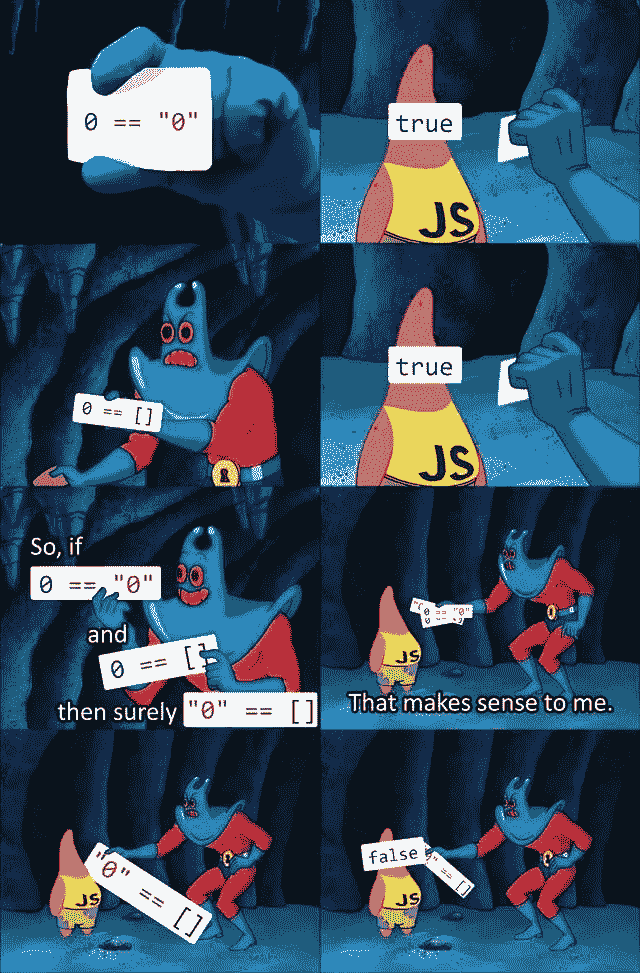

# 你应该知道的 10 个 JavaScript 技巧

> 原文：<https://javascript.plainenglish.io/10-javascript-tips-you-should-know-91a5b8c7fb02?source=collection_archive---------10----------------------->

## 用 JavaScript 编写更简洁的代码


## 得益于 NodeJs ( *后端*)和 React / Angular / Vue ( *前端*)等库和框架近年来经历的热潮，JavaScript 是 *fullstack* 开发中使用最广泛的语言。

然而，不管你使用哪一个来开发，都有一些通用的技巧和提示，可以帮助你改善作为一个 **JavaScript** 开发者的体验。因此，在这篇文章中，我决定编译那些我认为每天都最有用的代码，并且为了编写干净的代码和尽可能少的失败，它们应该总是出现在头部。

所以一如既往，我们干吧！

# 变量声明

每当你声明一个变量时，使用`var`、`let`、`const`，因为否则你将创建的将是一个全局变量，这可能导致诸如覆盖变量之类的失败(例如，一个第三方库正在为另一个目的全局使用同一个变量，而你的语句正在“踩住它”)。

使用`let`或`const`代替`var`也是明智的，因为`let`和`const`所创建的声明是一个变量，其作用域仅限于使用它的语法块。例如:

```
function example() {
    let a = 'foo';
    console.log(a);  // 'foo'
    if (true) {
        let a = 'bar';
        console.log(a); // 'bar'
    }
    console.log(a);  //  'foo'
}
```

另一方面，如果我们使用`var`，我们将获得:

```
function example() {
    var a = 'foo';
    console.log(a);  // 'foo'
    if (true) {
        var a = 'bar';
        console.log(a); // 'bar'
    }
    console.log(a);  // 'bar'
}
```

此外，使用`let`和`const`还可以防止我们出现以下错误:

```
function example() {
 let a = 10;
 let a = 20; // **Error Message: Uncaught SyntaxError: Identifier ‘a’ has already been declared.**
 console.log(a);
}
```

最后一点，记住`const`防止变量一旦被声明就被重新赋值，所以下面的代码是无效的:

```
function example() {
    const a = 'foo';
    a = 'bar' **// Error Message : Uncaught TypeError: Assignment to constant variable.**
}
```

# 变量比较

每当你比较变量时，使用三倍相等的`===`而不是双倍的`==`,因为后者意味着一种自动转换，这种自动转换会导致“*情况*”，例如下面的迷因:



Best ever meme

或者不想要的结果，例如:

```
3 == ‘3’ // true
3 === ‘3’ //false
```

这是因为三重相等`===`的比较是严格的，不像第一次尝试将两个元素转换为相同类型时执行双重相同:

```
[10] == 10   // is true
[10] === 10  // is false
'10' == 10   // is true
'10' === 10  // is false
[] == 0      // is true
[] === 0     // is false
'' == false  // is true
'' === false // is false
```

# JavaScript 中什么被认为是假的？

它应该永远记住在 JavaScript 中哪些值被认为是错误的，以便进行比较并调试我们的代码。取值为:`undefined`、`null`、`0`、`false`、`NaN`和`''`。

# 如何在 JavaScript 中清空数组？

有一种非常简单的方法来清空数组:

```
let sampleArray = ['foo', 'bar', 'zeta'];
sampleArray.length = 0; // sampleArray becomes []
```

# 整数

每当我们需要将一个数字四舍五入到一定的小数位数时，我们可以使用本机提供 JavaScript 的`toFixed`方法:

```
let n = 3.141592653;
n = n.toFixed(3); // computes n = "3.142"
```

# 检查结果是否有限

这是那些看起来“T15”没有用的提示之一，直到有一天你突然需要它(尤其是在后端开发中)。

例如，想象一下，数据库查询的结果可以根据某个值而变化，所以有必要检查这个结果是否是有限的。

对于这个检查，JavaScript 给了我们`isFinite`方法，这将允许我们在使用它之前确保这个值是有效的:

```
isFinite(0/0);       // false
isFinite('foo');     // true
isFinite('10');      // true
isFinite(10);        // true
isFinite(undefined); // false
isFinite();          // false  
isFinite(null);      // true
```

# 开关/外壳

在有许多`else if`要检查的情况下，建议使用`switch / case`语句，因为代码组织得更好，速度也更快:

> 事实证明，与 if-else 相比，在大多数**情况下**的 **switch 语句比**快，但只有在条件数较多时**才明显比**快。两者在性能上的主要区别在于，if-else 的附加条件的增量成本大于**开关**。

[](https://www.oreilly.com/library/view/high-performance-javascript/9781449382308/ch04.html) [## 高性能 JavaScript

### 第四章。算法和流控制代码的整体结构是决定如何…

www.oreilly.com](https://www.oreilly.com/library/view/high-performance-javascript/9781449382308/ch04.html) 

# 使用“严格使用”

为防止出现第一点所述的全局变量错误声明等情况，建议使用`use strict` 声明编写:

```
(function () {
   “use strict”;
   a = 'foo'; *// Error: Uncaught ReferenceError: a is not defined* })();
```

在文件的开头或文件中的其他地方使用`use strict`的区别在于，第一种方式下，我们将全局应用它，而不像第二种方式，第二种方式的作用范围将被限制在我们编写它的范围内。

# 使用&&和||

当我们需要根据某个条件声明变量时，记住使用运算符`&&` y `||`创建变量的灵活性是很方便的。例如:

```
let a = '' || 'foo'; // 'foo'let b = undefined || 'foo'; // 'foo'function doSomething () {
   return { foo: 'bar' };
}let expr = true;
let res = expr && doSomething(); // { foo: 'bar' }
```

# 使用展开/静止操作符

最后，携带 ES6 的操作员… `.`可以编写更简洁的代码，并简化我们执行不同操作的方式。

例如,我们可以将数组填充为 follows:

```
let first = ['foo', 'bar'];
let second = ['other foo', ...first, 'other bar'];// ['other foo', 'foo', 'bar', 'other bar'
```

Work with immutable objects in a simple way 以简单的方式处理不可变对象:

```
let first = { foo: 'foo' };let zeta = { ...first, bar: 'bar' };// { foo: 'foo', bar: 'bar' }
```

Or collect the arguments of a function as follows:

```
function myFun(a, b, ...manyMoreArgs) {
  console.log(a); 
  console.log(b);
  console.log(manyMoreArgs); 
}

myFun('one', 'two', 'three', 'four');// 'one'// 'two'// ['three', 'four']
```

# Bonus Track 的评论

如果你想继续挖掘 JavaScript,我会留下你与其他文章,我已经写了关于各种主题,这肯定会帮助你提高你的经验,作为一个开发人员。我希望他们为你服务!

[](https://medium.com/@ger86/javascript-qu%C3%A9-es-eso-de-las-high-order-functions-2b7a1d6831da) [## Javascript 的。什么是 High Order Functions?

### 当然,如果你使用过 React,你可能会遇到 High Order Component 的概念,因为它是一个高阶组件。

Medium.com](https://medium.com/@ger86/javascript-qu%C3%A9-es-eso-de-las-high-order-functions-2b7a1d6831da) [](https://medium.com/@ger86/vanilla-js-addeventlistener-queryselector-y-closest-ef95b3a0a2c1) [## 香草 JSAddEventListener、querySelector 和 closest

### 今天我听到一篇简短但有趣的文章,特别是现在 jQuery 不再是...

Medium.com](https://medium.com/@ger86/vanilla-js-addeventlistener-queryselector-y-closest-ef95b3a0a2c1) [](https://medium.com/@ger86/javascript-arrays-funciones-inmutables-cd2eac1be7a6) [## JavaScript Arrays - 不可变函数

### 在过去的两年里,我一直在专业水平上开发 React,这使我能够大大加深对 React 的理解。

Medium.com](https://medium.com/@ger86/javascript-arrays-funciones-inmutables-cd2eac1be7a6)  [## 使用 ES6 创建条件对象

### ES6 的到来为我们带来了许多其他新奇事物,即传播语法,正如您所知道的,它允许我们...

Medium.com](https://medium.com/@ger86/creando-objetos-de-forma-condicional-con-es6-5a535bab1569) 

# 你想阅读更多类似的文章吗?

如果你喜欢这篇文章,我鼓励你订阅通讯,我每个星期天发送类似的出版物到这个和更多推荐的内容:↓↓↓

[](https://eepurl.us20.list-manage.com/subscribe?u=c14cad2102bcf33bf216cc69e&id=2790da9378) [## Latte 和 Code

### 您即将订阅每周日收到的 Latte and Code 通讯。最后两篇文章...

eepurl.us20.list-manage.com](https://eepurl.us20.list-manage.com/subscribe?u=c14cad2102bcf33bf216cc69e&id=2790da9378)