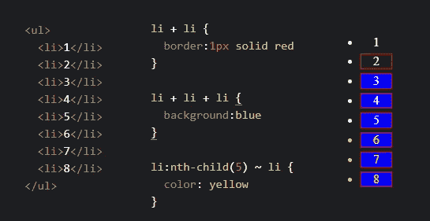

# 初级 JavaScript 开发人员面试中的 10 个问题

> 原文：<https://javascript.plainenglish.io/10-keynotes-of-a-junior-javascript-developer-interview-62fbcb9f1a7a?source=collection_archive---------5----------------------->


Photo by [Dalton Touchberry](https://unsplash.com/@daltontouch?utm_source=medium&utm_medium=referral) on [Unsplash](https://unsplash.com?utm_source=medium&utm_medium=referral)

JavaScript 现在已经 25 岁了，所以它有很多经验。但是在一个典型的 JavaScript 面试中会发生什么仍然是未知的，特别是当你是一个新手的时候。

在整个讨论过程中，作为一名初级 JavaScript 开发人员，您将面临一些基本但很少被问到的问题，这些问题在正确回答时将证明您真正的洞察力。

## 1.创建一个元素，给它一个 ID，将它附加到主体

这将测试您的基本 DOM 知识，并证明您的基本 DOM 操作逻辑。准备好回答关于 DOM 操作的类似问题，比如创建/删除/更新元素和节点，改变元素的样式。

```
var div = document.createElement('div')
div.id = 'myDiv'
document.body.appendChild(div)
```

**了解:**文档对象模型(DOM)，DOM 操作技术。

**最好证明更多:** DOM ClassList 属性和添加/删除方法。

## 2.什么是节点列表？它是用来做什么的？

节点列表是一个类似于 iterable 对象的数组，它是一个页面中节点的集合。

```
var nodeList = document.querySelectorAll('p') *//NodeList(14) [p.summary,p.space,p,p,p,p,p,p,p,p,p,p,p#error,p]*typeof nodeList *// "object"*Object.prototype.toString.call(nodeList) *//"[object NodeList]"*nodeList.forEach(item => console.log(item)) *// logs all the nodes*
```

**良好的状态知识:** DOM 查询选择器，HTML 集合之间的差异&节点列表。

**最好证明更多关于:**用*数组*转换成数组。from()或 spread 语法[…nodeList]能够使用数组原型方法。

## 3.如何求一个变量的类型？

这是最常见的问题之一，也是我最喜欢的问题之一。由于类型在 JavaScript 中至关重要，因此这个主题可以衍生出许多问题。关键的答案是在 Object.prototype 中使用 toString()方法，同时使用 Function.prototype.call()方法，结果将得到对象的类。通过使用这种方法，您可以创建一个 switch/case 语句或一个查找表来生成您的输入类型。但是要小心那些可以进一步引导的棘手问题。

```
Object.prototype.toString.call("test string") *//"[object String]"*Object.prototype.toString.call([]) *//"[object Array]"*Object.prototype.toString.call(1) *//"[object Number]"*Object.prototype.toString.call(new Date) *//"[object Date]"*
```

**很好地陈述了以下知识:**每个变量主要是 object 类型的，为什么我们不能使用 typeof 运算符。

**最好再证明一下:**为什么 typeof null 等于“object”。

## 4.一个棘手的字符串连接问题

当涉及加法运算符(+)时，字符串很难处理，错误的知识可能会导致不必要的结论。

首先，请记住，当谈到数字时，JavaScript 试图尽最大努力，比如解析操作数并试图维护操作。

```
"3"*"5" //15
"3"*5   //15
3*"5"   //15
3-"5"   //-2
"15"/3  //5
```

但是当(+)操作符引起关注时，您必须非常小心以避免意外的行为。可能的问答如下，试着解读一下。以这样一种方式思考，那些表达式是从左到右计算的，一旦开始就要保持类型的一致性！一旦一个字符串被连接到任何类型的变量，结果就是该时刻的字符串。

```
3+2+"test"+3+2           // "5test32"
3 * "test" * 3 + "test"  // "NaNtest"
3+true+"false"+5         // "4false5"
```

请注意，数字和字符串相乘产生 NaN(不是数字)。NaN 和 Infinity 是两个特殊值，它们可能是通常返回数字的运算的结果。此外，布尔类型在数学运算中被评估为数字。

**良好的状态知识:** JavaScript 数据类型、类型转换(动态类型语言)。

**最好证明更多关于:**数据类型的 7 种原语(Boolean、null、undefined、Number、Bigint、String、Symbol)和对象、类型转换。

## 5.一个周期性的算法，一个数字钟的实现

这是你以循环思维方式思考的技能的另一个证据。这种思维方式会在向上迈步的时候给你最大的引导。请记住，你将在整个职业生涯中面临这种算法的投影，尤其是在处理函数式编程、渲染模板、准备动画和数据更新时。

问题是显示一个在 div 元素中更新的数字时钟。关键的方法是获取当前日期，然后应用可选的格式并在元素中显示。不要忘记每秒更新一次！！！

解决方案 1:在回调链中使用 setTimeout

```
var div = document.createElement('div')

function updateTime() {
    div.innerHTML = new Date().toTimeString() 
    *// formatters like toTimeString are optional to apply 
    // main focus is on updating data*
    startCycle()
}

function startCycle() {
    setTimeout(updateTime, 1000)
}

startCycle()
```

解决方案 2:使用 setInterval

```
var div = document.createElement('div')setInterval(function(){
    div.innerHTML = new Date().toTimeString()
},1000)
```

**良好状态知识:**区间定义，创建和清除区间。

**最好证明更多关于:**由于潜在的内存泄漏，注意间隔的清除。

## 6.原型和 ES6 类

由于 JavaScript 是一种基于原型的语言，你将被引导到与继承相关的问题。在回答这些问题时，试着强调经典继承和原型继承，JavaScript 可以模拟这两种继承。准备好构造函数、新操作符和 ES6 类实现。

一个具有挑战性的问题是 ES6 到 ES5 的转换，提供一个 class 语句，期望你将一个标准的 ES6 类转换成 ES5 计数器部分，就像一个 [Babel 编译器](https://babeljs.io/)所做的那样。

```
class Animal {
    constructor(name){
        this.name = name;
    }
    walk(){
        console.log('walked')
    }
    static jump(){
        console.log('jumped')
    }
}

*// converting to ES5*

var Animal = function () {
    function Animal(name) {
        this.name = name;
    }
    Animal.prototype.walk = function walk() {
        console.log('walked');
    };
    Animal.jump = function jump() {
        console.log('jumped');
    };
    return Animal;
}();
```

尽力证明你在实例创建、类方法和静态方法方面的知识。

```
*// instantiate with new operator*
var lion = new Animal('lion')

*// class methods inherited*
lion.walk() // walked

*// careful with static methods* 
Animal.jump() // jumped
```

**很好地陈述了以下方面的知识:** ECMA 脚本&标准、浏览器兼容的 JavaScript、使用 new 运算符的类继承、使用 Object.create()的原型继承。

**最好证明更多关于:**“super”关键字用于调用父类上的函数，“extends”关键字用于子类化，对象链接到其他对象(OLOO)模式。

## 7.错误值/零位检查/短路评估

在你的整个学习过程中，你总是会遇到条件语句，这需要你在类型检查、空/未定义控制和语句求值方面有很强的知识。

```
*// a simple null/undefined check*if(typeof variable === 'undefined' || variable === null ){
    // Do stuff
}*// falsy values are --> undefined,null,0,""(empty string),false**// check if data property exists*if(data && data.property) {
    // Do stuff
}*// logical expressions are evaluated left to right 
// once an OR is evaluated to true, the rest is short circuited
// once an AND is evaluated to false, the rest is ignored too.*
```

该问题最有可能出现在条件语句中，包括上述所有事实。一个示例问题被证明是一个棘手的问题:

```
var *a* = 2
var *b* = undefined
var *c* = []
var *d* = "false"

*// What is the output of this expression ?*

***a* && !*b* ? *c* : *d*** *// Result is an empty array []*
```

**善到状态知识 on:** 空数组和对象求值为真，严格&相等(松散)比较，三元运算。

**最好能证明更多关于:**比较不同类型、类型铸造的解决方案。

## 8.什么是生活(立即调用的函数表达式)？

也称为自调用(或自执行)函数，顾名思义，这些函数一经定义就立即执行。另一个方面是，它们创建了外部无法到达的命名空间，这防止了全球环境的污染。

典型的生活是这样的:

```
(function () { /* ... */ })()
(function () { /* ... */ }())
(() => { /* ... */ })(); // with arrow functions in ES6
```

查看一些棘手的例子，以便更深入地理解:

```
(function (a,b) {
    return a + b
})('a','b')
*// outputs "ab"*

((x,y) => x + 'test' + y)(2)
*// outputs "2testundefined"*

(() => 'return')()
*// outputs "return"*
```

**良好的国家知识:**全球名称空间，关闭，名称冲突。

**最佳证明:**词法范围、数据隐私、JavaScript 模块模式。

## 9.著名的三部曲——什么是调用/应用/绑定？

Function.prototype 上的 Call 和 Apply 方法用于立即调用函数，在上下文 **(this)** 上设置显式绑定。

Bind 方法创建一个具有特定上下文的新函数，准备在将来的某个时候使用。

这三种方法对于 JS 开发人员来说至关重要，必须牢记在心。

你可以查看我关于调用/应用/绑定的文章以获得更深入和更好的理解。

**好到状态知识:**绑定上下文和这个关键字。

**最好证明更多:**问题与 ES6 超级关键词的关系，提供三部曲的一些用法。

## 10.什么是 CSS 组合子？

至少一个 CSS 问题值得成为强有力的候选，我最喜欢的是关于组合子的问题。关注四种不同类型的 CSS 组合子:

*   后代组合子(空间)
*   子组合子(>)
*   相邻兄弟组合符(+)
*   一般兄弟组合子(~)

我认为你几乎不知道他们中的前两个。棘手的问题将是关于最后两个。

相邻兄弟组合器选择同一级别的后*右侧*的一个元素。它意味着紧随其后的元素。

通用兄弟组合符匹配同级的**之后 **处*出现的兄弟元素。*****

****

**有一个“**匹配点**”说明组合子或选择器无法匹配前面的元素，这是由于 CSS 规则的单向流动。这只能用 flex 或其他方法来伪装，但这超出了面试的范围。**

****很好地陈述了关于:** CSS 选择器&组合器的知识。**

****最好证明更多关于:**伪选择器。**

**在我与 JavaScript 打交道的这些年里，我一直相信“教育永无止境”。深呼吸，试着深入了解 JavaScript 的迷人世界。一旦你了解了这门伟大语言的基础，你就不会害怕花哨的框架和陡峭的学习曲线。**

# ****用简单英语写的便条****

**你知道我们有四份出版物和一个 YouTube 频道吗？你可以在我们的主页 [**plainenglish.io**](https://plainenglish.io/) 找到所有这些内容——关注我们的出版物并 [**订阅我们的 YouTube 频道**](https://www.youtube.com/channel/UCtipWUghju290NWcn8jhyAw) **来表达你的爱吧！****