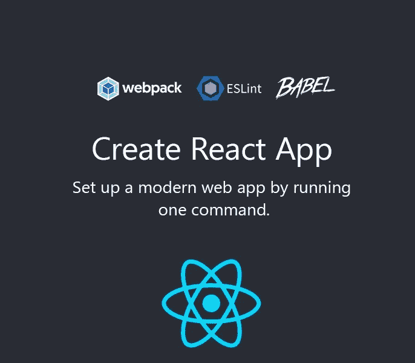
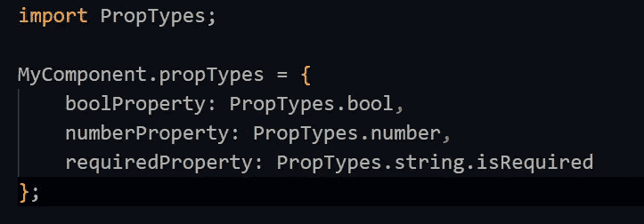
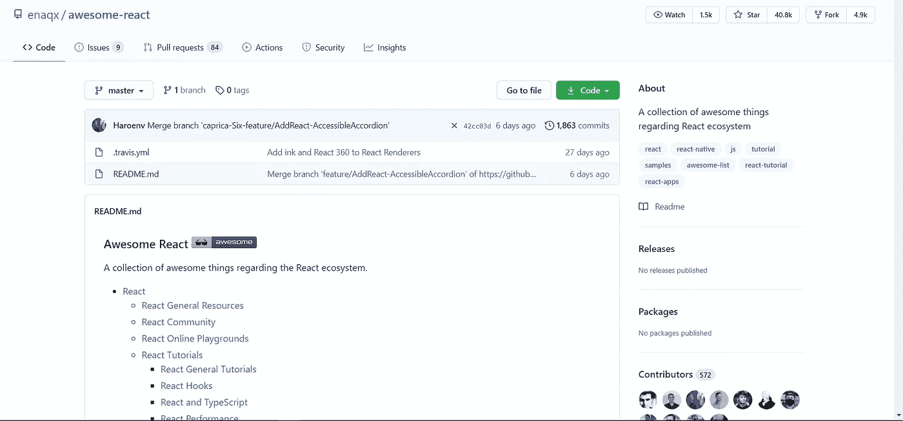

# 2021 年 React 开发者的 10 个重要工具

> 原文：<https://javascript.plainenglish.io/10-must-have-tools-for-react-developers-in-2021-b063426b43fd?source=collection_archive---------5----------------------->

## 使用 React 工具的正确生态系统来制作出色的 React 应用程序

**React** 自**脸书**引进以来，一直以非常快的速度发展。但是随着受欢迎程度的增长，开发更大的应用程序变得越来越复杂。因此，这里有一些基本的 React 工具，可以帮助你更容易地使用 React 构建 ***应用。***

# 1.钩住

> GitHub Stars: 157，000 +
> 
> 开发商:脸书

你可能不会称它为工具，但任何在 2021 年开发 ***React 应用*** 的开发者都需要熟悉 React 中的钩子，例如， ***useState*** 钩子允许一个函数组件拥有自己的状态&***use effect***允许你在初始渲染**(数据获取)**后执行副作用。钩子也可以用来在特定的组件之间共享代码。

## 以下是最常见的挂钩:

1.  **使用状态:**没有生命周期方法的功能组件中的突变状态。
2.  **useEffect:** 用于触发 *Ajax* 请求。
3.  **useContext:** 访问组件上下文数据，即使在组件的属性之外。

## 优点:

1.更好的状态管理复杂性。

2.支持功能组件。

# 2.创建 React 应用

> GitHub Stars:82000+
> 
> 开发商:脸书

***Create React App***另一个开始创建一个全新 React 项目时必不可少的工具，它通过单个 **npm 包**管理所有依赖关系。你不必浪费很多时间去处理****【web pack】***&剩下的事情。不仅如此，您只需坚持使用一个命令，该命令将创建一个本地开发环境，其中包含 **React** 、 **JSX** 、&、 **ES6 支持**，您可以轻松地处理您的项目，并能够实时观察更改(**、*热模块重装-* 、**您的更改会在开发时立即出现在浏览器中)。*

*要开始，您只需在终端窗口中运行以下命令:*

*`npm create-react-app Your App Name`*

# *3.PropsTypes*

> *GitHub Stars:3600 以上*
> 
> *开发商:脸书*

*该工具声明为 React 组件实现的类型，并显示其意图，如果类型不匹配，它将在开发环境中显示警告。它支持所有的原语类型，如**布尔值、数字和字符串**，它使用 ***isRequired*** 来记录需要哪些 ***道具*** 。*

*例如:*

**

## *优点:*

1.  *记录组件意图。*
2.  *显示所有的 JavaScript 原语。*

# *4.Redux*

**

> *GitHub Stars:54000+*
> 
> *开发者:丹·阿布拉莫夫和安德鲁·克拉克*

*当我们谈论 React 中的状态管理时，仍然没有像 **Redux** 这样的东西，这个状态管理工具为 **JavaScript** 应用程序提供了一个可预测的状态管理容器。它将应用程序中的所有内容保存在一个单独的存储中，redux 的输入参数和输出状态之间有一对一的关系，这使得 reducers 成为纯函数。*

## *优点:*

1.  *一个商店里有多个减速器。*
2.  *可预测的状态管理。*

# *5.反应路由器*

**

> *GitHub Stars:42000*
> 
> *开发人员:反应培训*

**React Router 是*另一个在现实世界应用程序的多个视图之间路由的伟大工具，React Router 是 React 的标准路由库，它保持应用程序 UI 和 URL 同步。*

*这个库包括 3 个包:react-router、react-router-dom 和 react-router-native。*

*核心包是 react-router，其余部分是特定于环境的，例如，我们可以将 **react-router-dom** 用于 web 应用&**React-router-Native**用于***React-Native****应用*。在最近的 ***更新中，React-Router*** 钩子也被引入，它提供了对路由器状态的访问，并从我们的组件内部执行导航。*

## *优点:*

1.  *组件之间快速简单的布线。*
2.  *将组件连接到单个存储。*

# *6.洛达什*

**

> *GitHub Stars:46000+*
> 
> *开发者:约翰-大卫&洛达什团队*

*一个非常有用的 React 组件实用程序库。例如，在 React 应用程序中构建**表单**时，每次击键 ***onChange*** 输入事件触发一次&，即使组件从 ***后端 API*** 获取数据，每次击键它仍然只触发一次。当用户击键不止一次时，这会产生严重的问题。Lodash 带有去抖事件，通过多次击键触发一个 ***API*** 请求。*

*优点:*

1.  *好用。*
2.  *模块依赖性。*

# *7.Axios*

**

> *GitHub Stars:77500+*
> 
> *开发者:Axios 团队*

*一个客户端 **JavaScript** 应用程序需要执行的最多的任务是发出 ***HTTP 请求*** 来获取或保存数据，据我所知，没有比 **Axios** 更好的库来执行这项任务，这是一个基于 Promise 的 HTTP 客户端，带有一个易于使用的 **API** 。它支持 async-await 语法从浏览器发出 Ajax 请求。*

*它还支持在出现错误的情况下通过 ***catch 进行错误处理，*** API 支持所有 HTTP 请求，如 **GET、DELETE、POST、PUT、PATCH &** 也可以很好地与 Promise.all()等 Promise API 调用一起发送 HTTP 请求。*

*因为我们有 jQuery 的`.ajax`函数，类似地，您可以通过将一个对象传递给 ***Axios*** 来发出任何类型的 HTTP 请求。*

**

*优点:*

1.  *基于承诺。*
2.  *支持异步等待。*

# *8.玩笑*

**

> *GitHub 明星:32500+。*
> 
> *开发商:脸书。*

*一个针对 **JavaScript** 项目的测试框架，它带有***create-react-app****，由 **Babel，ts，& Node** 组成。在大多数 *React 项目*上几乎不需要配置，并且可以在监视模式下运行，监视模式跟踪代码变更并重新运行测试。**

**优点:**

1.  **流畅的 API。**
2.  **在监视模式下运行。**

# **9.酶**

****

> **GitHub 明星:19000+。**
> 
> **开发商:Airbnb。**

**用酶测试反应成分变得容易得多，要得到酶只需要两个包: ***酶&一个单独的适配器。*** 适配器必须与您当前版本的 React 兼容。**

**例如: ***酶-接头-反应-16 为反应 16.4.0*****

**优点:**

1.  **直观的 API。**
2.  **支持 React 组件。**

# **10.厉害的反应**

****

> **GitHub Stars:39500**

**一个 ***GitHub*** 回购，其中包含了一系列与 ***React 生态系统相关的精彩内容。*** 非常有用，如果你一直关注 React 更新的话，还有工具、演示、视频&会议& React-Native 等等。**