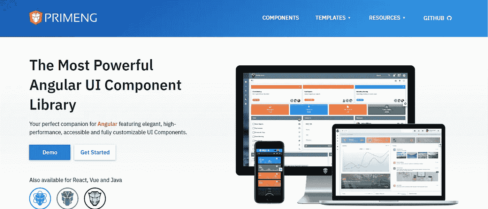

# 2021 年要尝试的 11 个流行 Angular UI 库

> 原文：<https://javascript.plainenglish.io/10-popular-angular-ui-libraries-to-try-in-2021-5a24c8aaa902?source=collection_archive---------1----------------------->

Angular 是最受欢迎的框架之一，为应用程序开发公司提供了最佳设计的实践和工具。Angular 鼓励开发者使用组件将用户界面分成可重用的不同部分。市场上有许多流行的 Angular 组件库，可以帮助 Angular 开发公司为他们的客户创建一个健壮的应用程序。

在这篇博客中，我们将浏览一些最流行的角度组件库，人们可以在 2021 年使用。

# **为什么要使用角度组件库？**

使用 Angular 和 TypeScript 创建角度组件。这些组件都是用谷歌的材质设计实现的。它还使 Angular 开发人员能够将 UI 分成不同的部分。让开发人员使用 Angular 组件库的一些奇妙的方面是

*   **模块化架构**

Angular 中的组件以与模块类似的方式创建。这完全取决于开发人员在哪个平台上使用以及何时使用它。

*   **反应灵敏**

Angular 组件库在本质上非常灵敏，这使得它对于网站设计和开发至关重要。

*   **人性化**

Angular 组件库是用户友好的，并且是以轻量级的方式构建的。对于任何 Angular developer 来说，学习和使用都很容易。

# **2021 年必须使用的 10 大角度组件库**

# **1。NGX 引导程序**

NGX Bootstrap 是最流行的开源角度组件之一。它提供了巨大的引导功能，并帮助开发人员在他们客户的下一个 Angular 应用程序开发项目中利用它。

NGX Bootstrap 被 GitHub 社区打了 [5.2k 星](https://github.com/valor-software/ngx-bootstrap)。

## **NGX Bootstrap 的特性**

*   **灵活**

ngx-bootstrap 团队的 AngularJS 开发人员致力于创建 ngx-bootstrap 模块化，这可以帮助开发公司实现他们自己的 whatnot、styles 和 templates。所有角度组件的设计都考虑到了适应性和可扩展性。他们可以在具有相同性能水平的桌面和移动平台上高效工作。

*   **好的文档**

NGX Bootstrap 提供了精心编写的文档，可以极大地帮助 AngularJS 开发人员减轻工作负担，提高软件质量。ngx-bootstrap 的团队提供易于理解和完整的文档。

*   **修补程序友好代码**

NGX Bootstrap 整合了一套指导原则，可以帮助增强代码的可读性和可维护性。

## **NGX Bootstrap 的组件**

*   倒塌
*   字模
*   倒塌
*   警报
*   旋转木马
*   手风琴

# **2。NG 引导程序**

NG Bootstrap 是一个流行的角度开发引导组件。它在 GitHub 上有大约 [7.6k 颗星星。使用 NG Bootstrap 时，不需要使用第三方 JS 依赖。它也用于高测试覆盖率。](https://github.com/ng-bootstrap/ng-bootstrap)

## **NG Bootstrap 的特性**

*   **Widgets**

NG bootstrap 提供了像 modal、tablet、rating 和 tooltip 这样的小部件。

*   **可访问**

NG bootstrap 提供了独特的小部件，并提供了对它们的完全访问。NG bootstrap 团队使用 HTML 元素和属性来帮助 AngularJS 应用开发公司创建健壮的应用。这个库还提供焦点管理工作和键盘导航。

*   **质量**

NG bootstrap 的团队以 100%的收敛测试代码，并审查所有的更改。

*   **团队**

有一个为开发小部件而创建的 bootstrap/angular-UI 团队，也有许多核心 angular 贡献者。

## **NG 引导程序的组件**

*   旋转木马
*   波普沃
*   字模
*   模型
*   工具提示
*   日期选择器

# **3。Teradata 共价 UI 平台**

Teradata 是在 Angular 和 Angular-Material 上创建的 UI 平台。它附带的解决方案结合了全面的 web 框架和成熟的设计语言。它甚至让 AngularJS 开发人员快速开始创建一个现代的 web 应用程序。Teradata 共价分数 2.2k GitHub 分数。

Angular 命令行界面使开发人员能够使用 Angular-material 并创建、部署和测试应用程序。它提供了简化的步进器、文件上传、用户界面布局、定制 web 组件、扩展面板以及更多用于端到端测试和单元测试的测试工具。

## **Teradata 的特性**

*   角形材料部件
*   公用事业
*   埃查尔兹

## **Teradata 的组件**

*   基本布局
*   管理列表
*   扩展面板
*   虚拟滚动
*   跳舞者
*   装货
*   面包屑

# **4。星云**

Nebular 是一个有角度的 8 UI 库，专注于品牌的适应性和设计。它有四个支持自定义 CSS 属性的可视主题。该库基于 Eva 设计系统。Nebular 只有很少的安全模块和大约 40 多个 UI 组件。其中一些组件如下所述。除此之外，它在 GitHub 社区还有 [6.7k 启动](https://github.com/akveo/nebular)。

## **星云的特征**

*   服务器端渲染
*   高质量的角形部件
*   视觉主题

## **星云的成分**

*   无限列表
*   补充报道
*   布局
*   上下文菜单
*   工具提示
*   窗户
*   全局搜索
*   检验盒

# **5。透明度**

Clarity 是一个开源的 Angular 组件，充当 HTML 框架和 Angular 组件之间的桥梁。Clarity 是软件开发者和设计者的最佳平台。

Clarity library 为 Angular 开发服务提供商提供了已实现的数据绑定组件和结构良好的选项。还拥有 6.1k GitHub stars。

## **特性清晰**

*   **基于产品的**

Clarity 团队提供了一个易于理解和使用的平台，帮助开发人员解决大量的挑战。

*   **可靠**

它是最可靠的平台，因为它提供了高质量的标准。

*   **快速发展**

Clarity 的设计使得专业知识的交流和合作变得非常容易和迅速。

*   **进化**

随着新技术和技巧的出现，清晰度不断发展。

## **组件的清晰度**

*   登录页面
*   进度条
*   拨动开关
*   男巫
*   路标
*   格子
*   警报
*   密码

# **6。温泉 UI**

Onsen UI 是 Angular 开发服务公司使用最多的组件库之一，用于使用 JavaScript 为 Android 和 iOS 创建移动 web 应用程序。它在 GitHub 社区拥有 [8.2 颗星。](https://github.com/OnsenUI/OnsenUI)

Onsen UI 是一个带有开发工具和 Monaca 的强大 CLI 的库。Onsen UI 的主要优势在于其 UI 组件可以轻松地插入到移动应用程序中。

## **温泉 UI 的特色**

*   **支持 Monaca**

Monaca 是一个用于创建混合应用程序的跨平台，Onsen UI 使用它表现非常好。

*   **原生外观**

它提供了现成的组件，如工具栏、表单、侧菜单等，提供了一个自然的外观。除此之外，Onsen UI 还支持 Android 和 iOS 材质设计，使应用的外观和风格看起来与选择的平台一致。

*   **优化的性能**

新版本的 Onsen UI 现在能够提供优化的性能，而不会减慢进程。

*   **简单易学**

尽管它是开发移动应用程序的强大工具，但学习和使用起来非常简单。

*   **零点时间设置**

Onsen UI 允许开发人员使用 CSS、HTML 和 JavaScript 等技术。这些是他们可能已经知道的技术，所以使用这个工具不需要花费太多时间。

## **温泉 UI 的组件**

*   旋转木马
*   有条件的
*   控制
*   对话
*   形式
*   手势
*   菜单
*   目录
*   航行
*   Tabbar

# 7 .**。Vaadin 组件**

Vaadin Angular 组件库使 AngularJS 开发人员能够创建漂亮的 web 应用程序。该库为桌面和移动平台设计了组件。它在两个平台上都能很好地工作。Vaadin 是一个库，众所周知，它是聚合物元素和角度组件之间的桥梁。Vaadin 是一个库，可以快速安全地处理服务器-客户端通信和路由。

## **vaa din 组件的特性**

*   Java Web 开发
*   Web 组件
*   主题
*   按指定路线发送
*   Java EE 支持
*   数据绑定
*   展开性

## **万艾丁的成分**

*   密码字段
*   自定义字段
*   通知
*   上下文菜单
*   进度条
*   试算表
*   富文本编辑器
*   图表

# **8。NG 闪电**

NG Lightning 是另一个流行的 Angular 组件库，专为 salesforce 开发而设计。这个库依赖于输入属性来为最终用户提供更好的性能。它包含一个照明设计系统和一个原生角度组件。

## **NG 闪电的特征**

*   易接近
*   最佳实践
*   面向未来的建筑

## **天然气闪电的组成**

*   电影《阿凡达》
*   徽章
*   按钮图标
*   旋转木马
*   面包屑
*   警报
*   手风琴
*   动态图标
*   松饼
*   纺纱机

# **9。NG 语义界面**

NG Semantic 是最流行的框架之一，旨在帮助 Angular development 公司使用 HTML 代码开发独特的布局。它使用可交换的概念。

NG Semantic-UI 有大约 3000 多个主题变量、5000 多个提交和 50 多个 UI 组件。所有这些都可以用来创建一个健壮的、用户友好的应用程序。

## **NG 语义界面的特点**

*   简洁的 HTML
*   简化调试
*   令人惊叹的主题
*   直观的 JavaScript

## **NG 语义界面的组件**

*   圆规
*   页眉
*   图像
*   图标
*   铁路
*   容器
*   纽扣
*   输入标签

# **10。角度的剑道 UI**

Kendo UI 是一个库，帮助 Angular 开发公司将应用程序创建过程提升到一个新的水平。这是最专业的角度组件库之一。它提供了令人印象深刻的功能，如原生的 Angular UI、灵活的主题和简单的安装过程。

## **有棱角的剑道 UI 特点**

*   虚拟化
*   易接近
*   角度数据网格分组

# 11.**充能**

PrimeNG 是另一个流行的 Angular 组件库，因为它收集了大量的 UI 组件。该库下的所有小部件都是开源的，开发者可以轻松使用它们。这些小工具在麻省理工学院的许可下运行。PrimeTek Informatics 是一家在创建最佳开源 UI 解决方案方面拥有专业知识的公司，它创建的这个库非常受欢迎。

## **灌注的特点**

*   **模板**

在 PrimeNG 组件的支持下，可以使用模板并使用 *pTemplate* 属性进行定制。它使 Angular 开发者能够随时定制他们想要的内容。

*   **主题**

PrimeNG 库为 UI 组件提供了各种主题的列表，开发人员可以从中进行选择。它使 AngularJs 开发人员能够选择 UI 组件的外观和感觉。

*   **积极发展**

PrimeNG 库正在持续开发中。因此，如果开发人员有任何问题，他们可以很快得到解决。除此之外，Angular 开发公司可以利用其频繁的更新和发布。

## **灌注组件**

*   自动完成
*   多选
*   柔性网格
*   数据视图
*   确认对话
*   面包屑
*   甜甜圈
*   玻璃纤维

**结论**

在这里，我们讨论了未来几年 AngularJS 开发人员将继续流行的前 11 个 Angular 组件库。这些库用于创建许多不同类型的平台。使用它创建的一些流行网站有 IBM、Forbes、Freelancer、PayPal 和 UpWork。这非常清楚地表明，为客户的项目使用这些库将是正确的决定。