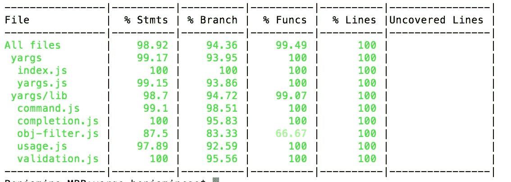

# 给开发者的 10 个测试技巧

> 原文：<https://javascript.plainenglish.io/10-testing-tips-for-developers-f12bfb7844c3?source=collection_archive---------0----------------------->

## 如何面对虫子？

## 少做容易出错的软件！


Photo by [Austin Distel](https://unsplash.com/@austindistel?utm_source=unsplash&utm_medium=referral&utm_content=creditCopyText) on [Unsplash](https://unsplash.com/s/photos/software?utm_source=unsplash&utm_medium=referral&utm_content=creditCopyText)

> 计划就是一切，计划什么都不是！
> 
> *——*德怀特·戴维·艾森豪威尔

如果你打算设计你的系统，那么就选择花哨的图表([数据流图](https://www.visual-paradigm.com/guide/data-flow-diagram/what-is-data-flow-diagram/)，[用例](https://www.visual-paradigm.com/guide/uml-unified-modeling-language/what-is-use-case-diagram/)， [JSP 图](https://www.conceptdraw.com/solution-park/software-jackson-structured-programming-diagram)，[状态图](https://www.tutorialspoint.com/uml/uml_statechart_diagram.htm)等等。)，**然后你要做好 bug**的准备。**不可能设计出一个完美的系统，既能完美扩展，又没有死角。**

我要给你 10 个技巧，这是我辛苦学来的！

# 1.考虑同地办公

我见过一次**不寻常的代码注释方式**。一开始看起来很傻，但是可以说得通。唯一维护整个系统的人…他将代码注释从代码中分离出来。他将所有的代码注释转移到一个名为`docs`的独立文件夹中。大概是这样的:

```
├───docs
├───fixtures
├───controllers
├───middlewares
├───models
├───public
├───routes
├───utils
```

我不喜欢这种方法。会有一些严重的问题。我列出了三个最大的:

*   **可维护性** -忘记更新相应的`docs/`文件；
*   **不透明**——程序员看着代码，却不知道到底发生了什么；
*   浪费时间-考虑那些你必须更新的位置，等等。)我们会遇到注释与代码库不在一起的情况。

这同样适用于测试。坚持测试的概念让你的生活更轻松。您将避免以前的方法会遇到的大多数问题。所以，拿着你的`__tests__`文件夹，里面有你正在测试的代码组。我给你看一个我最新项目的例子:

```
├───config
├───fixtures
│   └───db
├───handlers
│   └───__tests__
├───middleware
├───models
├───public
├───routes
│   └───__tests__
├───utils
└───__mocks__
```

对我来说，采用 TDD 方法很常见(由于[初创企业](https://en.wikipedia.org/wiki/Startup_company) …)的性质，我们的项目没有采用这种方法)。

结论:**做一个名为** `**__tests__**` **的文件夹，放在你要测试的代码所在的文件夹里。**

# 2.永远不要忽视国际化测试

根据最近一次[民族语言学家](https://www.ethnologue.com/)的研究，在写这个[媒介](https://medium.com/u/504c7870fdb6?source=post_page-----f12bfb7844c3--------------------------------)的故事时，有 7117 种语言在今天被使用。这个数字一直在变化，因为我们每天都在学习世界上更多的语言。

因此，如果你想制造一种适合许多市场的产品或服务，你可能需要考虑国际化。

如果有人问我:‘什么是国际化测试？’我可能会说**一套帮助我们使我们的产品适应多种地区和文化的技术**。

没有人强迫你自己去写那些测试。有一堆测试库。你可能会在前端纠结这个问题，所以我给你推荐一个我曾经用过的很酷的库:[*JS*](https://github.com/kentcdodds/rtl-css-js)*中的 CSS RTL。*

# 3.猴子补丁可能是一个棘手的问题

猴子打补丁呢？嗯，对于我们的模块来说，这不是一个最优的解决方案，但有时我们无法避免。使用嘲讽的主要原因是防止第三方服务工作。例如，如果我们正在使用 [Twilio SendGrid 电子邮件 API](https://www.twilio.com/sendgrid/email-api) ，我们不希望在 10 秒的时间间隔内发送 100 封电子邮件。服务将为此向我们收费，我们正在不必要的浪费资源。

我举一个基本的例子:

例如，如果我们在测试函数的范围内调用`randPicker(12, 1)`太多次，或者如果我们以错误的方式调用它，那么**的事情可能会破坏**。

当你在你的测试中设计一个东西的假版本(模仿)时，你就失去了对模仿和你正在测试的逻辑之间的集成的信心。让我们看一个例子:

我们完成了工作，把项目留给了同事。他决定增加一个新功能。大学是一个写作测试，他选择修复这个模拟功能:

同事添加了一个新的参数`maxArgs` …我们的模拟被修改了，测试仍然通过，代码被破坏了！最后，**我不是劝你停止嘲讽**。当你使用它的时候你必须小心。我是我的看法，我并不总是使用它，但有时我不得不这样做。

如果您正在处理敏感数据(用户信息、信用卡信息等)。)，没有绕过的办法。你是迫于形势才使用它的。没有办法知道你是否恰当地称呼事物。在这种情况下，**QA**强烈推荐使用嘲讽策略。

有些情况下，当你测试收费服务时，你不能仅仅为了测试而向用户的账户收费。对了，测试两个分离系统的兼容性叫做[契约测试](https://pactflow.io/blog/what-is-contract-testing/)。

不幸的是，你不能用嘲讽来伪造你的银行账户，这样你就能获得一大笔钱！

# 4.尊重纯函数的概念

我强烈建议您熟悉[棉绒](https://eslint.org/)并正确使用该工具。当你使用嘲弄策略时，我将向你展示最有影响力的棉绒配置之一。

在下一个例子中，我们有一个`.eslintrc`，它禁用了一个叫做`import/namespace`的林挺规则:

这是`.eslintrc`导入插件。如果我重新打开它(将`off`改为`warn`，它将确保您不会对导入的任何内容进行更改，至少不会对名称空间进行更改。

如果你想知道为什么这个规则存在，那么我们应该谈谈 [NodeJS](https://nodejs.org/) 的历史。当 [ECMAScript 的模块](https://nodejs.org/api/esm.html)在 [Node.js](https://medium.com/u/96cd9a1fb56?source=post_page-----f12bfb7844c3--------------------------------) 中实现时，如果我们使用原生模块，这将不起作用。它可能会产生语法错误或(至少)运行时错误。

这是当你想要模仿你的数据时，你需要三思的额外原因。

# 5.作为原型工具的前端

如果你正在开发一个大的商业系统，首先设计系统是很正常的。根据系统设计，您将实现服务器端。最后，做前端的东西。

**在创业行业，首先制作前端原型并不少见**这样你就可以通过视觉内容来表达你的想法。你会问的一个常见问题是:**如何测试是否使用目前还没有准备好的内部 API？**

> 这是一个很好的问题。

你在考虑使用模拟，是吗？这与您拥有后端实现的情况有关。**这取决于您要测试的工件。**也许，您正在进行一个集成两个或更多服务的集成测试(合同测试)，或者您正在尝试验证网络请求等。

**有时您可以依赖那些服务**，主要是如果这些服务很重要的话。在这种情况下，您可能不想进行模拟。**但是，如果你在做单元测试(低级测试)，你必须模拟。**

你必须采用正确的思维模式。如果您的内部应用编程接口还没有准备好，那么模拟是很好的。不是在测试的背景下，而是在能够开发软件的背景下。在我看来，这是一个很好的测试策略。

因此，如果您的测试将在服务不可用时使用 API，那么您必须使用 mock。**测试您的服务很好**，但是如果您在本地机器上运行测试，我大部分时间都在本地机器上运行测试，我想测试控制器，所以我先模拟一下。

结论:**拥有第三方服务的模拟版本很好，因为您可能会在脱机时或内部 API 尚未就绪时运行测试。**

# 6.尽可能明确

假设我们正在测试索引用户路由:

我们将编写相应的测试:

当然，测试会通过的。例如，如果我们将其更改为`toHaveBeenCalled(3)`，它将失败，因为它预计将被测试调用一次。还有一个我们可以使用的断言，那就是`toHaveBeenCalled()`。

我不亲自使用它的原因是，我想在这里更明确地说明测试调用了多少次。为什么？有时，您可能会在控制器中出错。例如，您可以编写两次相同的函数调用:

`toHaveBeenCalled()`会通过测试，但`toHaveBeenCalledTimes(1)`不会。明确事情回应的次数，以避免类似的情况。最终，你可以验证什么叫做`console.log(res.json.mock.calls[1])`。

# 7.编写一个纯单元测试是很困难的

前面的例子不是一个纯粹的单元测试。单元测试是模拟所有依赖关系的测试。它只测试相应模块中的东西。如果我们想要一个纯单元测试，我们将为我们导入的所有东西(utils、数据库等)提供一个模拟。).**我们正专注于该单元。**

结论:**如果你更喜欢纯单元测试，你必须模拟所有的东西。否则，您将不会有一个纯单元测试。**

我不太关心区分单元测试和集成测试。我的意思是，我不在乎那些名字，我在乎的是我从测试中获得的信心。当我不得不做那些可笑的事情时，我几乎忘记了我在乎额外的工作。

**注意:**不要忽视编写额外的测试来获得对正确工作的更多依赖。

# 8.每次测试前初始化数据库

在我的每一个测试之前，我总是以异步的方式初始化数据库。我将花一些时间进行初始化，然后运行测试。

**我强烈推荐这种做法**，因为可能会有这样的情况，你正在处理一个大型数据库，这会降低你的测试速度。**这是最糟糕的情况——浪费时间。**

另一个特点是赢得更多的信心，因为你确信测试是独立运行的，独立于其他测试用例。如果测试失败，并且您的数据库完全混乱，您应该再次运行初始化过程。

如果你有一个大的应用程序，它需要一个大的数据库，你只需要在测试之前初始化数据库一次，这样就不会降低系统的速度。在大量数据的情况下，这是一个很好的策略，至少在我看来是这样。

在更普通的应用中，你可以使用[夹具](https://stackoverflow.com/questions/12071344/what-are-fixtures-in-programming)，这在所有测试中都是一样的。您将知道在任何给定时间数据库中应该有什么。每次测试后，您都应该清理数据库。

> 您可能想知道我们是否应该考虑在完全隔离的情况下执行单元测试？

好吧，我希望你在疑惑，我没有白写答案。我不关心被隔离测试的单元。我只关心测试的有效性。我相信分割测试单元所有依赖项的方式将确保测试更加可靠，但我个人很少这样做。

如果我有一个足够复杂的单元，并且在每次测试(测试该单元的所有复杂业务逻辑)之前初始化数据库是浪费时间，**我会把它取出来，放入一个纯函数**。**我解决了时间复杂度问题**，可以一整天孤立测试。

这是一个两全其美的好方法。我可以**获得纯单元测试的动力**而不会牺牲很多信心。你可以有一个验证业务逻辑的**测试**，以及围绕这个**的一系列纯功能的单元测试**。

有些情况下，降低测试级别是最佳的。你可以有一些现在只能作为集成测试来测试的东西。你把有很多边缘情况的那块拿出来处理，然后把它放进它的小模块里，然后你就可以全部测试出来了。

结论:**没有理想的解决方案。你必须权衡后果。但是，在每次测试后清理数据库会给你很大的信心。你必须记住，这可能会消耗更多的时间。**

# 9.使用测试对象工厂

让我们考虑下一种情况:

当大多数请求对象看起来与其他测试相同时，您应该使用测试对象工厂(又名 [ObjectMother](https://martinfowler.com/bliki/ObjectMother.html) )。理论是，你把常用的东西放在一个函数中，然后根据需要，你可以取回你需要的任何东西。

通常将这个函数命名为`setup()`。**该功能负责任何类型的设置，这在所有测试中都是相同的。**您不限于使用相同的设置。需要的话可以随时添加一些自定义的东西。

您可以使用`beforeEach()`之类的东西，但是如果您对测试中发生的事情感兴趣，那就不是一个好方法。

# 10.TDD 的目标是什么？

**测试驱动开发**在纯函数的世界里有一个很好的位置。别的不说，考察纯函数更容易。

有很多地方我们可以使用 TDD 方法。我们添加新功能、删除等的情况。，都是高档景点。我们正试图开发更多的用例来鼓励我们发展业务逻辑。

TDD 不好用的地方是用户界面。测试用户界面通常很棘手。**如果你正在试验用户界面，并且经常改变它，你最好避免 TDD，因为它在这种情况下不起作用。**

当你对你想要开发的东西有一个清晰的愿景时，你就使用 TDD。因此，流程是您将首先记录概念，然后编写测试来验证，最后一步是编写实现。你必须发展对 TDD 的直觉，并采用正确的工作流程。

如果你在做开源项目，你就不是 TDD 的粉丝。如果你从 TDD 开始，你可能会有跳过重构过程的问题。如果你落入那个陷阱，你的代码将无法维护。

**如果你的项目变得流行，被成千上万的人接受怎么办？他们不应该在产品中使用不可维护的代码，但是他们使用。**

但是并不是所有的事情都是如此糟糕，如果你在重构阶段打破了一些东西，你总是可以继续下去并修复它。

结论: **TDD 被(大型)团队用于构建大型商业系统，如支付服务或电信系统。**

# 末日即将来临

测试的整个过程是试图与维护这些测试的人交流什么是相关的。不要让他们开始思考:

> 我要更改索引用户路由，最好不要对用户的请求对象做任何更改，因为那里有重要的东西。

我很感兴趣的一个普遍存在的错误是，当管理层(很少是软件开发人员)创建一个你必须拥有 100% [代码覆盖率](https://en.wikipedia.org/wiki/Code_coverage)的命令时！**坏主意！把** [**帕累托原理**](https://en.wikipedia.org/wiki/Pareto_principle) **考虑进去。**



Istanbul’s terminal shows the code coverage (source: [Istanbul](https://istanbul.js.org/))

很难结束代码覆盖率提供的价值曲线。为这个目标奋斗会产生收益递减。最后 10%的代码覆盖率可能非常挑剔，很难维护。您必须计划无法计划的事情，经常开始挂起强制代码来暴露某些对测试有用的逻辑。

**所有的努力都是为了让** [**伊斯坦布尔**](http://nnecessarily.) **能够向你展示 100%的测试覆盖率！没必要。**