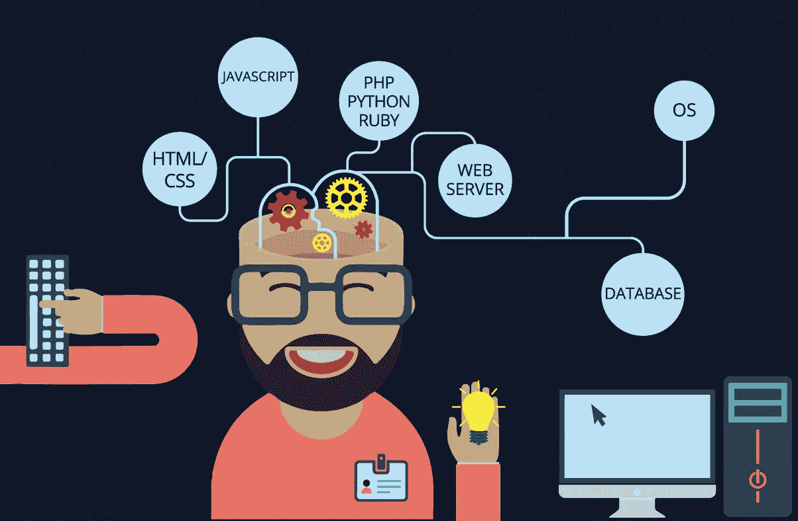
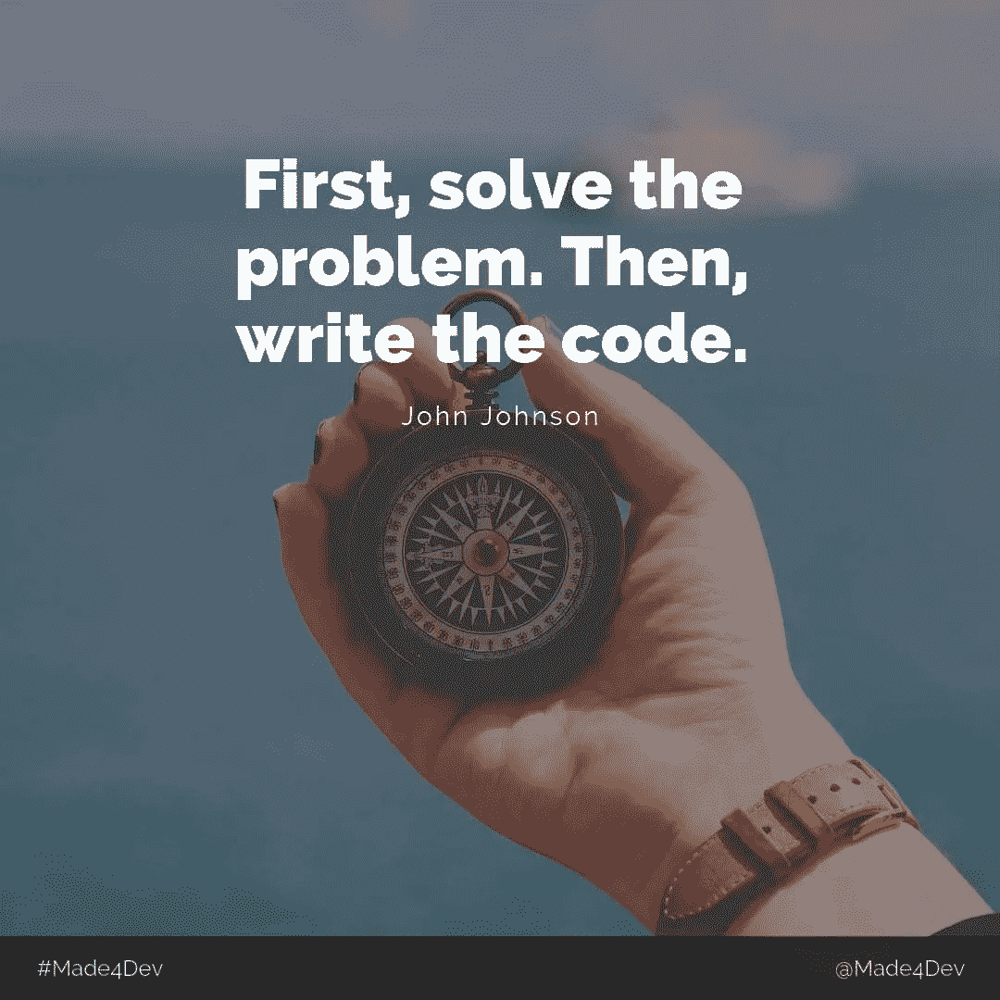

# 全栈开发人员应该知道的 10 件事

> 原文：<https://javascript.plainenglish.io/10-things-a-full-stack-developer-should-know-961f79756e2d?source=collection_archive---------5----------------------->

# 当你听到“全栈开发者”这个词时，你会想到什么？

可能是做某种编码的人！前端？….后端？或者两者都有？

让我把 Quora 最著名的定义放出来…

全栈开发人员是能够处理数据库、服务器、系统工程和客户机的所有工作的工程师。根据项目的不同，客户需要的可能是移动堆栈、Web 堆栈或本机应用程序堆栈。

其实“全栈”指的是完成一个项目所需的一系列技术的集合。“堆栈”是指子模块的集合。这些软件子模块或组件组合在一起实现了既定的功能，而不需要其他模块。….听起来很酷吧！

根据 Payscale，Glassdoor，Linkedin 和所有其他组织的工资报告，全栈开发人员平均比前端或后端开发人员赚得多。

如果你正计划成为其中一员…这里有关于这个角色你需要知道的 10 件事。

1.  你的工作将会有很大的变化

有一天，您将致力于性能改进问题，以制作一个存储过程来帮助处理百万条以上的记录，另一天，您将致力于一个 UI bug 来改进您的网站的外观和感觉。你将会接触到很多技术，比如 HTML、Javascript、SQL、Java/C#/Python，以及 Eclipse、Visual Studio 等 ide。

2.**你将负责端到端的应用开发**

你的团队中会有人处理应用程序的特定部分，比如处理数据库，或者处理网站的 UI/UX。但是你将会在某个时候为所有的事情努力。从设计高层应用到理解从 UI 到后端的数据流，所有这些都由全栈开发人员以某种方式处理。你可以从事像数据流(数据库设计)或系统设计这样的工作，它们是任何应用程序的重要方面。

你可能不会完全致力于完成上述任务，但它的理解会对你有用。全栈开发人员就像是在某个时候能够帮助每个团队成员的人:)

3.**使用 API**

API 基本上类似于任何普通的服务，用户可以向其发送请求，服务将返回一些数据或执行一些操作。像谷歌、脸书、Twitter 这样的公司已经创建了大量的 API，可以很容易地在应用程序中实现。创建你自己的可以处理各种操作的 API 使你的工作更容易。应用程序编程接口及其在技术行业中的趋势需求使得公司雇佣专门精通 API 开发的工程师。作为一个完整的堆栈资源，很多时候你会被期望处理 project 中的各种 API 或者实现新的 API。

4.**调试……测试……调试……测试……还有很多其他的事情**

这占用了任何开发人员 70%以上的时间。大量的测试和调试开始显现出你的代码是如何处理不同情况的。您必须确保在基本实现的同时处理所有的边缘情况。测试基本上是任何开发任务的第二步。你做一个算法，你测试它。在各种数据和条件下进行测试。你测试得越好，它就越健壮。了解各种键盘快捷键和调试技巧也可以减少您的时间。

**5。服务器端配置知识，读取服务器日志并理解流程**

尽管您将主要从事应用程序的开发部分。但是有时候你需要了解服务器端来调试各种问题。知道如何阅读服务器日志很有帮助。一旦记录了日志，就更容易知道哪里出了问题，也更容易修复它。不仅仅是服务器日志，了解诸如数据流是如何发生的，以及各种应用程序和数据库是如何相互作用的，都可以帮助我们轻松完成任务。同样，你对这些事情探索得越多，你解决问题的能力就越强。

6 **。版本控制系统(VCS)**

事实上，如果你是一个全栈开发者或者任何开发者，这是你绝对不能缺少的东西。任何时候，你想把你的代码从一个环境转移到另一个环境，你需要一个版本控制系统。SVN、GIT、TFS 是在不同项目中使用的少数几个著名的 VCS。如果你有一个集中的系统，协作和围绕你的代码移动会变得更容易，VCS 正是这样做的。您应该了解基本的命令和术语来理解它。

**7。知道如何调试多线程**

现在，我在一段时间前面临这个问题，它变得如此痛苦，因为我正在处理的代码有 8 个线程，跨越了大约 2000 行代码。你不能按照正常的调试实践进行，因为在这种情况下，所有的任务都是并行运行的，因此如果你试图按程序进行，你几乎不可能理解流程。像并行观察和并行堆栈这样的工具对于这样的任务来说很方便。

8.**如果你没有正确编码，它会困扰你一整夜**

是的，这个绝对是来自我的亲身经历。有时，当你得到一个要实现的特性时，你会按照客户的要求马上实现它，而不考虑外部的依赖性或后果。突然在晚上你接到一个电话，说你的代码不能处理一百万条记录。您可能不得不在巨大的压力下彻夜不眠来修复它，因为停机时间可能会让您的业务损失惨重。因此，在直接开始编码部分之前，坐下来想清楚你要做什么是非常重要的。请始终考虑您的实施可能会影响哪些功能。您的代码是否足够可伸缩、健壮？

不断优化你的代码，以提高其性能，并尽量使你的代码干净。使用适当的缩进和驼峰式大小写。在必要的地方加上适当的注释。

9.**确保获得需求权！…非常非常重要**

通常在团队中，业务分析师或产品负责人向开发人员讲述需求，然后开发人员通过记住这些条件来设计解决方案。所以，把它们做好是很重要的。如果当它被分配给你时，你不能正确理解它，最好安排一次与合适的利益相关者的会议，以便更好地把握手头的任务。此外，很多时候，业务的需求不断变化，所以你需要随时与你的利益相关者保持同步。最好把你的工作分成子任务，当你完成一部分时让他们知道。

10.**保持冷静，继续编码…**

最后也是最重要的一点。对于一个主要技能是解决问题的全栈开发人员来说，当你在处理一个任务时，你会遇到困难，这是很常见的。当你尝试不同的方法来解决你的问题时，有时手头的时间变少了。因此，你必须在时间限制下处理不同的任务，每一项任务都涉及不同的技术。始终保持冷静，当你陷入困境时，休息片刻。做一些不需要看屏幕的事情。过一段时间再去想它，你会对它有一个全新的看法。

永远不要害怕提问。你可能会被某项任务困住，而这项任务有人可以在 5 分钟内解决。所以，每当你觉得自己走进了死胡同，就去寻求帮助。问问你的同事，参考 stack overflow 等此类论坛，看看其他人有没有类似的问题。

最后…

