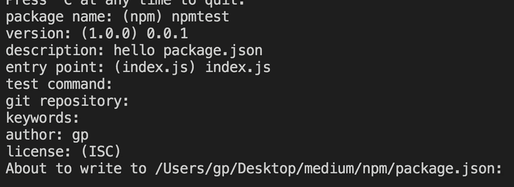
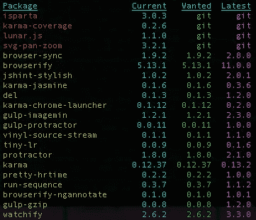
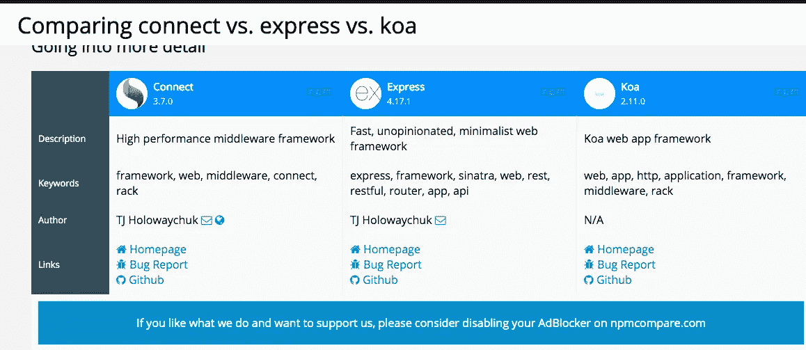
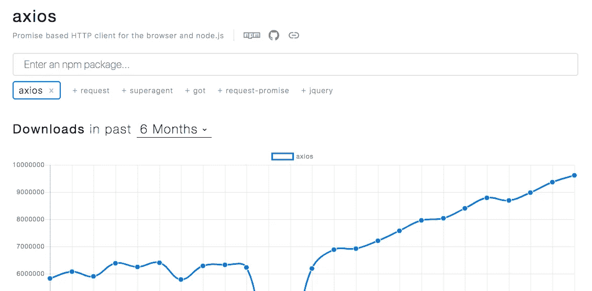

# 关于 NPM 你应该知道的 10 件事

> 原文：<https://javascript.plainenglish.io/10-things-you-should-know-about-npm-f72f94a13954?source=collection_archive---------0----------------------->


# > 1 什么是 NPM

*   npm 代表节点包管理器，大部分 JavaScript 程序都以包的形式注册到 npm
*   npm 注册了超过 70 万个包；世界上最大的 IT 生态系统
*   纱线是 npm 的替代品；由脸书创造

# > 2 package.json

*   同一个包可以有不同的功能，这取决于它的版本；`package.json`文件记录了所有已安装的软件包
*   创建`packge.json`的命令

```
$ npm init
```



**包名:**包名；`package.json`的`name`属性

**版本:** npm 版本管理严格(后面会深入讲解)

**入口点:**JavaScript 可执行文件的入口点。往往最后一个`module.exports`文件

**git 仓库:`package.json`的**属性

**关键字:**使用户能够在 npm 官方网站(https://npmjs.com)轻松找到该包`package.json`的`keywords`属性

# > 3 个许可证

*   **ISC、麻省理工学院、BSD 许可证:**当您确认模块和许可证后，即可免费使用
*   Apache : 免费使用，但有专利权限制
*   **GPL :** 部署时需要公开源代码并分发，直到 GPL 许可

# package.json 中的 4 个以上的“脚本”

*   `script`属性指定`npm`命令行，即控制台中的`npm run [SCRIPT COMMAND]`
*   通常情况下，在`start`命令下保存`node [FILE NAME]`并像 React.js、Vue.js 一样执行`npm start`

# > 5 个“保存”选项

*   `npm install`命令的`--save`选项常用于教程
*   `--save`选项将包名添加到`dependencies`中，但默认来自`npm@5`；因此，不需要为`npm install`命令指定`--save`选项

# > 6 `—保存-开发'选项

*   `--save-dev`仅用于开发的包选项，即`nodemon`在源代码更改时提供热加载，通常仅用于开发
*   `--save-dev`可以缩写为`-D`

```
// console
npm install --save-dev nodemand// package.json
{ ... "devDependencies": { "nodemon": "^1.17.3"
 }
}
```

# > 7 包版本

*   节点包版本总是由 3 个数字组成，因为它遵循 SemVer(语义版本化)规则

```
1.0.7
```

**第一个数字(` 1 '):**

*   主要版本
*   0 代表开发版；正式版从 1 开始
*   只有当较低版本不兼容时，主版本才会增加，即从`1.5.0`升级到`2.0.0`意味着从`1.5.0`更新到`2.0.0`很可能会出错

**第二个数字(` 0 '):**

*   次要版本
*   较低版本是兼容的，并且经常进行功能更新，即从`1.5.0`升级到`1.6.0`在兼容性方面没有问题

**第三个数字(` 7 '):**

*   补丁版本
*   修复现有错误，即从`1.5.0`升级到`1.5.1`不会导致任何错误

# > 8 ^，< , ~ symbol for package version

【 :

*   install / update to minor version
*   i.e., 【 installs a version from 【 ~ 【 (excluding 【 because the first number has changed and it’s major (version) change)

【 :

*   install / update to patch version
*   i.e., 【 installs a version from 【 ~ 【

【 is often useful than 【 because **次要版本更新**与较低版本兼容，具有最新的功能

`@latest`:用于安装最新版本的软件包(可以表示为`npm i express@latest`或`npm i express@x`

# > 9“NPM 过时”命令

*   使用`npm outdated`可以找到可用的更新包



*   如果`Current` & `Wanted`不同，则需要更新
*   可以通过执行`npm update [PACKAGE NAME]`进行更新
*   运行`npm update`将**所有**包更新到`Wanted`中指定的版本

# > 10 个有用的资源

**比较包**

 [## 搜索和比较 npm 包

### 轻松搜索和比较 npm 包，npm 包研究和发现的最终资源。

npmcompare.com](https://npmcompare.com/) 

**查看包的下载趋势**

[](https://www.npmtrends.com/) [## npm 趋势:比较 NPM 软件包下载

### 你应该使用哪个 NPM 软件包？比较 NPM 软件包下载统计随着时间的推移。现货趋势，挑选赢家！

www.npmtrends.com](https://www.npmtrends.com/) 

> 编码快乐！


Photo by [Kevin Ku](https://unsplash.com/@ikukevk?utm_source=medium&utm_medium=referral) on [Unsplash](https://unsplash.com?utm_source=medium&utm_medium=referral)

## **用简单英语写的 JavaScript 的一个注释:**

我们已经推出了三种新的出版物！请关注我们的新出版物: [**AI in Plain English**](https://medium.com/ai-in-plain-english) ，[**UX in Plain English**](https://medium.com/ux-in-plain-english)，[**Python in Plain English**](https://medium.com/python-in-plain-english)**——谢谢，继续学习！**