# 10 个 JavaScript 数组/对象技巧

> 原文：<https://javascript.plainenglish.io/10-tricks-on-arrays-and-objects-a67e286bfe80?source=collection_archive---------8----------------------->

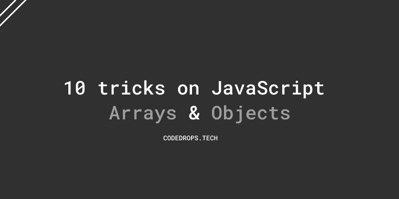

# 1.初始化一个大小为 n 的数组，并用默认值填充

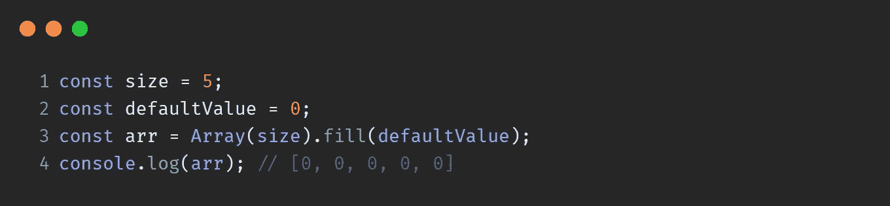

# 2.在数组的中间插入一些东西

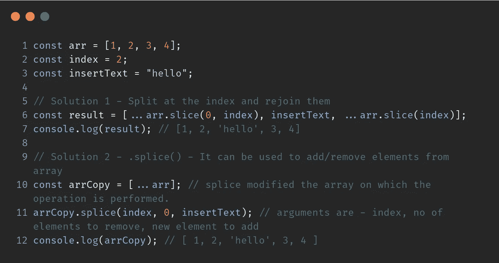

# 3.从数组中选择一个随机元素

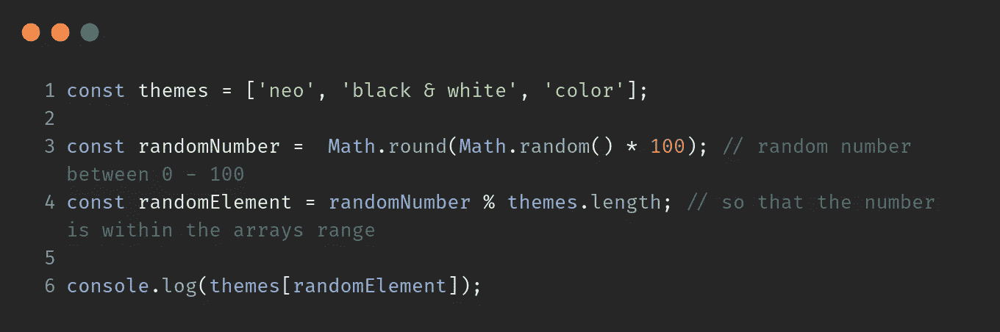

# 4.检查值是否为数组

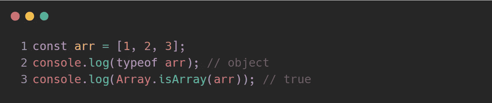

# 5.从数组中删除重复项

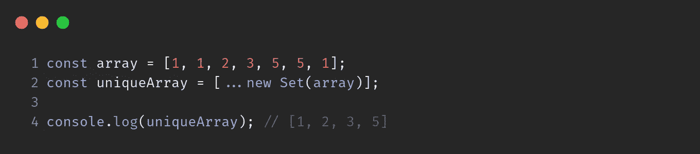

# 6.检查对象是否为空

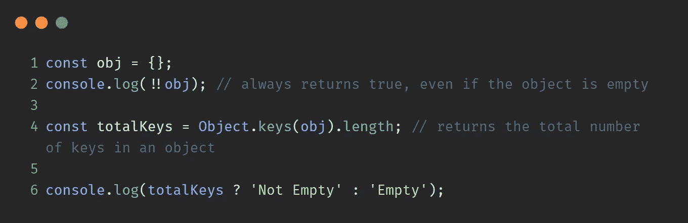

# 7.检查对象中是否存在属性

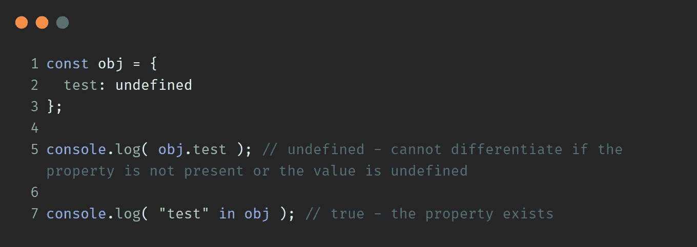

# 8.在对象上循环

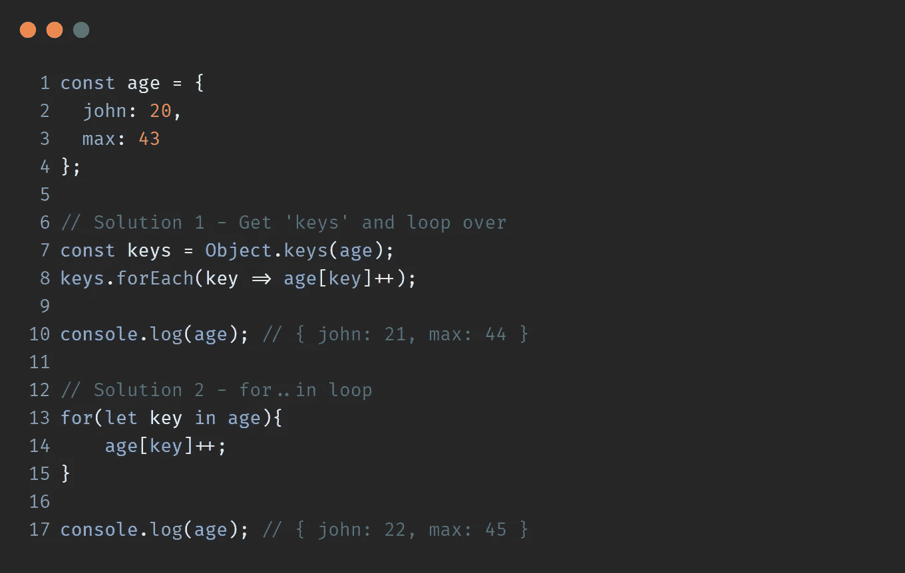

# 9.防止对象的属性值更新

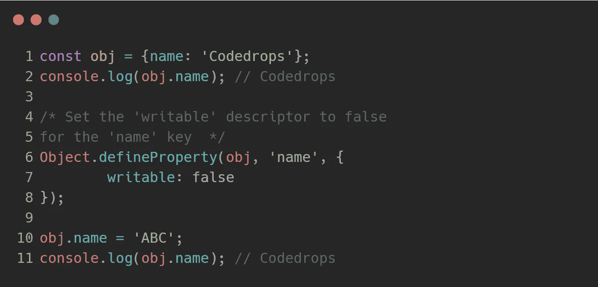

# 10.对象键按插入顺序存储

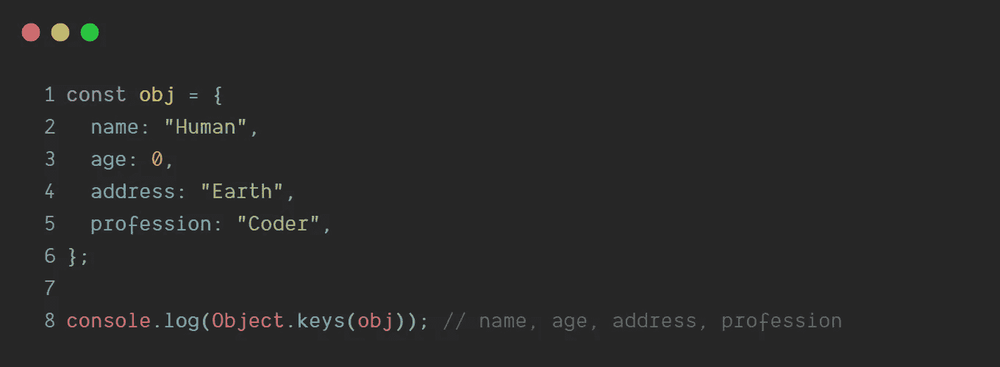

`Objects`保持键的创建顺序。

**感谢阅读**💙

更多信息请关注 **@codedrops.tech**

[insta gram](https://www.instagram.com/codedrops.tech/)●[Twitter](https://twitter.com/codedrops_tech)●[脸书](https://www.facebook.com/codedrops.tech/) ● [Linkedin](https://www.linkedin.com/company/codedrops-tech/)

[**code drops . tech**](https://www.codedrops.tech/)

 [## JavaScript 破坏基础

### ES2015/ES6 中引入了破坏。可以对对象/数组执行以下操作

medium.com](https://medium.com/javascript-in-plain-english/all-about-destructuring-84188bb00993)  [## 10 个 JavaScript 面试问题

### 10 个有趣的 JavaScript 问题，输出和解释。

medium.com](https://medium.com/javascript-in-plain-english/10-javascript-interview-question-c050a357161c)  [## 文件操作- Visual Studio 市场

### 轻松标记/别名文件，并在文件之间快速切换。1.文件标签-标签/别名/书签文件 2。快速切换-快速…

marketplace.visualstudio.com](https://marketplace.visualstudio.com/items?itemName=mehullakhanpal.file-ops)