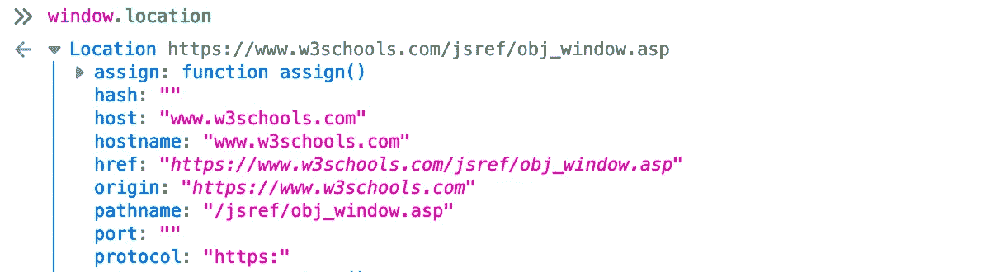
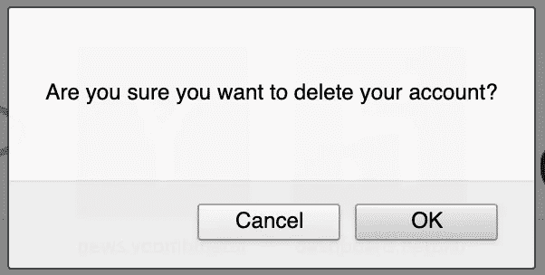
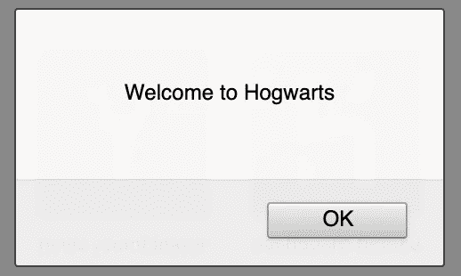
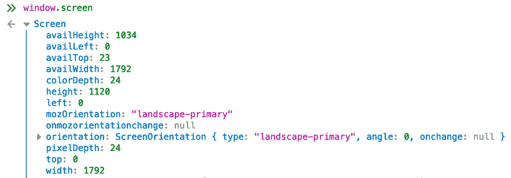

# 我在 JavaScript 中使用窗口对象的 10 种方式

> 原文：<https://javascript.plainenglish.io/10-ways-ive-used-the-window-object-in-javascript-b929055217b?source=collection_archive---------6----------------------->

## 从无限滚动到操纵 DOM 到打印变量


Photo by [**fauxels**](https://www.pexels.com/@fauxels?utm_content=attributionCopyText&utm_medium=referral&utm_source=pexels) from [**Pexels**](https://www.pexels.com/photo/people-working-in-front-of-the-computer-3184357/?utm_content=attributionCopyText&utm_medium=referral&utm_source=pexels)

你熟悉`window`这个物体吗？

作为一个开发前端的后端开发者，我复制/粘贴了包含`window`对象的函数(没有理解它),这是我不愿意承认的。

但是随着我进一步深入前端开发，真正理解它变得很有用。

简单地说，`window`的对象，

*   表示浏览器的当前选项卡。
*   包括`document`和`screen`对象，它们代表站点的内容和设备屏幕的形状。
*   包含全局变量和函数。

现在，与其给出一个`window`对象属性的清单，不如给出我实际使用`window`对象的 10 种方式。

# 1.重定向到一个新的网址，打开和关闭标签

`window`上的`location`对象可以用来跳转 URL。这是通过简单地重新分配一个新的网址。

```
window.location.href = "[https://www.google.com](https://www.google.com)"
```

通常，您会希望将单击按钮或其他 DOM 元素作为重定向的条件。在 ReactJS 中，可以这样做。

```
<Button
    type="button"
    onClick={(e) => {
      window.location.href = `${thing.url}`;
}}>Visit</Button>
```

有时我们不想丢失当前页面。这可以用在新标签页中打开 URL 的`window.open()`方法来处理。

```
window.open("https://www.w3schools.com")
```

关闭当前标签页也同样简单。

```
window.close()
```

# 2.实现无限滚动

无限滚动是指当用户到达现有项目的底部时，向 DOM 追加额外的项目。无限滚动通常在呈现搜索结果的视图中实现。

有这方面的图书馆…

虽然我避免了“非发明”综合症，但是如果你可以用 10 行代码解决一个问题，就没有必要增加整个库。

高级别上，我们可以在`window`上使用以下 3 个属性实现无限滚动。

```
// Distance you've scrolled from the top of a page
scrollHeight = window.document.documentElement.scrollTop// Current height of viewport
viewportHeight = window.innerHeight// Distance from top to bottom of a page
pageHeight = window.document.documentElement.scrollHeight
```

给定上述变量，我们可以编写代码，当用户滚动到页面底部附近时，触发并加载更多的对象。

```
 if (scrollHeight + viewportHeight + 50 > pageHeight){
  // append more object
}
```

将它连接到`window`上的一个事件监听器(我们一会儿就能看到)，您就可以滚动自己的无限滚动了。

要使它兼容所有的浏览器，还需要做一些工作。

# 3.访问和操作 DOM 元素

操纵 DOM 的能力是 JavaScript 如此出色的原因。让我们建立动态前端。

您可能不知道的是，让我们能够访问 DOM 的`document`对象是`window`对象的一个属性。

所以当你打这个电话的时候。

```
document.getElementById("header-title")
```

你真的称之为。

```
window.document.getElementById("header-title");
```

# 4.访问与当前 URL 相关的信息

我们已经提到了使用`location`进行重定向，但是它可以做更多的事情。

当您在控制台中调用`window.location`时，会返回几个属性。



这些可以用来确定当前用户正在查看哪个页面。

通常，调用并解析`pathname`很有用，这样我们就可以在用户位于特定页面时有条件地触发逻辑。

```
if ( window.location.pathname.includes("profile") ) {
  // do something cool
}
```

# 5.在窗口上添加事件侦听器

我们经常给特定的 DOM 元素添加事件监听器。

但是有时我们希望监听器直接在`window`上。

在上面的无限滚动示例中，我们希望在用户滚动的任何时候检查当前的滚动状态。

这是一个在`window`对象上添加事件监听器的例子。在 React 中，你可以用一个`useEffect`钩子把它包起来，就像这样。

```
*useEffect*(() => {
  window.addEventListener(
      'scroll',
      someFunction
  );
  return () => window.removeEventListener('scroll', someFunction);
  }, []
);
```

这将在用户滚动时触发`someFunction`。

# 6.在设定的时间后或以设定的间隔触发逻辑

有时，您希望在事件发生后的特定时间触发逻辑。为此，使用`setTimeout`。

您可以在您的浏览器控制台中尝试这样做。

```
setTimeout(function(){ alert("Bonjour!"); }, 5000);
```

它将在运行 5 秒后启动一个弹出窗口。

现在如果你想每 5 秒触发一次逻辑，你可以用`setInterval`做同样的事情。

*不要在你的主机上运行这个程序，因为每 5 秒钟就会有一个警告弹出来，这会非常烦人。*

```
setInterval(function(){ alert("Bonjour"); }, 5000);
```

这是一个使用警报的简单例子。但是更复杂的情况可能是向后端发出 ajax 请求，以便在用户查看页面超过 10 秒时记录信息。

# 7.提示、确认和警告弹出窗口

在将这些弹出窗口部署到生产环境之前，它们肯定需要一些样式，但是它们确实有自己的用例。

`prompt()`可用于向用户询问信息并将其赋给一个变量。

```
var name = prompt("Who goes there?", "Your name...");
```


`confirm()`常用于在删除某个东西之前与用户进行核对。

```
var d = confirm("Are you sure you want to delete your account?");
```



而`alert()`只是……嗯，只是一个警告。

虽然它散发着 90 年代的网络气息，但有时你会想要一个简单的弹出窗口来向用户传达信息。

```
alert("Welcome to Hogwarts");
```



我唯一的建议是，请在使用这些弹出窗口之前重新设计它们的样式！

# 8.滚动到页面上的特定点或指定的像素数

有时，您希望将用户滚动到页面上的特定点。`scrollTo()`可以做到这一点。

```
window.scrollTo(0, 1000);
```

这将用户从页面顶部向下滚动 1000 像素。参数分别是滚动到的 x 和 y 像素坐标。

按特定像素数滚动，而不是滚动到特定点，使用`scrollBy()`方法。

```
window.scrollBy(0, window.innerHeight);
```

同样，参数是水平和垂直滚动的像素数。

# 9.屏幕对象

屏幕对象表示当前可见的区域。

在控制台中调用`window.screen`将返回以下内容。



如果您决定根据屏幕的宽度或高度以不同的方式渲染对象，屏幕可能会很有用。例如:

```
if (window.screen.height < 800) {
  // render fewer elements
}
```

## `"window.innerWidth”`和`"screen.width”`有什么区别？

好问题。

`window.innerWidth`是浏览器中显示内容的宽度，不包括书签、元素检查器等。

`screen.width`是设备屏幕分辨率的宽度。

# 10.windows . console . log

如果没有`console.log`来打印变量和消息，我们会怎样？

当你称之为。

```
console.log('')
```

你真的称之为。

```
window.console.log('Hello')
```

`console`也是`window`对象的一部分！

# 结论

这个列表包含了我发现`window`对象在我短暂的 JavaScript 生涯中有用的大部分方法。

挖掘和理解一个我一直在使用但从未花时间去玩的东西很有趣。

我希望你觉得这和给我写信一样有用。

如果我错过了使用`window`对象的任何重要或有用的方法，请在评论中告诉我们。

一如既往，继续编码！