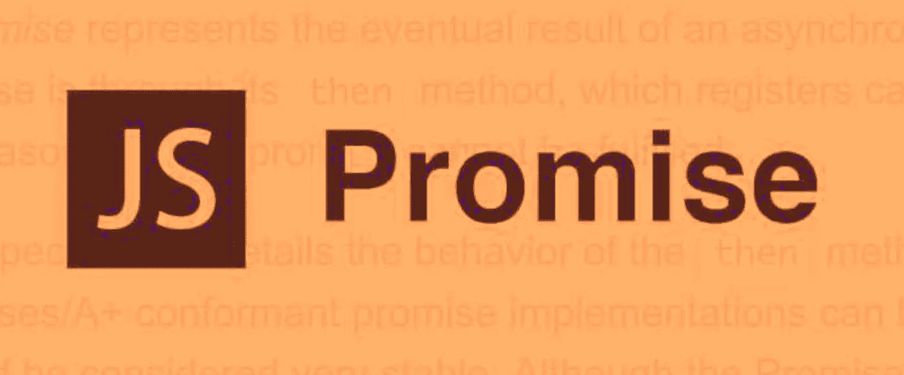

# 提高 JavaScript/ES6 中承诺知识的 10 种方法

> 原文：<https://javascript.plainenglish.io/10-ways-to-level-up-your-knowledge-of-promises-in-javascript-d53d25a27645?source=collection_archive---------2----------------------->



有许多很好的方法来提高你的编码技能，尝试新技术。事情的真相是理解 JavaScript 和 Promise。

# 第一部分:

```
const prom = new Promise((res, rej) => {
  console.log('first');
  res();
  console.log('second');
});
prom.then(() => {
  console.log('third');
});
console.log('fourth');

// first
// second
// fourth
// third
```

`Promise`同步执行，`promise.then`异步执行

# 第二部分:

```
const prom = new Promise((res, rej) => {
  setTimeout(() => {
    res('success');
  }, 1000);
});
const prom2 = prom.then(() => {
  throw new Error('error');
});

console.log('prom', prom);
console.log('prom2', prom2);

setTimeout(() => {
  console.log('prom', prom);
  console.log('prom2', prom2);
}, 2000);

// prom 
// Promise {<pending>}
// __proto__: Promise
// [[PromiseStatus]]: "resolved"
// [[PromiseValue]]: "success"

// prom2
// Promise {<pending>}__proto__: 
// Promise[[PromiseStatus]]: "rejected"[[PromiseValue]]: 
// Error: error
//     at <anonymous>:7:9
```

`promise`有三种不同的状态:

*   悬而未决的
*   感到满足的
*   拒绝

一旦状态更新，`pending->fulfilled`或`pending->rejected`，可以再次更改。`prom1`与`prom2`不同，都返回新的承诺状态。

# 第三部分:

```
const prom = new Promise((res, rej) => {
  res('1');
  rej('error');
  res('2');
});

prom
  .then(res => {
    console.log('then: ', res);
  })
  .catch(err => {
    console.log('catch: ', err);
  });

// then: 1
```

`resolve`或`reject`仅执行一次，即使在拒绝后有解决调用。它不会执行。

# 第四部分:

```
Promise.resolve(1)
  .then(res => {
    console.log(res);
    return 2;
  })
  .catch(err => {
    return 3;
  })
  .then(res => {
    console.log(res);
  });

// 1
// 2
```

承诺是可以连锁的。当提到连锁调用时，我们通常会想到返回这个，但承诺不会。每次一个承诺调用`.then`或者`.catch`，都会返回一个新的承诺，这样就实现了链式调用。

# 第五部分:

```
const promise = new Promise((resolve, reject) => {
  setTimeout(() => {
    console.log('first')
    resolve('second')
  }, 1000)
})

const start = Date.now()
promise.then((res) => {
  console.log(res, Date.now() - start, "third")
})
promise.then((res) => {
  console.log(res, Date.now() - start, "fourth")
})

// first
// second 1054 third
// second 1054 fourth
```

promise `.then`或`.catch`可以被多次调用，但是这里 promise 构造函数只被执行一次。换句话说，一旦一个承诺的内部状态发生变化并获得一个值，那么随后对`.then`或`.catch`的每次调用都将直接获得该值。

# 第六部分:

```
const promise = Promise.resolve()
  .then(() => {
    return promise
  })
promise.catch(console.error)

// [TypeError: Chaining cycle detected for promise #<Promise>]
// Uncaught SyntaxError: Identifier 'promise' has already been declared
//    at <anonymous>:1:1
// (anonymous) @ VM218:1
```

`.then`或`.catch`返回的值不能是承诺本身，否则会造成无限循环。

# 第七部分:

```
Promise.resolve()
  .then(() => {
    return new Error('error');
  })
  .then(res => {
    console.log('then: ', res);
  })
  .catch(err => {
    console.log('catch: ', err);
  });

// then: Error: error!
// at Promise.resolve.then (...)
// at ...
```

在`.then`或`.catch`中返回一个错误对象并不会抛出错误，所以不会被后续的`.catch`捕获，需要改为其中一个:

```
return Promise.reject(new Error('error')) throw new Error('error')
```

因为返回任何非 promise 值都会被包装到一个 promise 对象中，即 return new Error ('error ')等价于 return promise . resolve(new Error(' Error '))。

# 第八部分:

```
Promise.resolve(1)
  .then(2)
  .then(Promise.resolve(3))
  .then(console.log)

  // 1
```

的论点。然后还是。catch 应该是一个函数，传入一个非函数会导致 value 的结果被忽略比如`.then(2)`或者`.then(Promise.resolve(3)`。

# 第九部分:

```
Promise.resolve()
  .then(
    function success(res) {
      throw new Error('Error after success');
    },
    function fail1(e) {
      console.error('fail1: ', e);
    }
  )
  .catch(function fail2(e) {
    console.error('fail2: ', e);
  });

//   fail2:  Error: Error after success
//     at success (<anonymous>:4:13)
```

`.then`可以接受两个参数，第一个是处理成功的函数，第二个是处理错误的函数。`.catch`是写`.then`第二个参数的方便方式，但是在使用中有一点要注意:`.then`第二个错误处理函数不能捕捉到第一个成功的函数和后续的函数抛出的错误。catch 捕获以前的错误。当然，如果您想重写，下面的代码是有效的:

```
Promise.resolve()
  .then(function success1 (res) {
    throw new Error('success1 error')
  }, function fail1 (e) {
    console.error('fail1: ', e)
  })
  .then(function success2 (res) {
  }, function fail2 (e) {
    console.error('fail2: ', e)
  })
```

# 第 10 部分:

```
process.nextTick(() => {
  console.log('1')
})
Promise.resolve()
  .then(() => {
    console.log('2')
  })
setImmediate(() => {
  console.log('3')
})
console.log('4');

// Print 4
// Print 1
// Print 2
// Print 3
```

`process.nextTick`和`promise.then`都属于微任务，而`setImmediate`属于宏任务，在事件循环的检查阶段执行。在事件循环(macrotask)的每个阶段之间执行一次 microtask，事件循环的开始执行一次。