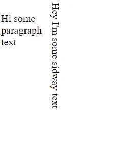
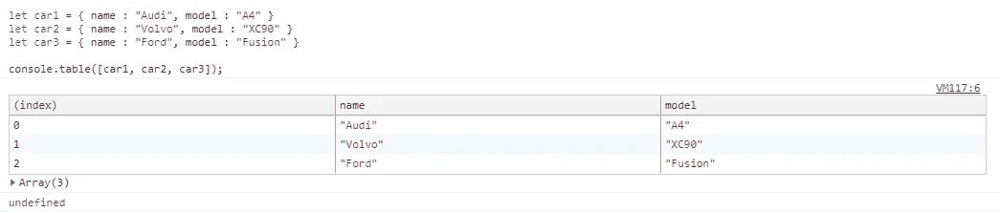
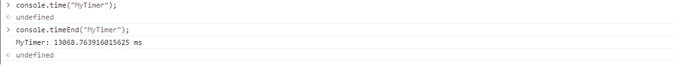

# 大多数前端开发人员不知道的 11 个前端技巧

> 原文：<https://javascript.plainenglish.io/11-frontend-tricks-that-most-frontend-developers-dont-know-about-68dc48199ed6?source=collection_archive---------0----------------------->

## 你可以用 HTML/JS/CSS 做一些有趣的技巧


Photo by [FLOUFFY](https://unsplash.com/@theflouffy?utm_source=medium&utm_medium=referral) on [Unsplash](https://unsplash.com?utm_source=medium&utm_medium=referral)

下面是一些很多前端开发者不知道的技巧。与 HTML/CSS/JavaScript 有关。

希望名单上至少有几个你不知道的人！

## 1.数据列表元素

有一个 HTML 元素，你根本看不到它被大量使用，而且没有任何理由！

`<datalist>`标签用于为`<input>`元素提供“自动完成”特性。您将在键入时看到预定义选项的下拉列表。


<datalist>

*例如:*

```
<input **list="animals"** name="animal" id="animal"><datalist **id="animals"**>
    <option value="Cat">
    <option value="Dog">
    <option value="Chicken">
    <option value="Cow">
    <option value="Pig">
  </datalist>
```

`<datalist>` id 属性(见上面的粗体项目)必须等于`<input>`的列表属性，这是将它们绑定在一起的原因。

## 2.带有复选框的可点击标签

如果你想要一个复选框的可点击标签，你通常会使用带有“for”属性的`label`元素，如下所示。

```
<input type="checkbox" name="checkbox" id="checkbox_id" value="value">
<label for="checkbox_id">I agree</label>
```

实际上，您可以将`label`元素放在复选框周围来完成同样的事情。所以当你点击“我同意”它会选择复选框！

*例如:*

```
<label><input type="checkbox" name="checkbox" id="checkbox_id" value="value">I agree</label>
```

## 3.子选择器

可能更多的是这个列表中最常用的，但大多数人不知道他们的权力有多大。

子选择器用于匹配所有指定元素的子元素。它给出了两个元素之间的关系。

*示例:*

```
 /* 1st <li> element */
 li:first-child { 
    color: red;
 }/* Last <li> element */
 li:last-child { 
     color: green;
 }// Select All <li> elements but The First Three */
li:nth-child(n+4) {     
      color: yellow;    
}/* Select only the first 3 <li> elemets */
li:nth-child(-n+3) {     
    color: green;    
}/* Styles are elements that are not a <p> */
.my-class:not(p) { 
    display: none;
}
```

## 4.写入方式

写作模式是鲜为人知，但相当强大的 CSS 属性。

这允许文本垂直排列，如下所示:



Vertical text

完成这个任务的代码非常简单。

```
writing-mode: vertical-rl;
```

*完整示例:*

```
<style>
.sideway { 
   writing-mode: vertical-rl;
}
.normal {
   width: 5%;
   float: left;
}
</style>
<p class="normal">
     Hi some paragraph text
</p>
<p class="sideway"> 
     Hey I'm some sidway text 
</p>
```

`writing-mode`属性有五个可能的选项。

```
 writing-mode: horizontal-tb;
  writing-mode: vertical-rl;
  writing-mode: vertical-lr;
  writing-mode: sideways-rl;
  writing-mode: sideways-lr;
```

## 5.calc()函数

`calc()` CSS 函数让您在指定 CSS 属性值时执行计算。

`calc()`最有用的能力是它混合单位的能力，比如百分比和像素。没有预处理器能够做到这一点。这是渲染时必须发生的事情。

*例子:*

```
width: calc(5px + 100px);
width: calc(6em * 8);
width: calc(100% - 50px);
```

## 6.Math.round 和 Math.floor 备选方案

也许不是最容易阅读，但仍然是一个很酷的把戏。

`Math.floor()`可以用`0|`:

```
**0|**743.4343 // returns 743
Math.floor(743.4343) // returns 743
```

`Math.round()`可以用`+.5|0`:

```
812.777**+.5|0** // returns 813
Math.round(812.777) // returns 813
```

## 7.控制台.表格

希望现在你已经听说并使用了`console.log()`，但是你可能没有听说过`console.table()`，它接受一个数组或一个对象。这将在控制台视图中以非常简洁的方式显示一个表格！

*数组示例:*

```
let car1 = { name : "Audi", model : "A4" }
let car2 = { name : "Volvo", model : "XC90" }
let car3 = { name : "Ford", model : "Fusion" }console.table([car1, car2, car3]);
```



console.table()

## 8.控制台.时间

另一个有用的控制台方法。`console.time()`启动定时器。它以一个参数作为标签。然后您使用具有相同标签名称的`console.timeEnd()`,控制台将以毫秒为单位输出从您调用`console.time()`和`console.timeEnd()`开始的时间



console.time()

*举例:*

```
// Starts the timer
console.time("MyTimer");// Ends the timer and outputs the time in milliseconds
console.timeEnd("MyTimer");
```

## 9.In 运算符

“in”操作符可以检查数组中是否存在索引，并将返回 true 或 false。

*举例:*

```
let cars = ['Audi', 'BMW', 'Mini', 'Bentley', 'Porsche'];0 in cars        // returns true
3 in cars        // returns true
6 in cars        // returns false
```

您还可以检查对象中是否存在属性。

*举例:*

```
const person = { firstName : "Dave", surname: "Smith", age: 34 };'firstName' in person  // returns true
'surname' in person    // returns true
'age' in person        // returns true
'gendar' in person     // returns false
```

## 10.马**柯 Chrome 一文字编辑**

可能是名单上非常随机的一个。如果您在 URL 栏中输入以下内容并按回车键。它会把 Chrome 变成一个记事本

```
data:text/html, <html contenteditable>
```

## 11.if 块中没有花括号的多条语句

我不会使用这个实际的产品代码，但仍然有很多人不知道。诀窍就是逗号！

```
if (1 === 1)
 alert("Alert 1"), alert("Alert 2");
```

# 结论

列表中的所有这些可能不是最实用的，但其中一些在前端开发中肯定没有被充分使用，但它们确实可以帮助你扩展前端技能。肯定还有很多花样！

希望你喜欢阅读！

你喜欢读这个吗？如果有，通过 [**订阅解码，我们的 YouTube 频道**](https://www.youtube.com/channel/UCtipWUghju290NWcn8jhyAw) **获取更多类似内容！**