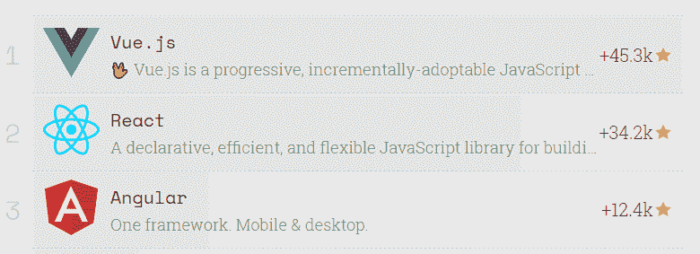
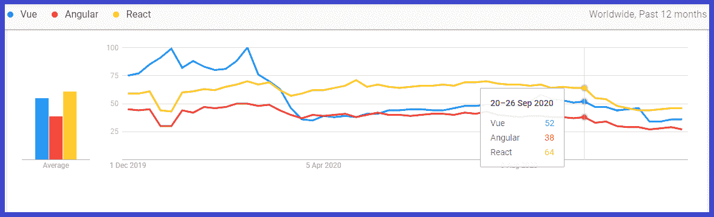

# 12 种替代反应、角度和 Vue

> 原文：<https://javascript.plainenglish.io/12-best-alternatives-to-angular-react-and-vue-4d1b433975b8?source=collection_archive---------2----------------------->

在技术世界里，你必须让自己为下一个做好准备，这就是替代品的真正含义。如标题所示，我们将在此讨论技术的替代方案，即反应、角度和 Vue。

所有这些都在他们的位置上是最好的，并在无法轻易取代的市场上占据了他们的位置。它为应用程序提供的质量是有前途的，这也是它成为市场热门技术的原因。

## **从统计数据开始**

根据 [JavaScript Rising Stars](https://risingstars.js.org/2018/en/#section-framework) 报告，Vue、React 和 Angular 击败其他顶级框架，成为 2018 年最受欢迎的 JS 框架:

另一个你可以检查 JS 框架当前流行程度的平台是 [Google Trend](https://trends.google.com/trends/explore?q=Vue,%2Fg%2F11c6w0ddw9,%2Fm%2F012l1vxv) 。在这里，您可以找到对三个流行框架 Angular、React 和 Vue 的持续需求。

在上图中，你可以看到 React 和 Vue 是如何超越 Angular 的。您可以理解新框架是如何与市场上较老且流行的框架展开激烈竞争的。

嗯，所有这些都是各自最好的，通过记住 React、 [Angular 和 Vue](https://www.pixelcrayons.com/blog/angular-js-vs-vue-js/) 的强大功能，我已经搜索了这些 **javascript 框架**的一些最佳替代方案，如果你不能使用这三个框架，你可以使用它们。

**那么，现在让我们从 React、Angular 和 Vue 的替代品开始:**

## **1。小教堂**

如果你喜欢 virtual DOM 的想法，但是你想避免在 React、Vue 或任何其他流行的框架中采用社区思维所带来的限制，那么你可以选择 Petit DOM。您获得了少量的代码，可以让您管理标签的虚拟集合，然后将它们移动到真正的 DOM。

关于组件结构和渲染的其他一切都取决于您。假设你有简单的组件，如果你打算创建一些超级复杂的渲染层次，这将是你唯一的。它可以作为您的基础，因为它提供的只是一个虚拟化 DOM 的工具。如果你需要同样的帮助，你可以从印度顶级网络开发机构那里得到帮助。

## **2。盈余**

虚拟 DOM 并不是每个人都喜欢的，因为它会占用空间。因此，如果您的操作不太复杂，您也可以通过官方 DOM 来发布指令。

剩余图书馆就是这样做的。它采用了每个 JSX 人最喜欢的标记，并将其编译成相同的代码来管理真正的 DOM。正如人们在广告业务中所说的，它省去了代理人。没什么区别。没有隐藏的额外一层。只是一个纯粹真实的 DOM 的操纵。

如果你的代码足够简单直接，只需要对 DOM 做几件事，那你为什么还要使用虚拟分心呢？

## **3。回复:DOM**

对于那些不想在虚拟 DOM 中花费任何内存的人来说，有一个不同的选择，那就是一个更小的库(2KB ),名为 RE: DOM。它包含一些必要的例程，让您通过几个简单的 JavaScript 调用就可以创建所有的标签和组件。语法明显更像 CSS，这样只需击几下键就可以定义相当复杂的带有 id 的标记和类。

## **4。秘银**

所有的替代品都不是小而极简的。在这种情况下，这个框架可以被称为“中型”框架，尽管它只有大约 8KB 重。所有这些代码创建了一个虚拟 DOM，像其他代码一样具有有效的更新机制。但是它也提供了一套标准化的工具来处理许多常见的挑战，比如路由和 XMLHttpRequest 调用。

移动应用程序开发人员希望 Mithril 项目相对规范，他们认为将这些代码添加到主库中可以提高标准化程度。如果这还不够，他们还推出了一些惯用的结构和标准格式。如果你需要帮助，你可以[在印度](https://www.codersdaddy.com/hire-developer-engineer-programmer/website-app)雇佣网络应用开发者。

## **5。鲍勃里尔**

如果您喜欢虚拟 DOM 和 React 的有状态组件，并且希望用 TypeScript 编程，那么您可以使用 Bobril。在某些区域，它始终比 Angular 或 React 快得多。

可能是因为更快的 diff 算法和它缺乏对同构 JavaScript 的支持。此外，如果您需要，还有用于 CSS 操作的速记函数以及完整的状态管理层。

## **6。马尔科**

如果你做过 Pez 自动售货机或不同收藏品的竞标，你会对 Marko 的力量有所了解。这是一个小巧、快速的 Java 框架，易贝通过开源许可共享了这个框架。

你知道 Makro 最好的部分是什么吗？这是一种轻量级的模板语法，可以很容易地从 HTML 中去掉多余的脂肪，通过缩进来定义结构，而不需要做其他事情。此外，渲染引擎有一个很好的速度，可以驱动跳舞 div 的精心星座，它使更新速度超过 60fps。

## 7 .**。嵌套**

降低服务器复杂性的下一个选择来自于 Nest。它提供了一个充满管道、控制器、拦截器、异常过滤器和带有一些防护的提供者的架构。

Nest framework 是 modern plus，从一开始就可以处理 GraphQL 和微服务请求。你可以在印度[雇佣 PHP 开发人员](https://www.codersdaddy.com/hire-developer-engineer-programmer/php-web)，如果你需要同样的帮助。

## **8。苗条**

Svelte 是一种构建用户界面的高级方法。与此同时，React 和 Vue 等常见的 **JavaScript 框架**在浏览器中完成大量工作，Svelte 将这些工作转移到编译步骤中，在您创建应用程序时发生。

它没有利用虚拟 DOM diffing 之类的技术，而是编写代码，当应用程序的状态发生变化时，以外科手术的方式更新 DOM。这是一个聪明的架构策略，它非常轻量级，占用更少的内存。

## **9。Drupal，WordPress，& Rails**

内置 JavaScript 并运行在 Node.js 之上的框架占据了当今 web 开发世界的心理中心。但是，如果您忽略了构建在 PHP 上的上一代，这可能是您的错误。这是一个比以前更快的基础，它也有一个即时编译器，如 JavaScript。

包括这一点，Ruby 和它的 Rails 框架继续充当健壮站点的基石。过去的一代经历了近十年的持续发展和工作，饱经沧桑。一些成熟的设计师可以为应用程序设计主题和皮肤。如果有人已经构建了具有您需要的功能的模块，那就有更好的机会。如果你需要 JavaScript 框架方面的帮助，你可以[雇佣 Angular 开发者](https://www.codersdaddy.com/hire-developer-engineer-programmer/angular-js)或者[在印度雇佣 React 开发者](https://www.codersdaddy.com/hire-developer-engineer-programmer/react-js)。

## **9。地狱**

我们拥有的另一个框架是 Inferno，它是为做许多与 React 类似的事情而创建的。但是它下载量更小，运行时间更快。

它通过将复杂的合成事件机制放在一边，只关注像 onClick 这样的必需事件来获得这一点。API 的许多不同部分都是相似的，如果不相似，就使它成为

如果不需要事件优化层，运行代码相对简单。

## 10。Hapi.js

hapi.js(也称为 hapi)是一个用于开发 web 应用程序的开源框架。hapi 目前最流行的用途是构建 web 服务，比如 JSON API。使用它，您可以创建网站、应用程序编程接口(API)服务器和 HTTP 代理应用程序。

该框架提供了一个健壮的插件系统，使您能够快速添加新功能和修复错误。它允许您开发可伸缩的 API。由于该框架为开发人员提供了路由、输入、输出验证和缓存，因此它是构建 REST(表述性状态转移)API 的最佳选择。您可以创建一个 API 来帮助各种需要移动和单页应用程序的客户端。

你也可以用 MongoDB、MySQL、Postgres 搭配 hapi.js，它还可以让你开发静态网站。它提供了一个模板引擎来传递动态内容。您可以将 hapi.js 用于任何前端框架，如 React、Angular 和 Vue.js，来创建单页面应用程序。

## **11。Koa**

有时，您需要一个相当复杂的例程集合来平衡传入的请求，并将它们转换成许多更改，其中一些非常复杂。开发该框架是为了组织所有这些工作，使之更易于管理。

通过利用异步函数，它使您能够离开回调并显著改进错误处理。它没有在其核心中捆绑任何中间件，而且它提供了一套优雅的方法，使得编写服务器既快又有趣。

## **12。余烬**

Ember 是一个开源的 JavaScript 框架。它使开发人员能够通过利用框架中的最佳实践来开发可伸缩的单页应用程序。它基于模型-视图-视图-模型(MVVM)模式。

Vinel、LinkedIn、Nordstrom 等顶级网站都在使用 Ember。有了它，您还可以开发桌面和移动应用程序。Apple Music 在这里就是最好的例子。

该框架提供了诸如 Ember 模板、Ember CLI、Ember Inspector 工具等功能，您可以使用这些功能进行调试。它提供了一个友好的 API，易于理解和使用。如果你需要同样的帮助，你可以从印度顶级网络开发机构那里得到帮助。

# **遗言**

仅此而已。所有这些都是您下一个应用的 React、Angular 和 Vue 的最佳选择。

如果你知道，Angular 和 React 已经是 Vue 的替代品，因为 Vue 在市场上相对较新。但同时，它也在激烈竞争以提供最好的服务。

如果你正在创建一个成熟的单页面应用程序或 SPA，那么你可能需要一个稳定且不断增长的库，比如 React、Angular 和 Vue。但是，如果您最关心的是应用程序的性能，那么 Inferno 和其他软件可能是您更好的选择。最重要的是，选择取决于你的需求和优先顺序。

但是，如果你在为 JavaScript 框架做出正确选择时感到困惑，那么你可以联系印度的一家软件咨询公司。他们会帮助你，为你提供最好的解决方案。

去吧&祝你好运！