# JavaScript 中 12 个新的超级有用的技巧

> 原文：<https://javascript.plainenglish.io/12-more-new-super-useful-tricks-in-javascript-497062e67e08?source=collection_archive---------3----------------------->

## 给每个人的编码技巧


在[的前一篇文章](https://medium.com/javascript-in-plain-english/12-super-useful-tricks-in-javascript-65c0595d309b)中，我编译了一些我在日常开发中经常使用的 JavaScript“技术”。在这篇新文章中，我收集了 12 种在前端或后端(nodejs)开发中非常实用的技术，但可能它们并不太为人所知。

# 1.随机

在下面的例子中，我展示了两种生成随机数或从数组中获取随机项的实用方法。

从一个范围中生成一个随机数:

```
let getRandomNumber = (min, max) => {
     return Math.round(Math.random() * (max - min) + min);
 } 
console.log(getRandomNumber(0, 100));
```

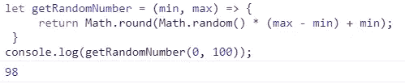

getRandomNumber function.

从数组中随机获取一个项目:

```
let names= ['Evelyn', 'Harper', 'Jackson', 'Avery', 'Jack', 'Eleanor', 'Carter'];const chooseName = () =>{
 let randomName = 
  names[Math.floor(Math.random()
  *names.length)];
 return randomName;
}
console.log('Random name:', chooseName(names));
```

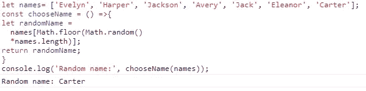

chooseName function.

# 2.加密一个号码

您可以使用 XOR (^)运算符来加密和解密 numbers 信息。它是这样工作的:

```
const secretKey = 12345;
const plainNumber= "1005"//Encrypt it:
let encryptedNumber = plainNumber ^ secretKey;
console.log(encryptedNumber);//Decrypt it:
let decryptedNumber = encryptedNumber ^ secretKey;
console.log(decryptedNumber);
```

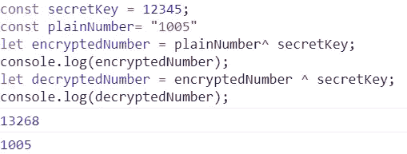

Decrypted number.

# 3.动态创建函数

动态创建函数是一种基于字符串动态生成函数的有用机制。第一个参数是以逗号分隔的参数列表，最后一个参数是函数体的代码:

```
const multiply = new Function("n1", "n2", "return n1 * n2");console.log(multiply(2, 3));
```

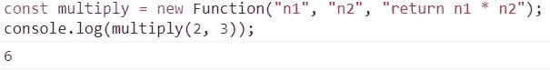

Result of the dynamic function.

您可以使用默认参数(ES6):

```
const multiply = new Function("n1", "n2 = 3", "return n1 * n2");console.log(multiply(2));
```

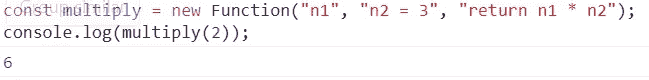

Result of the dynamic function.

或带有减速器(ES6)的静止参数(ES6):

```
const multiply = new Function("...numbers", " return numbers.reduce( (a,b) => a * b, 1)" );console.log(multiply(1,2,3,4));
```

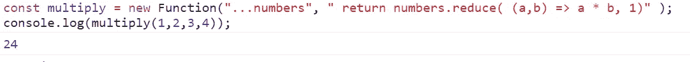

Result of the dynamic function.

# 4.每个和一些

JavaScript 中的(ES11) Array.every()方法用于检查所有数组元素是否满足给定条件。相反，JavaScript 中的 Array.some()方法用于检查是否至少有一个数组元素满足给定的条件。

```
const myArray = [10,20,30,9,50]console.log(myArray.every( e => e > 10));console.log(myArray.every( e => e > 9));console.log(myArray.some( e => e > 10));
```

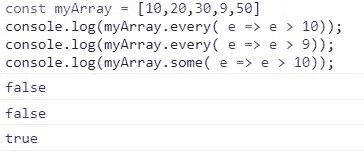

Results of the different functions.

# 5.转换为布尔值

在 JavaScript 中，除了*“”、“”、null、undefined、NaN、false 和 null* 之外的所有值都是‘truthy’，因此您可以使用！!'要转换为布尔值的运算符:

```
const a = '';
const b = "";
const c = null;
const d = undefined;
const e = NaN;
const f = false;
const g = 1;console.log(!!a); 
console.log(!!b);
console.log(!!c);
console.log(!!d);
console.log(!!e);
console.log(!!f);
console.log(!!g);
```


Results of evaluating the different variables.

# 6.有条件地设置变量

有条件地设置变量既简单又让你的代码看起来更优雅。应用这个技巧时，没有必要写一个 if 语句；这是我个人最喜欢的 JavaScript 技术之一。

使用 if-else 语句:

```
const model = null;
if(model == null){
   theModel = 'Ford';
}else{
   theModel = model;
}
console.log(theModel);
```

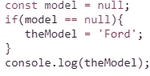

Result of setting a variable.

那么如何有条件地设置一个变量呢？

```
const model = null;
const theModel = model || 'Ford';
console.log(theModel);
```

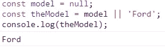

Result of setting a variable.

或者更好:

```
const model = null;
const theModel= model ? model : "Ford";
console.log(theModel);
```

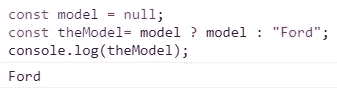

Result of setting a variable.

# 7.交换变量

在没有临时变量的情况下，如何交换两个变量？

实现这一点的一种方法是使用(ES6)析构:

```
let var1= 'world!';
let var2= 'Hello';[var1, var2] = [var2, var1];
console.log(var1, var2);
```

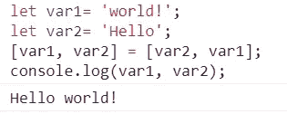

Results of swapping the variables.

# 8.使用&&运算符的简写

让我们考虑下面的例子:

```
let execute = true;
const foo = () => {
    console.log('Do some stuff');
}
```

您可以检查变量“execute”的值，它告诉我们是否必须执行函数 foo，但是这样做非常冗长。

```
if (execute) {
    foo();
}
```

更好的方法是使用&&运算符。这样，我们就有了最干净的代码。

```
execute && foo();
```

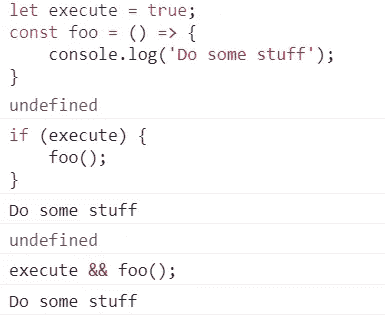

Result.

# 9.设置强制参数

使用默认参数，我们可以设置所需的参数。首先，定义所需的功能:

现在，将“强制”函数作为默认参数分配给它，瞧！

向“name”参数传递值:

```
const hello = (name = mandatory()) => { return console.log(`Hello: ${name}!`)};hello(’Rick’);
```

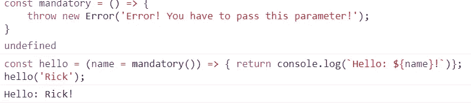

Result of executing the function with the mandatory parameter.

如果参数为空:

```
hello();
```

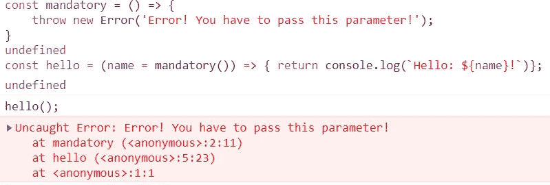

Result of executing the function without the mandatory parameter.

# 10.通过编程美化 JSON

这种技术在 node.js 中创建格式化的。json 文件，然后将它们写入磁盘，或者在屏幕上显示它们以便于阅读。

出发地:

```
const obj = {"name":"Olivia","surname":"Wilde","profession":"actress"}
```

收件人:

```
"{
 "name": "Olivia",
 "surname": "Wilde",
 "profession": "actress"
}"
```

我们可以使用带有“\t”属性的 JSON.stringify()方法，将值或 JavaScript 对象转换为 JSON 字符串，并在每一级插入制表符。

```
JSON.stringify(obj, null, “\t”);
```

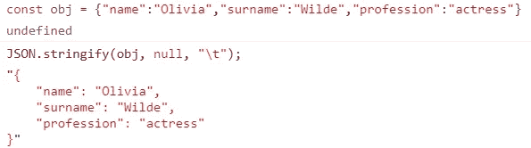

Json String beautified.

该方法需要三个参数:

JSON.stringify(值[，替换符[，空格]])

*   Value:要转换为 JSON 字符串的值。
*   Replacer:改变字符串化过程行为的函数。如果该值为 null 或未提供，则所有对象属性都包含在生成的 JSON 字符串中。
*   空格:用空格或换行符打印 json

# 11.如何用 CSS 和模板文字定制你的 javascript 控制台

您可以使用%c 指令来传递 CSS 样式。

(这可以在现代版的 Chrome 和 Firefox 上运行，但不能在 Safari 上运行。)

```
const value1 = 'Hello';
const value2 = 'Wolrd!';
const color1 = 'green';
const color2 = 'blue';console.log(`%c ${value1} %c ${value2}`, `color:${color1}`, `color:${color2}`)
```

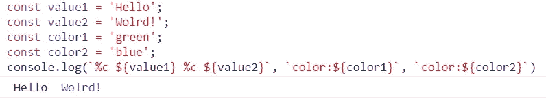

Result of applying css to console.log.

# 12.合并多个对象

使用 ES6 spread 运算符是将两个简单对象合并为一个对象的最佳方式:

```
const object1 = {
  name: 'Kesk'
}const object2 = {
  surname: 'Noren'
}const object3 = {...object1, ...object2 }
console.log(object3);
```

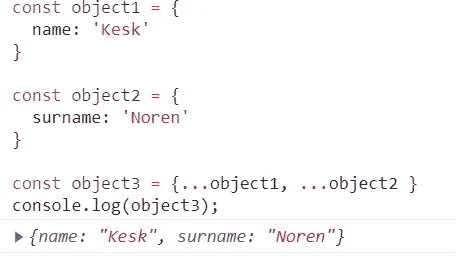

Result of merging two objects.

请注意，如果两个对象都有同名的属性，则第二个对象属性会覆盖第一个属性:

```
const object1 = {
  name: 'Kesk'
}const object2 = {
  name: 'Noren'
}const object3 = {...object1, ...object2 }
console.log(object3);
```


Result of merging two objects.

另一种方法是使用(ES6) Object.assign()方法:

Object.assign(target，sourceObj1，sourceObj2，…)；

```
const object1 = {
  name: 'Kesk'
}const object2 = {
  surname: 'Noren'
}const object3 = Object.assign(object1, object2);
console.log(object3);
```

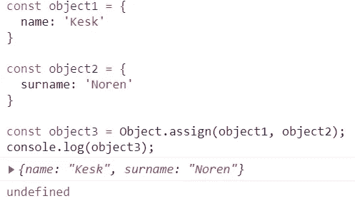

Result of merging two objects.

Object.assign()和 spread 运算符方法都执行浅层合并。这意味着如果一个对象具有引用另一个对象的属性，则原始对象和目标对象的属性将引用同一个对象。

用 vanilla js 做深度合并并不容易，最好使用第三方库。

# 结论

我希望这篇文章对你有用，让你愉快。了解这些小技巧会让你的编程工作更容易。

感谢你阅读我！保重！