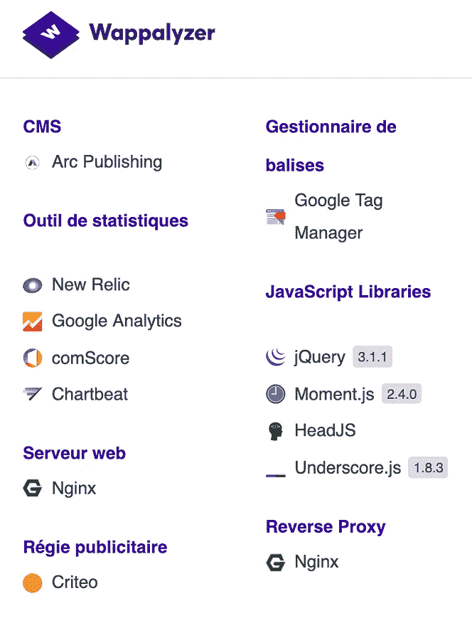
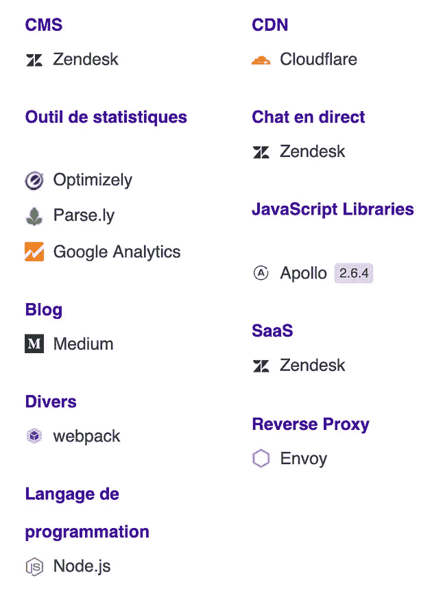
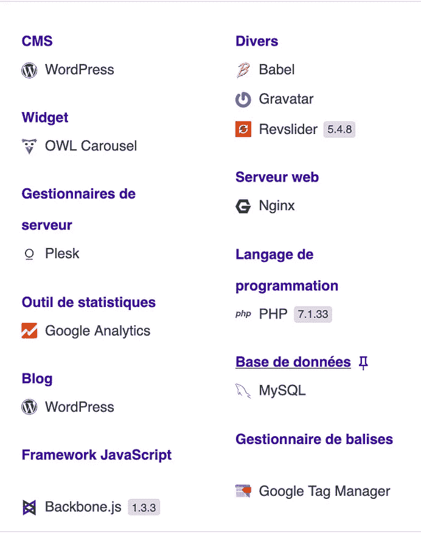
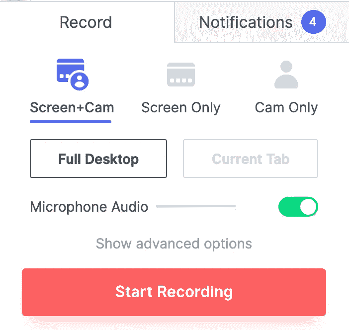
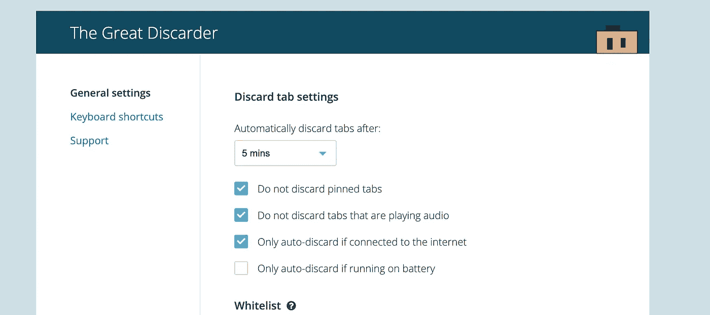
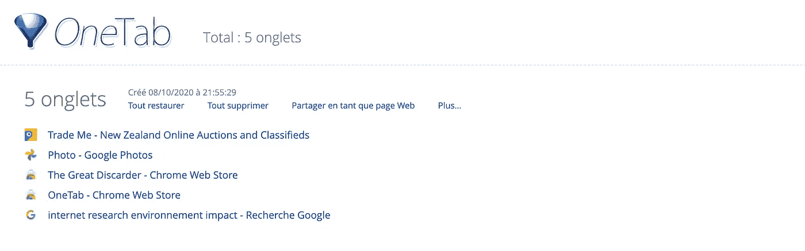
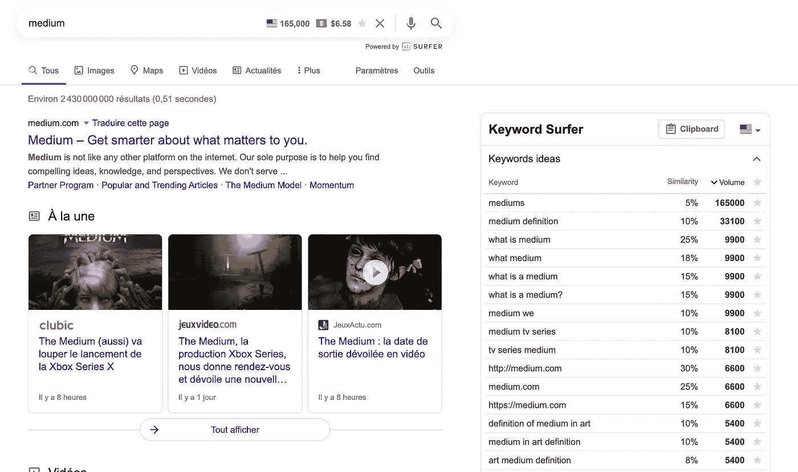
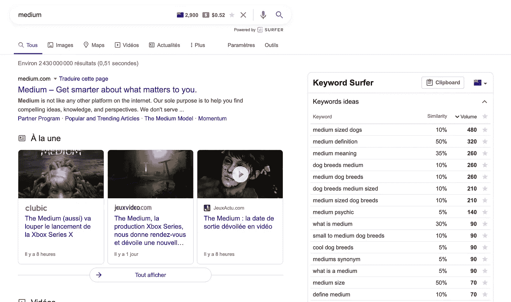
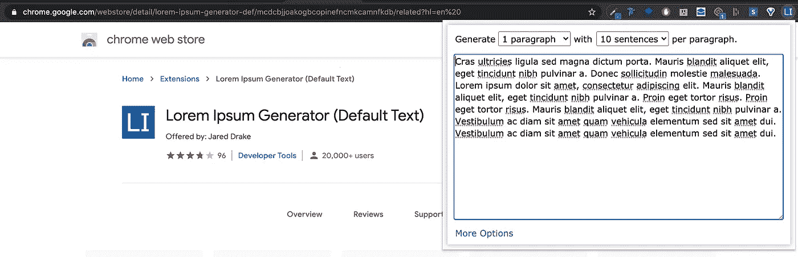
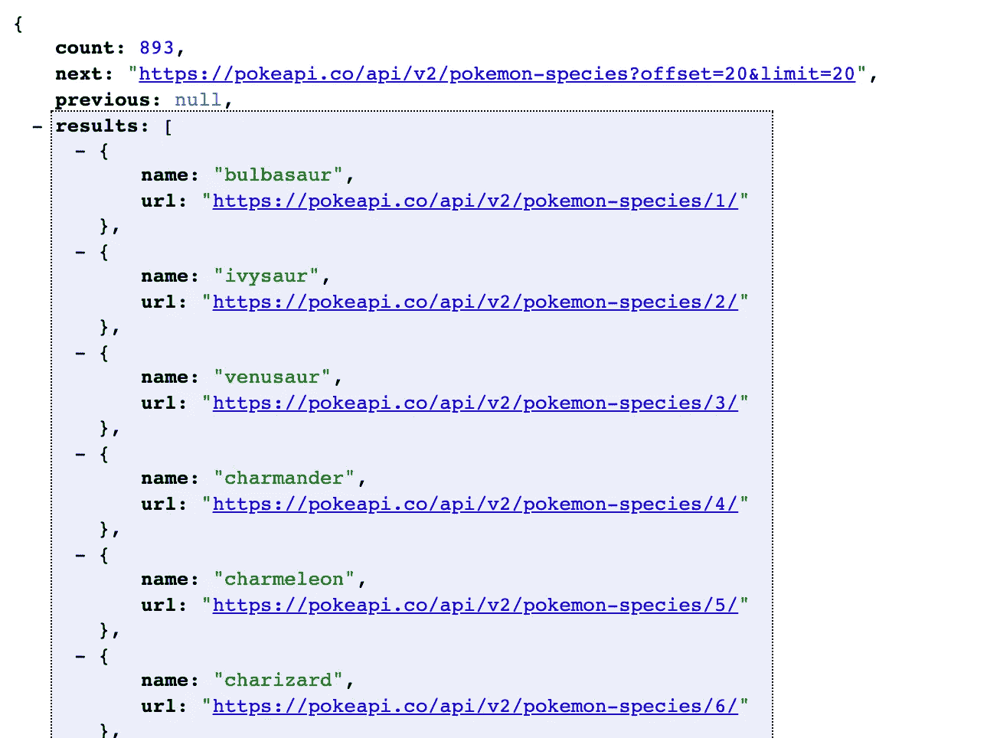

# 12 必须为前端开发人员提供 Chrome 扩展

> 原文：<https://javascript.plainenglish.io/12-must-have-chrome-extensions-for-front-end-developers-bd48da712913?source=collection_archive---------2----------------------->

## 使用这 12 个 Chrome 扩展加速您的工作流程

我是谷歌 Chrome 用户，最近我意识到我有太多的 Chrome 扩展，是时候清理一下了。

经过深思熟虑，我知道是时候去掉一些我不使用的扩展了。坚持最基本的，都归结到我经常使用的 12 个扩展:

# 1.瓦帕里斯

我经常出现在一个网站上，很好奇。我知道这不好，但我是个好奇的人。如果你和我一样， [Wappalyzer](https://chrome.google.com/webstore/detail/wappalyzer/gppongmhjkpfnbhagpmjfkannfbllamg?hl=fr) 是你的扩展。它会让你先睹为快任何网站的幕后。

以下是您可以从 Wappalyzer 获得的一些数据示例:

Whappalyzing The Washington Post, Medium and a WordPress website

信息从一个网站到另一个网站有所不同，但它可以是一个伟大的工具，例如检查一个潜在的客户已经存在的网站。

 [## 瓦帕里斯

### 识别网络技术

chrome.google.com](https://chrome.google.com/webstore/detail/wappalyzer/gppongmhjkpfnbhagpmjfkannfbllamg?hl=fr) 

# 2.字体忍者和颜色

作为开发人员，您经常需要检查一些元素的字体或颜色。有很多扩展可以做到这一点，所以我不打算在这上面花太多时间。我用的是字体 Ninja & ColorZilla:

 [## 字体忍者

### 加快您的设计工作流程！

chrome.google.com](https://chrome.google.com/webstore/detail/fonts-ninja/eljapbgkmlngdpckoiiibecpemleclhh)  [## 色彩奇拉

### 先进的滴管，颜色选择器，梯度发生器和其他丰富多彩的好东西

chrome.google.com](https://chrome.google.com/webstore/detail/colorzilla/bhlhnicpbhignbdhedgjhgdocnmhomnp) 

# 3.反应灵敏的观众或 Sizzy

在检查我的网站是否有响应时，我是 Sizzy 的超级粉丝。但是，在使用 Sizzy 之前，我使用了一个名为 Responsive Viewer 的谷歌扩展。能上这个榜单已经足够好了。

 [## 响应观众

### 一次显示多个屏幕，响应式设计测试器

chrome.google.com](https://chrome.google.com/webstore/detail/responsive-viewer/inmopeiepgfljkpkidclfgbgbmfcennb/related) 

但是说到检查一个元素，在我看来，[sizy](http://sizzy.co/mariequittelier)更好。然而，Sizzy 不是免费的，但没有什么伟大的是免费的。它还有一个谷歌扩展，可以自动将你重定向到该应用程序。

 [## 希兹

### 响应式设计浏览器

chrome.google.com](https://chrome.google.com/webstore/detail/sizzy/nfhlbmjiiogoelaflfclodlkncbdiefo) 

# 4.织布机

当我为客户工作时，我喜欢给他们发送我所做的功能的简短演示。为此，我使用织布机。现在，每当我需要屏幕录制时，我只需点击扩展按钮并选择参数。

我真正喜欢的是它的易用性。您可以同时进行屏幕录像和摄像头录像。在我看来，当解释一个屏幕记录时，同时看到一张脸在说话，这真的很重要。

此外，当有人观看你的视频时，你会得到通知，这在你向客户发送信息时非常酷。

 [## 铬合金织机

### 工作视频信息。

chrome.google.com](https://chrome.google.com/webstore/detail/loom-for-chrome/liecbddmkiiihnedobmlmillhodjkdmb?hl=fr) 

# 5.伟大的丢弃者& OneTab

Settings of the Great Discarder.

这可能是我使用的最烦人的 chrome 扩展。但是，这是有原因的。作为一名开发人员，我经常会打开很多标签页。我真的没办法，我的大部分工作是研究。但是，保持一个标签是真的对地球不好，我相信，每一小步，你可以采取，你应该。众所周知，这就是为什么我有******。它只是简单地阻止你的标签自动重新加载。通过暂停你的标签，伟大的丢弃者也减少了 chrome 的内存使用。不要忘记调整设置，以适应您的使用！******

****在研究我是否应该保留这个扩展时，我记得一个同事正在使用 [**OneTab**](https://chrome.google.com/webstore/detail/onetab/chphlpgkkbolifaimnlloiipkdnihall/related?hl=fr) **。******

********

****一个标签有完全相同的目的(减少 chrome 内存的使用和停止自动重新加载),但它做的不同。它会关闭所有选项卡，并在一个也是唯一的选项卡中进行汇总。您可以选择逐个或同时重新加载它们。****

****我想这两者可以同时使用，但方式不同。使用伟大的丢弃器在短时间内丢弃你的标签，当你开始有太多的标签打开时，使用 oneTab 重新组合它们！****

**** [## 伟大的丢弃者

### 自动丢弃未使用的选项卡以释放系统资源

chrome.google.com](https://chrome.google.com/webstore/detail/the-great-discarder/jlipbpadkjcklpeiajndiijbeieicbdh)  [## OneTab

### 95%的经济特区由小岛屿发展中国家组成

chrome.google.com](https://chrome.google.com/webstore/detail/onetab/chphlpgkkbolifaimnlloiipkdnihall/related?hl=fr) 

# 6.关键词冲浪

正如我所说，开发人员工作的一个重要部分就是研究。但它也可以提高网站搜索引擎优化的技术层面。对于我工作的这两个方面，关键字冲浪是一个很好的附加功能。你也可以直接在你的谷歌页面上看到一个请求的搜索量。

An example of your google page with the keyword surfer

有时候，在搜索中了解其他人如何寻找同样的东西是很有用的。它允许你重新措辞你的搜索，以获得更好的结果。它有时也是完全错误的。从上面的中号搜索可以看出，人们并不是真的在找“中号”，而是在找美国的“a 中号”。它有一个国家选项，看起来很有趣。例如，在新西兰，中型搜索不会给出与美国相同的结果:

An example of your google page with the keyword surfer in another country

 [## 关键词冲浪

### 关键词冲浪是一个 100%免费的扩展，允许你直接在谷歌搜索结果中看到搜索量。

chrome.google.com](https://chrome.google.com/webstore/detail/keyword-surfer/bafijghppfhdpldihckdcadbcobikaca) 

# 7.Lorem Ipsum 生成器

一切都在名字里，我想不用多说了。每当我需要的时候，我都会用谷歌搜索“Lorem Ipsum”。这个扩展节省了我搜索的时间。如您所见，这非常简单:

Example of Lorem Ipsum Extension

 [## Lorem Ipsum 生成器(默认文本)

### 提供了一种优雅而快速的方法来创建默认文本或生成 Lorem Ipsum。针对快速使用进行了优化，但它可以…

chrome.google.com](https://chrome.google.com/webstore/detail/lorem-ipsum-generator-def/mcdcbjjoakogbcopinefncmkcamnfkdb?hl=en%20) 

# 8.清除缓存

这是非常烦人的事情之一。每次需要清空缓存的时候，我都要去 chrome 设置，搜索清空缓存部分，清空缓存。这个扩展清除您的缓存和浏览数据，只需点击一下。它是可定制的，您可以决定要清除多少数据，在哪个时间段清除，……这真的节省了我的时间。它简单、快速、容易。

 [## 清除缓存

### 只需单击一个按钮，即可清除您的缓存和浏览数据。

chrome.google.com](https://chrome.google.com/webstore/detail/clear-cache/cppjkneekbjaeellbfkmgnhonkkjfpdn) 

# 9.完美像素

作为一名前端开发人员，在你的大部分工作中，你会被要求以一种完美的方式实现一些模型。如果你有那种要求，这是给你的分机。这个扩展允许你在网页上放置一个半透明的覆盖图。如果没有区别，你就是像素完美，如果没有，嗯，你还有一些工作要做。

 [## WellDoneCode 的 PerfectPixel(完美像素)

### 这一扩展有助于开发您的网站像素完美的准确性！

chrome.google.com](https://chrome.google.com/webstore/detail/perfectpixel-by-welldonec/dkaagdgjmgdmbnecmcefdhjekcoceebi) 

# 10.检查我的链接

另一个扩展，一切都在名字里:检查我的链接。我相信你知道，链接确实会被破坏，而你网站上一个被破坏的链接会对你的 SEO 不利。这个扩展允许你以一种简单的方式寻找你的断开的链接。

 [## 检查我的链接

### 检查我的链接是一个链接检查器，通过你的网页抓取并寻找断开的链接。

chrome.google.com](https://chrome.google.com/webstore/detail/check-my-links/ojkcdipcgfaekbeaelaapakgnjflfglf) 

# 11.JSON 视图

这不是我最常用的扩展，但它确实派上了用场。

最初，它是 firefox 的扩展。它允许您以更人性化的方式查看 JSON 文件。

这里有一个著名的口袋妖怪 API 的例子。当然，显示屏可以根据您的风格偏好进行调整。

 [## JSONView

### 验证和查看 JSON 文档

chrome.google.com](https://chrome.google.com/webstore/detail/jsonview/chklaanhfefbnpoihckbnefhakgolnmc) 

# 12.React 开发人员工具

在本文的第一稿中，React Developer Tools 扩展不在列表中。什么？是的，不是，只是因为我不认为你会发现什么。每个 react 开发者都有这个用于调试的扩展。算是经典吧。后来，我发现它是我不能离开的扩展之一，所以它在这里有它的位置。

 [## React 开发人员工具

### 将 React 调试工具添加到 Chrome 开发者工具中。根据 2020 年 7 月 15 日的修订版 fed4ae024 创建。

chrome.google.com](https://chrome.google.com/webstore/detail/react-developer-tools/fmkadmapgofadopljbjfkapdkoienihi) 

# 额外收获:语法上

另外，我想谈谈我正在使用的这个扩展，它不是面向开发的，但仍然非常有用。

我在用 [**语法上**](https://chrome.google.com/webstore/detail/grammarly-for-chrome/kbfnbcaeplbcioakkpcpgfkobkghlhen) 来检查我的语法。我不是以英语为母语的人，有时我会在英语中犯错误。例如，有一个词:地址。在我的母语法语中，它非常接近，它是“adresse”。我总是把拼写它的两种方法搞混。这只是其中一个例子。写这一段的时候，我至少有两三个其他的例子。语法总是为我强调那些错误，并提供改变它们的方法。

 [## 铬的语法

### 用 Grammarly 为 Chrome 写下你最好的一面。

chrome.google.com](https://chrome.google.com/webstore/detail/grammarly-for-chrome/kbfnbcaeplbcioakkpcpgfkobkghlhen) 

进一步阅读:

 [## 信息图表:互联网的碳足迹-气候技术

### 跳到内容项目地图曾经想知道有多少碳排放产生的在线活动？此信息图…

climatecare.org](https://climatecare.org/infographic-the-carbon-footprint-of-the-internet/) 

你呢。有什么让你的生活更简单的 Chrome Extension 软件你想分享吗？请留言让我知道！我总是对改进工作的新工具感到好奇！****