# JavaScript 中的 12 个超级有用的技巧

> 原文：<https://javascript.plainenglish.io/12-super-useful-tricks-in-javascript-65c0595d309b?source=collection_archive---------2----------------------->

## 在我看来，强制性的知识


Image by Gratisography in [Pexels](https://www.pexels.com/)

在本文中，我整理了一些日常生活中常用的 JavaScript“技巧”，节省了大量时间。希望你觉得有用！

# 1.创建通用函数

假设我们想开发一个通用函数，给定一些参数和一个函数。然后使用这些参数执行该功能。
比如有 N 个参数，N 个运算的计算器。使用 spread 运算符和 reduce 函数可以轻松实现这一点:

```
function calculator(operation, ...numbers) {
    return operation(...numbers);
}function add(...numbers) {
    return numbers.reduce( (total, num) => total + num, 0);
}function subtract(...numbers) {
    return numbers.reduce( (total, num) => total - num, 0);
}function multiply(...numbers) {
    return numbers.reduce( (total, num) => total * num, 1);
}console.log(calculator(add, 1, 2, 3, 4, 5));
console.log(calculator(subtract, 10, 2, 1));
console.log(calculator(multiply, 2, 2, 2, 2));
```

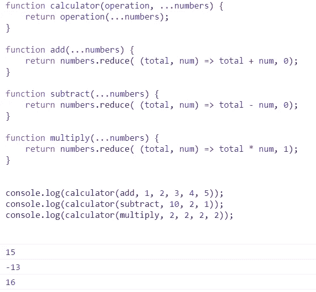

Different operations with our generic function

# 2.切换范围

有时你可能会发现在 Switch 语句中使用范围很有用。下面是一个如何做到这一点的例子:

```
function chooseSportByTemperature(fahrenheit) { 
  let sport;
  switch (true) {

   case (fahrenheit >= 15 && fahrenheit <=20):
     sport = 'Running';
     break; case (fahrenheit > 20 && fahrenheit <= 30):
    sport = 'Cycling';
    break; case (fahrenheit > 30):
    sport = 'Stay in home';
    break; default:
    sport = 'Sex';

   }
return sport;
}
```

# 3.将多个开关箱分组

一种简单的对案例句子进行分组的方法:

```
function setMyValueByValue(value) { 
    let myValue;
  switch (value)
  {
     case "value1":
     case "value2":
     case "value3": 
         myValue = "My value 1-2-3"
         break;
     case "value4":     
         myValue = "My value 4"
         break;
     default: 
         myValue = "Default value"
  }
 return myValue;
}console.log(setMyValueByValue("value1"));
console.log(setMyValueByValue("value2"));
console.log(setMyValueByValue("value3"));
console.log(setMyValueByValue("value4"));
console.log(setMyValueByValue("value5"));
```

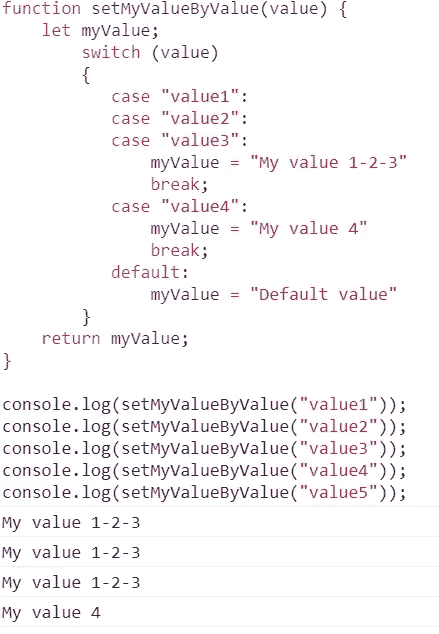

Grouping multiple switch cases.

# 4.用 async/await 等待多个异步函数

可以在异步函数中使用(Promise.all)来等待多个异步函数完成。

```
function resolveAfter1Seconds() {
  return new Promise(resolve => {
    setTimeout(() => {
      resolve('resolved');
    }, 1000);
  });
}function resolveAfter2Seconds() {
  return new Promise(resolve => {
    setTimeout(() => {
      resolve('resolved');
    }, 2000);
  });
}function resolveAfter3Seconds() {
  return new Promise(resolve => {
    setTimeout(() => {
      resolve('resolved');
    }, 3000);
  });
}function resolveAfter4Seconds() {
  return new Promise(resolve => {
    setTimeout(() => {
      resolve('resolved');
    }, 4000);
  });
}async function asyncFunction() {
  console.log('start');
  const result = **await Promise.all**(

  [resolveAfter1Seconds(),
   resolveAfter2Seconds(),
   resolveAfter3Seconds(),
   resolveAfter4Seconds()]) console.log(result); //resolved after 4 seconds !
  console.log('end');
}asyncFunction();
```

# 5.一步展平二维数组

```
const multidimensionalArray = [1,2, [3, 4], [5, 6], 7, [8] ];const flatArray = (original) => [].concat(...original);const flattenedArray = flatArray(multidimensionalArray);
```

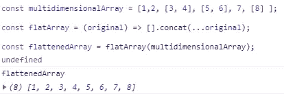

Bidimensional flattened Array

# 6.一步展平多维数组

使用 flat()方法，我们可以创建一个新数组，将所有子数组元素递归连接到指定深度。

```
const multidimensionalArray = [0, 1, 2, [[[3, 4, 5]]]];console.log(multidimensionalArray.flat());console.log(multidimensionalArray.flat(3)); //depth 3.
```

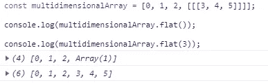

Multidimensional flattened array

# 7.用 JavaScript 创建纯对象

创建不继承任何对象属性的纯 JavaScript 对象通常很有趣。实现这一点非常简单，只需执行以下操作:

```
const car = {type:"Ford", model:"250", color:"black"};console.log(car);
console.log(car.constructor);
console.log(car.toString);
console.log(car.hasOwnProperty);
```

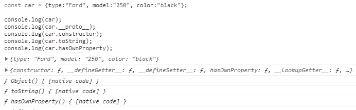

Regular JavaScript Object

```
const  pureCar = Object.create(null);console.log(pureCar);
console.log(pureCar.__proto__);
console.log(pureCar.constructor);
console.log(pureCar.toString);
console.log(pureCar.hasOwnProperty);
```

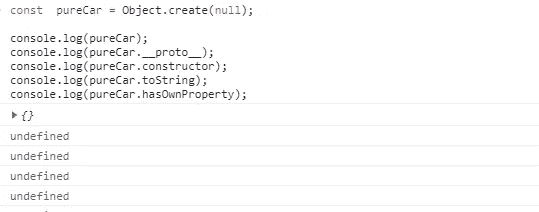

Pure JavaScript Object

# 8.一步移除数组中的重复元素

要移除数组中的重复元素，可以使用 destructuring 和 ES6 Set:

```
const removeDuplicatesFromArray = arr => [...new Set(arr)];

removeDuplicatesFromArray([1,1,2,3,4,4,4,true,true,'foo','foo']);
```

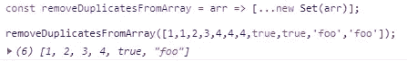

# 9.当页面开始并完成加载时，在控制台中显示

```
<script>
   window.onload=() =>{console.log('Start');}
   window.onunload=() =>{console.log('Finish');}
</script>Or better:<script>
   window.onload=() =>{console.time('pageLoadingTime');}
   window.onunload=() =>{console.timeEnd('pageLoadingTime');}
</script>
```

您还可以使用 console.time('一个唯一的名称')和 console.timeEnd('一个唯一的名称')函数来启动和结束一个计时器，以跟踪一个操作需要多长时间。

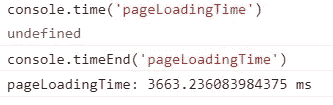

Using console.time() and console.timeEnd()

# 10.按钮打印当前页面

```
<input type="button" value="Print this page!" onclick="window.print()">
```

# 11.四舍五入数字

我们可以舍入到最接近的整数，向下舍入，或向上舍入。JavaScript 使用三种方法来实现这一点:数学

```
let myNumber= 1.56789;
myNumber = myNumber.toFixed(2);
```

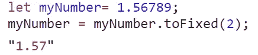

myNumber round to two decimals

输出是一个字符串，需要传递给 parseFloat()函数以返回一个数字。可惜这个真的很慢。但是如果你需要精确，这是更好的方法。

另一种方法是使用 Math.round 舍入到最接近的整数:

```
let myNumber= 1.56789;
Math.round(myNumber);
```

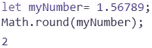

myNumber round with Math.round

或者向下舍入的 Math.floor()和向上舍入的 Math.ceil()。

请注意，舍入不同于截断:

```
let myNumber= 1.56789;
Math.trunc(myNumber);
```

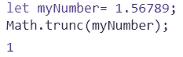

myNumber truncated with Math.trunc

Math.trunc()删除所有小数。

# 12.清空数组

就像给他的 length 属性赋值一样简单:

```
let myArray = [1,2,3,4,5,6,7,8,9,10];
myArray.length = 0;
```

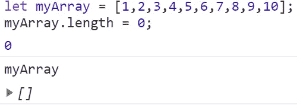

My new empty array

# 结论

我希望这篇文章对你有用，让你愉快。通过结合语言带给我们的东西，我们经常可以实现强大而实用的东西，比如用几步就可以创建一个通用的计算器。

更多尽在 [**12 更 JavaScript**](https://link.medium.com/gkH7UBqmebb) 新超级有用的招数

如果你喜欢这篇文章，可以考虑通过我的[个人资料](https://kesk.medium.com/membership)订阅 Medium。谢谢大家！