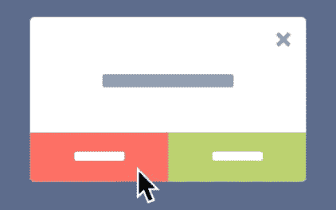
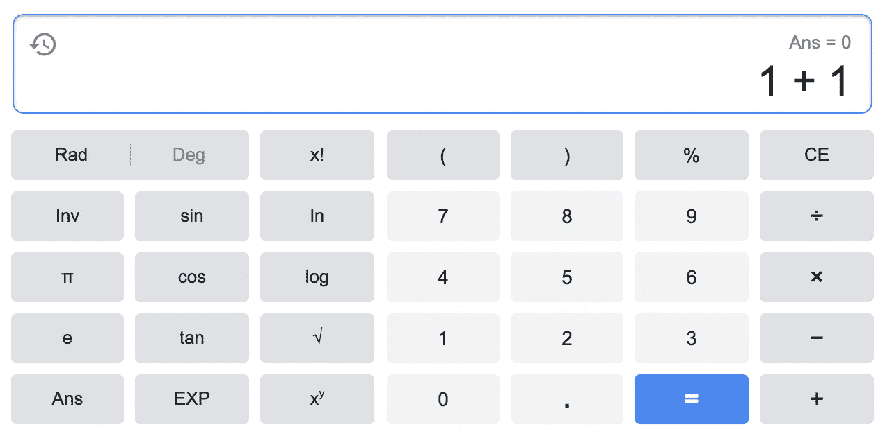
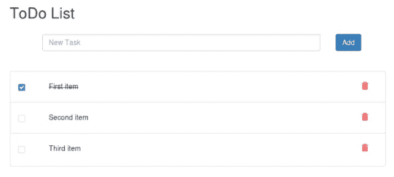
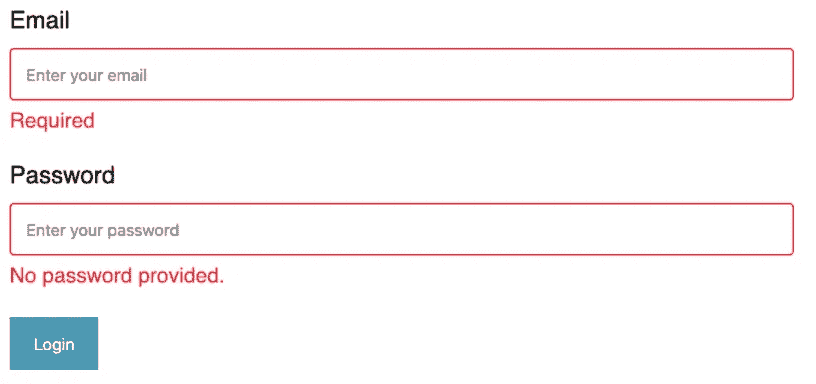
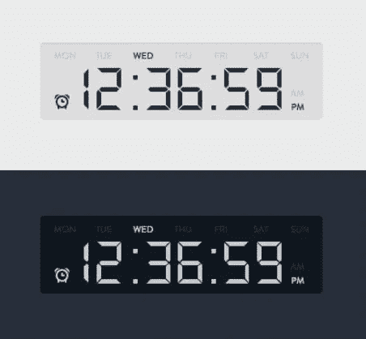
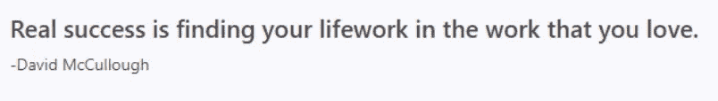
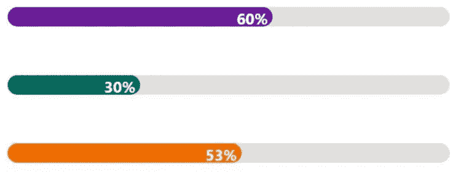
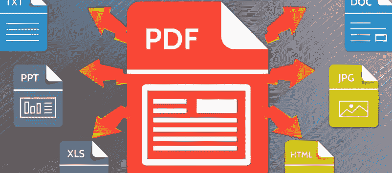
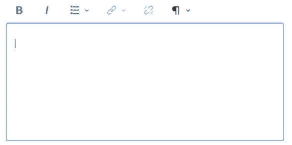

# 13 个 JavaScript 项目创意，帮助初学者提高编码技能

> 原文：<https://javascript.plainenglish.io/13-javascript-project-ideas-for-beginners-to-sharpen-your-coding-skills-2892c8400554?source=collection_archive---------0----------------------->

## 理论很无聊。

Photo by [Max Duzij](https://unsplash.com/@max_duz?utm_source=medium&utm_medium=referral) on [Unsplash](https://unsplash.com?utm_source=medium&utm_medium=referral)

说到学习新技能，我更喜欢实用的部分。

当然，你需要理论，然后才能实践。但是不要把所有的时间都花在一个理论上，然后是另一个。你肯定会忘记这一切的。

下面是 13 个 JavaScript 项目想法，供初学者充分利用你的学习过程。

# 1.存储卡游戏

我总是觉得开发游戏很兴奋。存储卡游戏就是其中之一。

你知道规矩，对吧？纸牌正面朝下放在棋盘上。当你点击两张卡片时，如果它们匹配，你就保留它们，否则它们会再次被翻过来。你继续玩直到你收集所有的卡片。

# 2.弹出

像 **alert()** 或 **prompt()** 这样的弹出窗口是有局限性的。它们很简单。您的项目总是需要更多的特性，比如显示更多的字段、处理复杂的动作或完美的 UI。

所以，我们来造一个吧。

# 3.图片库

每个电子商务网站在产品详情页面上都有一个图片库。你可以建立一个像缩放，查看下一张或上一张照片的功能。

# 4.计算器

这是我学习 JavaScript 时实践的第一个项目。

对你来说，理解如何在一定程度上使用 JavaScript、HTML 和 CSS 已经足够简单了。

您可以从一些简单的运算符开始，如加、减、乘和除。然后通过添加一些复杂的功能让你的计算器更加专业。

# 5.待办事项列表

与其使用其他待办事项应用程序，为什么不为自己创建一个呢？

待办事项列表的基本功能包括添加、删除、编辑和检查项目。为了获得更多的乐趣，你可以添加动画，比如当你完成一个项目时慢慢敲击它。

# 6.表单验证

您得到的表单主要由三个元素组成——用户名、密码和登录按钮。

用户需要输入用户名和密码，然后点击登录按钮。你的任务是在点击按钮后验证用户名和密码。如果数据有效，则授予用户访问下一步的权限。

# 7.时钟

你喜欢哪种钟？模拟还是数字？您可以使用 JavaScript、HTML 和 CSS 来创建这两者。为了让它更酷，添加一些平滑的动画。

# 8.励志名言

每次你坐在办公桌前，打开电脑，打开浏览器，你都会看到激励你一整天的励志名言。

您可以通过构建一个 Chrome 扩展来创建这个应用程序。

# 9.乐器

喜欢玩音乐。为什么不自己造一个乐器呢？可能是钢琴，吉他，或者架子鼓？

您可以将键盘上的每个键模拟成您想要构建的乐器的声音。

相信我。非常好玩！

# 10.进度条

当用户等待加载数据时，将显示此进度条。

你可以做一个简单的动画，也可以做一个复杂的有一些奇妙效果的动画，比如改变颜色。

# 11.转换器

你使用多少种转换器？

对我来说，它们是 doc 到 pdf，mp4 到 mp3，png 到 jpeg，或者一个单位转换器等等。

现在，让我们构建自己的转换器。

# 12.注意

这是用来做笔记和尽快写下你的想法的。

对于简单版本，只允许用户创建、编辑和删除注释。

为了使它更有趣，让我们添加一个特性，提供格式化注释的能力，比如改变文本颜色、显示 HTML/Markdown 格式等。

# 13.恶作剧

你知道“谁是百万富翁？”展示。从技术角度来说，它只不过是一个测验应用程序。

用户可以开始任何领域的测验。然后，他们会看到一个有 4 个选项可供选择的问题。选择一个并提交后，他们将看到另一个问题。用户一直回答，直到最后一个问题。

在结果屏幕上，他们将看到他们达到了多少分数，还有多少问题他们没有回答。

# 结论

还是那句话，熟能生巧。有了上面所有的想法，你就有机会提高你的 JavaScript 技能。

希望你觉得有用！

## 进一步阅读

 [## 15 种简单的编码技术，用更短的 JavaScript 代码完成任务

### 不要浪费时间写长代码，而你可以把它写得更短，更清晰，更易读。

medium.com](https://medium.com/javascript-in-plain-english/15-simple-coding-techniques-to-get-your-tasks-done-with-shorter-code-in-javascript-59d46801db0) 

# 简单英语的 JavaScript

喜欢这篇文章吗？如果是这样，通过 [**订阅解码获得更多类似内容，我们的 YouTube 频道**](https://www.youtube.com/channel/UCtipWUghju290NWcn8jhyAw) **！**