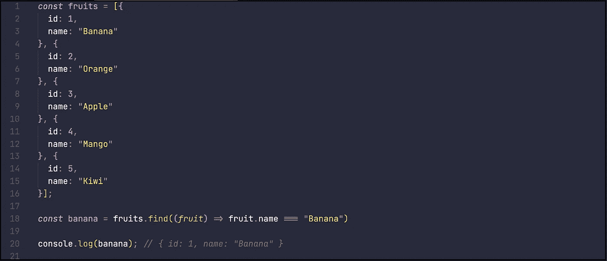

# 使用 JavaScript 数组可以做的 13 件事

> 原文：<https://javascript.plainenglish.io/13-things-you-can-do-with-javascript-arrays-5b6cb4c16c47?source=collection_archive---------10----------------------->

## 你可以用数组做很多不同的事情，每个都有例子

数组是 JavaScript 的基本组成部分，作为开发人员，我们经常使用和操作数组。

本文的目的是向您展示您可以使用数组做的所有不同的事情，从简单的例子开始，然后快速转到您可以使用数组做的一些更高级的事情。如果您已经对数组有了一定的了解，请随意跳到文章的一半，开始阅读一些您可以做的更高级的事情。

# 1.向数组中添加元素

您可以使用`array.push()`将一个项目添加到一个数组中，这会将该项目添加到数组的末尾。

# 2.将元素添加到数组的开头

如果你想在数组的开头添加一个条目，你可以使用`array.unshift()`。

# 3.从数组中删除最后一个元素

如果你想从数组中移除一个元素，你可以使用`array.pop()`，这将移除最后一个元素。

# 4.从数组中移除第一项

如果你想从数组中移除第一个元素，你可以使用`array.shift()`。

# 5.复制数组

如果你想复制一个数组，你可以使用析构来将元素从原始数组复制到一个新的数组中。

# 6.用 for 循环遍历数组

遍历数组最简单的方法是使用一个`for`循环，在这里使用 incrementor 来引用数组中要访问的项。

# 7.用 forEach()遍历数组

循环遍历数组的另一种方法是使用`array.forEach()`，在这种情况下，您不需要 incrementor，因为您正在传递一个方法，该方法将为数组中的每一项调用，该项的值作为参数。

# 8.使用 map()创建新的变异数组

有时当你循环遍历一个数组时，你会想要创建一个新的数组作为输出。一种方法是使用`array.map()`，`array.map()`和前面提到的`array.forEach()`的主要区别在于，你可以在方法的末尾返回一个值，这个值将出现在你的新数组中。

在下面的例子中，我创建了一个新的数组，根据索引值加 1 对水果进行编号。

# 9.[…析构数组]

有时我们可能想使用变量名引用数组的值，一种方法是析构数组。

在下面的例子中，我们将把前两个水果放入名为`banana`和`orange`的变量中，然后把剩下的水果放入名为`otherFruits`的数组中。

# 10.使用 filter()创建一个过滤数组

您可能希望对数组执行的一个常见操作是筛选值。

这就是`Array.filter()`的用武之地，要使用它，您需要通过一个测试方法 Array.filter()。你的方法应该在你需要的时候返回 true，在你不需要的时候返回 false。所有返回 true 的项将被添加到一个新的数组中。

在下面的例子中，我过滤了水果数组来查找所有以字母“A”开头的水果。本例中的测试是检查水果的第一个字母是否为“A ”,如果为“A ”,则返回 true，否则返回 false。得到的数组将只是以字母“A”开头的水果。

# 11.使用 Sort()对数组中的项目进行排序

有时我们可能需要对数组中的项目进行排序，为此我们有了`Array.sort()`。有两种方法可以使用 Array.sort():

*   默认行为是调用。sort()在我们要排序的数组上，这将导致项目被视为字符串并按字母顺序排序。这对于实际的字符串来说很好，但是对于数字来说，这可能会导致“100”被放在“50”之前。
*   您可以传递一个 compare 方法，该方法允许您控制数组的排序方式

在第一个例子中，我们将按照字母顺序对水果进行排序，因为水果是字符串，我们可以在水果数组中简单地称之为`.sort()`。

在第二个示例中，我们将按数字顺序对一些数字进行排序，在这种情况下，我们将提供一个比较方法，该方法将检查彼此的值，如果比较的两个数字中的第一个大于第二个，则返回 true。

# 12.使用 Find()在数组中查找项目

如果你正在处理一组数据，你想找到一个特定的条目，你可以用 Array.find()来完成。

在下面的例子中，我们有一个水果对象的列表，我们想要找到**香蕉**对象，我们使用`.find()`，给它传递一个方法来检查每个水果的名称，看它是否是“香蕉”。

# 13.检查您的数组是否包含带有 includes()的项

有时我们只想知道我们的数组是否包含一个项目，为此我们可以使用`Array.includes()`。要做到这一点，只需调用`.includes()`，传递您想要检查数组中是否存在的字符串，它将返回 true 或 false。

# 摘要

这个数组方法列表并不详尽，但是它应该涵盖了编写 JavaScript 时可能需要的大多数方法。希望这里有一些你以前没有用过的东西，你学到了一些东西，如果你有，请竖起大拇指，跟着我，这样我就知道将来会写更多这样的文章。