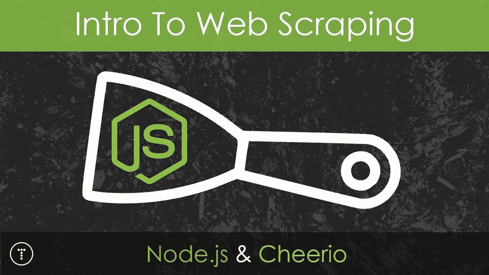
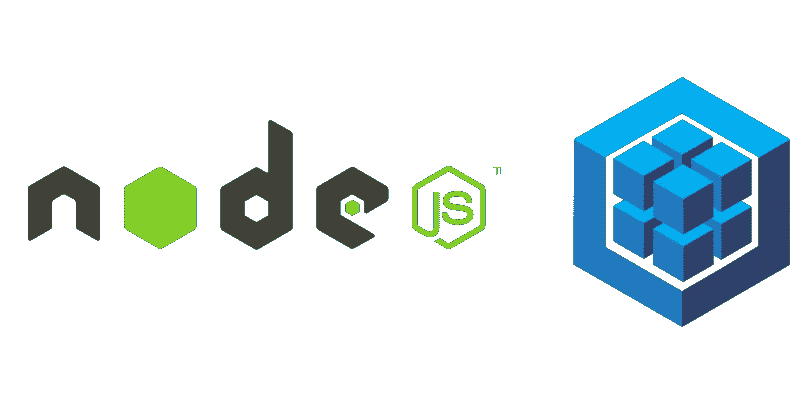
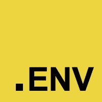
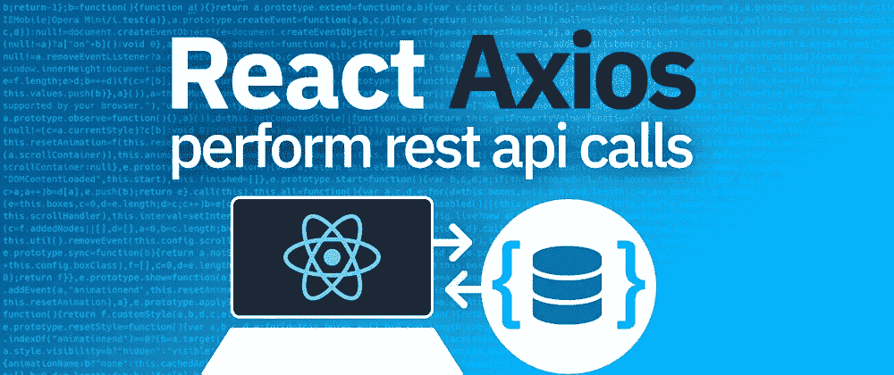

# 2020 年最有用的 14 个节点库

> 原文：<https://javascript.plainenglish.io/14-most-useful-nodejs-libraries-in-2020-9e0a5e72d1d8?source=collection_archive---------0----------------------->


Photo by [Ivo Rainha](https://unsplash.com/@ivoafr?utm_source=medium&utm_medium=referral) on [Unsplash](https://unsplash.com?utm_source=medium&utm_medium=referral)

# 表达


快速、非个人化、极简的节点 web 框架

## 对…有好处

*   make MEAN stack app (MongoDB，Express.js，Angular.js，Node.js)
*   易于处理多种类型的请求，如 GET、PUT、POST 和 DELETE 请求
*   快速构建单页面、多页面和混合 web 应用程序

## 每周下载量

11 米

## 许可证

麻省理工学院(Massachu-setts Institute of Technology)

## **替代品**

Koa，哈比神，流星

[](https://www.npmjs.com/package/express) [## 表达

### 快速、非个人化、极简的节点 web 框架。这是一个 Node.js 模块，可通过 npm 注册表获得…

www.npmjs.com](https://www.npmjs.com/package/express) 

# 再见



Cheerio 解析标记，例如 HTML，并提供用于遍历/操纵结果数据结构的 API

```
const cheerio **=** require('cheerio');const $ **=** cheerio.load('<ul id="fruits">...</ul>');
```

## 对…有好处

*   制作网络爬虫/抓取器
*   简单直观的语法和用法

## 每周下载量

4.2 米

## 许可证

麻省理工学院(Massachu-setts Institute of Technology)

## 可供选择的事物

jsdom，木偶师

[](https://www.npmjs.com/package/cheerio) [## 再见

### 专为服务器设计的核心 jQuery 的微小、快速和优雅的实现

www.npmjs.com](https://www.npmjs.com/package/cheerio) 

# 节点邮件程序


从 Node.js 发送电子邮件

```
const nodemailer = require("nodemailer");let testAccount = await nodemailer.createTestAccount();let transporter = nodemailer.createTransport({
  host: "smtp.ethereal.email",
  port: 587,
  secure: false,
  auth: {
    user: testAccount.user, 
    pass: testAccount.pass
 }
});let info = await transporter.sendMail({
  from: '"Fred Foo 👻" <foo@example.com>',
  to: "bar@example.com, baz@example.com",
  subject: "Hello ✔", 
  text: "Hello world?",
  html: "<b>Hello world?</b>"
});
```

## 对…有好处

*   使用 SMTP 轻松发送邮件

## 每周下载量

98 万

## 许可证

麻省理工学院(Massachu-setts Institute of Technology)

## 可供选择的事物

sendmail，电子邮件

[](https://www.npmjs.com/package/nodemailer) [## 节点邮件程序

### 从 Node.js 发送电子邮件-非常简单！🍰文件和条款见 nodemailer.com✉️。的文档

www.npmjs.com](https://www.npmjs.com/package/nodemailer) 

# socket.io


插座。IO 支持基于事件的实时双向通信

```
const server = require('http').createServer();
const io = require('socket.io')(server);
io.on('connection', client => {
  client.on('event', data => { ... });
  client.on('disconnect', () => { ... });
});
server.listen(3000);
```

## 对…有好处

*   实施实时分析、二进制流、实例消息传递和文档协作
*   值得注意的用户包括微软 Office、Yammer 和 Zendesk

## 每周下载量

3M

## 许可证

麻省理工学院(Massachu-setts Institute of Technology)

## 可供选择的事物

推进器

[](https://www.npmjs.com/package/socket.io) [## socket.io

### 插座。IO 支持基于事件的实时双向通信。它包括:在其他方面的一些实现…

www.npmjs.com](https://www.npmjs.com/package/socket.io) 

# 骗子


在浏览器和 node.js 中生成大量虚假数据

```
var faker = require('faker');var randomName = faker.name.findName(); // Rowan Nikolaus
var randomEmail = faker.internet.email(); // Kassandra@erich.biz
var randomCard = faker.helpers.createCard(); // random contact card
```

## 对…有好处

*   在 API 后端构建尚未完成时，构建前端 UI 并与数据交互
*   众多 API 方法，包括地址、公司、数据库、图像、名称(名字、姓氏)

## 每周下载量

1.4 米

## 许可证

麻省理工学院(Massachu-setts Institute of Technology)

## 可供选择的事物

非正式的

[](https://www.npmjs.com/package/fake) [## 骗子

### 当前状态:该库已准备好供实验使用。一次测试一件事，其余的假装。设置一个…

www.npmjs.com](https://www.npmjs.com/package/fake) 

# 摩根


node.js 的 HTTP 请求记录器中间件

如`GET / 200 51.267 ms — 1539`

```
morgan
(':method :url :status :res[content-length] - :response-time ms')---var express **=** require('express')var morgan **=** require('morgan')var app **=** express()app.use(morgan('combined'))app.get('/', function (req, res) {res.send('hello, world!')})
```

## 对…有好处

*   在控制台、文件、数据库中记录请求
*   调试和日志历史

## 每周下载量

2M

## 许可证

麻省理工学院(Massachu-setts Institute of Technology)

[](https://www.npmjs.com/package/morgan) [## 摩根

### 以 Dexter 命名的 node.js 的 HTTP request logger 中间件，在完成之前您不应该观看这个节目。创建一个…

www.npmjs.com](https://www.npmjs.com/package/morgan) 

# http-错误


为 Express、Koa、Connect 等创建 HTTP 错误。

```
app.use(function (req, res, next) {
 if (!req.user) 
   return next(createError(401, 'Please login to view this page.'))
  next()
})
```

## 对…有好处

*   易于发送错误响应
*   许多错误属性可用

```
expose
headers
message
status
statusCode
```

## 每周下载量

27 米

## 许可证

麻省理工学院(Massachu-setts Institute of Technology)

[](https://www.npmjs.com/package/http-errors) [## http-错误

### 为 Express、Koa、Connect 等创建 HTTP 错误。轻松地。这是一个 Node.js 模块，可通过 npm 获得…

www.npmjs.com](https://www.npmjs.com/package/http-errors) 

# 正文分析器


Node.js 主体解析中间件

在处理程序之前解析中间件中的传入请求体，在`req.body`属性下可用

```
var express = require('express')
var bodyParser = require('body-parser')var app = express()// parse application/x-www-form-urlencoded
app.use(bodyParser.urlencoded({ extended: false }))// parse application/json
app.use(bodyParser.json())
```

## 对…有好处

*   解释请求正文
*   许多选项如`inflate`、`type`、`verify`

## 每周下载量

13 米

## 许可证

麻省理工学院(Massachu-setts Institute of Technology)

[](https://www.npmjs.com/package/body-parser) [## 正文分析器

### Node.js 主体解析中间件。在您的处理程序之前，在中间件中解析传入的请求体，可在…

www.npmjs.com](https://www.npmjs.com/package/body-parser) 

# 序列



Sequelize 是一个基于承诺的 Node.js ORM，用于 Postgres、MySQL、MariaDB、SQLite 和 Microsoft SQL Server

它具有可靠的事务支持、关系、急切加载和延迟加载、读取复制等特性

```
const sequelize = new Sequelize
  ('database', 'username', 'password', 
    {
   host: 'localhost',
   dialect: /* one of 'mysql' 
     | 'mariadb' | 'postgres' | 'mssql' */ });
```

## 对…有好处

*   Node.js 表单

## 每周下载量

72 万

## 许可证

麻省理工学院(Massachu-setts Institute of Technology)

[](https://www.npmjs.com/package/sequelize) [## 序列

### Sequelize 是一个基于 promise 的 Node.js ORM，用于 Postgres、MySQL、MariaDB、SQLite 和 Microsoft SQL Server。它的特点是…

www.npmjs.com](https://www.npmjs.com/package/sequelize) 

# 护照


Passsport 是 Node.js 的 Express 兼容认证中间件

Passport 的唯一目的是验证请求，这是通过一组称为策略的可扩展插件来实现的

```
passport.use(**new** LocalStrategy( function(username, password, done) { User.findOne({ username**:** username }, function (err, user) { **if** (err) { **return** done(err); } **if** (**!**user) { **return** done(null, false); } **if** (**!**user.verifyPassword(password)) { **return** done(null,  
          false); } **return** done(null, user); }); }));
```

## 对…有好处

*   Node.js 身份验证
*   与 OAuth 和 OpenID 的集成(脸书，Twitter 等…登录)

## 每周下载量

810K

## 许可证

麻省理工学院(Massachu-setts Institute of Technology)

[](https://www.npmjs.com/package/passport) [## 护照

### Passport 是 Node.js 的 Express 兼容认证中间件。Passport 的唯一目的是认证…

www.npmjs.com](https://www.npmjs.com/package/passport) 

# dotenv



Dotenv 是一个零依赖模块，它将环境变量从一个`.env`文件加载到`process.env`

将配置存储在独立于代码的环境中

```
require('dotenv').config()const db **=** require('db')db.connect({host**:** process.env.DB_HOST,username**:** process.env.DB_USER,password**:** process.env.DB_PASS}) // .env file
DB_HOST=localhostDB_USER=rootDB_PASS=s1mpl3
```

## 对…有好处

*   加载部署、连接到其他工具所需的环境变量，如`AWS`、`sql`用户名、密码
*   将配置存储在独立于代码的环境中

## 每周下载量

10M

## 许可证

BSD-2 条款

[](https://www.npmjs.com/package/dotenv) [## dotenv

### Dotenv 是一个零依赖模块，它将环境变量从. env 文件加载到 process.env 中。正在存储…

www.npmjs.com](https://www.npmjs.com/package/dotenv) 

# 穆尔特


Multer 是一个处理`multipart/form-data`的 node.js 中间件，主要用于上传文件

```
var express **=** require('express')var multer  **=** require('multer')var upload **=** multer({ dest**:** 'uploads/' })var app **=** express()app.post('/profile', 
  upload.single('avatar'), function (req, res, next) { *// req.file is the `avatar` file* *// req.body will hold the text fields, if there were any* })app.post('/photos/upload', 
  upload.array('photos', 12), function (req, res, next) { *// req.files is array of `photos` files* *// req.body will contain the text fields, if there were any*})
```

## 对…有好处

*   轻松上传`multipart/form-data`文件

## 每周下载量

92K

## 许可证

麻省理工学院(Massachu-setts Institute of Technology)

[](https://www.npmjs.com/package/multer) [## 穆尔特

### Multer 是一个用于处理多部分/表单数据的 node.js 中间件，主要用于上传文件。这是…

www.npmjs.com](https://www.npmjs.com/package/multer) 

# axios



基于 Promise 的浏览器和 node.js 的 HTTP 客户端

```
const axios **=** require('axios');*// Make a request for a user with a given ID*axios.get('/user?ID=12345') .then(function (response) { *// handle success* console.log(response); }) .catch(function (error) { *// handle error* console.log(error); }) .finally(function () { *// always executed* });
```

## 对…有好处

*   从 node.js 发出 http 请求
*   从浏览器发出 XMLHttpRequests
*   支持 Promise api

## 每周下载量

9.6 米

## 许可证

麻省理工学院(Massachu-setts Institute of Technology)

[](https://www.npmjs.com/package/axios) [## axios

### 基于 Promise 的浏览器和 node.js 的 HTTP 客户端

www.npmjs.com](https://www.npmjs.com/package/axios) 

# 克-奥二氏分级量表


CORS 是一个 node.js 包，用于提供一个连接/快速中间件，该中间件可用于支持具有各种选项的 CORS

```
var express **=** require('express')var cors **=** require('cors')var app **=** express()app.use(cors())app.get('/products/:id', function (req, res, next) {res.json({msg**:** 'This is CORS-enabled for all origins!'})})app.listen(80, function () {console.log('CORS-enabled web server listening on port 80')})
```

## 对…有好处

*   轻松解决 CORS 问题

## 每周下载量

3.7 米

## 许可证

麻省理工学院(Massachu-setts Institute of Technology)

> 享受编码

# **用简单英语写的便条**

你知道我们有四份出版物和一个 YouTube 频道吗？你可以在我们的主页 [**plainenglish.io**](https://plainenglish.io/) 找到所有这些内容——关注我们的出版物并 [**订阅我们的 YouTube 频道**](https://www.youtube.com/channel/UCtipWUghju290NWcn8jhyAw) **来表达你的爱吧！**


Photo by [Kevin Ku](https://unsplash.com/@ikukevk?utm_source=medium&utm_medium=referral) on [Unsplash](https://unsplash.com?utm_source=medium&utm_medium=referral)