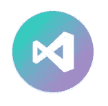
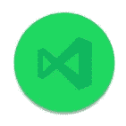

# 14 个 VSCode 扩展，将提高您的工作效率

> 原文：<https://javascript.plainenglish.io/14-vscode-extensions-that-will-boost-your-productivity-1402f659e587?source=collection_archive---------6----------------------->

我使用 VSCode 已经一年半了，它最棒的地方是扩展库，所以我希望你能在这里找到一些有用的扩展。

# 设置同步

如果你像我一样在台式机和笔记本电脑之间切换，这非常有用，它会将你的设置保存在云中，并在你的设备之间同步它们。

[下载](https://marketplace.visualstudio.com/items?itemName=Shan.code-settings-sync)

# 较美丽

它帮助您在项目之间编写一致的代码，保持您的代码风格始终整洁。

[下载](https://marketplace.visualstudio.com/items?itemName=esbenp.prettier-vscode)

# 实时分享

如果你和其他开发人员一起远程工作，你可以在其他人的环境中编写代码，反之亦然，你可以共享资源管理器、文件和终端。

[下载](https://marketplace.visualstudio.com/items?itemName=MS-vsliveshare.vsliveshare)

# 吉特朗斯

我喜欢这个扩展的原因是一行代码的错误，但是它真的很强大，有很多特性，看看吧。

[下载](https://marketplace.visualstudio.com/itemdetails?itemName=eamodio.gitlens)

# 代码拼写检查器

我喜欢这个，尤其是因为我的母语不是英语，所以，我打了很多错别字。

[下载](https://marketplace.visualstudio.com/items?itemName=streetsidesoftware.code-spell-checker)

# ES7 React/Redux/graph QL/React-本机代码片段

嗯，这是为 react 开发者准备的，但如果你是，这是必备的。

[下载](https://marketplace.visualstudio.com/items?itemName=dsznajder.es7-react-js-snippets)

# 材料主题

VSCode 中最好的主题集合，可能也是最受欢迎的，这不会提高你的工作效率，但是很酷

[下载](https://marketplace.visualstudio.com/items?itemName=Equinusocio.vsc-material-theme)

# 自动重命名标签

当你更新开始标签时，它改变结束标签，非常简单。

[下载](https://marketplace.visualstudio.com/items?itemName=formulahendry.auto-rename-tag)

# 自动关闭标签

技术上已经内置到 VSCode 中，但有时它不起作用，所以我有这个。

[下载](https://marketplace.visualstudio.com/items?itemName=formulahendry.auto-close-tag)

# 埃斯林特

如果你是一个 JS 开发人员，你需要有这个，它帮助你写更好的代码，更高质量的代码检测坏的模式和实践。

[下载](https://marketplace.visualstudio.com/items?itemName=dbaeumer.vscode-eslint)

# 书签

我在三天前发现了这个，我喜欢这个，有时当我关闭 VSCode 并返回时，我忘记了我离开的地方，所以当我关闭时，我用书签标记了这一行。

[下载](https://marketplace.visualstudio.com/items?itemName=alefragnani.Bookmarks)

# Vscode-Spotify

嗯，这可能也不会提高你的工作效率，但是我喜欢在编程的时候听音乐，所以，也许会呢？

[下载](https://marketplace.visualstudio.com/items?itemName=shyykoserhiy.vscode-spotify)

# 代码时间

看到你在编码上花了多少时间的统计数据是很棒的，当你使用它至少一个月，并给你比昨天多工作一点的动力时，这变得最有趣。

[下载](https://marketplace.visualstudio.com/items?itemName=softwaredotcom.swdc-vscode)

# Chrome 调试器

你必须停止使用 ***console.log()，*** 这将加快你正在处理的任何东西的调试过程。

[下载](https://marketplace.visualstudio.com/items?itemName=msjsdiag.debugger-for-chrome)