# 2020 年 15 个最佳 Javascript IDE 和代码编辑器评论

> 原文：<https://javascript.plainenglish.io/15-best-javascript-ide-code-editors-in-2020-review-6cd0303d0586?source=collection_archive---------3----------------------->

他们有很多！有很多功能强大的昂贵的 ide，也有免费的。有带或不带类似 IDE 功能的代码编辑器。

如今 JavaScript 被广泛用于前端开发。作为最流行的技术之一，它引起了开发人员的极大关注。像本地脚本和渐进式 web 应用程序这样的技术有助于降低开发成本。我们在最近的文章中已经详细介绍了[渐进式应用](https://jelvix.com/blog/how-develop-progressive-web-app)。

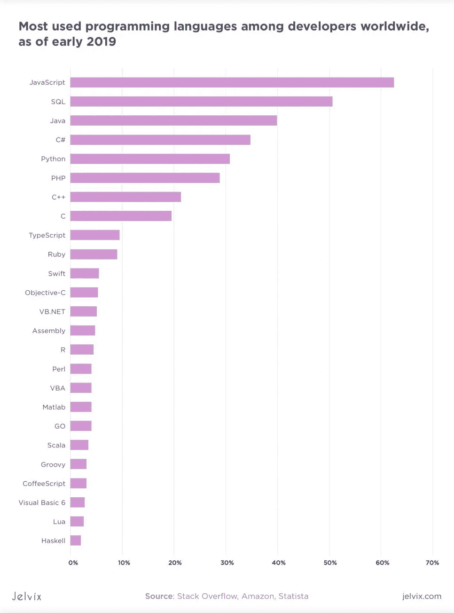

# JavaScript 最好的 IDE 是什么？选什么？

你需要在笔记本电脑上开发网站的东西吗，或者你需要一个编辑器来快速浏览手机上的代码？谢天谢地，市场上充满了解决方案。

在本文中，我们试图回答这个问题:对于您的预期用途和编码风格，哪一个是最好的 JS IDE？

# 什么是 IDE？

一个 [IDE(集成开发环境)](https://en.wikipedia.org/wiki/Integrated_development_environment)是一个帮助应用程序开发的环境。大多数时候，它用于代码编辑、调试和自动化。

ide 的创建是为了简化开发人员的工作。这是一个可以完成所有工作的单一环境。随着控制台和终端的引入，ide 的使用成为可能。在此之前，这样的软件在技术上是不可能创造出来的。ide 对于大型工作环境非常有用，因为它们允许许多人同时在同一个项目上工作。有些甚至允许多人同时处理同一段代码。除此之外，还有一个很棒的 UI 来导航和管理大型项目的代码。

顶级 JavaScript IDEs 提供了自动化代码编写、测试和调试的优秀工具。因此它节省了成本，适用于各种规模的企业。时间就是金钱，省下的钱就是赚到的钱。

# ide 和编辑器有什么区别？

所以在很多方面，用于 JavaScript 开发的 ide 都很优秀。它们加速了开发过程，并使其更有效率。此外，他们即时测试事物的能力带来了许多优势。然而，尽管如此，代码编辑器仍然很受欢迎，因为它们中的许多都是免费的。它们还更轻、更快、更不消耗资源，因此可以用在笔记本电脑和智能手机上。此外，更令人困惑的是，IDE 的部分功能被引入到代码编辑器中。它把它们从加了香料的记事本(10 年前是这样的)变成了类似 IDE 的平台。

# 可能值得您关注的最佳 JavaScript IDEs

下面我们提供了一个 JavaScript 的顶级 ide 列表。我们在这里解释了它们的主要优点和缺点，可以让你更容易做出选择。

# 1.Visual Studio:行业标准软件

可以说，最好的前端开发 IDE 之一是 Microsoft Visual Studio。它还有一个非常受欢迎的免费开源衍生品 [Visual Studio 代码，](https://code.visualstudio.com/)可以认为是精简版。然而，不要让这种陈词滥调欺骗了你——它本身就是一个强大的 JavaScript 编辑器。由 JS 州进行的调查表明，这是 2018 年使用最广泛的文本编辑器。

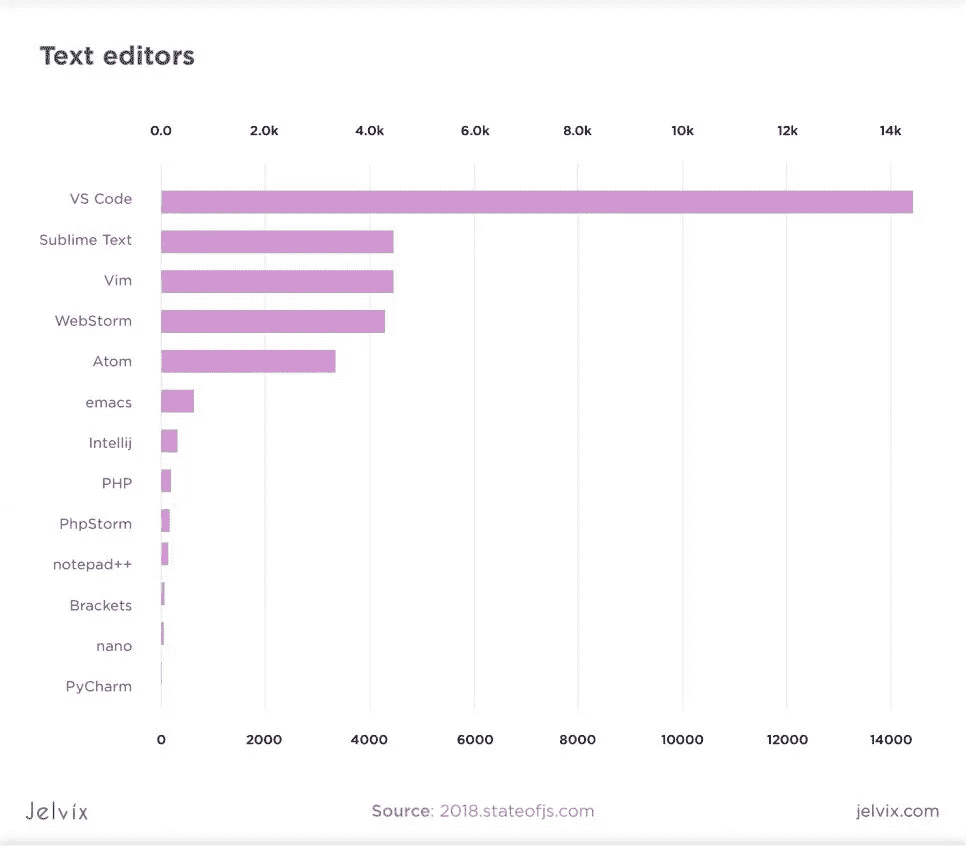

其次是 VS Code、SublimeText、Vim、WebStorm 和 Atom，在 20000 名调查参与者中，它拥有超过 14k 名用户。除了 JS，它还支持 Ruby、Python、C#等 30 种编程语言。如果你对 Ruby 开发感兴趣，我们为你准备了这个。

Microsoft visual studio 是一个功能强大的 IDE，它是非常资源密集型的，主要用于 C、C++、.NET 和 C#。它具有优秀的功能，如同步编辑规划和脚手架。它发现行业最佳代码英特尔，并内置调试器。换句话说，它是一个合适的工业级 IDE。

但是对于 JavaScript 这样的应用，说列表就过分了，这就是它的小兄弟存在的原因。

# 2.Visual Studio 代码。免费版:功能更轻；价值高

Visual Studio 代码既没有完整的工作环境，也没有许多工作规划功能。但是，它更轻便，可定制性更强。此外，它不需要一个强大的桌面来运行它。它具有类似的智能感知功能。它已经集成了 Git 支持，因此可以直接从应用程序快速运行拉、推和提交操作。

这个编辑器有一个一流的调试器，在处理 Node.js 和基于 js 的应用程序时非常方便。应用程序以调试模式启动，也可以随时激活。调试器也有一些独特的功能，如调用牛排，设置断点和观察变量。

它被广泛使用，并且有一个专门的社区。这种跨平台有一个集成的终端，尽管很轻，但仍然需要相当长的时间来加载项目。尤其是当您尝试将其与 Bash 或 PowerShell 性能进行比较时。像微软一样，它也有一些错误的更新，所以在更新它时最好小心谨慎。

# 3.网络风暴。高级 JavaScript 开发环境

教育机构和非营利组织也有折扣和免费许可证。Webstorm 是目前市场上最受支持和更新的产品之一。所以新的和重要的功能通常会首先出现在网络风暴中。例如，它是 2015 年首次推出时唯一支持 JSX 的 IDE。

它具有与 GitHub 和其他 VCS 的功能集成。它本质上是一个 JavaScript 和类型脚本 IDE。它对 Cordova、Ionic、React、React Native、Angular、Node.js、Vue.js 以及其他流行的 JavaScript 框架都有出色的支持。顺便说一下，我们已经更详细地介绍了 Vue.js。对于包含用其他语言编写的代码的项目，它还对 20 多种其他语言提供了必要的语法支持。

Webstorm 有很多很棒的功能。例如，移动编辑、重构、卓越的导航和代码完成。许多人认为 Webstorm 的自动调试和代码测试功能是市场上最好的。Webstorm 还有一个优秀的智能模板功能。

最后但同样重要的是，它有一个体面的用户界面定制和主题。是的，如果和其他功能相比，这是一个看似不重要的功能。但是，一个软件开发人员，大半辈子都盯着编辑器里的代码，让自己的生活过得舒服一点也没什么不好。

# 4.原子。最佳免费 JavaScript IDE 的有力竞争者

默认情况下，应用程序有一个合适但有点过分的内置包。此外，建议移除不必要的组件以降低速度。Atom 擅长于它的预期目的——运行可以利用其所有模块化特性的大型复杂项目。

然而，它也有不好的一面。Atom 是资源密集型的，即使在功能强大的机器上也会很慢，尤其是在软件包管理不当的情况下。

你可以下载很多 Atom 的包和模板，修改它们或者自己制作。该应用程序是非常可定制的，这是好的也是坏的。很难按照你需要的方式设置它，尤其是对初学者来说。然而，在你做了一个适当的项目设置后，它对工作有很大的帮助。它有最好的用户界面定制特性，你可以把它做成你想要的样子。

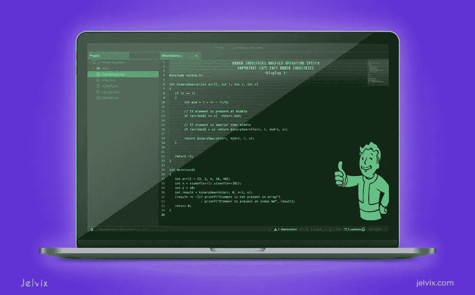

在微软[收购 GitHub](https://blogs.microsoft.com/blog/2018/10/26/microsoft-completes-github-acquisition/) 之后，很多人都在关注 Atom 的未来。毕竟直接和 Visual Studio 代码竞争！然而，到目前为止，没有迹象表明原子受到了影响。

Atom 还缺乏用户支持和帮助部分，增加了进入门槛。它有一个实时协作功能，对于这样一个强大的工具来说，这是非常好的，如果你考虑到它是免费的，那就更好了。这使得它成为市场上的一个独特的命题。

目前，Atom 看起来是前端开发最佳 IDE 的有力竞争者。

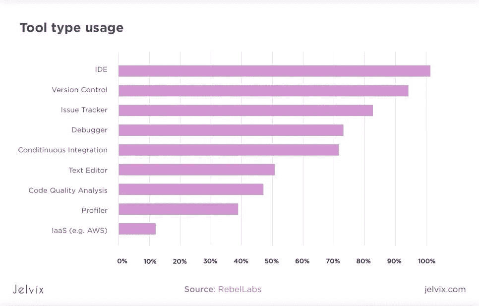

# 5.括号。免费的 Adobe JavaScript IDE。不可能！

括号是由深刻了解网页设计和前端的开发人员创建的。这个编辑器又轻又快。它有一个非常直观的界面，所以它适合初学者。初学者也不需要其他 ide 提供的大量特性。对于喜欢随意编码的 web 开发人员来说，这是一个完美的工具。

括号专注于制作可视化工具和出色的预处理器支持。另一个优点是，该软件允许在不打开多个窗口的情况下处理代码。用户界面在一定程度上是可定制的，但总的来说，流畅而直观。然而，这正是现在人们对 Adobe 产品的期望。

顺便说一下，括号支持令人印象深刻的语言列表和最流行的框架的语法突出显示。但是，一些高级功能仅适用于 HTML、JavaScript 和 CSS。

说到实时预览，这是这个软件最关键的功能。它允许在你编辑的时候在浏览器中实时看到结果，这在 frontend 中非常有用。

# 6.科莫多 IDE。另一个顶级的 JavaScript IDEs

不幸的是，它的代码 Intel 只适用于 Python、PHP、Perl、Tcl、Go、Ruby、Node.js、JavaScript、HTML 和 CSS。面向 C++的英特尔代码也在那里，但容量有限。另一个不利因素是定价。个人每月 7 美元，企业每月 490 美元。然而，如果你需要一个多语言的工作环境，这可能是你的一个选择。

# 7.科莫多编辑。基于 Komodo IDE 的自由文本编辑器

但是，它仍然保留了多选功能、Comando 导航、Kopy.io pastebin、项目管理器和多语言语法突出显示。

总的来说，它的功能有点简单，但是它是一个易于使用的多语言开发工具包。你当然可以在市场上用多语言语法高亮编辑器做得更差。它的简单和易用是免费的，这使得它非常有吸引力。开始学习它的大兄弟，或者对于随意编码来说，都是一个不错的选择。

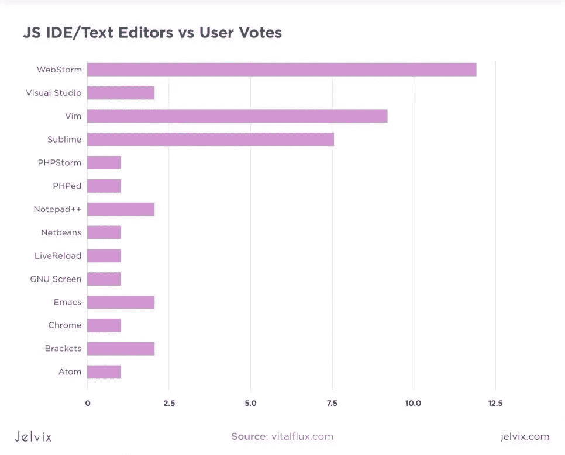

# 8.崇高的文字。免费增值进入文本编辑器市场

它的多光标和多选择特性受到许多程序员的喜爱，因为它允许同时在多个地方编辑代码。但是被别人认为很奇怪，很难习惯。这是一个视角问题。Sublime Text 还支持许多对编写 JavaScript 有用的特性。JS 也有智能感知包。顺便说一下，它有一个体面的 Github 集成。也是比较轻便快捷的。它是高度可定制的，包括外观部门。它的不足之处在于工作环境的特点。结论是——自由职业者或小型工作环境的首选 JavaScript 编辑器。对大公司的吸引力有所下降。

# 9.月食。具有良好工作环境特性的 IDE

尽管 Eclipse 以其卓越的 Java IDE 而闻名，但它也常用于 JavaScript 开发。然而，为了能够在 [Eclipse](https://www.eclipse.org/ide/) 中使用 JavaScript 代码，需要安装特殊的插件。但是一旦你安装了这些插件，你最终会发现 Eclipse 非常有价值。

Eclipse 团队最近投入了大量精力来使平台尽可能对 JavaScript 友好。因此，它支持像 Docker UI 和 Docker CLI 这样的开源解决方案。

# 10.光桌。强大的机器人引擎和键盘映射

它是 JavaScript 项目的开源开发环境。该 IDE 由麻省理工学院团队开发，并通过 Kickstarter 获得资金，筹集了超过 30 万美元。 [LightTable](http://lighttable.com/) 提供反馈和代码执行，帮助开发人员快速创建抽象。

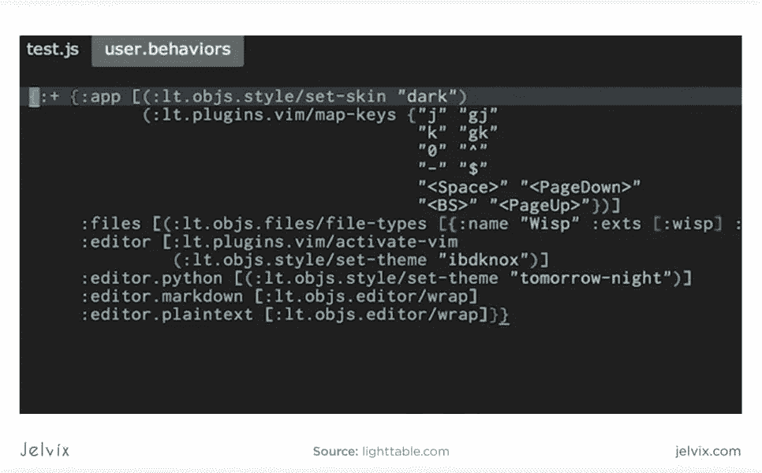

IDE 的主要特性包括行为对象标签引擎和可定制的键映射。用户可以为代码跟踪系统设置一个值，并实时监控代码质量。

Light Table 允许几个用户同时在环境中工作，编辑同一个代码文件。该界面包括命令窗格、文件树和导航窗格。此外，该环境不要求用户打印控制台，相反，他们可以实时逐行检查代码。

# 11.代码龙虾。用于 JavaScript 和 PHP 开发的 IDE

尽管这种开发环境以帮助 PHP 开发而闻名，但它在 JavaScript 开发人员中也很受欢迎。该解决方案目前支持 JavaScript、PHP、HTML 和 CSS。这种多功能性使该软件成为最适合 web 开发的解决方案之一。对于在开发过程中同时使用 PHP 和 JavaScript 的团队来说，这也是一个不错的解决方案。

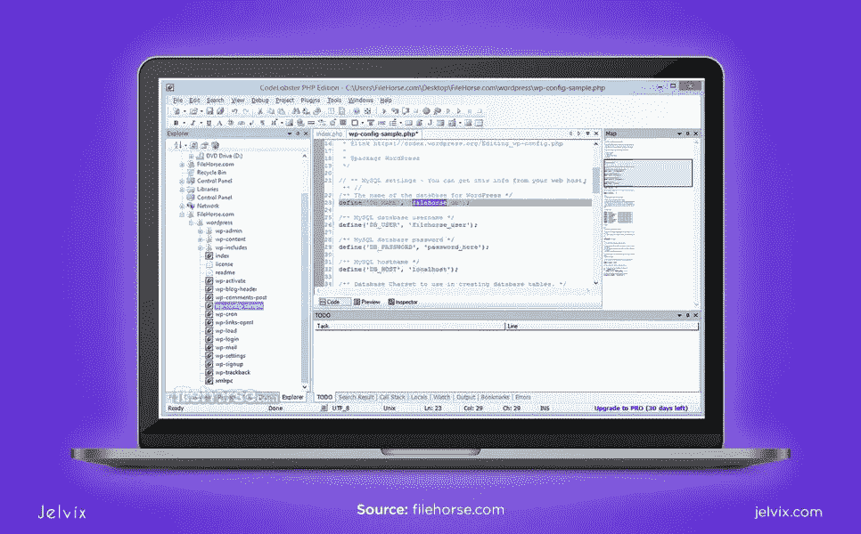

此外， [Codelobster](http://codelobsteride.com/) 支持数十个插件，这些插件允许它支持 Joomla、Drupal、JQuery、WordPress、Yii 等。IDE 有 30 天免费试用版；付费会员分为两类——“精简版”(升级有限)和“专业版”(功能最多的版本，提供所有功能的完全访问)。

该软件提供自动完成和语法检查和突出显示。该软件支持单用户和多用户版本，尽管对于团队支持，成员需要获得付费订阅。

开发环境受 Windows、Mac 和 Linux 支持，有 10 个多语言界面。

# 12.RJ 发短信了。web 开发的首选

这个 JS IDE 被称为通用 web 开发环境，因为它不仅支持 JavaScript，还支持 HTML、CSS、PHP 和 ASP。IDE 提供了平滑的自动完成、Unicode 集成、代码折叠、排序和列界面模式。界面设置允许在多重编辑和多重选择模式之间进行选择，打开批注栏和高级排序。

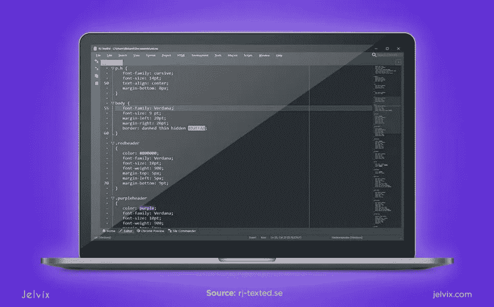

IDE 突出显示了 LESS、SASS 和 CSS 中的语法，并包括一个具有数十种格式的高级颜色编辑器。您也可以探索其他内置工具，大多数开发人员的最爱是代码资源管理器、文件资源管理器和项目管理器。

[RJ TextEd](https://www.rj-texted.se/) 支持二进制和 ASCII 文件，以及 SFTP 和 FTP 同步客户端。这是一个多功能的环境，具有 HTML 修复、验证和格式化，以及丰富的定制选项—在这里，您有一个图表映射、颜色选择器和语法编辑器。

# 13.NetBeans。一个强大的代码监控工具

[NetBeans](https://netbeans.org/) 是一个用于 web、移动和桌面开发的多功能 IDE，支持 HTML、JavaScript、PHP、C 和 C++。这个 IDE 以强大的代码监控和编辑功能而闻名，赢得了市场上最好的 JS 编辑器之一的美誉。NetBeans 支持 Knockout 和 Node.js，是后端开发的首选。

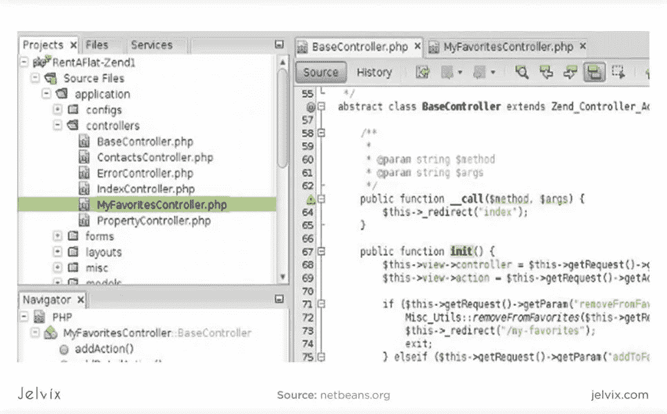

IDE 的主要特性是代码编辑器、调试器、语法亮点和项目管理工具。主要特性是功能管理、用户设置定制、可视化库集成、存储监控和逐步对话支持。

IDE 有多种翻译界面，包括英语、中文、俄语、葡萄牙语和其他语言。

# 14.CodeLite。用于 JS、C、C++和 PHP 的开源 IDE

[CodeLite](https://codelite.org/) 是一个开源的开发环境，支持 JavaScript、PHP、C++和 C，IDE 兼容 Windows、Mac 和 Linux。该环境集成了 GBD、MinGW 和 FreeBSD 等开源编译器。

CodeLite 的功能基于重构和代码完成特性、项目管理附加组件、语法突出显示和源代码浏览。此外，IDE 允许 UnitTest++集成、subversion 和 scope 集成，以及一个源代码编辑器。

开发团队通过 GitHub 库定期更新平台。CodeLite 被翻译成多种语言，并且社区不断添加新版本。

# 15.AWS Cloud9。用于 web 开发的基于云的 JavaScript IDE

AWS Cloud9 是专门为 JavaScript 编写的，但它也支持 Perl、C、C++、PHP、Perl、Python、Ruby 和 Node.js。这种多功能性使它成为迄今为止 JavaScript 应用程序开发的最佳 IDE 之一。

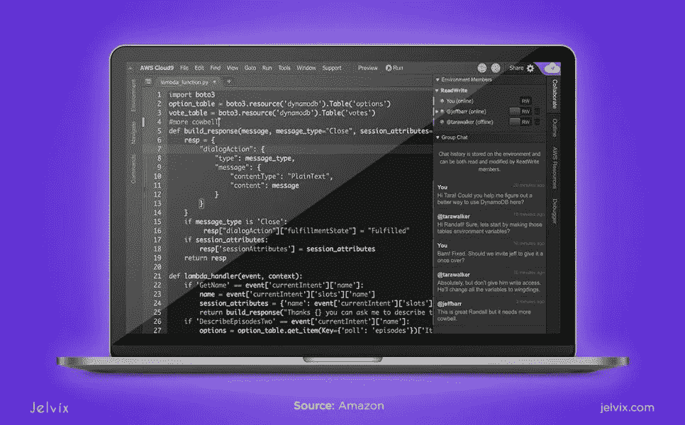

要访问 IDE，开发人员应该有一个 AWS 帐户。每个用户都可以访问 MPM 终端和带有团队版本的同步代码编辑器。该软件支持语法重构，突出，并通过 CSS 林特，JS 美化格式。IDE 还支持 Vim、Emacs 和 Sublime 文本的预设。

此外，该平台与 GitHub、Mercurial 和 BitBucket 以及其他版本控制系统兼容。代码可以直接从平台部署到 Microsoft Azure、Google App Engine、Joyent 和 Heroku。

# JavaScript 开发最好的 IDE 是什么？让我们来了解一下！

为了评估该软件的所有利弊，我们安排了一个方便的信息图表:

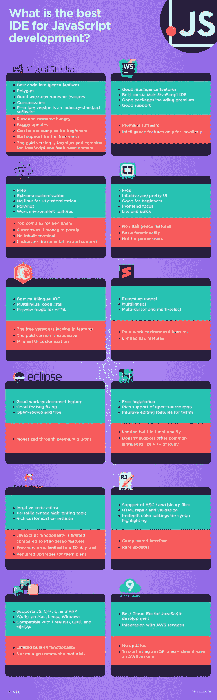

总而言之，Webstorm 是最好的高级 JavaScript 专用工具。Atom 和 Visual Studio 是大型复杂项目的最佳选择。当涉及到 lite 和初学者友好的软件时，括号是最好的选择。此外，Komodo IDE 值得一提，它是一个用户友好的多语言 IDE，具有丰富的功能。

# 哪种 IDE 最适合前端开发？

括号编辑器似乎是一个不错的选择，因为它的预览模式和工作环境。但是对于更高级的应用，像 Visual Studio 和 Atom 这样的工具可以提供更多。

# Web 开发最好的 IDE 是哪个？

一个棘手的问题。像 Webstorm 和 PHPstorm 这样的优质产品在一个简洁的包中提供了巨大的价值。然而，它们是要花钱的，这对于专业的 web 开发公司来说不是问题。

像 Visual Studio Code 和 Atom 这样的产品是免费的，提供了一个几乎无限的定制框架，尽管它们需要时间和技术。括号或崇高的文字可以是个人或更随意使用的正确选择。

# Node JS 用什么工具和 IDE？

许多好的 ide 都有不错的 Node.js 支持。如果你愿意专攻节点开发，你应该考虑投资一个像 Webform 这样的专业工具。然而，如果它看起来不合适，像 VSC 或 Atom 这样强大的免费编辑器应该可以满足你的需求。顺便说一下，如果你对 Node.js 开发感兴趣，我们有一篇关于[最佳 Node.js 框架](https://jelvix.com/blog/best-nodejs-frameworks)的文章。

# HTML 用哪个 IDE 最好？

如上所述，任何 ide 都可以正常工作。还有，还有很多其他的。对于 HTML 编码，我们建议一些免费的和基本的东西，如括号或 Notepad++。如果需要高级特性，可以考虑使用 Atom 和 Visual Studio 代码。

# 结论

一切的速度和质量成为任何企业最重要的部分。如果你能做些什么来提高项目的时间和效率，你应该去做。ide 是 2020 年让你的开发过程受益的完美解决方案。您可以在几分钟内收到解决方案，更好地满足您的客户。

大多数 ide 都允许在线编辑和跟踪。这可以确保您有更好的响应时间或更短的时间投入生产。所以，你更快，更好，同时降低开发成本。你需要做的就是决定哪一个是适合你的 ide。

*最初发表于*[*【https://jelvix.com】*](https://jelvix.com/blog/best-javascript-ides)*。*

# **用简单英语写的便条**

你知道我们有四份出版物和一个 YouTube 频道吗？你可以在我们的主页[**plain English . io**](https://plainenglish.io/)找到所有这些内容——关注我们的出版物并 [**订阅我们的 YouTube 频道**](https://www.youtube.com/channel/UCtipWUghju290NWcn8jhyAw) **来表达你的爱吧！**