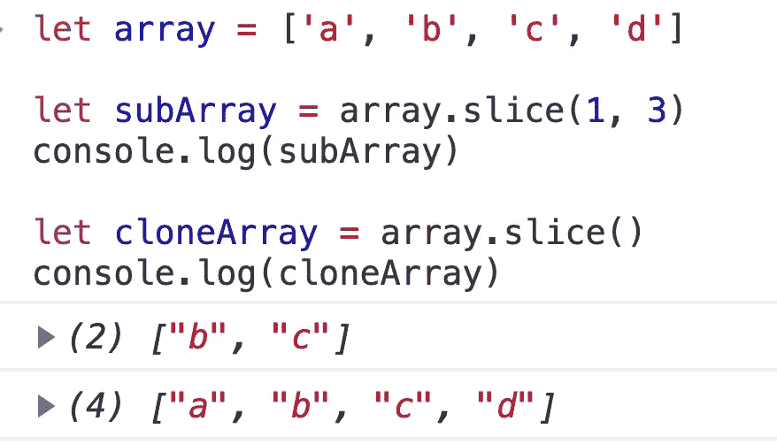

# JavaScript 初学者的 16 个数组技巧

> 原文：<https://javascript.plainenglish.io/16-array-tips-for-javascript-beginners-138fe703d8d0?source=collection_archive---------3----------------------->

## 每个初学者都应该知道的关于在 JavaScript 中操作数组的完整指南。


Photo by [Markus Spiske](https://unsplash.com/@markusspiske?utm_source=medium&utm_medium=referral) on [Unsplash](https://unsplash.com?utm_source=medium&utm_medium=referral)

数组是程序中最常见的数据结构之一。在 JavaScript 中，有许多操作数组的方法，所有 JavaScript 程序员都应该熟悉这些方法。

对于任何类型的数据结构，最常见的操作是遍历集合、查询元素、修改元素、添加和删除元素。数组也不例外，所以我就着重从这些操作来介绍数组的技巧。

# 循环数组

遍历数组是最常见的需求之一，那么您知道有多少种方法可以遍历数组吗？

## 对于索引

首先，数组是索引的数据结构，所以我们可以通过索引来迭代数组。

```
let array = ['a', 'b', 'c', 'd']for(let i = 0; i < array.length; i++) {
  console.log(array[i])
}
```


## 对于...来说

在 JavaScript 中，数组是一种带有迭代器接口的数据结构。对于这样的数据结构，我们可以遍历`for … of`。如果我们不需要数组的索引，这是迭代数组的最好方法。

```
let array = ['a', 'b', 'c', 'd']for(let element of array) {
  console.log(element)
}
```


## 因为在

如果我们想遍历一个普通的对象，我们可以使用`for in`语法来获取对象的键和值。

```
let obj = {key1: 'value1', key2: 'value2'}
for(let key in obj){
  console.log(key, obj[key])
}
```


在 JavaScript 中，所有的数组都是对象，所以我们也可以把它应用到数组中。在这种情况下，索引是对象的关键。

```
let array = ['a', 'b', 'c', 'd']for(let index in array) {
  console.log(index, array[index])
}
```


## 为每一个

如你所知，JavaScript 是一种函数式编程语言，所以它提供了一个专门用于遍历数组的高阶函数:`Array#forEach`。

`forEach()`为每个数组元素执行一次提供的函数。

```
let array = ['a', 'b', 'c', 'd']array.forEach((element, index) => {
  console.log(element, index)
})
```


# 询问

## 检查数组是否包含值

最基本也是最常见的方法是遍历数组，看看是否有符合条件的元素。

```
function contains(array, value){
  for(let item of array){
    if(item === value) {
      console.log(`the array contains ${value}`)
      return true
    }
  }
  console.log(`the array does not contain ${value}`)
  return false
}
```


但是在现实应用中，我们通常会直接使用 JavaSript 提供的一些内置函数来快速完成这个任务。

内置的`*Array#includes*`方法是查询数组是否包含指定元素的最便捷方式。

`includes()`方法确定数组的条目中是否包含某个值，根据情况返回`true`或`false`。

```
let array = ['a', 'b', 'c', 'd']console.log(array.includes('a'))
console.log(array.includes('e'))
```


此外，您可以使用`*Array#indexOf*`来查询数组是否包含指定的元素。

`indexOf()`方法返回给定元素在数组中可以找到的第一个索引，**或者-1，如果它不存在**。

```
let array = ['a', 'b', 'c', 'd']console.log(array.indexOf('c'))
console.log(array.indexOf('e'))
```


# 增加

## 在数组的开头或结尾添加元素

有 4 个内置的方法来添加/删除一个元素到一个数组的开头/结尾。

*   `unshift` / `push` -在数组的开头/结尾添加一个元素
*   `shift` / `pop` -移除并返回数组的第一个/最后一个元素


我们可以使用数组展开`...`来添加元素。


## 扩展现有阵列

`concat()`方法用于合并两个或多个数组。此方法不会更改现有数组，而是返回一个新数组。


我们可以使用数组展开`...`来合并数组。


# 去除

## 从数组中移除具有特定值的元素

当我们需要删除元素时，最常用的方法是`*Array#splice*`。

`splice()`方法通过移除或替换现有元素和/或在适当的位置添加新元素[来改变数组的内容。](https://en.wikipedia.org/wiki/In-place_algorithm)

```
let arrDeletedItems = array.splice(start[, deleteCount])
```

它可以接受两个参数:

*   start:开始更改数组的索引。
*   deleteCount:一个整数，指示要从`start`中移除的数组元素的数量。

这里有两个例子:

```
let array = ['a', 'b', 'c', 'd']array.splice(1, 2)console.log(array)
```


remove two elements from a[1]

```
let array = ['a', 'b', 'c', 'd']array.splice(2, 1)console.log(array)
```


remove an element from a[2]

现在回到我们的任务:从数组中移除一个有特定值的元素。

为此，我们需要两步:

*   查找元素的索引
*   移除它

```
function removeElement(array, value){
  let index = array.indexOf(value)
  if(index > -1){
    array.splice(index, 1)
  }
}
```


## 移除具有特定值的所有元素

但是上面的函数有一个缺点，就是在一个数组中，可能有不止一个元素的值等于给定值。


如果我们想从一个数组中删除所有具有特定值的元素，我们需要遍历它。

```
function removeAllElements(array, value){
  while(array.indexOf(value) > -1) {
    array.splice(array.indexOf(value), 1)
  }
}
```


但是，如果你知道一个名为`*Array#filter*`的内置函数，你可以更容易地做到这一点。

`filter()`方法**创建一个新的数组**，其中所有通过测试的元素都由提供的函数实现。

```
function removeAllElements(array, value){
  return array.filter(element => {
    return element === value ? false : true
  })
}
```


# 修改

## 删除重复值

我们知道集合是一个没有重复元素的数据结构，所以我们先把数组转换成集合，然后把集合还原成数组，得到一个没有重复元素的数组。

```
let unique = [...new Set(array)];
```


除此之外，很明显，去除重复元素本质上是从一个数组中去除满足一定标准的元素子集，这非常接近于`*Array#filter*`的定义。所以我们可以使用`*Array#filter*`来删除重复的元素。

```
function removeDuplicate(array){
  return array.filter((element, index, self) => {
    // if self.indexOf(element) does not equal to `index`,
    // means there is a repeating element before it
    return self.indexOf(element) === index
  })
}
```


## 展平数组的数组

假设我们有这样一个数组:

```
[2, 2, 5, [5, [5, [6]], 7]];
```

我们想把它转换成这样一个数组:

```
[2, 2, 5, 5, 5, 6, 7];
```

怎么才能做到呢？

JavaScript 在 ECMAScript2019 之后提供了内置的平面函数。

`flat()`方法创建一个新数组，所有子数组元素递归地连接到该数组中，直到指定的深度。

```
var newArray = arr.flat(*[depth]*);
```

深度级别，指定嵌套数组结构应展平的深度。默认为 1。


ECMAScript2019 之前，我们可以自己写平面函数。

```
const flatten = function(arr, result = []) {
  for (let i = 0, length = arr.length; i < length; i++) {
    const value = arr[i];
    if (Array.isArray(value)) {
      flatten(value, result);
    } else {
      result.push(value);
    }
  }
  return result;
};
```

## 对数组排序

对数组排序是最常见的算法。本文不是关于算法的教程，所以我们将直接讨论内置排序函数的使用。

`sort()`方法对数组 [*中的元素进行排序，并返回排序后的数组。默认的排序顺序是升序。*](https://en.wikipedia.org/wiki/In-place_algorithm)

```
arr.sort([compareFunction])
```


ascending


**descending**

除了上面的循环、查询、添加、删除和修改，还有几个技巧你也应该学会。

## 检查变量是否是数组

首先，所有数组都是`Array`的实例。如果一个变量是一个数组，那么这个变量也必须是`Array`的一个实例，所以我们可以使用 instanceof 关键字。

```
obj instanceof Array
```


此外，JavaScript 提供了一个内置方法`Array.isArray()`，它可以快速帮助我们检测变量是否是数组。

```
Array.isArray([1, 2, 3]);  // true
Array.isArray({foo: 123}); // false
Array.isArray('foobar');   // false
Array.isArray(undefined);  // false
```


还有一种特殊的技巧，就是当`Object.prototype.toString.call(obj)`调用数组对象时，它会返回`[object Array]`。我们可以通过这个特征来检查一个对象是否是一个数组。

```
function isArray(obj){
  return Object.prototype.toString.call(obj) === '[object Array]'
}
```


如果你想了解更多关于这个技巧的知识，你可以看看我的另一篇文章。

[](https://levelup.gitconnected.com/5-javascript-tips-i-learned-from-vue-source-code-6095df4e9bc1) [## 我从 Vue 源代码中学到的 5 个 JavaScript 技巧

### 从流行的 JS 框架的源代码中学习 JavaScript。

levelup.gitconnected.com](https://levelup.gitconnected.com/5-javascript-tips-i-learned-from-vue-source-code-6095df4e9bc1) 

## 复制数组

如果我们想得到一个数组的副本，有多少种方法可以写出来？

首先，我们可以创建一个新数组，然后迭代旧数组，将旧数组中的每个值依次复制到新数组中。

这种方法非常简单，但是编写起来可能很繁琐，您可以在 JavaScript 中使用一些更简洁的方法。

基本上，`[slice()](https://developer.mozilla.org/en-US/docs/Web/JavaScript/Reference/Global_Objects/Array/slice)`操作克隆数组并返回对新数组的引用。

`slice()`方法将数组的一部分的浅层副本返回到从`start`到`end`(不包括`end`)中选择的新数组对象中，其中`start`和`end`表示该数组中项目的索引。原始数组不会被修改。

```
let newArray = oldArray.slice();
```



和`*Array#slice*`一样，`*Array#conca*` t 也可以帮助我们复制数组。

`**concat()**`方法用于合并两个或多个数组。此方法不会更改现有数组，而是返回一个新数组。

我们可以使用一个空数组来连接旧数组，并获得旧数组的副本。

```
let newArray = [].concat(oldArray);
```


我们可以使用数组展开来复制数组。

```
let newArray = [...oldArray];
```


不过需要注意的是，以上方法都是浅层克隆，如果想了解更多关于深层克隆的知识，可以参考我的另一篇文章。

[](https://medium.com/javascript-in-plain-english/write-a-better-deep-clone-function-in-javascript-d0e798e5f550) [## 用 JavaScript 写一个更好的深度克隆函数

### 你的面试官问你这个问题，其实是想考察你的后续知识。

medium.com](https://medium.com/javascript-in-plain-english/write-a-better-deep-clone-function-in-javascript-d0e798e5f550) 

## 生成整数序列

很多时候我们希望生成这样的数组:

```
[1, 2, 3, 4, 5 ...][4, 5, 6...][2, 4, 6, 8 ...]
```

如果你使用 Python 或 PHP，它们提供了一个名为`range()`的内置函数来快速完成这项工作。但是 JavaScript 里没有所谓的捷径，我们必须自己去做。

我们知道数组的索引是一个自然数序列。我们可以创建一个数组，当我们得到这个数组的索引时，我们得到一个整数序列。


我们希望数组以其他数字开始，所以我们可以创建一个从 0 开始的序列，并用`map`函数修改它。


同样，我们可以创建一个偶数序列。


## 比较两个数组

给定两个集合，我们经常需要得到它们的交集、并集等等。数组也不例外。

首先，让我们看看如何获得两个数组的交集。

```
function intersection(array1, array2){
  return arr1.filter(x => arr2.includes(x));
}
```


对于`[1,2,3]`和`[2,3,4]`，它将产生`[2,3]`。


我们可以得到两个数组的差。

```
let difference = arr1.filter(x => !arr2.includes(x));
```


对于`[1,2,3] [2,3]`，它将产生`[1]`。


最后，让我们来看看合并两个数组的简单要求。

```
let newArray = [...array1, ...array2]
```

