# 17 个有用的 Visual Studio 代码快捷方式来提高您的编码速度

> 原文：<https://javascript.plainenglish.io/17-useful-visual-studio-code-shortcuts-to-boost-your-coding-speed-68e46705d542?source=collection_archive---------0----------------------->

## 这是世界上最好的代码编辑器中最酷的特性

Photo by [Juan Gomez](https://unsplash.com/@nosoylasonia?utm_source=medium&utm_medium=referral) on [Unsplash](https://unsplash.com?utm_source=medium&utm_medium=referral)

我所有的 JavaScript 项目都使用 VS 代码。这是我用过的最好的编辑器。事实上，它接管了 JavaScript 社区，[获得了 50.7%的市场份额](https://en.wikipedia.org/wiki/Visual_Studio_Code)，这使它成为世界上排名第一的编辑器。

VS 代码令人惊奇的一点是它提供了许多快捷方式，可以提高你的编码速度。

以下是我最常用的快捷方式。让我们开始吧。

*(* ***注意*** *:所有快捷键都是 macOS 的。由于我不使用 Windows，我不知道他们在那个操作系统上的确切对应，但我想这可能只是一个* ***命令*** *(Mac)和****Ctrl****(Windows)之间的替换。)*

# 1.重命名符号

这是重命名符号的最快方法，无需搜索文件和手动编辑。

使用这个功能的快捷键 **F2** 在 MacOS(或者只是我的机器)上不起作用，所以我们必须使用上下文菜单。要重命名符号，只需右键单击该符号→选择重命名符号→输入所需的名称，然后按回车键。

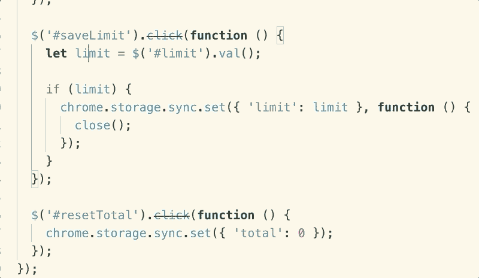

# 2.拆分编辑器

仅仅为了同时查看文件而购买额外的屏幕可能会很昂贵。最便宜的选择是使用 VS 代码的拆分编辑器特性。

此功能的快捷键: **Command + \** 。

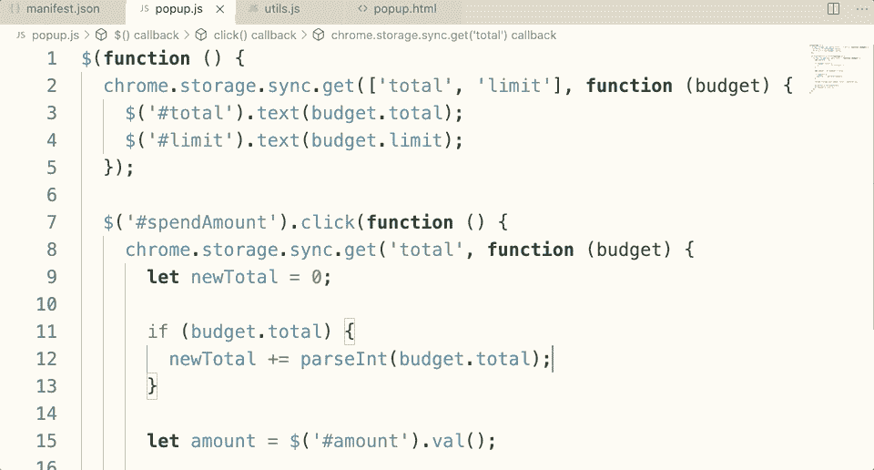

# 3.导航到一个符号

当您需要导航到文件中的函数/变量时，使用 **Command + Shift + o** ，然后键入您需要查找的函数/变量。

如果您想将搜索范围扩展到整个工作区，而不是单个文件，请使用**命令+ t** 。这里不同的是，它会自动在搜索词的开头加上“ **#** ”，而不是“ **@** ”。

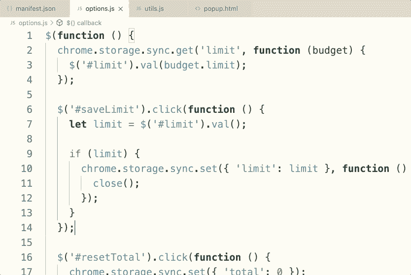

# 4.更改编辑器布局

默认情况下，您在单个代码编辑器上工作。但是，为了更加方便，您可以根据需要更改编辑器布局。这样你就可以拥有多个编辑器，就像使用拆分编辑器功能一样。只是这次更灵活。您可以将编辑器排列为列或网格。

要更改编辑器布局，请选择菜单视图→编辑器布局→选择所需的布局。

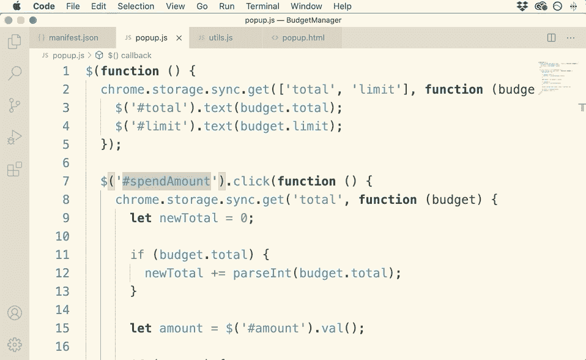

# 5.添加多个光标

我喜欢这个功能，因为它节省了我很多时间，同时看到东西被编辑也很令人满意。

有两种方法可以使用该功能。

第一种是按下**命令+ Option +上箭头/下箭头**。

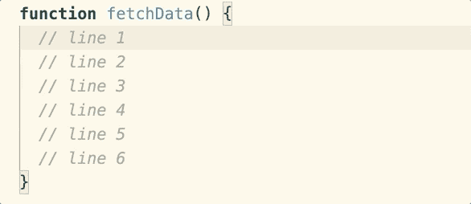

第二个是在按下**选项**的同时，你需要点击你想要添加光标的地方。

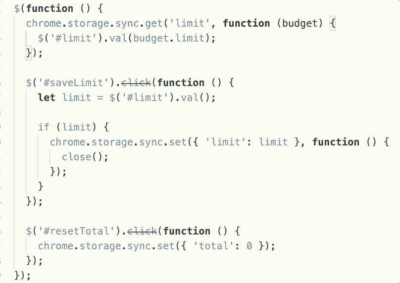

# 6.折叠代码

当你在处理一个大文件时，如果你想专注于一个特定的部分，你需要折叠其他的部分。这里你需要的快捷键是 **Command + Option + [** 。并展开:**Command+Option+】**。

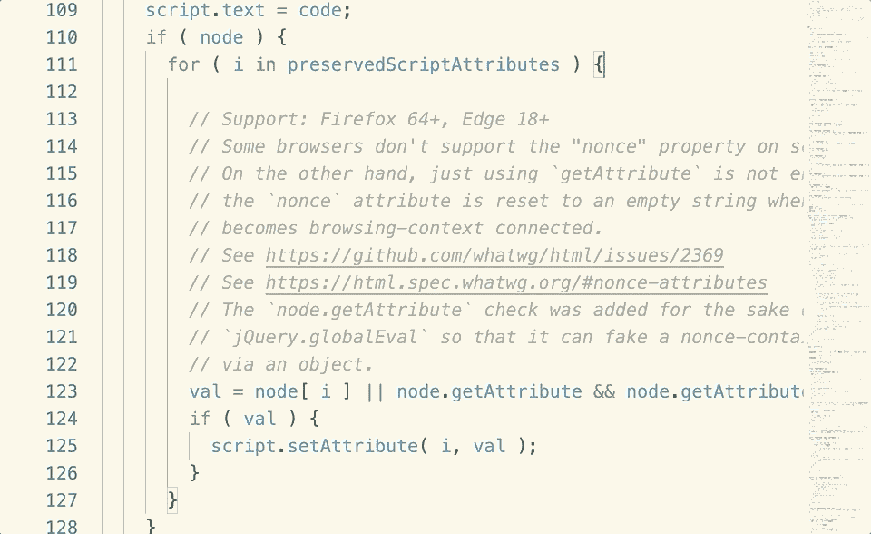

# 7.切换侧边栏

如果你和我一样，13 英寸的 Macbook 有时没有足够的空间给你。您可以使用**命令+ b** 来关闭/打开侧边栏以获得更多空间。

# 8.格式代码

这个帮你调整代码缩进: **Shift + Option + F** 。一旦完成，你的代码会更漂亮。

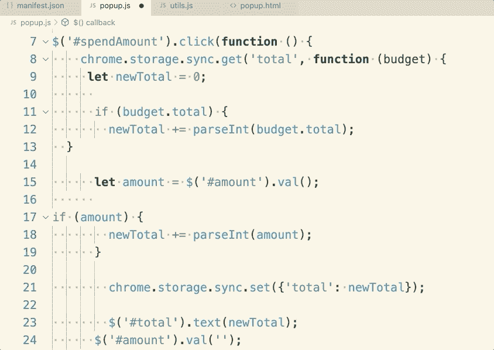

# 9.保存时自动修剪尾随空格

谈到源代码文件的大小，每个字节都很重要。虽然空白会占用空间，但您应该删除它以加快加载速度。

下面的设置将有助于您做到这一点:

1.打开 Visual Studio 代码用户设置(首选项→设置→用户设置选项卡)。

2.点击窗口右上方的*文档图标*，将打开一个 settings.json 文件。

3.如果您还没有看到文件，请添加一个新设置***" files . trimtrailinghhitespace ":true***。

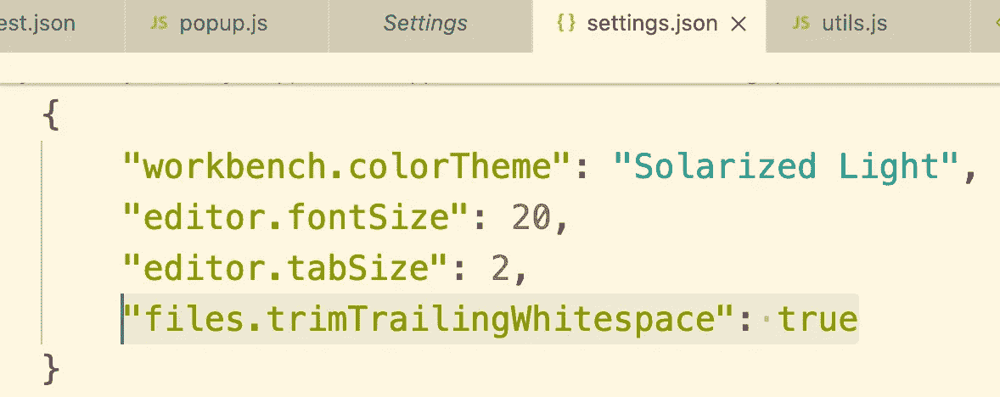

4.保存。

完成了。现在，每当你保存一个文件，结束空格将被自动删除。

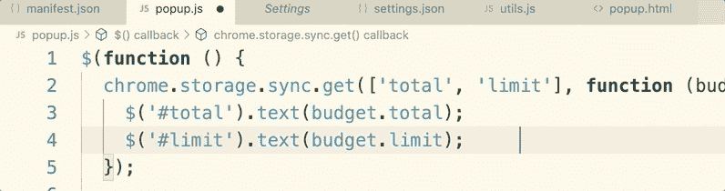

# 10.加入线条

当您想要将多行合并成一行时，请使用此快捷方式。只需选择所有需要的线，然后按下 **Control + J** 。

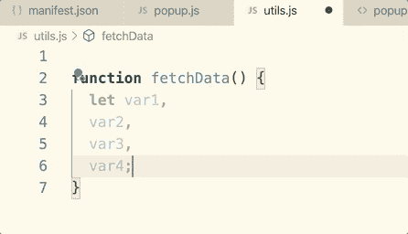

# 11.跳到特定行

有时候你知道你需要的在某一行，你想直接跳到那一行，而不需要上下滚动。你只需要按下 **Control + g** ，然后输入行号。

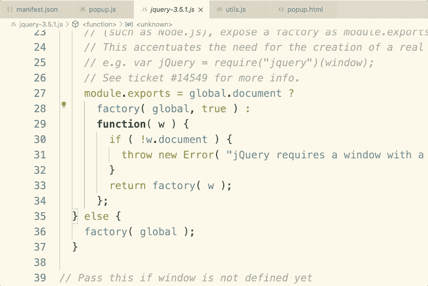

# 12.选择和编辑单词

如果你有用鼠标选择和编辑单词的习惯，你应该改变它，因为使用键盘会更好地提高你的速度。尤其是当您想要在一个文件的多个位置选择然后编辑单词时。这里的快捷键是 **Command + d** 。

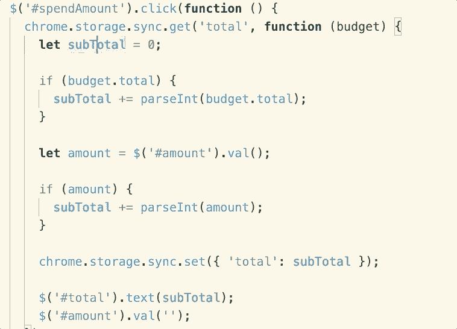

# 13.用词选择

通过使用 **Option + Shift +左箭头/右箭头**，您可以更快地选择一行中的单词，而无需使用鼠标。

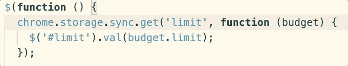

# 14.移动一行

要快速上下移动一行，请按**选项+上箭头/下箭头**。

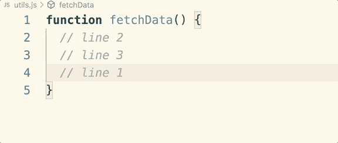

# 15.删除一行

将光标移动到一行的末尾，然后按 **Command + delete** ，该行将消失。

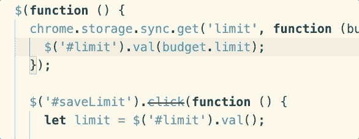

# 16.重新打开关闭的选项卡

如果您误关闭了一个标签页，您可以使用**命令+ Shift + t** 立即重新打开它，而无需搜索文件。

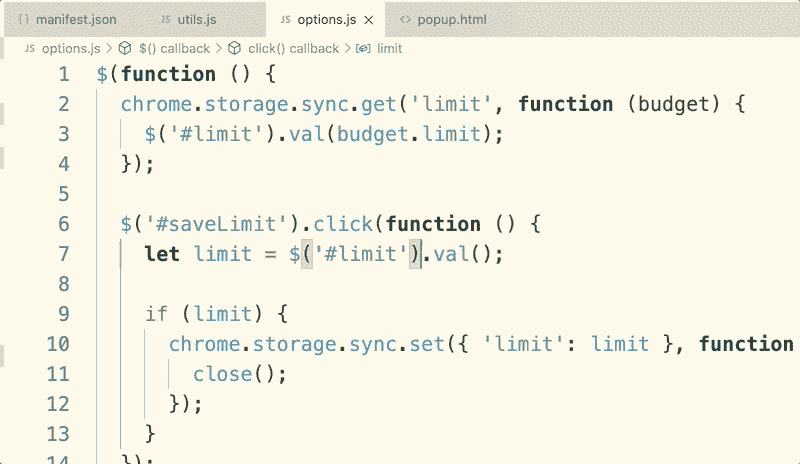

# 17.命令选项板

我最常使用这条捷径。当你按下 **Command + p** 时，会出现一个文本框，你可以用它做很多很酷的事情。

我最常用的功能是查找并打开一个文件。只需在文本框中输入文件名，然后输入。

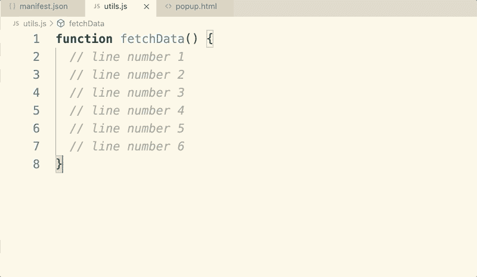

如果你想找到一个符号，输入' **#** '或'**@【T3]'，然后输入你想找到的符号的名字，我上面提到过使用快捷键 **Command + Shift + o** 和 **Command + t** 。**

虽然有许多其他方式使用命令面板，但最酷的方式是它可以显示当前上下文中所有可用的命令，这将在某种程度上涵盖我上面提到的所有快捷方式。

只要输入' **>** '你就会明白我的意思了:

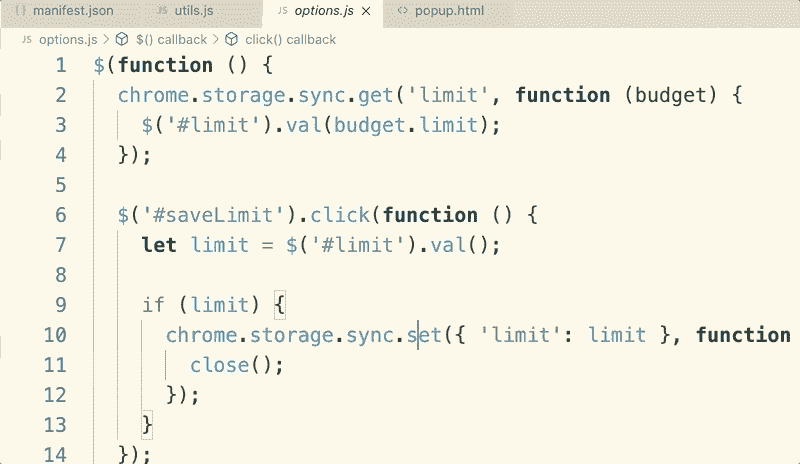

# 结论

想象一下，你能记住 VS 代码的所有快捷键，这看起来就像你在视频游戏中控制角色的速度，在键盘上舞动你的手指，而不用触摸鼠标。很酷吧。？

为了速度，我很少使用鼠标，这都要归功于 VS 代码快捷方式。

喜欢这篇文章吗？如果有，通过 [**订阅解码，我们的 YouTube 频道**](https://www.youtube.com/channel/UCtipWUghju290NWcn8jhyAw) **获取更多类似内容！**

我错过了什么有用的捷径吗？请在下面的评论中告诉我。

## 进一步阅读

 [## Visual Studio 代码的 9 大 JavaScript 扩展加速您的开发

### 谁想更快更容易地编码？

medium.com](https://medium.com/javascript-in-plain-english/9-great-javascript-extensions-for-visual-studio-code-to-speed-up-your-development-8b3275248718)