# 初级 JavaScript 开发人员的 18 个技巧和窍门

> 原文：<https://javascript.plainenglish.io/18-tips-tricks-for-a-junior-javascript-developer-ae4af698a596?source=collection_archive---------2----------------------->

## 1.转换为字符串

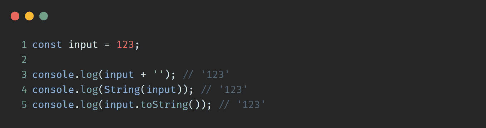

## 2.转换为数字

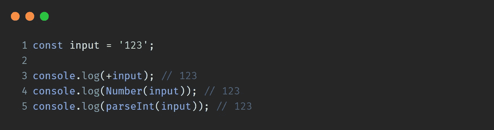

## 3.转换为布尔值

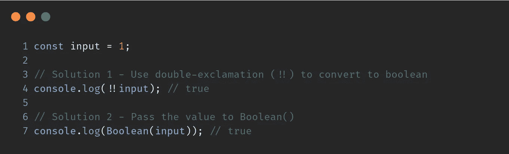

## 4.字符串“false”有问题

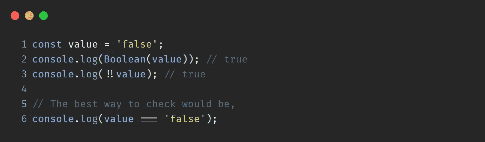

## 5.空与未定义

`null`是值，而`undefined`不是。`null`如同一个空的**盒子**，`undefined`根本就不是盒子。前任。,

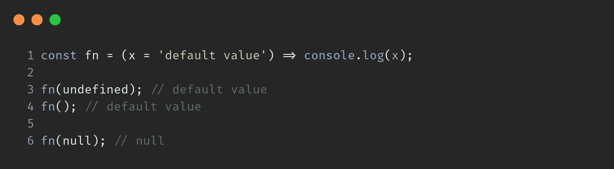

当`null`通过时，不取默认值，而当`undefined`或没有通过时，取默认值。

## 6.真实和虚假的价值观

**Falsy 值** — `false`、`0`、`""`(空字符串)、`null`、`undefined`、&、`NaN`。

**真值** — `"false"`、`"0"`、`{}`(空物)、&、`[]`(空阵)

## 7.`const`可以做哪些修改

`const`数值不变时使用。例如，

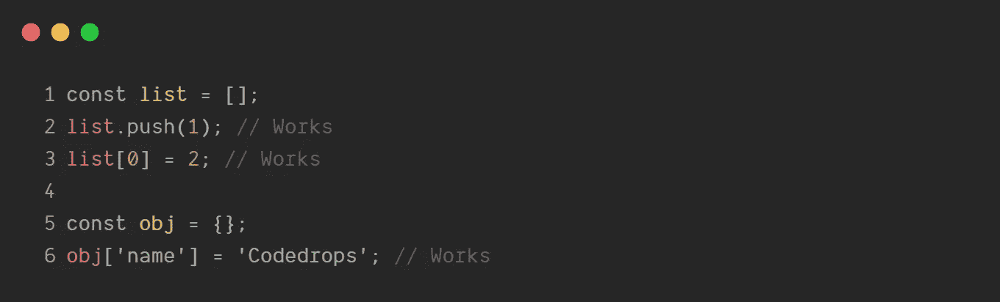

但是它可以用来更新先前分配的数组/对象中的值**引用**

## 8.双等和三等的区别

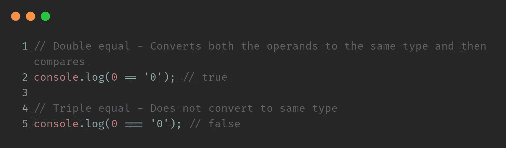

## 9.接受论点的更好方法

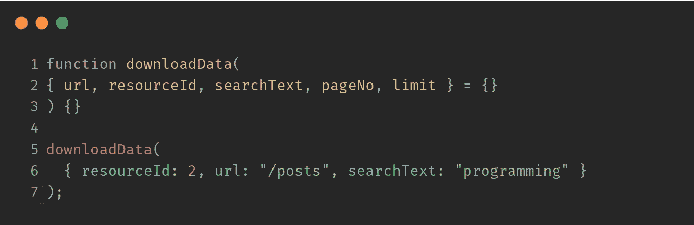

更简单的方法是-

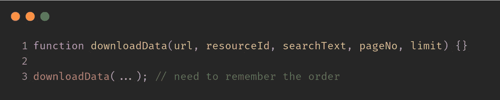

## 10.将标准函数重写为箭头函数

可以重写为

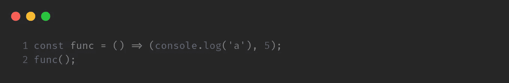

## 11.从 arrow 函数返回一个对象/表达式

## 12.将集合转换为数组

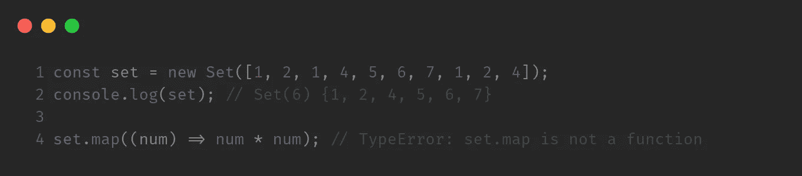

要转换为数组，

## 13.检查值是否为数组

## 14.对象键按插入顺序存储

`Objects`保持键的创建顺序。

## 15.无效合并算子

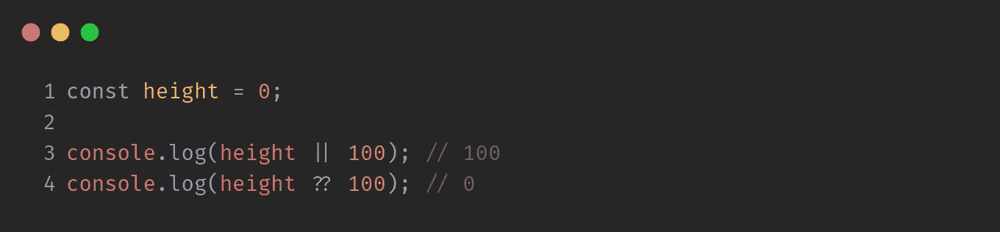

`Nullish coalescing operator`(？？)仅当左侧值为`undefined`或`null`时返回右侧值

## 16.什么是 JS 中的 map()

这是一个实用函数，有助于**在数组的每个元素上应用一个函数**。它返回一个**新的**数组，该数组包含应用函数返回的值。前任。,

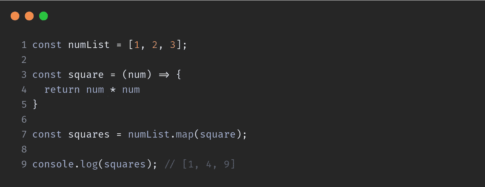

这里，函数`square`应用于每个元素。即 1、2、3。

该函数的返回值作为新元素值返回。

## 17.尝试..捕捉..最后—真实示例

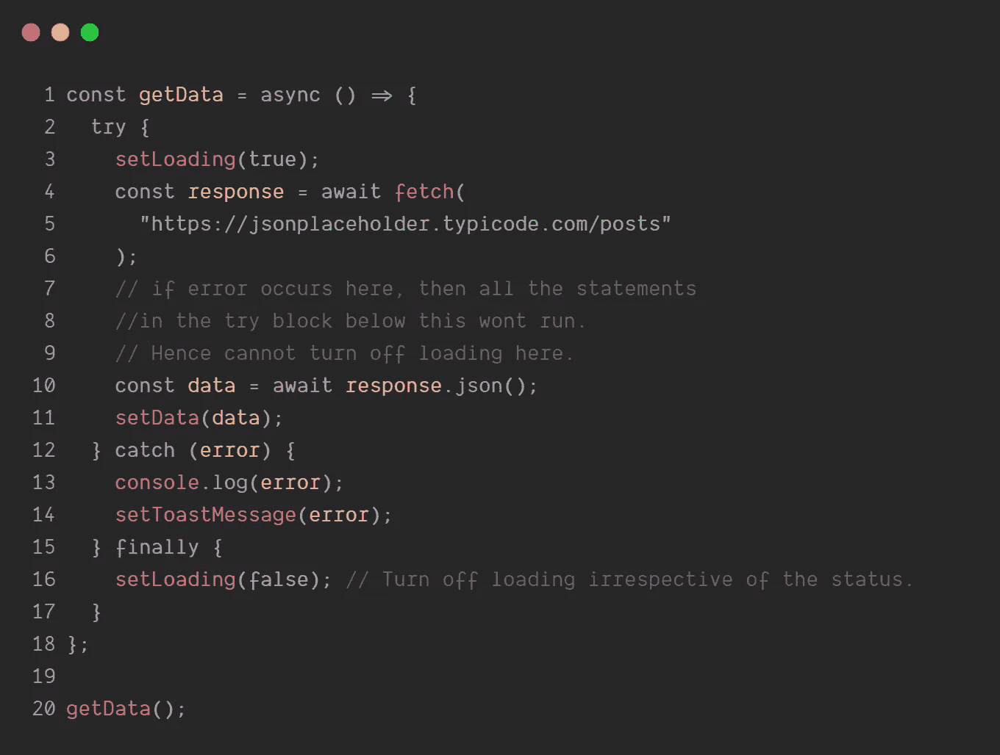

## 18.破坏

从数组/对象中提取值

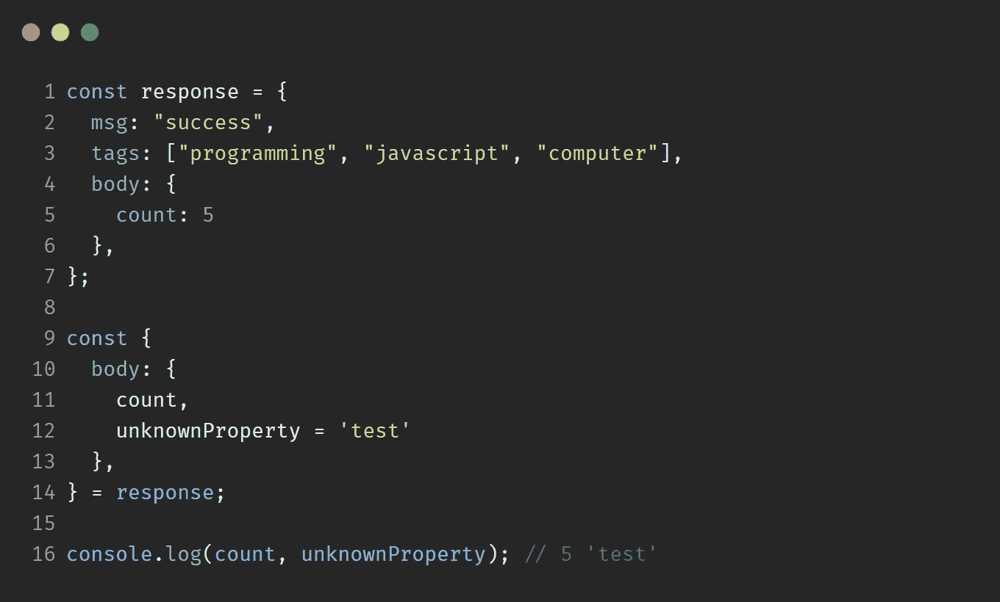

**感谢阅读**💙

更多信息请关注 **@codedrops.tech**

[Instagram](https://www.instagram.com/codedrops.tech/) ● [推特](https://twitter.com/codedrops_tech) ● [脸书](https://www.facebook.com/codedrops.tech/) ● [Linkedin](https://www.linkedin.com/company/codedrops-tech/)

[**codedrops.tech**](https://www.codedrops.tech/)

 [## 10 个 JavaScript 面试问题

### 10 个 JavaScript 有趣的问题，输出和解释。

medium.com](https://medium.com/javascript-in-plain-english/10-javascript-interview-question-c050a357161c)  [## 10 个 JavaScript 数组/对象技巧

### JavaScript 对象和数组的技巧和提示

medium.com](https://medium.com/javascript-in-plain-english/10-tricks-on-arrays-and-objects-a67e286bfe80)  [## 文件操作- Visual Studio 市场

### 轻松标记/别名文件和快速切换文件。1.文件标签-标签/别名/书签文件 2。快速切换-快速…

marketplace.visualstudio.com](https://marketplace.visualstudio.com/items?itemName=mehullakhanpal.file-ops)