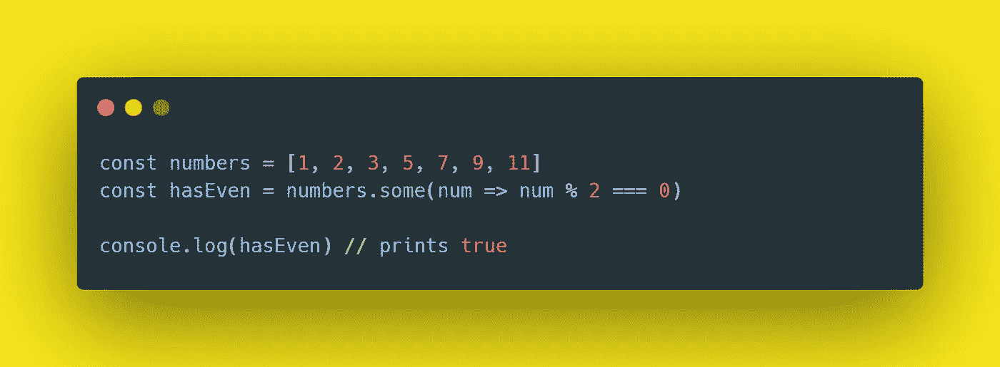
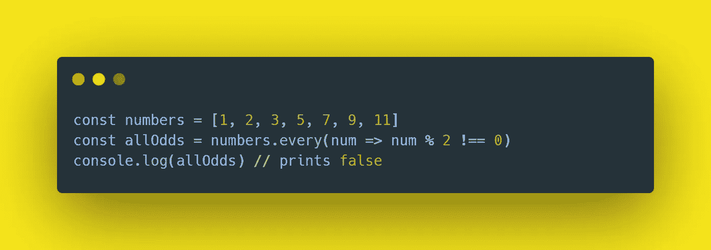

# 提高 JavaScript 水平的两种有效方法

> 原文：<https://javascript.plainenglish.io/2-powerful-ways-to-level-up-your-javascript-conditions-47c9b07ba3a4?source=collection_archive---------5----------------------->

当 some()和 every()方法转动表格时

Illustration by [Alexey Loparev](https://www.artstation.com/loparev) from [Icons8](https://icons8.com/)

> “如果你像我一样，那么你可能喜欢了解事情。你喜欢理解并知道如何利用你正在使用的工具的细微差别”。

还有什么比 JavaScript 环境更适合呢？它们对你来说似乎很容易，但是**你可能想测试很多不同的东西**。

*   [这个对象是否包含这个属性](https://stackoverflow.com/questions/135448/how-do-i-check-if-an-object-has-a-specific-property-in-javascript)？
*   [这个数组是否包含这个元素](https://medium.com/javascript-in-plain-english/how-to-easily-shorten-long-lists-of-or-operators-in-your-code-f095b9c06a28)？
*   [该值是否符合特定标准](https://medium.com/javascript-in-plain-english/how-to-easily-shorten-long-lists-of-or-operators-in-your-code-f095b9c06a28)？

有两个有趣的案例你应该会感兴趣。**它们是关于数组和针对数组运行的特定条件**。

*   这个数组是否包含*至少*一个匹配这个谓词的元素？
*   这个数组的所有元素都匹配这个谓词吗？

这些问题的答案分别存在于`array.some()`和`array.every()`方法中。

## array.some()

> array.some()测试数组中是否至少有一个元素通过了提供的条件。返回一个 boolean 值，表示该检查的结果。

假设你有一个包含一串`numbers`的数组。而且你要检查*是否至少有*其中一个是偶数。您可以像这样使用这种方法:

你在这里做的是:

*   调用`numbers`数组上的`some`方法
*   将一个函数传递给包含测试数组中每个元素的条件的`some`方法。
*   这里有一个正数:2，所以包含在`hasEven`中的最终结果将是`true`

## array.every()

> array.every()测试数组中包含的所有元素是否都通过了提供的条件。返回指示检查结果的布尔值。

类似于我们上面所做的，假设你现在想检查一个数组`numbers`中的*元素是否都是奇数。使用与上面相同的数组，结果将是这样的:*

你在这里做的是:

*   在`numbers`数组上调用`every` 方法
*   将包含条件的函数传递给`every` 方法，以测试数组中的每个元素。
*   这里没有所有的正数，所以包含在`allOdds`中的最终结果将是假的

## 关键要点

*   编写条件很难，因为您可能想要检查的内容有很多变体
*   如果你想检查一个数组是否包含符合给定条件的至少一个元素的*，你应该使用`some`。*
*   如果你想检查一个数组是否包含符合给定条件的所有元素，你应该使用`every`

今天到此为止。一如既往，感谢你花时间阅读这篇文章，并保持下面的评论。

— *皮耶罗*

## 资源

*   [检查对象是否包含属性](https://stackoverflow.com/questions/135448/how-do-i-check-if-an-object-has-a-specific-property-in-javascript)
*   [检查数组是否包含特定元素](https://medium.com/javascript-in-plain-english/how-to-easily-shorten-long-lists-of-or-operators-in-your-code-f095b9c06a28)
*   [缩短 JavaScript 中的长条件](https://medium.com/javascript-in-plain-english/how-to-easily-shorten-long-lists-of-or-operators-in-your-code-f095b9c06a28)