# 20 个即使不是程序员也能看懂的编程笑话

> 原文：<https://javascript.plainenglish.io/20-programming-jokes-you-can-understand-even-if-you-are-not-a-programmer-14da6bf860e?source=collection_archive---------0----------------------->

## 给我们所有人来点小喜剧。

Credit: gif-vif.com

需要一个程序员同事去理解另一个程序员的艰辛。但这并不意味着，他们的笑话也是如此。

# **1。让你流泪的书**

评论:815
股份:6.3k
反应:31k

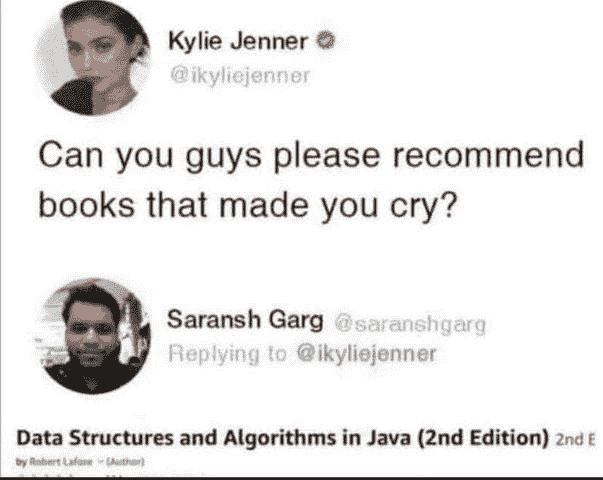

Image Credit: [Facebook](https://www.facebook.com/ProgrammersCreateLife/photos/3091179697597554)

# 2.程序员是安全的

评论:221
股份:1.75k
反应:11k

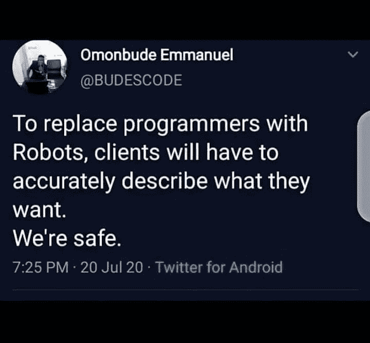

Credit: [Facebook](https://www.facebook.com/ProgrammersCreateLife/photos/3513764435339076)

# 3.猜猜这个地方

评论:14
股份:81
反应:1k

Credit: [Facebook](https://www.facebook.com/ProgrammersCreateLife/photos/3511773632204823)

# 4.不是一个错误，而是一个“特性”

评论:74
股份:5k
反应:1.2k

Credit: [Facebook](https://www.facebook.com/ProgrammersCreateLife/photos/3491173454264841)

# 5.“CSS”中的颜色

评论:488
股份:1.2
反应:13k

Credit: [Facebook](https://www.facebook.com/ProgrammersCreateLife/photos/3472264296155757)

# 6.2020 年是错误的一年

评论:435
股份:3.5k
反应:9k

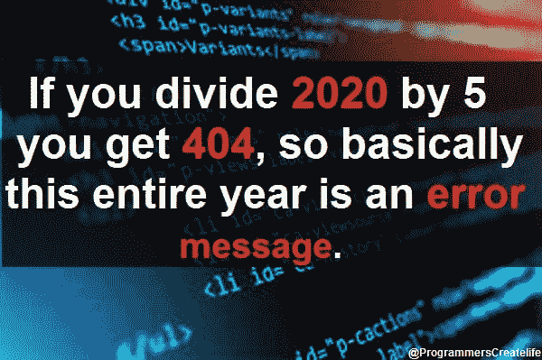

Credit: [Facebook](https://www.facebook.com/ProgrammersCreateLife/photos/3391544217561099)

# 7.调试愉快

评论:124
股份:272
反应:2.1k

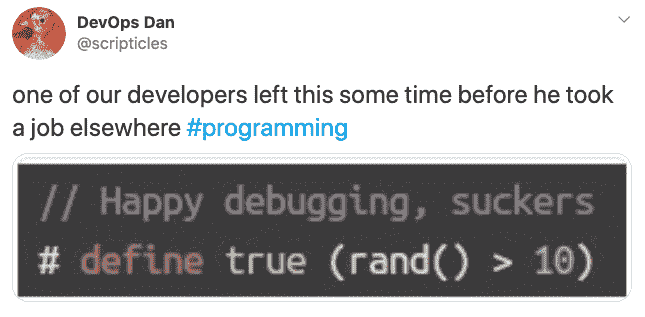

Credit: [Facebook](https://www.facebook.com/ProgrammersCreateLife/photos/3368233719892149)

# 8.IT 人如何看待彼此

评论:316
股份:2.8k
反应:12k

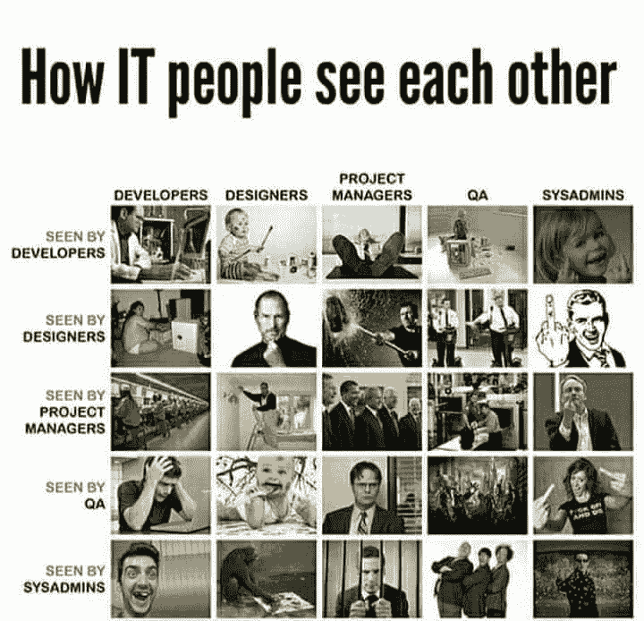

Credit: [Facebook](https://www.facebook.com/ProgrammersCreateLife/photos/3355993314449523)

# 9.既不是 SQL 也不是“Sequel”

评论:309
股份:923
反应:8.7k

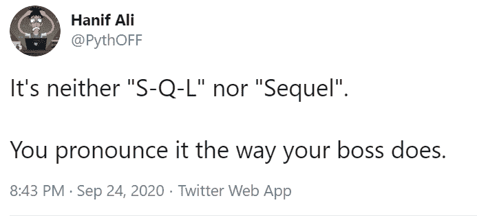

Credit: [Facebook](https://www.facebook.com/ProgrammersCreateLife/photos/3337008553014666)

# 10.HTML + C++

评论:141
股份:1.3k
反应:10k

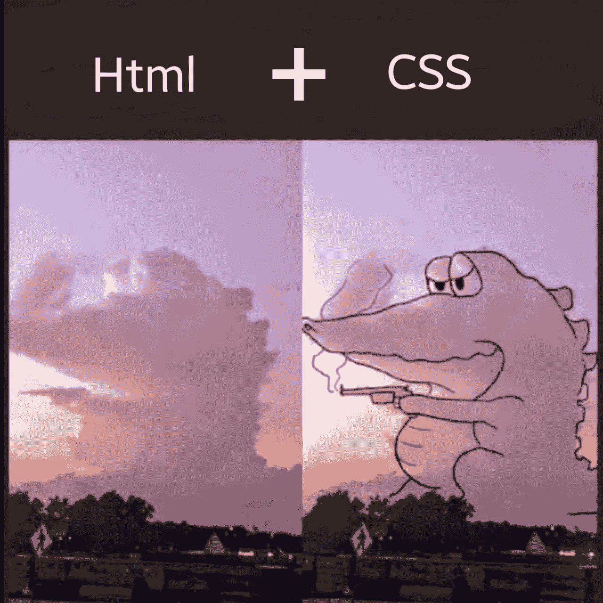

Credit: [Facebook](https://www.facebook.com/ProgrammersCreateLife/photos/3328080073907514)

# 12.我调试

评论:478
股份:1.7k
反应:11k

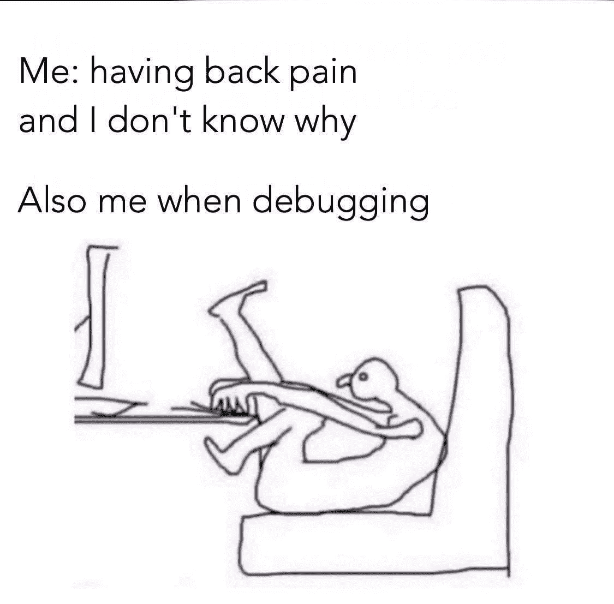

Credit: [Facebook](https://www.facebook.com/ProgrammersCreateLife/photos/3306340526081469)

# 12.Winrar

评论:396
股份:5.4k
反应:27k

Credit: [Facebook](https://www.facebook.com/ProgrammersCreateLife/photos/3121734591208731)

# 12.一部真实描述编程的电影

评论:358
股份:2.5k
反应:10k

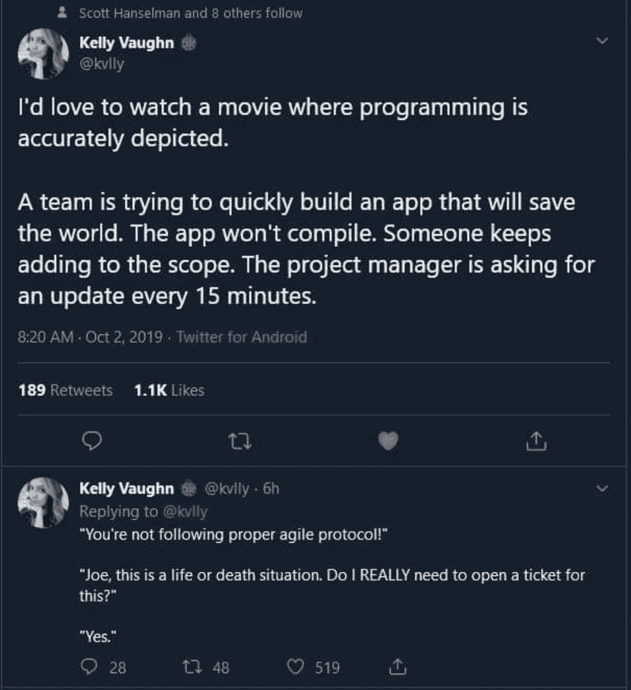

Credit: [Facebook](https://www.facebook.com/ProgrammersCreateLife/photos/3221519504563572)

# 13.我是一名软件工程师，我擅长谷歌搜索

评论:421
股份:2.6k
反应:15k

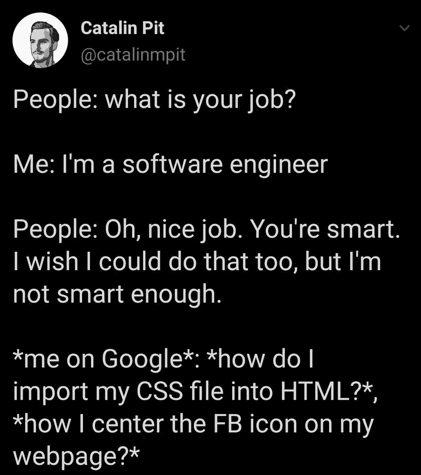

Credit: [Facebook](https://www.facebook.com/ProgrammersCreateLife/photos/3215826625132860)

# 13.我开发过的最好的应用程序

评论:240
股份:1.7k
反应:13k

Credit: [Facebook](https://www.facebook.com/ProgrammersCreateLife/photos/3192026014179588)

# 14.欢迎回到我的 Youtube 频道

评论:367
股份:1.2k
反应:10k

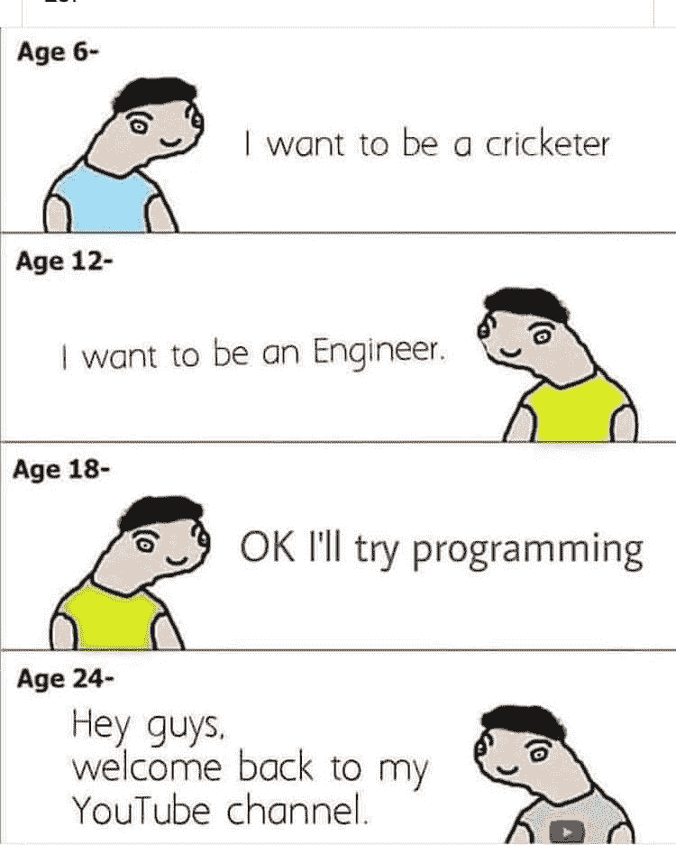

Credit: [Facebook](https://www.facebook.com/ProgrammersCreateLife/photos/3174480392600817)

# 15.4 种开发者

评论:429
股份:1.3k
反应:8.7k

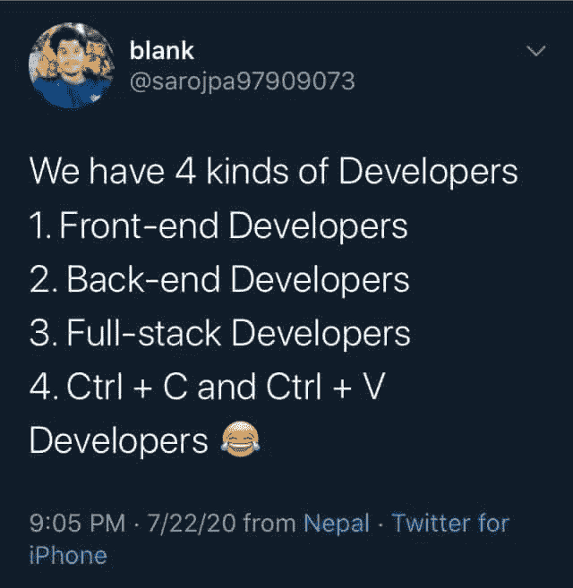

Credit: [Facebook](https://www.facebook.com/ProgrammersCreateLife/photos/3150298758352314)

# 16.我有一个关于编程的笑话

评论:349
股份:1.9k
反应:14k

Credit: [Facebook](https://www.facebook.com/ProgrammersCreateLife/photos/3136101556438701)

# 16.封锁期间的程序员

评论:234
股份:1k
反应:8.4k

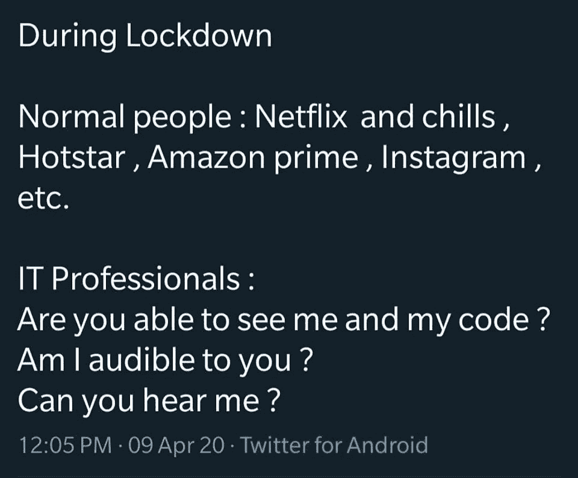

Credit: [Facebook](https://www.facebook.com/ProgrammersCreateLife/photos/3096887493693441)

# 17.哪种编程语言最好:C，C++，python，还是 java

评论:575
股份:1.8k
反应:11k

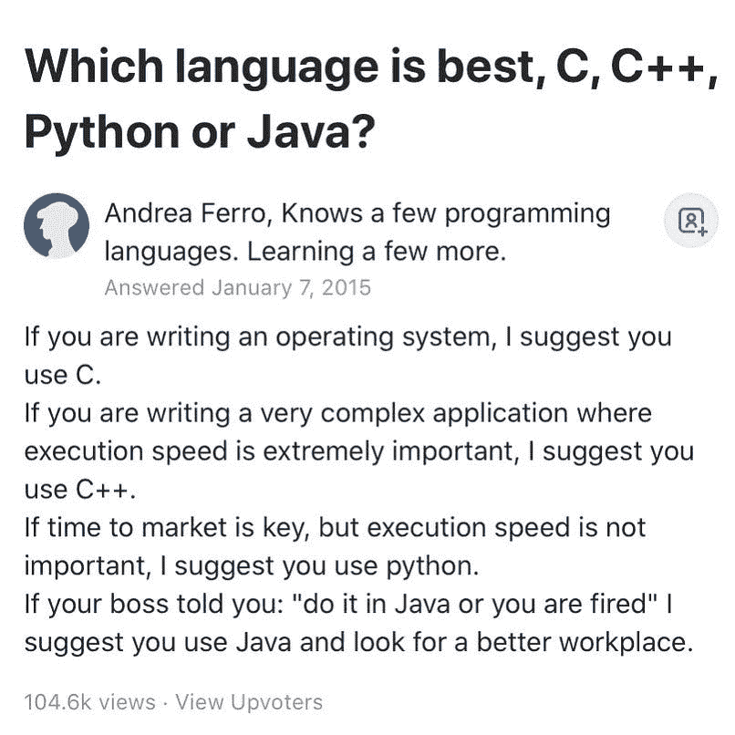

Credit: [Facebook](https://www.facebook.com/ProgrammersCreateLife/photos/3025593514156173)

# 18.Windows 10 功能

评论:406
股份:1.4k
反应:13k

Credit: [Facebook](https://www.facebook.com/ProgrammersCreateLife/photos/2984112188304306)

# 19.埃尔达贡网飞黑客现场

评论:1k
股份:3.3k
反应:14k

Credit: [Facebook](https://www.facebook.com/ProgrammersCreateLife/photos/2975863875795804)

# 20.埃尔达贡网飞黑客现场

评论:201
股份:1.8k
反应:11k

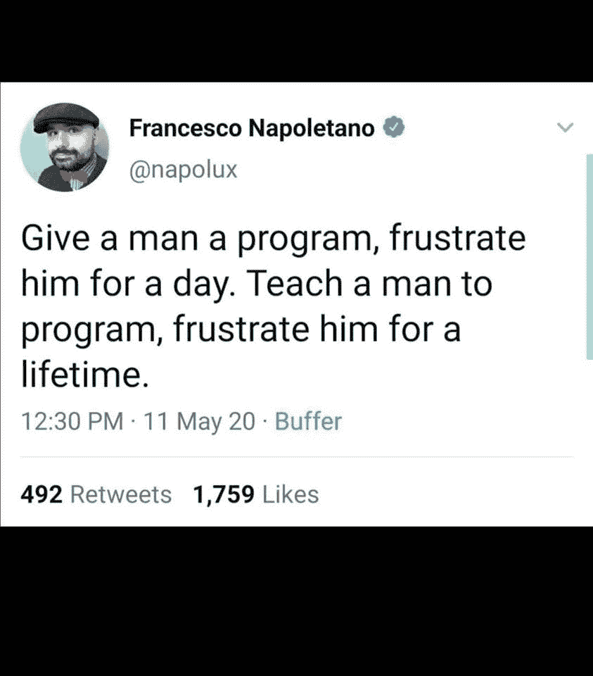

Credit: [Facebook](https://www.facebook.com/ProgrammersCreateLife/photos/2944606082254917)

## 发现关于编程的迷因和笑话的更多地方:

*   [https://www.reddit.com/r/ProgrammerHumor/](https://www.reddit.com/r/ProgrammerHumor/)
*   [https://www.facebook.com/ProgrammersCreateLife/](https://www.facebook.com/ProgrammersCreateLife/)
*   [https://twitter.com/programmersmeme?lang=en](https://twitter.com/programmersmeme?lang=en)
*   [https://www.instagram.com/realprogrammerhumor/](https://www.instagram.com/realprogrammerhumor/)