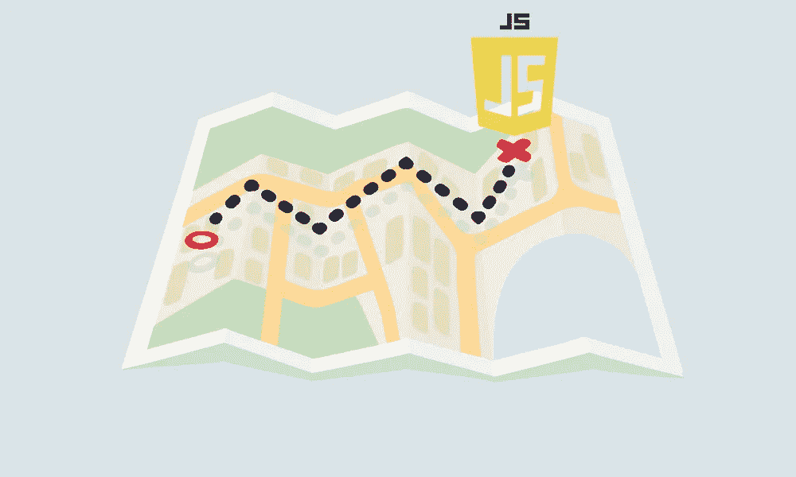
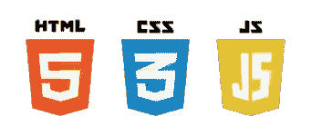
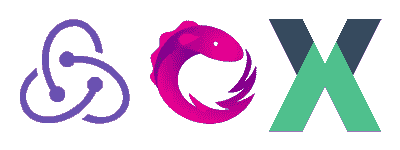

# 2021 年全栈开发者路线图

> 原文：<https://javascript.plainenglish.io/2021-js-fullstack-web-developer-roadmap-part1-d86ac51d5c39?source=collection_archive---------2----------------------->

## 第一部分

在过去的几年中，JavaScript 成为最强大和最常用的编程语言之一，它被用于 web、游戏、桌面开发等等。只要使用 JavaScript，你就可以成为一名完整的 web 开发人员(前端和后端开发人员)，因此我喜欢写一篇关于路线图的文章，这样对初学者和其他人来说都是有用的**，可以填补他们知识中的空白(如果存在的话**)。

我将在这篇文章中从基本的东西开始，在另一篇文章中继续讨论高级的东西。您可以从此处浏览下一篇文章:

 [## 2021 JS Fullstack web 开发者路线图-第二部分

### 在过去的几年中，JavaScript 成为最强大和最常用的编程语言之一，它被用于 web…

a-mhaish.medium.com](https://a-mhaish.medium.com/2021-js-fullstack-web-developer-roadmap-part2-d3579330b0e5) 

# 基础

Web 开发是一个非常广阔的领域，为了涉足这个广阔的领域，您需要了解基础知识，虽然有很多东西需要了解，但我将重点关注您需要很好理解的最重要的东西:

*   **互联网和 HTTP** :为了成为一名 web 开发者，你需要了解互联网是如何工作的，什么是 HTTP 协议，如果你对 TCP/IP 模型有一个大致的了解会更好。
*   **域名托管& DNS** :对域名、域名服务和 DNS 记录进行概述也是非常重要的。因此，您可以了解当您请求一个网站时会发生什么，以及该域名是如何转换为机器 IP 的。
*   **浏览器**:浏览器是访问互联网的大门，了解它们的工作方式是理解我们如何访问网站的基础，除了前面两点，下一个视频可能会帮助你理解整个想法:

*   **Web 托管**:纵观托管网站和 web apps 的思路也是必不可少的一步，你需要了解什么是 HTTP server 比如 [**IIS**](https://www.iis.net/) **，**[**Nginx**](https://www.nginx.com/resources/wiki/)**，**[**Apache server**](https://httpd.apache.org/)**以及它如何在特定端口上托管你的 app。此外，您应该看看去年出现的新后端框架中嵌入 HTTP 服务器的新想法。**
*   ****基本的终端命令**:掌握一些基本的终端命令 **(cd、grep、curl、get、tail、head、less、find、ssh、kill、vim、echo、nslookup、ping、telnet)对你来说是非常有益的**，为了在互联网上搜索这些命令并尝试在你的机器上使用它们，它们并不那么难，记住它们的用法，这样你就知道以后什么时候使用它们。**

# **开发工具**

**为了开始开发 Fullstack 应用程序，现在您应该掌握各种开发工具:**

*   ****版本控制系统&回购托管服务**:最常用的工具是 git，大多数回购托管服务是 **(Github，GitLab，Bitbucket，AzureDevOps)** ，要学习 git，我建议你去看看下一个网站[https://learngitbranching.js.org/](https://learngitbranching.js.org/)，对于回购托管服务，选择一个，然后在 YouTube 上搜索关于它的介绍视频。这里我们指的是 repo hosting，一种代码存储库托管服务，所以这是目前在这些 repo hosting 服务中托管您的服务的主要原因，有两个原因:为您的代码提供一个更安全的地方，可以从任何地方访问，并且他们支持 git，这是一个版本控制系统，这意味着您可以在更新代码时通过拥有版本来保留代码的备份，此外，如果两个人处理同一个文件等，还可以解决冲突。当你学习 git 时，你会明白它为什么如此重要。**

****

*   ****代码编辑器**:为了编写代码，你需要一个编辑器，当我们谈论 JavaScript 时，那么 [**VSCode**](https://code.visualstudio.com/) 考虑一个最好的选择，你需要安装并使用它来熟悉它。如果还能看一些相关的视频就更好了。根据你的需要安装扩展，你会发现很多扩展支持你进行全栈开发。我将很快就此写一篇文章。**

****

*   ****包管理器**:为了开发你的应用程序，你需要在另一种类型的包(库)上构建它，这种包支持在机器、网络或浏览器上进行原子或更复杂的操作。当我们谈论 JavaScript 时，最著名的 JS 包管理器是 [**npm**](https://www.npmjs.com/) 和 [**yarn**](https://yarnpkg.com/) 。你需要先阅读这个概念，然后理解如何使用这两个或至少其中一个。**

****

# **Java Script 语言**

**首先，你需要开始理解这种语言的主要概念，通常你需要前端或后端的例子，但是现在，只关注语言本身。你需要搜索和学习香草 JS。**

> **VanillaJS 是一个名字，指的是使用普通的 JavaScript 而不使用任何额外的库**

**搜索一个关于这个的课程，开始学习基础知识，**我更喜欢你开始学习** [**ES5**](https://www.w3schools.com/js/js_es5.asp) **，而不是** [**ES6**](https://www.w3schools.com/js/js_es6.asp) **这样你就理解了 JavaScript** **的** [**原型本质，否则，你会发现很难理解 ES6 是如何工作的。还有，理解单线程语言的意义太重要了，因为 JavaScript 就是这样，有另外一种处理并发的方式。**](https://en.wikipedia.org/wiki/Prototype-based_programming)**

# **前端技术**

**我更喜欢你从前端开始，因为那里有很多机会，甚至你可以使用许多在线平台来构建完整的应用程序，而不使用手写的后端。另一方面，仅仅使用后端(没有接口)很难构建一个完整的应用程序。**

*   **HTML:它是在浏览器中构建视图所需的主要标记语言。查看本[教程](https://www.w3schools.com/html/default.asp)了解基础知识，并尝试从头开始创建一个登陆页面。**
*   **CSS:它是对用 HTML 语言构建的视图进行样式化所需的主要语言。检查这个[教程](https://www.w3schools.com/css/default.asp)的基础知识。**
*   ****DOM(文档对象模型)** : JS API 定义了一个访问 HTML 文档的标准，当你了解到你将能够从 JavaScript 端操作 HTML 文档的时候。**
*   ****BOM(浏览器对象模型)** : JS API 定义了一个访问和管理浏览器窗口的标准，当你了解到你将能够在浏览器窗口上做一些预定义的动作，比如返回、导航到另一个页面、刷新页面等等。等等。**

****

*   ****前端框架:**选择 **React、Angular 或 Vue** 作为您将用来构建您的现代前端项目的主要框架，而不是通过用纯 JS (VanillaJS)编写应用程序来重新发明轮子，搜索合适的课程，并开始学习基础知识。但是，如果你只掌握了其中一个框架的基础知识，你可以继续学习其他要点。请注意，如果您选择了 Angular，那么您还需要查看一下 JavaScript 的超集[**TypeScript**](https://www.typescriptlang.org/)**。****

********

*   ******缓存:**是一个重要的概念，都是关于缓存浏览器内部的资源和对象，你需要了解更多关于 [**Cookies**](https://www.w3schools.com/js/js_cookies.asp) **，** [**本地存储**](https://www.w3schools.com/js/js_api_web_storage.asp) **，以及** [**会话存储**](https://www.w3schools.com/js/js_api_web_storage.asp) 。****
*   ******构建工具**:在学习一个框架的过程中，你将主要经历 JS 构建过程，而首先，我们使用 ES6 在前面的一个框架中编写 FE 应用程序，此外，以模块化的方式编写应用程序，所以我们将需要一个工具来捆绑所有这些模块并将它们转换成 ES5，以便浏览器能够理解和执行代码，你可以使用 **Webpack、Rollup 或 package**作为构建工具，但最著名的是 **Webpack 【T33 理解所选构建工具的概念和配置很重要。******

********

*   ******现代 CSS** :在学习其中一个框架的过程中，你大部分都会经过现代 CSS，所以复习一下会很好，这样你就对**风格的组件和 CSS 模块有了扎实的了解，**也可以看看[**情感**](https://emotion.sh/) 它是一个很棒的库。****
*   ******状态管理**:在学习一个框架的过程中，你大多会经过一个状态管理库，最著名的依次是 React、Angular、Vue 的 **Redux、RxJS、**和 **VueX** 。清楚地理解这个概念并在一些例子中使用它是非常重要的。大多数情况下，您需要一个中心位置来管理整个应用程序状态以及这些库所提供的功能。****

********

*   ******CSS 框架**:关于你的应用程序的基本结构和风格，有一些重要的库你应该看看，[**reacts trap**](https://reactstrap.github.io/)**/**[**Bootstrap**](https://getbootstrap.com/)**，**[**Material UI**](https://material-ui.com/)**/**[**Materialize CSS**](https://materializecss.com/)**…等等。理解网格和响应视图也很重要。******

********

****至此，您可以转向后端技术，并开始学习基础知识。****

# ****后端技术****

****在你对前端技术有了坚实的基础之后，你可以开始学习如何从头开始做你自己的后端。****

*   ******HTTP API**:首先你需要理解 web APIs 的概念，那里有一些数据查询和操作的标准，比如 **REST、SOAP、graph QL……等等**。此外，还有一些认证标准，如 OAuth、Basic、Token、JWT、OpenID 等。对它们的深刻理解将使你更容易写出更清晰和标准的代码。****
*   ******NodeJS** :你需要首先学习 NodeJS，它是一组 API，为你提供主机操作系统的基本后端操作，如 **I/O 管理、进程管理、网络管理**…等等。你可以从[这里](https://www.w3schools.com/nodejs/)学到基础知识。****

********

*   ******后端框架**:虽然你已经了解了 JavaScript 语言，但你需要掌握一个后端框架，而不是从头开始编写应用程序，就像我们在前端框架中说的那样，这又是一个麻烦。你需要检查其中一个框架，比如 [**Express.js**](https://expressjs.com/) **，**[**hapi . js**](https://hapi.dev/)**，** [**Koa.js**](https://koajs.com/) ..等等。Express.js 是最著名的一个。您可以学习基础知识，然后继续接下来的步骤，将高级概念留到以后，只需尝试构建一个完整的 web API 应用程序，并使用您的前端应用程序进行测试，这样您就可以了解整个周期。****
*   ******关系数据库**:理解数据库的概念很重要，我们可以从关系数据库开始，虽然它是最常见和最简单的数据库，看看并学习其中一个数据库引擎，如 **PostGreSQL、MySQL、MariaDB、MS SQL、Oracle**…等等。我个人建议要么 MySQL 要么 MS SQL 入手。在此期间，您应该了解代表结构化查询语言的 SQL 语言的基础知识。SQL 让你访问和操作数据库。****

********

*   ******ORM(Object Relational Mapping)**:下一步是理解一个 ORM 库，它提供你通过代码以面向对象的方式访问数据库，而不使用 SQL 语言。你可以检查 Sequelize、TypeORM、loopback . io…等等。****

********

*   ******缓存**:这是一个重要的概念，它是关于缓存一些资源，而不是总是从源端服务它们，所以这将对性能有很大帮助，你需要阅读关于 **CDN** 用于缓存普通文件，服务器端缓存( **Redis，Memcached** )用于缓存对象。****

****我将在另一篇文章中继续讨论前端和后端技术中的高级概念。但是，如果你掌握了前面的几个，你就有可能成为中级全栈开发者。你可以在这里找到下一篇文章:****

**** [## 2021 JS Fullstack web 开发者路线图-第二部分

### 在过去的几年中，JavaScript 成为最强大和最常用的编程语言之一，它被用于 web…

a-mhaish.medium.com](https://a-mhaish.medium.com/2021-js-fullstack-web-developer-roadmap-part2-d3579330b0e5)****