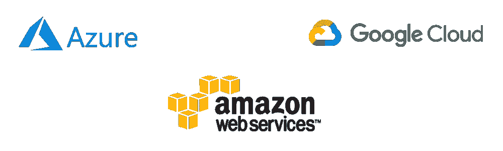
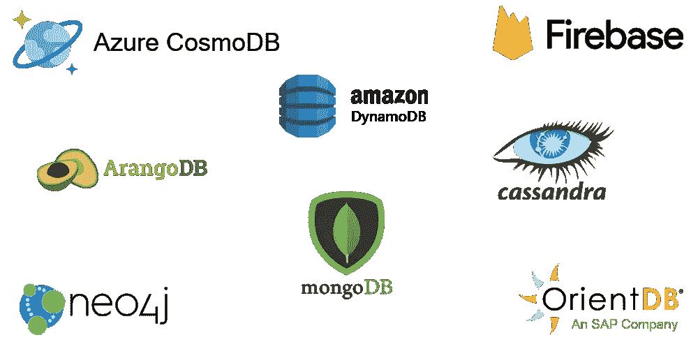
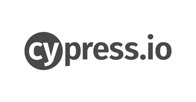
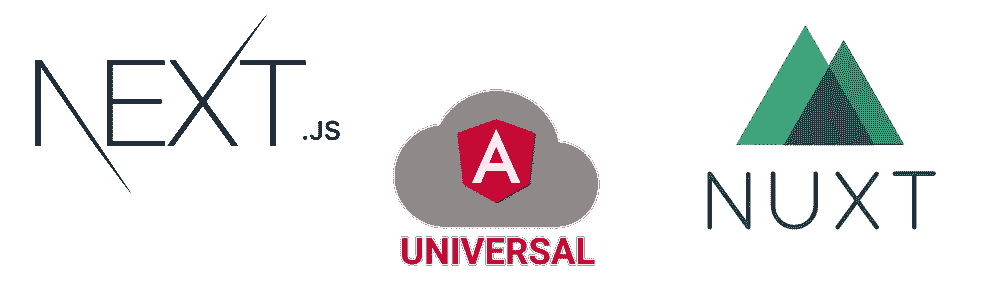
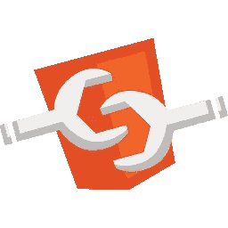

# 2021 年全栈开发者路线图

> 原文：<https://javascript.plainenglish.io/2021-js-fullstack-web-developer-roadmap-part2-d3579330b0e5?source=collection_archive---------9----------------------->

## 第二部分

在过去的几年中，JavaScript 成为最强大和最常用的编程语言之一，它被用于 web、游戏、桌面开发等等。只要使用 JavaScript，你就可以成为一名完整的 web 开发人员(前端和后端开发人员)，因此我喜欢写一篇关于路线图的文章，这样对初学者和其他人来说都是有用的**，可以填补他们知识中的空白(如果存在的话**)。

您可以通过以下链接查看第一部分:

 [## 2021 JS Fullstack web 开发者路线图-第 1 部分

### 在过去的几年中，JavaScript 成为最强大和最常用的编程语言之一，它被用于 web…

a-mhaish.medium.com](https://a-mhaish.medium.com/2021-js-fullstack-web-developer-roadmap-part1-d86ac51d5c39) 

您可以通过以下链接继续阅读下一篇文章:

 [## 2021 JS Fullstack web 开发者路线图-第 3 部分

### 在过去的几年中，JavaScript 成为最强大和最常用的编程语言之一，它被用于 web…

a-mhaish.medium.com](https://a-mhaish.medium.com/2021-js-fullstack-web-developer-roadmap-part3-a583d4ade3df) 

在这里，我将讨论前端和后端的一些高级技术和概念。**我认为高级主题可以分为概念主题和技术主题，其中技术主题我们将涵盖更多您可以使用的开发工具、后端和前端技术。**

**请注意:在进入这些新的高级主题之前，你应该有 6 个月到 2 年的实践经验。**

# 概念主题

当你开始编写高级系统时，你应该开始掌握一些编程概念，接下来我将列出一些重要的主题，以及一些我鼓励你添加到阅读清单中的书籍:

*   干净的代码:你需要关心的第一件事是将标准应用到你的代码中，并提高你的代码质量，这是进入职业世界的第一把钥匙。我鼓励你阅读**“罗伯特·c·马丁的干净代码”**。我相信快速阅读就足够了，稍后，通过训练，你将能够提高你的代码质量(当然如果你牢记在心的话)。还有一些你应该知道的重要原则，比如( **KISS，YANGI，DRY** )可以让代码更简洁。您可以查看我的下一篇文章来了解这方面的信息

 [## 干净代码重要原则

### 设计你的代码结构是一门艺术，这是毫无疑问的，你可以写一个干净的，可读的，和…

blog.amhaish.com](https://blog.amhaish.com/clean-code-important-principles-1674d76f71b2) 

*   **基本开发原则**:提高代码质量和系统软件设计的另一个步骤是理解一些重要的开发原则，如**(坚实，系统的基本属性，最终一致**，和我**中间一致)**，接下来是一篇关于坚实的伟大文章，这是最重要的一条，其他的我会留给你去搜索。

 [## 照片中的神盾局原则

### 如果你熟悉面向对象编程，那么你可能听说过坚实的原则。

medium.com](https://medium.com/backticks-tildes/the-s-o-l-i-d-principles-in-pictures-b34ce2f1e898) 

*   **敏捷开发**:敏捷是一种在迭代的基础上发现需求和开发解决方案的方法， **SCRUM** 是最著名的敏捷框架之一，理解它的概念是这个阶段非常重要的一点。接下来是一篇有趣的文章:

 [## Scrum 框架简介

### 或者我如何学会拥抱变化

medium.com](https://medium.com/chingu/a-short-introduction-to-the-scrum-methodology-7a23431b9f17) 

*   **设计模式**:软件设计模式是一种通用的、可重用的解决方案，用于解决软件设计中给定环境下经常出现的问题。这是一个充满活力的话题；然而现在你只能关注下一个最常用的设计模式**(单例、工厂、原型**、**复合**、**装饰、策略)**。在 JavaScript 中，模式与 OOP 语言略有不同，接下来是一篇关于 JS 设计模式的好文章，也是我的一篇关于装饰模式的文章:

 [## JavaScript 设计模式

### 最有用的设计模式 medium.com 终极指南

1](https://medium.com/better-programming/javascript-design-patterns-25f0faaaa15)  [## 基于类和基于原型的编程语言之间的装饰器

### OOP 和原型语言的区别集中在重用原则(称为继承)上，它…

medium.com](https://medium.com/javascript-in-plain-english/decorators-between-class-based-and-prototype-based-programming-languages-ee8a1c854411) 

*   **数据库原理:**在数据库中，我们有一些重要的原理你需要看一看，以了解数据库之间的区别**，CAP 定理**是其中最重要的一个**，**那么也许你应该看看**酸与碱，**接下来是一篇关于这个概念的文章。

 [## ACID 数据库属性

### 今天我们将深入了解 ACID 数据库的属性。如果你不小心点击了这个视频来学习…

medium.com](https://medium.com/@intuting/acid-database-properties-6bc2b049ed2d) 

# 开发工具

我喜欢首先介绍更多的开发工具，这些工具对于高级系统来说是必不可少的，而且这些工具现在非常普遍，但是，这并不意味着在第 1 部分的开发工具中还有更多的东西需要学习，您应该单独搜索并通过实践来学习。

*   **CI/CD** : 持续集成/持续部署管道是敏捷开发的基本工具，它们是一组自动化，使应用程序开发团队能够更频繁、更可靠地交付代码变更。一些帮助你实现这些管道的平台有 **(AzureDevOps 管道，Bitbucket 管道，Jenkins 等)**。有其中一门的实践经验太重要了。
*   Docker : Docker 是一套平台即服务产品，使用操作系统级虚拟化来交付称为容器的软件包中的软件。这是非常必要的，因为通过 Docker 容器服务软件组件提供了更高的性能、可移植性、隔离性和可伸缩性。下一个网站和视频对学习和理解码头工人和集装箱化非常有用:

 [## 玩 Docker 教室

### “Docker 游戏课堂”为您带来了实验室和教程，帮助您获得使用 Docker 的实践经验。在…

training.play-with-docker.com](https://training.play-with-docker.com/) 

*   **云服务提供商:**虽然现在有一个独立的职位叫做云开发者，但了解如何使用至少一个常见的云提供商也非常重要，比如 **(Azure、亚马逊 AWS 和谷歌云)。**云服务提供商**是一家第三方公司，提供基于**云**的平台、基础设施、应用程序、存储服务等等。大多数公司都在朝着这个方向发展，并跳过在专用服务器或虚拟机服务器上托管应用程序的旧方式。要学习的最重要的事情是如何在一个云系统中托管您的应用程序，如何使用他们的存储解决方案、他们的数据库解决方案，以及如何设置 CD 管道来将您的代码直接部署到您的云平台或通过容器部署。**

*   Kubernetes : Kubernetes 是一个服务于微服务架构系统的开源容器编排系统，许多公司开始将其系统迁移到微服务架构，因此在大多数云提供商支持的情况下，了解如何使用 Kubernetes 是非常重要的。现在只需要 how-to 就足够了，因为公司内部应该有一个 DevOps 人员来管理 Kubernetes 集群。你应该了解主要概念和**单片和微服务架构**之间的区别，以及如何使用其命令行界面 **Kubectl。**接下来是一篇关于这方面的好文章。现在，您只能关注 Kubernetes 下的一些类型的对象，它们是**(pod、名称空间、部署、有状态集、KubeConfig 和 Secrets)** 。您可以从下一个网站获得关于 Kubernetes 命令行的良好基础培训:[https://www.katacoda.com/courses/kubernetes](https://www.katacoda.com/courses/kubernetes)

 [## 整体服务与微服务，以及两者之间的所有服务

### 揭开蓝色和红色药丸困境的神秘面纱

medium.com](https://medium.com/swlh/monolithic-vs-micro-services-and-all-in-between-7d496408ad02) 

# 后端高级技术

在这里，我们将讨论一些先进的后端技术，这次我更喜欢从后端开始，因为我相信在你的职业道路上，它们比前端先进技术更重要。我应该再次关注前一篇文章的后端技术，并且你应该继续学习更多的东西，从而获得更多真实世界的场景。

*   **NoSQL 数据库**:除了关系数据库，还有其他重要类型的数据库，现在熟悉一下最著名的数据库并了解它们的用法是一个很好的步骤，有**(文档数据库、宽列数据库和图形数据库)**，文档数据库的例子有 **(MongoDB、DynamoDB、Firestore)** ，宽列数据库的重要例子有 **Apache Cassandra、**，图形数据库的重要例子有**neo 44**有些数据库支持多种模型，比如 **(Azure Consom DB，ArangoDB，OrientDB)。**还有很多，最重要的是对每一类都有亲身经历。

*   **Web 安全**:安全知识在此阶段必不可少，你要了解**哈希算法(MD5，SHA 家族)、HTTPS、SSL 证书、SSL/TLS、CORS、内容安全策略、堡垒主机、XSS 攻击、SQL 注入攻击、数据库角色&权限、数据库加密、网络策略**。接下来是一个有趣的网站，谈论 HTTPS 是如何工作的(只是一个介绍):

 [## HTTPS 是如何运作的

### 🙀一只猫解释 HTTPS 是如何工作的...在漫画里！😻

howhttps.works](https://howhttps.works/https-ssl-tls-differences/) 

*   **测试**:软件测试是检查实际软件产品是否符合预期需求的一种方法，有三种主要的后端测试类型**(单元测试、集成测试、功能测试)**，JS 中也有一些著名的支持测试的框架，如 **(Mocha、Chai、Sinon……等)。**花很多时间来实现这三种类型以充分理解这个概念是很重要的。

*   **Web Sockets&SSE:**It**是一种先进的技术，允许客户端浏览器和服务器之间的实时交互通信。它使用一种完全不同的协议，允许双向数据流，这使它与 HTTP 不同。实现 web 套接字的两个著名框架是 **Socket。IO** 和 **SockJS** 。如果你已经熟悉了**graph QL**API，那么看看 **GraphQL** 订阅也是非常重要的。**服务器发送的事件** (SSE)另一方面是服务器推送技术，使客户端能够通过 HTTP 连接从服务器接收自动更新，尝试 SSE 对您来说也非常有用，因为 SSE 比使用 web sockets 更能实现一些实时更新。**

****

# **前端先进技术**

**最后，我将关注上一篇文章的前端技术，正如我们在后端技术中所说的，你应该继续学习更多的东西，从而获得更多的真实场景。**

*   ****类型检查器:**静态**类型检查器**帮助开发人员编写 bug 更少的代码，试图捕捉代码中的**类型**错误，然后在编译时删除它们。最著名的框架要么使用 **TypeScript** 而不是 JavaScript，要么使用 **Flow** 。**

****

*   ****测试:**我们已经讨论了后端技术中的测试，在前端，测试的类型有**(单元/组件测试、快照测试和端到端测试)**然而**端到端测试(E2E)** 是最著名和最重要的一种。如今，Cypress.io 被认为是最重要的 E2E 框架。单元测试库根据框架不同而不同，比如 Jasmine 的**和 Angular 的**和 Karma 的 **Jest 和 React 的 Enzyme。**e2e 测试之后的第二步是尝试在其中一个框架中进行单元测试，然后也许你可以看看快照测试。**

****

*   **SSR(服务器端渲染):使用 SSR 框架的整个想法是在服务器端而不是客户端加载第一页，这种新的 web 应用被称为**通用应用**或**同构应用*。我们在第 1 部分中讨论的每个前端框架都有自己的框架来实现这一点。这种解决方案的优点是能够用相同的代码开发一个应用服务器端和客户端，并通过自定义数据向用户提供真正快速的体验，而且非常重要的一点是支持搜索引擎，而搜索引擎很难抓取客户端渲染的网站。React 中有 **NextJS** ，Vue 中有 **NuxtJS、**，Angular 中有 **Angular Universal** 。此外，一些框架只做静态网站生成，如 **Gatsby** 。了解这项技术很重要，因为目前它有很多用途。*****

****

*   ****Web Sockets & SSE:** 我们已经在后端讨论过这个话题，大多数情况下你需要在前端尝试一下，以了解整个周期。然而，我们之前讨论的相同框架有客户端库来使用它们。**
*   ****渐进式 web 应用:**它们是 web 应用，使用新兴的 Web 浏览器 API 和功能以及传统的渐进式增强策略，带来类似本地应用的用户体验。实现这一点的一些著名框架和库是 **(AMP，Next-pwa，Nuxt-pwa，@angular/pwa …等等)。用真实场景尝试其中一个是如此重要。围绕**客户端存储、web 套接字、服务人员、位置、通知、设备定位、支付、凭证、PRPL 模式、Rail 模型和性能指标，这里要学习的最重要的概念。******
*   **Web 组件:Web 组件是一组为 Web 提供标准组件模型的特性，允许封装和互操作单个 HTML 元素。这个想法很酷的一点是，它可以被转换成一个跨框架的标准，但直到现在，公司和开发人员更喜欢用他们自己的框架方式编写组件。然而，看一看会对以后有好处，接下来是一篇关于这方面的有用文章。**

****** [## 关于 Web 组件您需要知道的一切:第 1 部分

### 作者:艾米·华

medium.com](https://medium.com/rangle-io/everything-you-need-to-know-about-web-components-part-1-ced95964fbe6) 

*   **Web Assembly(WASM):**Web Assembly 是一个开放标准，它为可执行程序定义了可移植的二进制代码格式，以及相应的文本汇编语言，还定义了用于促进这些程序与其宿主环境之间的交互的接口。虽然它在开发 web 应用程序中并不常见，但是概述一下这项有趣的技术对将来会很有用，请看下一篇文章。

 [## 正如我们所知，网络组装是互联网的终结

### 小心你的愿望

medium.com](https://medium.com/better-programming/webassembly-is-the-end-of-the-internet-as-we-know-it-9085a49cbc7b) 

除了第一篇文章中的主题，如果你能掌握的话，我还浏览了一些高级主题**将你提升到高级水平**。

接下来，你可以找到我的最后一篇文章，关于更深入的概念和技术，可以让你从一个**高级开发人员**提升到一个**架构师**，以及作为一个架构师的意义是什么。

 [## 2021 JS Fullstack web 开发者路线图-第 3 部分

### 在过去的几年中，JavaScript 成为最强大和最常用的编程语言之一，它被用于 web…

a-mhaish.medium.com](https://a-mhaish.medium.com/2021-js-fullstack-web-developer-roadmap-part3-a583d4ade3df)**