# JavaScript 开发人员的 25 个最佳 VSCode 扩展

> 原文：<https://javascript.plainenglish.io/25-best-vscode-extensions-for-javascript-developers-e7d0eb1a230?source=collection_archive---------3----------------------->

## 我们都有自己最喜欢的，但你必须知道要点，让我们装上我们的枪。

Photo credit to ThisisEnginerring of [Unsplash](https://unsplash.com/photos/oiBqqugoB2s)

> “给我六个小时砍树，我会用前四个小时磨利斧头。”— [亚伯拉罕·林肯](https://www.brainyquote.com/quotes/abraham_lincoln_109275)

时间一直是并且将永远是一种奢侈品，尤其是对我们开发人员来说，您是否想过为什么大多数开发人员被描述为大部分时间花在自己身上的人，总是在他/她的计算机上，从不外出，在他/她的工作站上吃饭的人，非技术人员的描述在更广阔的画面中，而我们开发人员从更近的角度看，我们可以想象需要反复编写多少代码， 重写重复的代码行除了复制粘贴，你能想象我们需要的记忆吗，跟踪内存试图从第三方工具中获取不同的代码集、语法和不同的片段，甚至是适当缩进和空白的最小细节最后，这是解决方案。

VSCode 扩展是我们需要的工具，它不仅可以让我们的生活不那么紧张，还可以帮助我们变得更有生产力、更有效率，它甚至可以帮助我们通过学习前几代开发人员已经使用的一些实践来成为更好的开发人员。

除了 snippets、hot-reload、autocomplete 之外，还有许多跨几种编程语言的扩展，以及 JavaScript 的流行框架，如 Redux、Angular、React、Vue、TypeScript 等等。创建 JavaScript 扩展是为了帮助我们加快开发工作，这样我们就可以将更多的脑力集中到复杂的事情上，比如解决问题、创建逻辑、设计数据结构等等，我们只是消除了编程中无聊的一面，或者至少对某些人来说是这样。

# 片段

**代码片断最简单的定义就是重用代码和节省时间。**

## JavaScript ES6 代码片段

这个扩展包括 JavaScript ES6 语法的代码片段，这个代码片段非常适合 JavaScript 和 TypeScript。

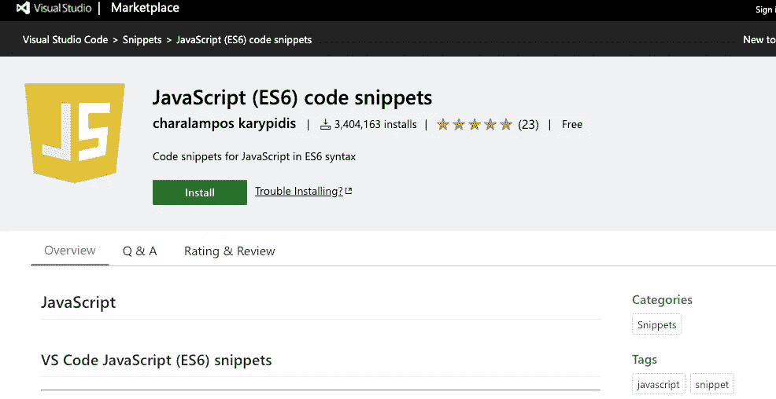

**在这里下载:**

 [## JavaScript (ES6)代码片段

### 编辑描述

marketplace.visualstudio.com](https://marketplace.visualstudio.com/items?itemName=xabikos.JavaScriptSnippets) 

## 有角度的片段

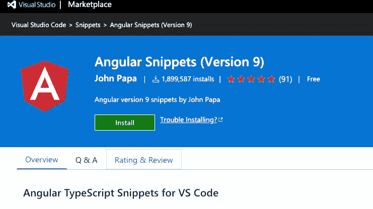

**在这里下载:**

 [## 角度片段(第 9 版)

### Visual Studio 代码的这一扩展为 TypeScript 和 HTML 添加了 Angular 代码段。请查看的变更日志…

marketplace.visualstudio.com](https://marketplace.visualstudio.com/items?itemName=johnpapa.Angular2) 

## ES7 React/Redux/graph QL/React-本机代码片段

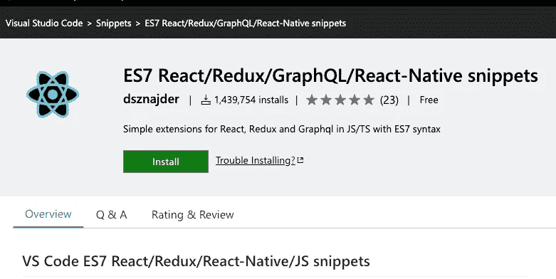

**在这里下载:**

 [## ES7 React/Redux/graph QL/React-本机代码片段

### 这个扩展为你提供了 ES7 中的 JavaScript 和 React/Redux 代码片段，以及 VS 代码的 Babel 插件特性，你可以…

marketplace.visualstudio.com](https://marketplace.visualstudio.com/items?itemName=dsznajder.es7-react-js-snippets) 

## jQuery 代码片段

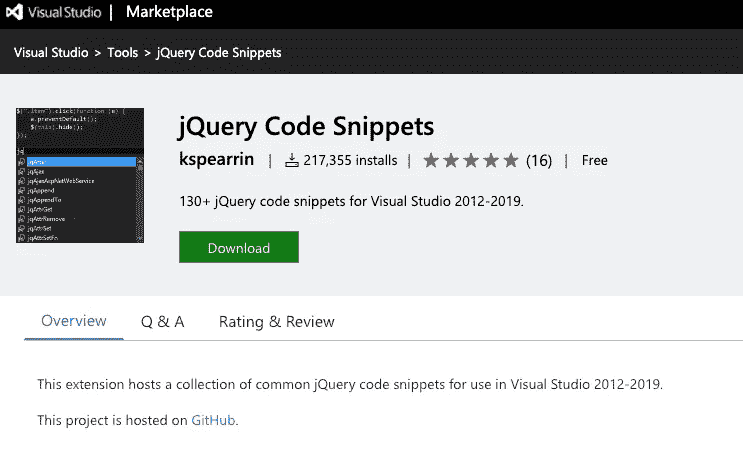

**在这里下载:**

 [## jQuery 代码片段

### 编辑描述

marketplace.visualstudio.com](https://marketplace.visualstudio.com/items?itemName=kspearrin.jQueryCodeSnippets) 

# 棉短绒

## 埃斯林特

ESLint 是一个智能的静态代码，可以找出任何有问题的模式，你甚至可以制定自己的规则来检查和重用逻辑。ESLint 是确保开发者拥有高质量代码格式的工具之一。

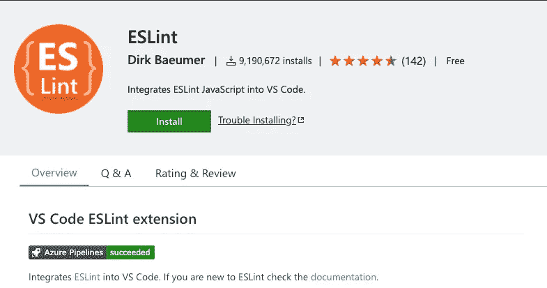

**在这里下载:**

 [## ESLint — Visual Studio 市场

### Visual Studio 代码的扩展—将 ESLint JavaScript 集成到 VS 代码中。

marketplace.visualstudio.com](https://marketplace.visualstudio.com/items?itemName=dbaeumer.vscode-eslint) 

## JSHint

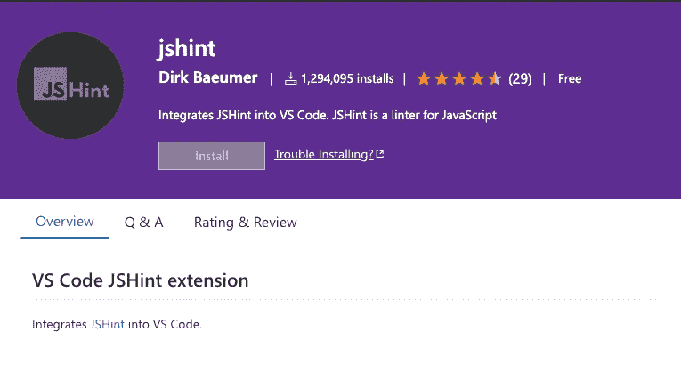

**在这里下载:**

 [## jshint

### 将 JSHint 集成到 VS 代码中。扩展在当前目录和全局目录中查找 jshint 模块…

marketplace.visualstudio.com](https://marketplace.visualstudio.com/items?itemName=dbaeumer.jshint) 

# 智能感知

IntelliSense 可以向开发人员显示智能代码完成，您还可以通过悬停来查看关于某个函数、变量、属性的信息，这有助于您更快、更高效地编码。

## npm 智能感知

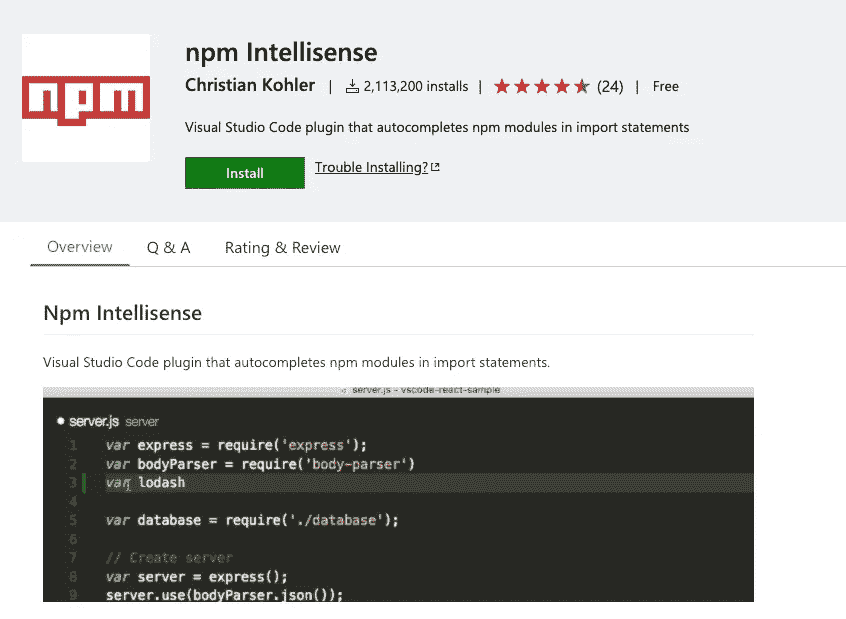

**在这里下载:**

 [## npm Intellisense — Visual Studio 市场

### 在导入语句中自动完成 npm 模块的 Visual Studio 代码插件。在命令调板中(cmd-shift-p)…

marketplace.visualstudio.com](https://marketplace.visualstudio.com/items?itemName=christian-kohler.npm-intellisense) 

## 路径智能感知

Path Intellisense 是必不可少的 VSCode 扩展之一，尤其是对于那些正在处理大型项目的人来说，它的主要功能是自动完成您试图导入的文件的路径，它会在您键入时自动显示出来。

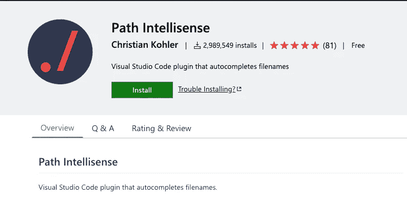

**在这里下载:**

 [## 路径智能感知

### 编辑描述

marketplace.visualstudio.com](https://marketplace.visualstudio.com/items?itemName=christian-kohler.path-intellisense) 

# 类型检查和格式

## 较美丽

漂亮是负责格式化代码，它确保你的代码是清晰的，干净的，可读的，而不需要你强调的东西，特别是长而复杂的代码文件。几年前，开发人员花了很多时间来确保代码适当缩进，空白，以确保其他开发人员不会很难理解事情，而 prettier 做得很好，拯救了我们所有人。

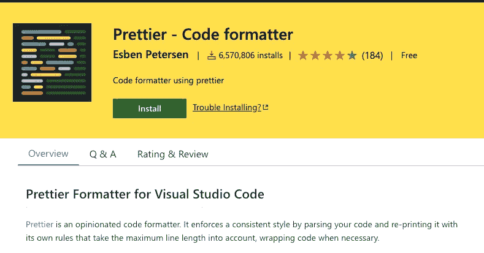

**在这里下载:**

 [## 更漂亮—代码格式化程序

### 编辑描述

marketplace.visualstudio.com](https://marketplace.visualstudio.com/items?itemName=esbenp.prettier-vscode) 

## 括号对着色程序 2

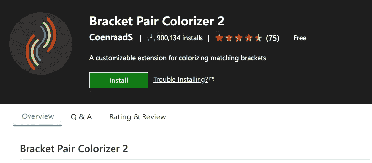

**在这里下载:**

 [## 括号对着色程序 2

### 这种扩展允许用颜色来识别匹配的括号。用户可以定义匹配哪些令牌，并且…

marketplace.visualstudio.com](https://marketplace.visualstudio.com/items?itemName=CoenraadS.bracket-pair-colorizer-2) 

## 巴别塔 JavaScript

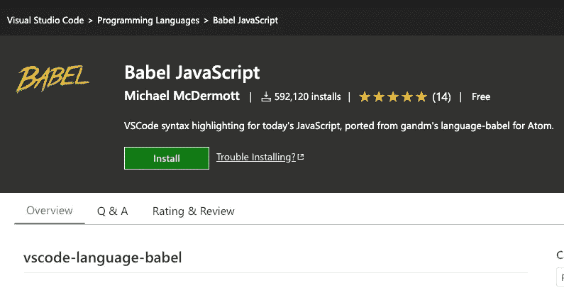

**在这里下载:**

 [## 巴别塔 JavaScript

### 编辑描述

marketplace.visualstudio.com](https://marketplace.visualstudio.com/items?itemName=mgmcdermott.vscode-language-babel) 

## npm

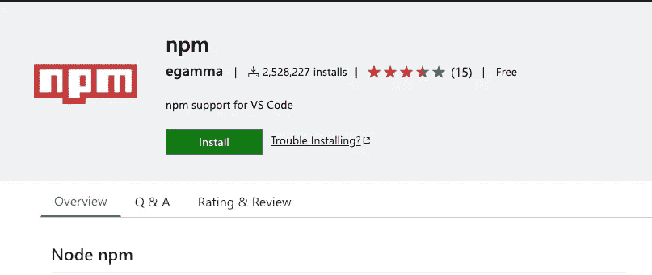

当在 vs 代码中使用 JavaScript 时，我们都知道使用 node 一直是我们创建的每个项目的一部分，因此我们需要一些帮助来确保包被正确安装，npm 扩展会帮助解决包丢失不匹配版本的问题，npm 扩展会通过一个可点击的选项通知您修复特定问题。

**在这里下载:**

 [## npm — Visual Studio 市场

### 这个扩展支持运行 package.json 文件中定义的 npm 脚本，并验证安装的模块…

marketplace.visualstudio.com](https://marketplace.visualstudio.com/items?itemName=eg2.vscode-npm-script) 

## 反应原生工具

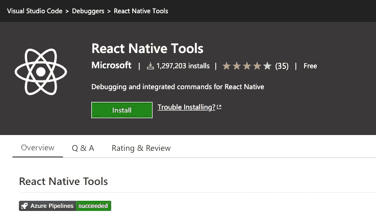

**在这里下载:**

 [## 反应原生工具

### 这个 VS 代码扩展为 React 本地项目提供了一个开发环境。使用此扩展，您可以…

marketplace.visualstudio.com](https://marketplace.visualstudio.com/items?itemName=msjsdiag.vscode-react-native) 

## 韦图尔

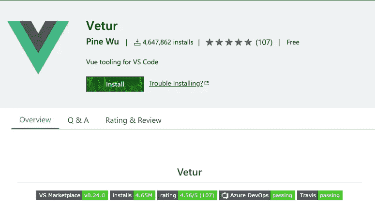

**在这里下载:**

 [## 韦图尔

### 现在就去拿。

marketplace.visualstudio.com](https://marketplace.visualstudio.com/items?itemName=octref.vetur) 

## 粘贴为 JSON

这个扩展可以帮助你快速地将 JSON 数据转换成 JavaScript 代码，没有正确格式化和空白的压力，它有一个非常简单的任务，但是让一切变得又轻又快。

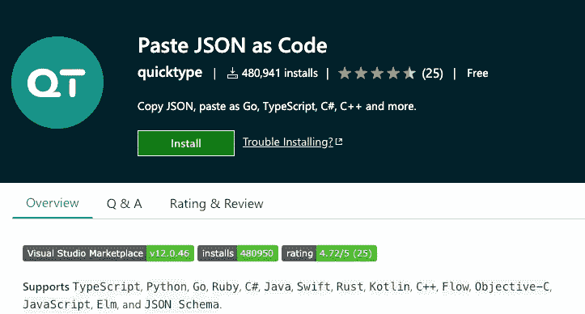

**在这里下载:**

 [## 将 JSON 粘贴为代码

### 从 JSON、JSON Schema 和 TypeScript 中交互式地生成类型和(反)序列化代码粘贴 JSON/JSON…

marketplace.visualstudio.com](https://marketplace.visualstudio.com/items?itemName=quicktype.quicktype) 

## Quokka.js

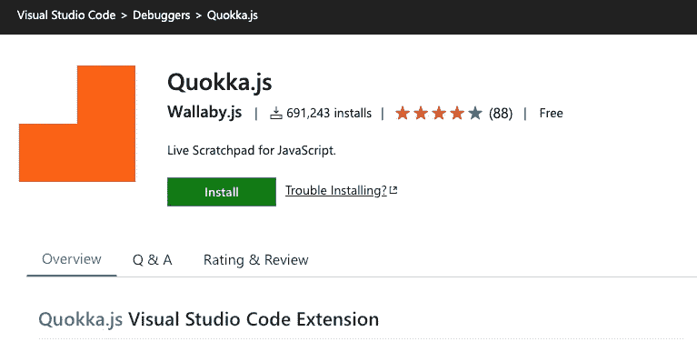

这是一个原型操场，结果会自动出现在你的 ide 中，一旦你完成代码的输入，它会在每一行显示或打印结果。

[VSCode](https://www.google.com/url?sa=i&url=https%3A%2F%2Fmarketplace.visualstudio.com%2Fitems%3FitemName%3DWallabyJs.quokka-vscode&psig=AOvVaw04mWOeLUAWKU9vyjL5Qr9Q&ust=1590136837444000&source=images&cd=vfe&ved=0CAIQjRxqFwoTCIilg9DHxOkCFQAAAAAdAAAAABAD)

**在这里下载:**

 [## Quokka.js

### 现在就去拿。

marketplace.visualstudio.com](https://marketplace.visualstudio.com/items?itemName=WallabyJs.quokka-vscode) 

## VSCode 的 GraphQL

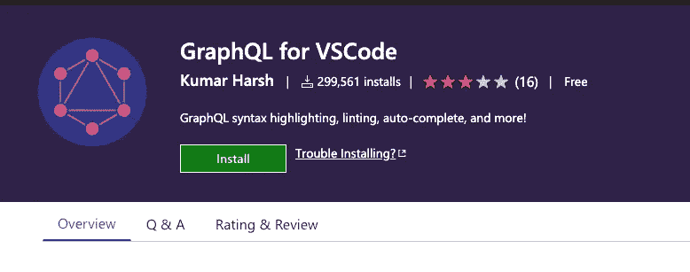

**在这里下载:**

 [## VSCode 的 GraphQL

### 编辑描述

marketplace.visualstudio.com](https://marketplace.visualstudio.com/items?itemName=kumar-harsh.graphql-for-vscode) 

# 排除故障

## Chrome 调试器

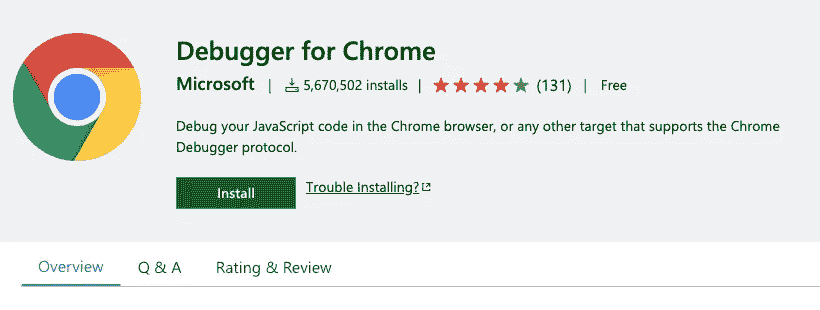

**在这里下载:**

 [## Chrome 调试器

### 编辑描述

marketplace.visualstudio.com](https://marketplace.visualstudio.com/items?itemName=msjsdiag.debugger-for-chrome) 

## 实时服务器

该工具将负责在 IDE 中代码发生变化时自动重新加载网页，而无需您一遍又一遍地重新加载网页，这将节省大量时间，要使用该工具，您只需单击“用 Live Server 打开”,正如您所见，它已被下载了 5 百万次。

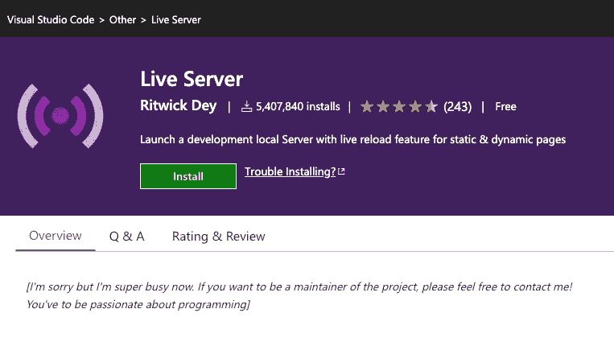

**在这里下载:**

 [## 实时服务器

### 对不起，但是我现在非常忙。如果你想成为项目的维护者，欢迎随时联系我！你已经…

marketplace.visualstudio.com](https://marketplace.visualstudio.com/items?itemName=ritwickdey.LiveServer) 

# JavaScript 开发人员的生产力工具

## 彩色高光

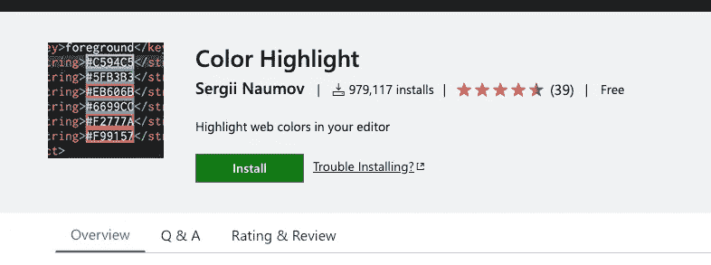

**在这里下载:**

 [## 彩色高光

### 这个扩展设计了文档中的 css/web 颜色。在 VSC 按 Ctrl+Shift+P(在 Mac 上按 Cmd+Shift+P ),然后输入…

marketplace.visualstudio.com](https://marketplace.visualstudio.com/items?itemName=naumovs.color-highlight) 

## 待办事项树

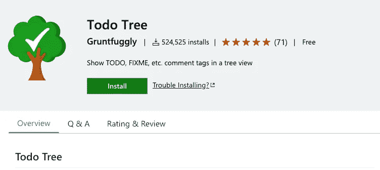

**在这里下载:**

 [## 待办事项树

### 这个扩展快速搜索(使用 ripgrep)您的工作区，寻找注释标签，如 TODO 和 FIXME，并显示它们…

marketplace.visualstudio.com](https://marketplace.visualstudio.com/items?itemName=Gruntfuggly.todo-tree) 

## 设置同步

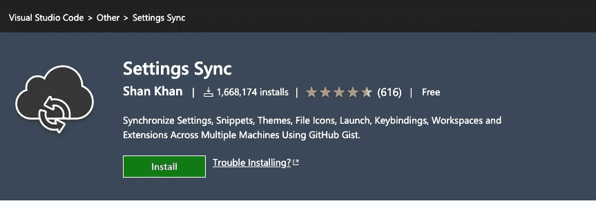

**在这里下载:**

 [## 设置同步

### 虽然是免费和开源的，但如果你觉得它有用，请考虑通过 PayPal 或 Open……

marketplace.visualstudio.com](https://marketplace.visualstudio.com/items?itemName=Shan.code-settings-sync) 

## REST 客户端

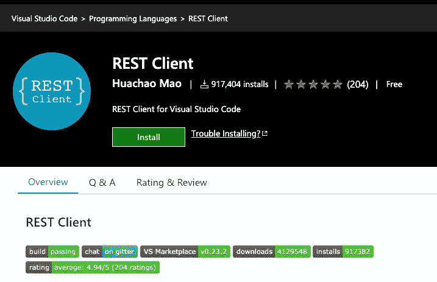

在这里下载:

 [## REST 客户端

### 编辑描述

marketplace.visualstudio.com](https://marketplace.visualstudio.com/items?itemName=humao.rest-client) 

## 缩进彩虹

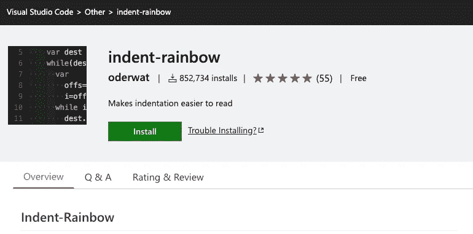

**在这里下载:**

 [## 缩进-彩虹

### 这个扩展为文本前面的缩进着色，在每一步交替四种不同的颜色。有些可能…

marketplace.visualstudio.com](https://marketplace.visualstudio.com/items?itemName=oderwat.indent-rainbow) 

## VSCode-Spotify

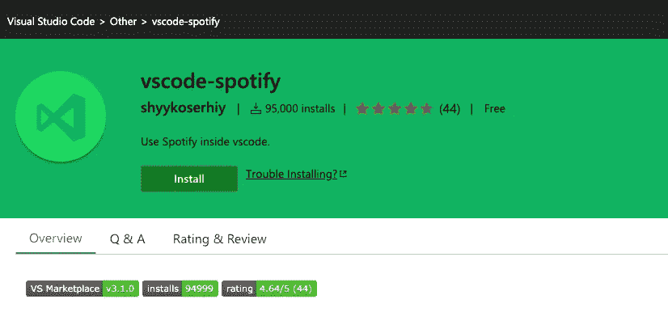

**在这里下载:**

 [## vscode-spotify

### 在 vscode 中使用 Spotify。提供与 Spotify 桌面客户端的集成。请注意，某些功能仅适用于…

marketplace.visualstudio.com](https://marketplace.visualstudio.com/items?itemName=shyykoserhiy.vscode-spotify) 

感谢您的阅读！关注我，获取更多自学成才的开发者文章。

# **简明英语团队的笔记**

你知道我们有四种出版物吗？给他们一个关注来表达爱意:[**JavaScript in Plain English**](https://medium.com/javascript-in-plain-english)[**AI in Plain English**](https://medium.com/ai-in-plain-english)[**UX in Plain English**](https://medium.com/ux-in-plain-english)[**Python in Plain English**](https://medium.com/python-in-plain-english)**——谢谢，继续学习！**

**我们还推出了一个 YouTube，希望你能通过 [**订阅我们的英语频道**](https://www.youtube.com/channel/UCtipWUghju290NWcn8jhyAw) 来支持我们**

**一如既往,“简明英语”希望帮助推广好的内容。如果您有一篇文章想要提交给我们的任何出版物，请发送电子邮件至[**submissions @ plain English . io**](mailto:submissions@plainenglish.io)**，并附上您的媒体用户名和您感兴趣的内容，我们将会回复您！****