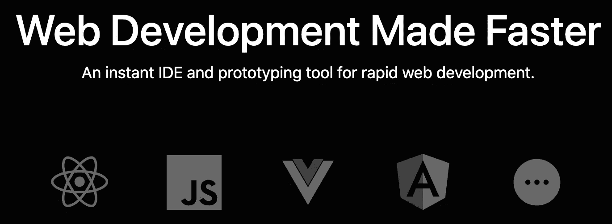
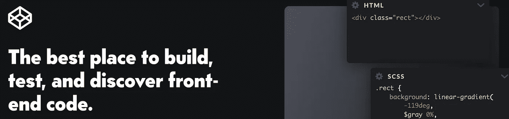
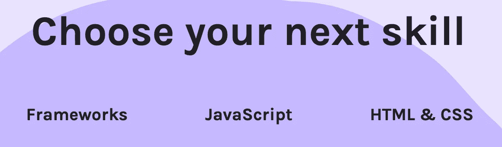
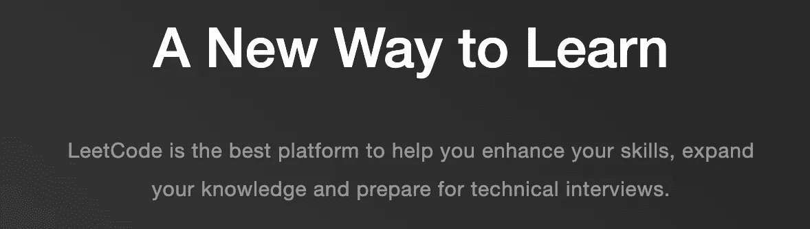
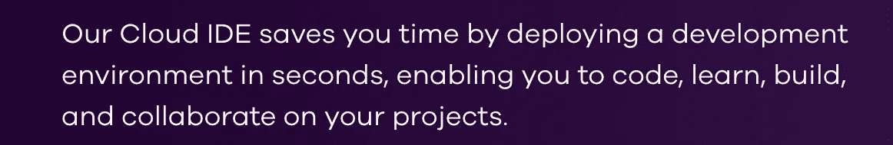

# 测试新想法的 25 个 JavaScript 平台

> 原文：<https://javascript.plainenglish.io/25-javascript-playgrounds-for-testing-new-ideas-de8735d963a7?source=collection_archive---------1----------------------->

## 测试你的新想法，甚至开发整个产品。

Photo by [Power Lai](https://unsplash.com/@welipower?utm_source=medium&utm_medium=referral) on [Unsplash](https://unsplash.com?utm_source=medium&utm_medium=referral)

如果你想在一个地方看到最好的 JavaScript playgrounds，那么这篇文章就是为你准备的。

今天，在这篇文章中，我将为你提供 25 个有用的平台，你可以用它们来支持你的发展。继续读。

# 1.CodeSandbox

有了 CodeSandbox，你所要做的就是专注于你的编码部分，把剩下的配置和设置留给编辑器。尤其是，它可以帮助你创建一个快速的演示，不仅仅是前端，还有后端，这是你几乎在其他游戏中找不到的。

官网: [https://codesandbox.io](https://codesandbox.io)

# 2.密码笔

作为一名前端开发人员，你可能听说过 Codepen。它提供了一些特性来帮助您测试、开发和与他人协作。

官网: [https://codepen.io](https://codepen.io)

# 3.JS 小提琴

JS Fiddle 更像是一个陈列室，在这里你可以找到很多有用的代码片段来加速你的项目开发。创建、测试、共享和协作是你可以在 JS Fiddle 中找到的特性。我倾向于用这个操场来演示一些像制作动画、网络运营等用例。

官方网站:【https://jsfiddle.net 

# 4.斯塔克布里茨

如果你喜欢用 [VSCode](https://medium.com/javascript-in-plain-english/9-great-javascript-extensions-for-visual-studio-code-to-speed-up-your-development-8b3275248718) 构建伟大的网站，你也会喜欢 StackBlitz。事实上，它由 VSCode 提供支持，并附带了一些功能，使您能够在几秒钟内创建自己的项目。此外，您还可以使用共享 URL 与同事协作。

官方网站:[https://stackblitz.com](https://stackblitz.com)

# 5.JS Bin

JS Bin，简单的用户界面，易于使用，提供了一系列强大的功能来尽可能快地创建、测试和分享你的想法。除了 JavaScript、HTML 和 CSS 之外，还提供了许多其他处理器，如 less、SCSS、JSX、TypeScript 等。

官方网站:[https://jsbin.com](https://jsbin.com)

# 6.Liveweaver

Liveweaver 与其他游乐场的不同之处在于，它不仅面向开发者，也面向没有任何编码技能的设计师。怎么会？设计师只是做好自己的工作，设计，把编码部分留给 CSS explorer、Color explorer、Vector Graphics Editor 等工具，这些工具会生成与设计师创造的东西相对应的代码。

官方网站:[https://liveweave.com](https://liveweave.com)

# 7.SourceLair

SourceLair 拥有开发网站产品所需的一切。您可以在客户端使用 JavaScript，在服务器端使用 PHP，甚至可以使用数据库。

官方网站:[https://ide.sourcelair.com](https://ide.sourcelair.com)

# 8.Rendera

Rendera 是一个非常简单的游乐场。然而，如果您想快速测试您的 JavaScript，您可以开始了。

官方网站:【http://rendera.herokuapp.com 

# 9.游戏代码

Playcode，快速而干净，是一种快速而简单的测试代码的方法。

官网: [https://playcode.io](https://playcode.io)

# 10.斯克林巴

Scrimba 不仅仅是一个编辑。这是一个在线编码学院。在每节课中，您都会看到代码示例，并聆听教师解释代码是如何工作的。它允许你在编写作业时观看名为“scrims”的课程视频，并立即看到结果。

官网:[https://scrimba.com](https://scrimba.com)

# 11.JSitor

JS Fiddle 和 JS Bin 编写和共享代码片段的替代方案。

官方网站:[https://jsitor.com](https://jsitor.com)

# 12.网络制造商

使用 Web Maker 不需要互联网。另外，这个游乐场提供了一个很好的 Chrome 扩展。如果你正在寻找一个离线编辑器，这就是你所需要的。

官网: [https://webmaker.app](https://webmaker.app)

# 13.LeetCode

不仅仅是 JavaScript，LeetCode 支持 14 种编程语言。这是一个测试和提高您的编码技能和扩展您的知识的好地方。

官方网站:[https://leetcode.com](https://leetcode.com)

# 14.回复它

Repl .它为您准备了一个实际的 IDE 来节省您设置开发环境的大量时间。

官方网站: [https://repl.it](https://repl.it)

# 15.弗莱姆斯

需要一个地方来快速测试你的想法并分享代码片段吗？到弗雷姆来。

官网: [https://flems.io](https://flems.io)

# 16.CSS 甲板

不要让名字欺骗了你。不仅仅是 CSS 的问题。它包括我们的三个好朋友 HTML、JavaScript 和 CSS。

官方网站:[http://cssdeck.com](http://cssdeck.com)

# 17.玩水

看起来 Dabblet 专注于 CSS 部分，但是你也可以尝试 HTML 和 JavaScript。

官方网站:[https://dabblet.com](https://dabblet.com)

# 18.共铺

Codeply 使前端开发更容易。它让你测试一些前端框架，看看什么最适合你的项目。

官方网站:[https://www.codeply.com](https://www.codeply.com)

# 19.扑通一声

Plunker 为您提供了一个与其他开发者合作以及与社区分享您的想法的地方。你可以在 Github 上找到 Plunker 的[源代码。](https://github.com/filearts/plunker)

官方网站:【https://plnkr.co 

# 20.小故障

您和其他开发人员可以使用 Glitch 同时处理同一个项目。

官网:[https://glitch.com](https://glitch.com)

# 21.柯丁

Koding 自带干净的界面，设计精良。预制的开发环境将节省您使用 Koding 的时间。

官方网站:[http://www.koding.com](http://www.koding.com)

# 22.跑步装备

简而言之，RunKit 帮助您在浏览器中尝试任何 Node.js 包。

官方网站:[https://npm.runkit.com](https://npm.runkit.com)

# 23.卡塔科达

Katacoda 是一个向社区展示你的产品的实时互动环境。它更像是一个除了 JavaScript 之外还有很多语言的学习平台。

官方网站:[https://www.katacoda.com](https://www.katacoda.com)

# 24.Codeanywhere

Codeanywhere 是一个强大的跨平台 IDE。如果你是一名网络开发人员，这将是你的最佳选择。

官方网站:[https://codeanywhere.com](https://codeanywhere.com)

# 25.最后但同样重要的是:浏览器控制台

有时候，一个游乐场不需要那么专业。Chrome 或 Firefox 浏览器控制台是你所需要的。事实上，这是测试一个想法或发现错误的最快方法。

你最喜欢的游乐场不在这里吗？请在下面留言，我会尽快把它添加到列表中。

 [## 15 种简单的编码技术，用更短的 JavaScript 代码完成任务

### 不要浪费时间写长代码，而你可以把它写得更短，更清晰，更易读。

medium.com](https://medium.com/javascript-in-plain-english/15-simple-coding-techniques-to-get-your-tasks-done-with-shorter-code-in-javascript-59d46801db0) 

## 简单英语的 JavaScript

喜欢这篇文章吗？如果有，通过 [**订阅获取更多类似内容解码，我们的 YouTube 频道**](https://www.youtube.com/channel/UCtipWUghju290NWcn8jhyAw) **！**