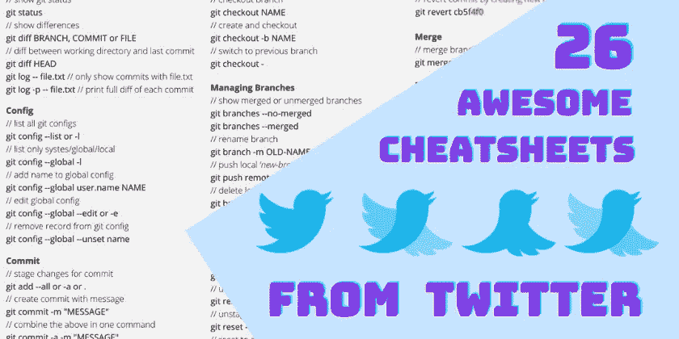

# 来自 Twitter 的 26 个超赞的小抄

> 原文：<https://javascript.plainenglish.io/26-awesome-cheatsheets-from-twitter-1fe6049aacd6?source=collection_archive---------13----------------------->

在这里，我从 Twitter 上收集了一份非常有用的备忘单。

鸣谢:[普拉塔姆·普拉松](https://twitter.com/PrasoonPratham)，[贾丁·拉奥](https://twitter.com/iamjatinrao)，[三叶虫帕里达](https://twitter.com/TechParida)，[苏尼尔·库马尔](https://twitter.com/sunilc_)，[普罗富尔·萨丹吉](https://twitter.com/profulsadangi)，[悉达多·克姆 1](https://twitter.com/siddharthkmr1) 。

我强烈推荐关注他们，因为他们会定期提供高质量的内容。

## 1.Windows 快捷方式

## 2.Mac 快捷方式

## 3.Linux 文件系统

## 4.Chrome 快捷键

## 5.虚拟代码快捷方式

## 6.降价语法

## 7.终端命令

## 8.Git 命令

## 9.引导规则

## 10.CSS 网格规则

## 11.FlexBox 规则

## 12.CSS 选择器

## 13.JavaScript 运算符

## 14.JS 字符串方法

## 15.JS 数组方法

## 16.JS 对象方法

## 17.JS 日期格式

## 18.JS DOM

## 19.代码调试

## 20.状态代码

## 21.NPM 命令

## 22.纱线指令

## 23.Docker 命令

## 24.正则表达式

## 25.数据库类型

## 26.Heroku 命令

我希望你喜欢这本书！随时关注我的 [Twitter](https://twitter.com/madzadev) 、 [LinkedIn](https://www.linkedin.com/in/madzadev/) 、 [GitHub](https://github.com/madzadev) 、 [Hashnode](https://hashnode.com/@madza) 和 [DEV](https://dev.to/madza) ！更多信息，请通过 [hi@madza.dev](mailto:hi@madza.dev) 联系我。

喜欢这篇文章吗？如果有，通过 [**订阅获取更多类似内容解码，我们的 YouTube 频道**](https://www.youtube.com/channel/UCtipWUghju290NWcn8jhyAw) **！**