# 面向开发人员和设计人员的 27 种免费资源

> 原文：<https://javascript.plainenglish.io/27-free-resources-for-developers-and-designers-aaa9019abed?source=collection_archive---------4----------------------->

## 许多免费资源您可以从今天开始使用

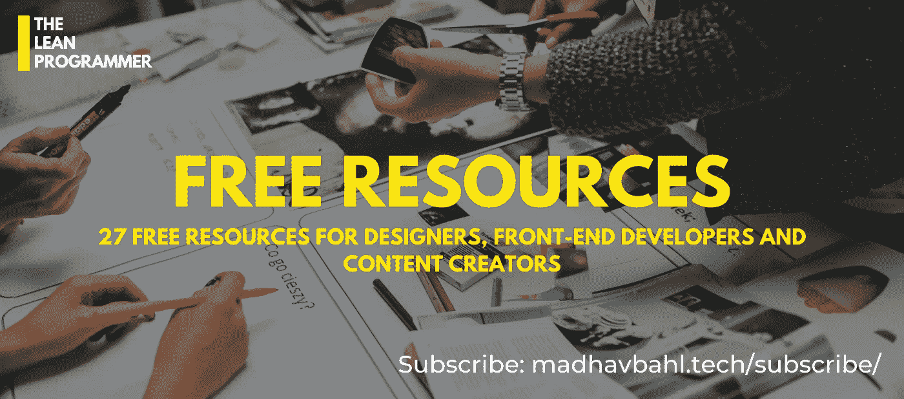

设计是你的产品、服务或内容的外观，没有好的设计，即使内容是惊人的，也有可能无法吸引更多的观众“看一看”。

但是，互联网上有如此多的工具使我们的生活(作为一名设计师/前端开发人员或内容创作者)变得更加容易，我将在这个博客中谈论我使用的许多工具。

Did someone say “design”?

这么多年来，我一直在制作内容，采取免费措施，曾经让我害怕的一件事是海报和信息图表。

我总是想把时间花在制作内容上，而不是担心宣传海报，然后我开始在互联网上搜索可以帮助我的工具，并发现了一些令人惊讶的工具。

慢慢地，我发现了我们可以使用的免费和开源的矢量、图像和设计灵感。如果你和我一样，相信我，这个博客会让你的生活变得更加轻松(͜ʖ)

但是等等，我打赌除了这些还有很多资源，所以如果你遇到一个，也在评论中提到它，我会编辑这篇文章，添加更多，当然，我会给你适当的学分。

我们开始吧！

既然说的是设计，那就提一些你可以从中获取设计灵感的来源吧。

我知道从零开始设计海报是非常困难的，所以也许，你可以了解一下最近的流行趋势。

但是请记住，只接受灵感，确保你的内容/海报/设计是原创的！

# 1.行为

> [https://www.behance.net/](https://www.behance.net/)

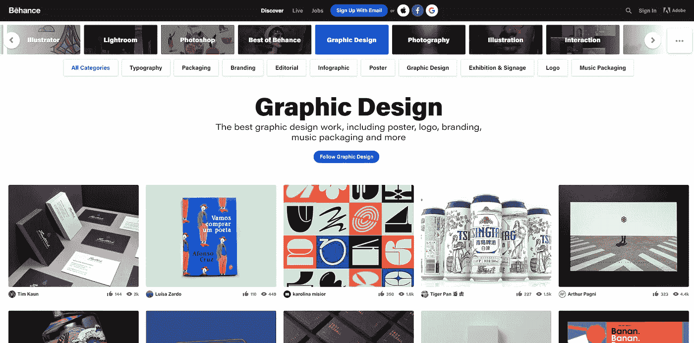

如果你正在寻找一些平面设计，排版，品牌，用户界面设计等方面的灵感。Behance 是一个很棒的起点。

作为像 Adobe 这样的大公司的一部分，它有一个巨大的社区，你可以得到很多想法，如果你擅长设计，为什么不把你的内容放在这里呢？它能让你受欢迎。

# 2.拼趣

> https://pinterest.com

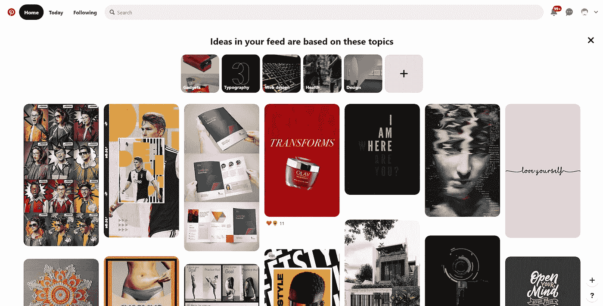

更像是一个设计师的社交媒体网站，你可以在这里得到一些真正令人惊叹的设计。

此外，您可以选择您感兴趣的标签或主题来获得日常设计灵感。

# 3.运球

> 【https://dribbble.com/ 

再次，一个非常惊人的网站，寻找不同领域的顶级设计。

如果你是一名用户界面设计师，你可能想在这个网站上看看一些顶级的移动/网页设计。

谈到设计，你可能已经注意到，带有矢量和插图的设计看起来很酷，不是吗？

不管是移动应用程序设计，还是网页设计，人们都在大量使用矢量。

好消息是，有许多网站为你提供免费的开源矢量，你可以在你的项目中使用。

# 4.拉开

> [https://undraw.co/](https://undraw.co/)

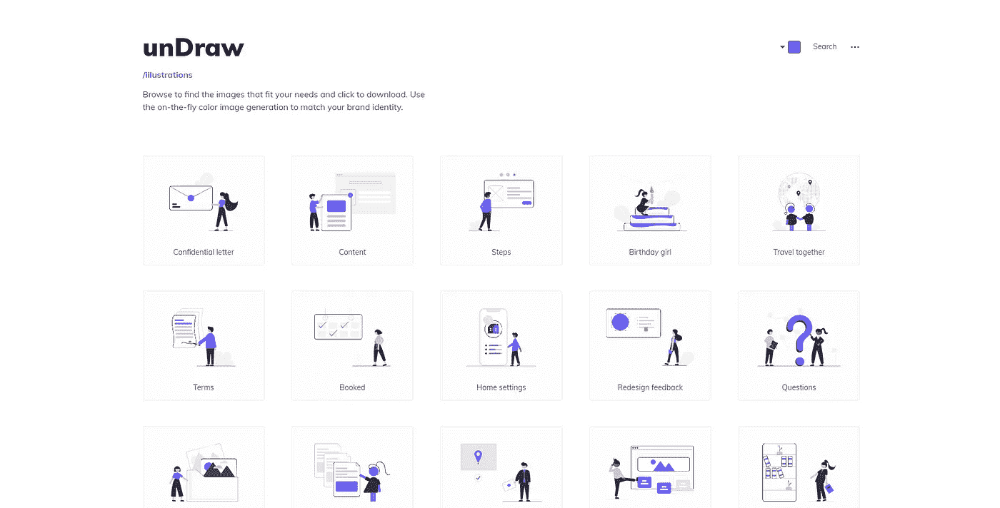

我可以说这是为你的项目寻找载体的最好的网站。

我已经在我的兼职项目中使用这些很长时间了，我可以说它们为你的所有需求提供了一个载体。

简单易用，下载简单，试试吧。

# 5.自由插图 xyz

> 【https://freeillustrations.xyz/ 号

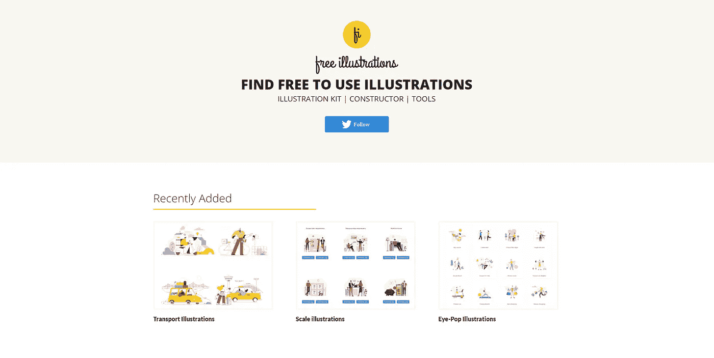

尽管我最喜欢的是 undraw，但我非常喜欢自由插画，它们有广泛的载体可以匹配你的故事。

例如，上面截图中提到的交通插图是 12 幅插图的集合，如果你正在进行一项活动，或者制作一个与交通相关的应用程序，这可能会非常有用。

# 6.脸红

> 【https://blush.design/ 

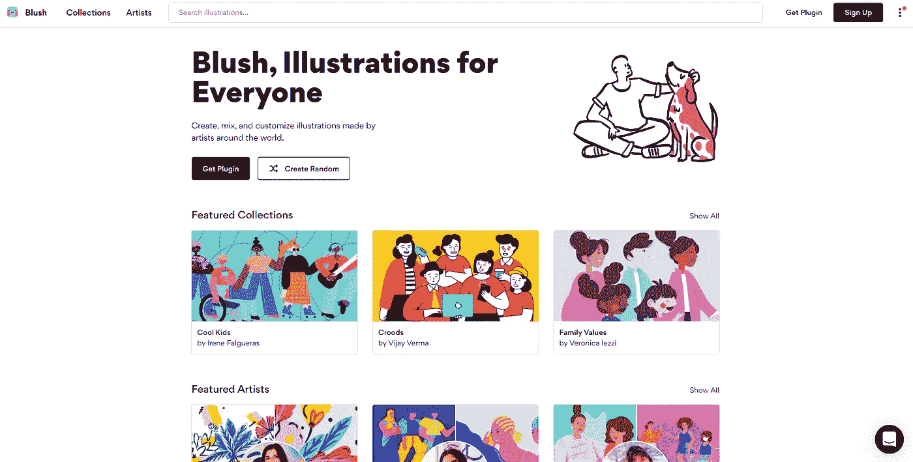

腮红上惊人的插画合集绝对会让你超级兴奋。

你会在下一个兼职项目中尝试它们吗？

# 7.绘图工具包

> [https://www.drawkit.io/](https://www.drawkit.io/)

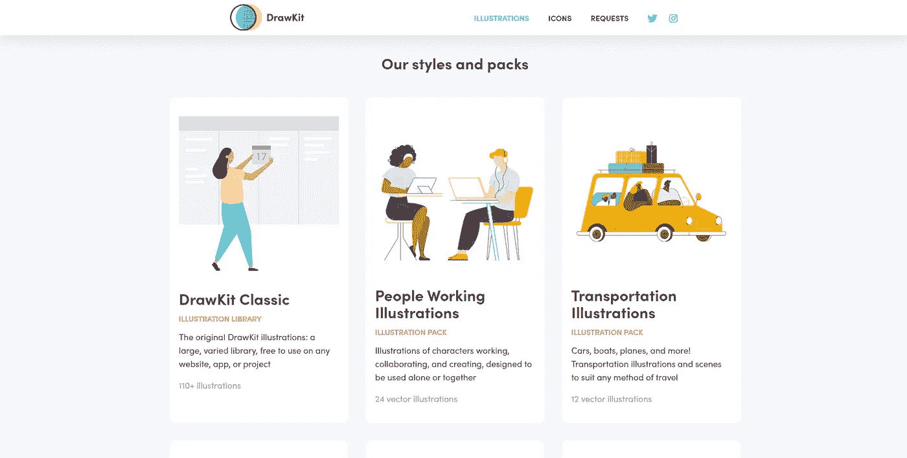

各种插图包和库的集合，你一定可以在这里找到很多很酷的 SVG。

# 8.卢卡斯·亚当

> [https://lukaszadam.com/illustrations](https://lukaszadam.com/illustrations)

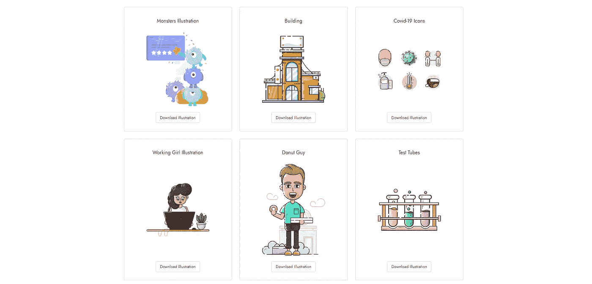

即使是商业项目也完全免费，Lukaszadam 提供了许多精彩的插图

# 9.哎呦图片

> [https://icons8.com/illustrations](https://icons8.com/illustrations)

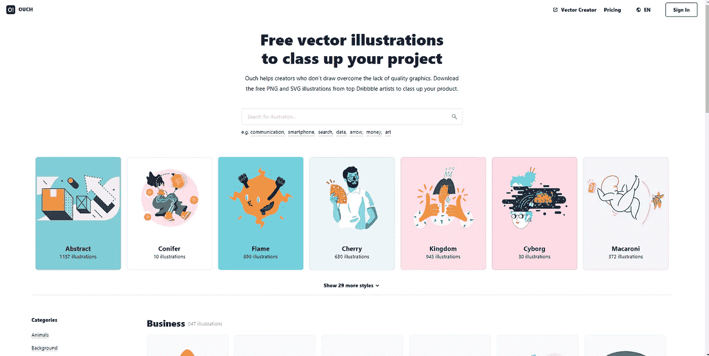

从抽象到通心粉，这个网站将为你的所有需求提供 SVG，一定要去看看。

# 10.人类

> [https://www.humaaans.com/](https://www.humaaans.com/)

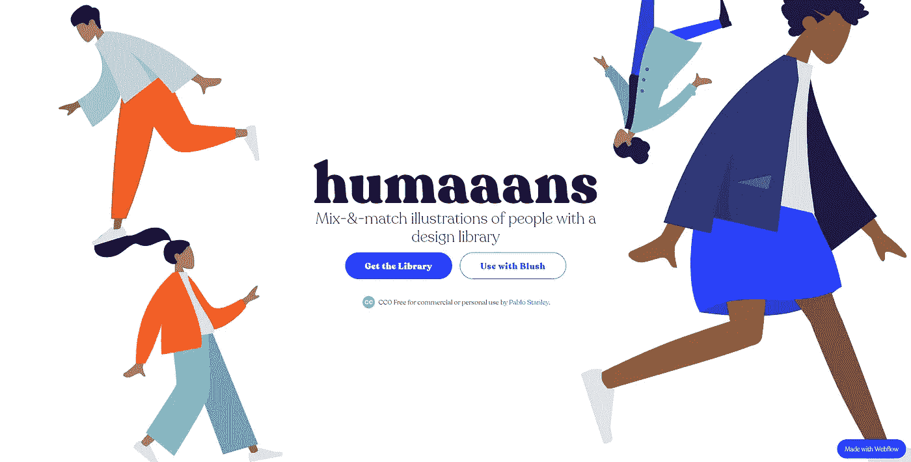

他们的登陆页面太吸引我了！

他们在登陆页面上提到了这一点，每个场合都有插图。

# 11.弗里皮克

> [https://www.freepik.com/](https://www.freepik.com/)

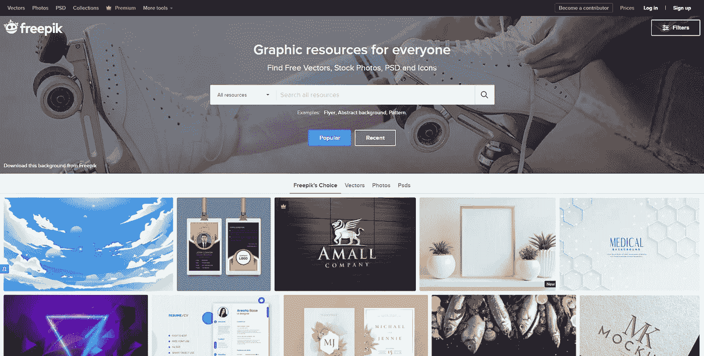

是的，我把它留到了矢量类的最后，矢量是设计师最好和最常用的资源之一，你可以在这里找到矢量，海报，平面设计，库存照片，PSDs，甚至图标。

现在你有这么多地方可以为你的下一个项目找到插图，你会兴奋地使用它们吗？

好了，现在我们已经看到了哪里可以找到设计灵感，哪里可以找到插图，让我们看看哪里可以找到一些很酷的图标。

# 12.简单图标

> [https://simpleicons.org/](https://simpleicons.org/)

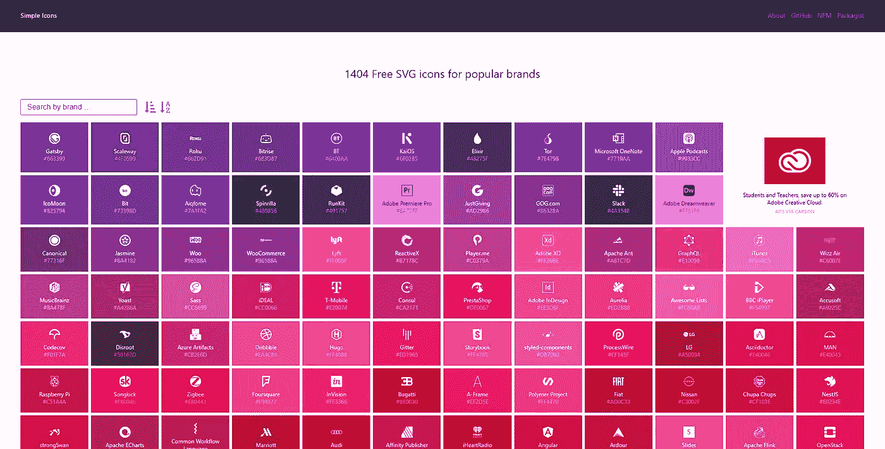

想在你的设计中使用任何著名品牌的图标吗？你可以在简单的图标上找到几乎所有的内容，而且是免费的。

# 13.字体真棒

> [https://fontawesome.com/](https://fontawesome.com/)

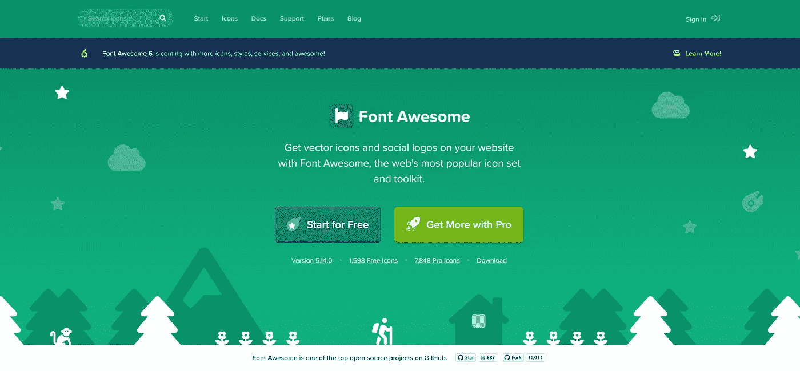

说到图标，怎么才能忘记字体牛逼？

为你的网站寻找矢量图标和社会标志的最著名的地方之一。

# 14.平面图标

> 【https://www.flaticon.com/ 号

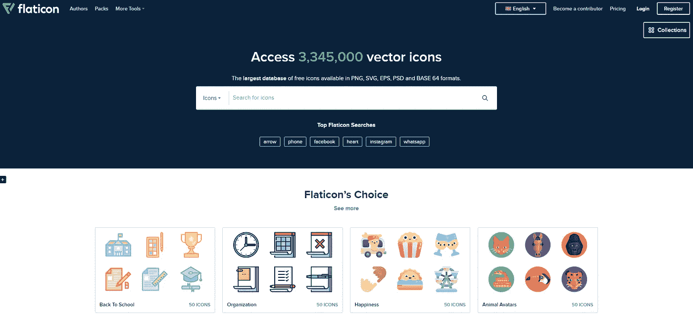

flaticon 拥有超过 3，345，000 个矢量图标，号称是最大的免费图标数据库。

但是，它不是完全免费的，所以，是的，在这里使用矢量图标之前，确保它们可以免费使用。

到目前为止，我们已经讨论了这么多东西，但是既然我们正在讨论插图和矢量图标，我们怎么能忘记动画呢，让我们也来看看吧。

# 15.动画图标

> 【http://animaticons.co/ 

美丽的，可定制的动画 GIF 图标，几乎可以在任何地方工作，并且易于使用。

# 16.洛蒂菲莱斯

> [https://lottiefiles.com/](https://lottiefiles.com/)

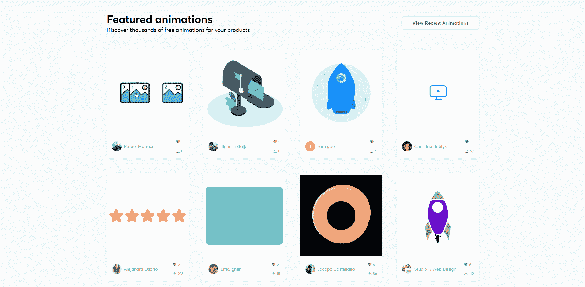

让我们看看他们怎么说-

> Lottie 是一种与众不同的开源动画文件格式。它体积更小，质量更高，允许你创建可以互动的动画。

我们已经涵盖了这么多的资源，但是，我们错过了一个巨大的领域，股票照片，让我们看看各种资源，你可以免费获得它们。

您将需要这些用于许多目的，

设计师？您可能需要在您的海报中添加一个
开发者？网站和应用程序也包含图像
内容创建者？你的博客/帖子/宣传海报可能需要这个

# 17.不溅

> [https://unsplash.com/](https://unsplash.com/)

我不知道我用了多少次这个网站上的照片，这可能是最好的资源之一。

# 18.免费照片

> [https://freephotos.cc/en](https://freephotos.cc/en)

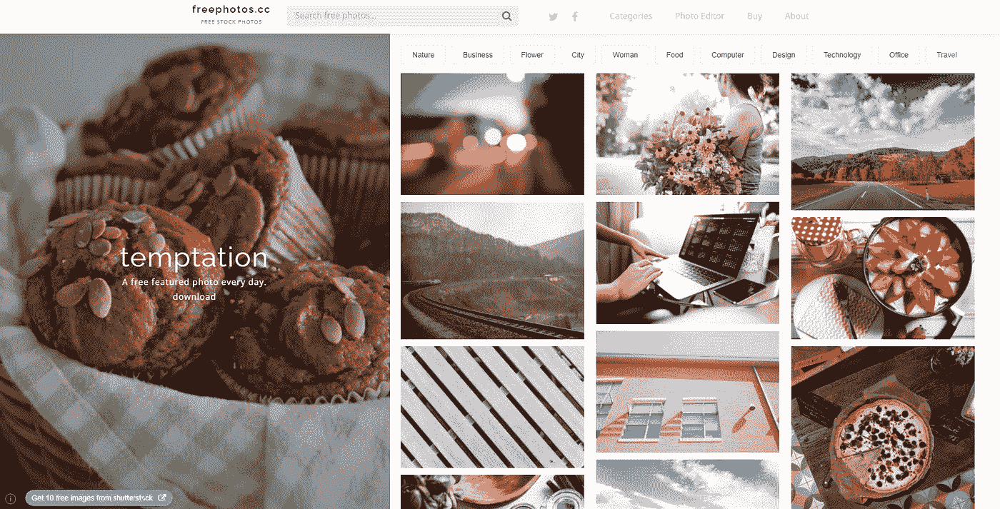

满足您所有需求的免费库存照片。

# 19.爆发

> [https://burst.shopify.com/](https://burst.shopify.com/)

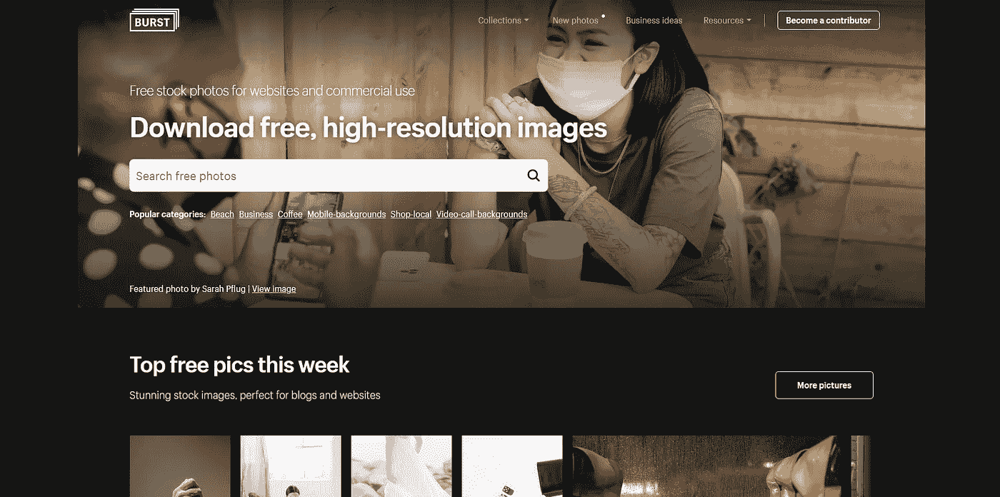

免费的高分辨率图像，供个人和商业使用，这个网站有一个伟大的图像集合。

# 20.照片创建者

> [https://photos.icons8.com/creator](https://photos.icons8.com/creator)

想要一张别人没有的独特的海报/网站照片吗？创建一个。照片创建器允许您创建自己定制的库存照片。

到目前为止，我们已经讨论了这么多类别，

*   设计灵感
*   插图
*   矢量图标
*   动画片
*   库存照片

但是，我们忽略了一些你作为设计师需要的重要东西。猜一猜？

是的，你猜对了，字体。说到字体，这两个是很棒的资源，看看吧-

# 21.谷歌字体

> [https://fonts.google.com/](https://fonts.google.com/)

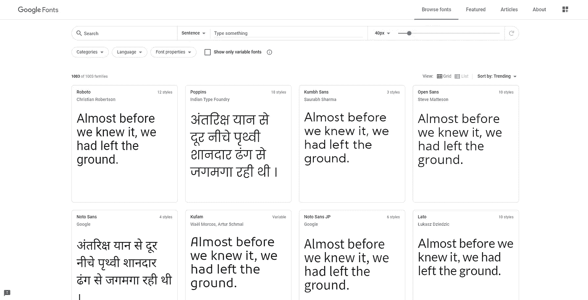

有这么多免费的和神奇的字体可以使用，我打赌你已经知道谷歌字体，但如果你不去看看。

# 22.达丰

> https://www.dafont.com/

为你的下一张海报寻找一些好的字体？查看 DaFont 上的热门字体。

这是一个巨大的资源列表，但是坚持住，最好的还在后面。

我们已经看了几乎所有的东西，但是等等，我们还缺少一些重要的东西。实际进行设计的工具。

不是每个人都可以拥有 Adobe Photoshop 和/或 Illustrator，它们是昂贵的软件，但不要担心，有许多免费的在线替代品！

让我们看看一些免费的设计工具，它们可以帮助你进行下一个海报设计、用户界面设计或信息图设计。

# 23.坎瓦

> 【https://www.canva.com/ 

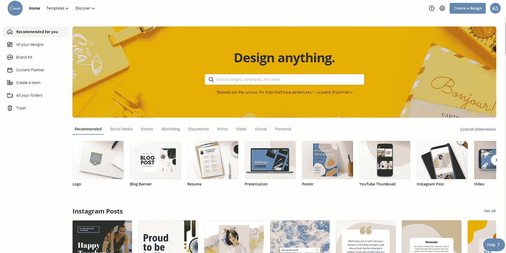

寻找适合您的设计

*   Instagram 帖子
*   标志；徽标
*   海报
*   报告
*   电子书
*   YouTube 缩略图
*   脸书邮报
*   卡片
*   博客横幅

或者其他什么设计？

Canva 为你提供了几乎所有的模板，去看看吧。

# 24.光环境

> [https://www.photopea.com/](https://www.photopea.com/)

看一下界面-

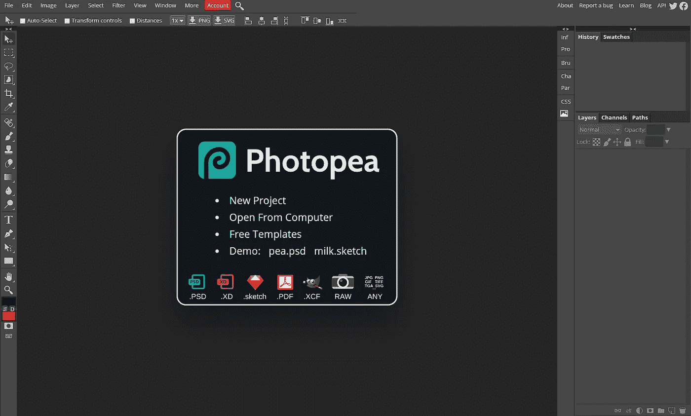

这让你想起什么了吗？

PHOTOSHOP！

是的，Photopea 为您提供了与 Adobe Photoshop 非常相似的界面和功能，而且还是免费的！

# 25.Adobe XD

> [https://www.adobe.com/products/xd.html](https://www.adobe.com/products/xd.html)

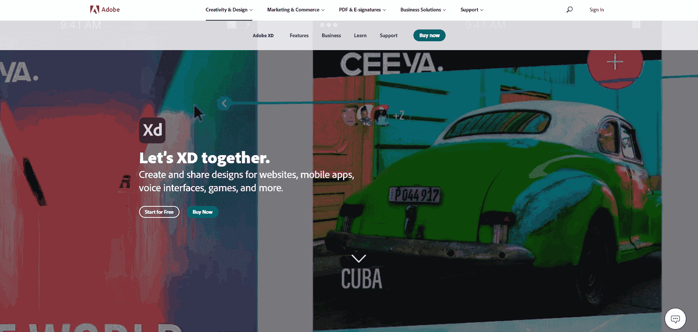

喔，是的，终于有免费的 Adobe 产品了。

我已经用这个产品很长时间了，我不能欣赏它。

用户界面/UX 设计，线框，原型，海报设计，这个软件可以让你用一个非常简单易用的界面几乎一切。我爱 Adobe XD。

# 26.视觉

> [https://www.invisionapp.com/](https://www.invisionapp.com/)

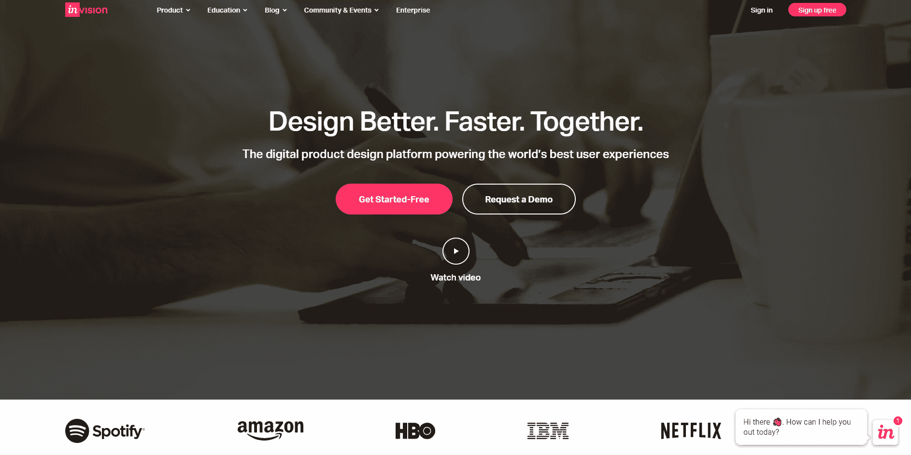

一个非常强大的设计工作室，个人免费使用。

# 27.菲格玛

> [https://www.figma.com/](https://www.figma.com/)

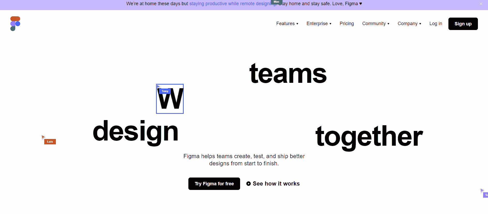

免费供个人使用(最多 3 个项目)并且非常类似于 Adobe XD，这个产品在 UI/UX 设计方面非常有用。

我们已经走了很长的路，不是吗？

既然你设法一直读到这里，我将为你提到一个额外的资源(͡~ ͜ʖ ͡)

上面提到的资源可以帮助你几乎所有的事情，但还有一件事，就是“颜色组合”

这是今天的最后一个资源，一个为你的项目/海报挑选颜色组合的神奇网站。

# 彩色狩猎

> [https://colorhunt.co/](https://colorhunt.co/)

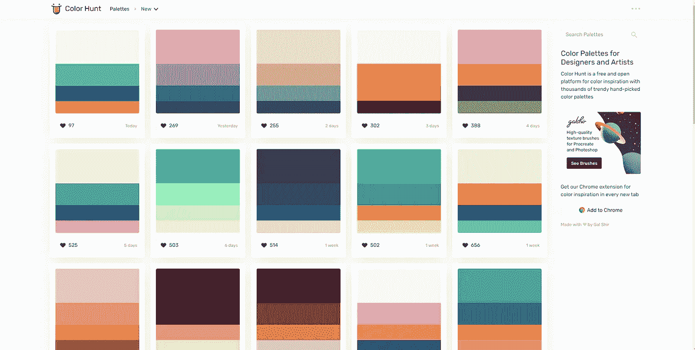

数百个调色板，我相信你会用这个网站来做你的下一个项目。

# 摘要

让我们看看我们在博客中提到的所有资源-

## 设计灵感

*   行为
*   拼趣
*   运球

## 插图

*   拉开
*   免费插图
*   脸红
*   绘图工具包
*   卢卡斯·亚当
*   哎呦图片
*   人类
*   弗里皮克

## 核标准情报中心

*   简单图标
*   字体真棒
*   平面图标

## 动画片

*   动画图标
*   洛蒂菲莱斯

## 库存照片

*   不溅
*   免费照片
*   爆发
*   照片创建者

## 字体

*   谷歌 Gonts
*   达丰

## 设计工具

*   坎瓦
*   光环境
*   Adobe XD
*   视觉
*   菲格玛

## 颜色组合

*   彩色狩猎

就这样，我希望你喜欢这篇文章。如果上面提到的资源对你有帮助，请告诉我，不要忘记评论更多你用于设计的资源。

*Web:*[*http://madhavbahl.tech/*](http://madhavbahl.tech/) *insta gram:*[*https://www.instagram.com/theleanprogrammer/*](https://www.instagram.com/theleanprogrammer/) *LinkedIn:*[*https://www.linkedin.com/in/madhavbahl/*](https://www.linkedin.com/in/madhavbahl/) *Github:*[*https://github.com/MadhavBahlMD*](https://github.com/MadhavBahlMD) *邮箱:theleanprogrammer@gmail.com*