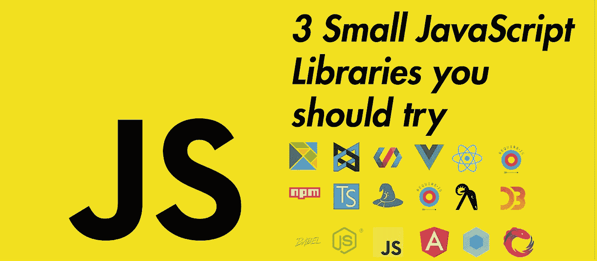
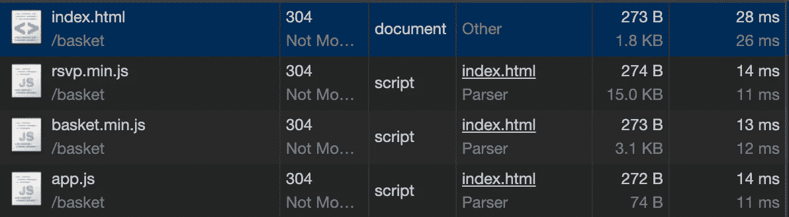

# 你需要尝试 3 个很棒但很小的 JavaScript 库

> 原文：<https://javascript.plainenglish.io/3-awesome-but-small-javascript-libraries-you-need-to-try-d43df5c0b5dd?source=collection_archive---------1----------------------->



Every second a new JS library appears :)

JavaScript 有许多并且不知何故以它们为基础——库。
我想每个人都已经对其中最重要的&最受欢迎的做了一个概述，然而却马上迷失了方向。
在这篇文章中，我将向你展示 3 个不太出名，但是非常强大的小 JavaScript 库，它们将让你的生活变得简单，而不会让你的 web 应用变得不必要的沉重。

## 好消息:我刚刚为你做了第二部分，❤

[](https://medium.com/javascript-in-plain-english/3-more-awesome-but-small-javascript-libraries-you-need-to-try-2f756ef9a2b) [## 您需要尝试 3 个更棒但更小的 JavaScript 库

### 这里还有 3 个不太出名，但是非常强大的小型 JavaScript 库，它们将使你的生活(以及…

medium.com](https://medium.com/javascript-in-plain-english/3-more-awesome-but-small-javascript-libraries-you-need-to-try-2f756ef9a2b) 

# Basket.js

[官方文件](https://addyosmani.com/basket.js/)

Basket.js 是一个极简的脚本加载器库，gzip 压缩后只有 0.7 kB。
(正如[https://github.com/addyosmani/basket.js/issues/61](https://github.com/addyosmani/basket.js/issues/61)中所说，它使用了另一个大约 5kB 的库，但仍然很小)
但是 basket.js 不仅可以加载外部 JavaScript，它还可以将它们缓存在浏览器的本地存储中，这样在下一个页面请求时，外部 JavaScript 就不必再通过网络请求，而只需从本地存储中加载即可。
但是为什么是本地存储而不是浏览器缓存呢？
首先，我个人发现在网页代码中通过 JS 库缓存 JavaScript 文件要容易得多，一般是从服务器端缓存。有了 Basket.js，现在在代码中用 JavaScript 动态控制脚本缓存变得非常容易。

**我们来试试:**
实际的 API 没那么复杂。我认为你可以自己浏览一下文档，在我们的小例子中，我们将只使用 **basket.require** ，因为它是整个库的核心。

*   `[basket.require()](https://addyosmani.com/basket.js/#basketrequire)`
*   `[basket.get()](https://addyosmani.com/basket.js/#basketget)`
*   `[basket.remove()](https://addyosmani.com/basket.js/#basketremove)`
*   `[basket.clear()](https://addyosmani.com/basket.js/#basketclear)`

使用 **basket.require** 我们可以通过 basket 加载一个 JS 文件。这个文件然后被缓存在本地存储器中，正如我已经解释的，并且下一次 basket.require 请求这个文件时，例如，当重新加载页面时，basket 将首先在缓存中查找&如果文件已经被缓存在那里，它将通过本地存储器加载文件，而不是通过网络再次请求它。

**index.html:**
在这里可以找到库:
[https://addyosmani.com/basket.js/dist/basket.min.js](https://addyosmani.com/basket.js/dist/basket.min.js)
[https://cdn.jsdelivr.net/npm/rsvp@4/dist/rsvp.min.js](https://cdn.jsdelivr.net/npm/rsvp@4/dist/rsvp.min.js)
[https://cdnjs . cloud flare . com/Ajax/libs/jquery/3 . 4 . 1/jquery . min . js](https://cdnjs.cloudflare.com/ajax/libs/jquery/3.4.1/jquery.min.js)

```
<!DOCTYPE html>
<html lang=”en”>
  <head>
    <meta charset=”UTF-8" />
    <script src=”rsvp.min.js”></script>
    <script src=”basket.min.js”></script>
    <title>Document</title>
</head>
<body>
  <script>
    basket.require({ url: '/scripts/jquery.js' })
  </script>
</body>
</html>
```

如您所见，我们首先导入 RSVP 库 Basket.js needs。然后是 Basket 本身，在主体中我们可以执行 require 函数，从某个地方加载 jQuery。
当您第一次打开页面时，您应该会看到:


jQuery is requested as normal over the network.

但是随着页面的重新加载:



jQuery is no longer listed in the Network tab. It was loaded from the local storage.

这就是全部的魔力:)

# 药丸

[官方 Github](https://github.com/rumkin/pill)

" Pill 为静态网站增加了动态内容加载功能，让用户可以流畅地加载内容."缩小压缩后大约 1 kB。
Pill 的发展始于推特:[https://twitter.com/sitnikcode/status/1109626507331338240](https://twitter.com/sitnikcode/status/1109626507331338240)
精髓:我们大多数人使用单页面应用程序来拥有网络应用程序，当我们导航时，不会加载一个全新的页面。在大多数 SPA 框架中，这是因为一切都基于一个 index.html。

但是如果我们有多个静态页面呢？药丸是解决办法。
按需获取服务器上其他 HTML 文件的内容，并用获取的新内容替换当前内容。这导致了巨大的性能提升，因为我们的应用程序不需要一个全新的页面。
重要内容只是被替换了。使用 Pill，这是自动完成的，因为它会拦截导航尝试。

关于药丸最好的事情——它有很好的记录，有很好的例子等等。所以一定要检查所有东西:[药丸示例](https://rumkin.github.io/pill/)
你可以在 GitHub 上找到代码[https://github.com/rumkin/pill/tree/master/example](https://github.com/rumkin/pill/tree/master/example)
玩药丸开心点:)

# JS-cookie

[官方 GitHub](https://github.com/js-cookie/js-cookie)

在浏览器中使用 cookies 可能会相当费力。JS-cookies 使这变得容易多了，现在我们将通过基本的。

通过 CDN 实现:

```
<script src="https://cdn.jsdelivr.net/npm/js-cookie@beta/dist/js.cookie.min.js"></script>
```

设置一个名为“name”的 cookie 键，其值为“Max”

```
Cookies.set(‘name’, ‘Max’)
```

用关键字“name”获取 cookie 的值

```
Cookies.get(‘name’) // 'Max'
```

创建 cookie，让它在 7 天后过期

```
Cookies.set('name', 'Max', { expires: 7 })
```

删除 cookie

```
Cookies.remove(‘name’)
```

获取所有 cookies

```
Cookies.get() // { name: 'Max' }
```

## [加入我的邮件接收一切，你感兴趣的](http://eepurl.com/hacY0v)

## **感谢您的阅读！关于我，作者:)**

嗨！非常感谢您的阅读，我叫路易斯，是一名来自德国的 18 岁学生。我热爱 Web 开发，包括后端和前端。我最喜欢的技术是 React、Vue、React Native 和 node . js。
请务必关注我，了解更多相关内容，并随时查看我的 IG @ Louis . jsx&@ codingcultureshop
祝您愉快&随时给我留下您的反馈！