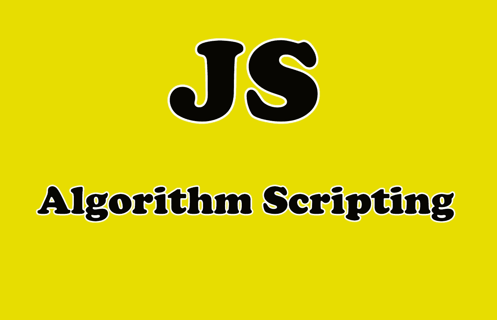

# 3 个初级 JavaScript 算法来提高你的编码技能

> 原文：<https://javascript.plainenglish.io/3-beginner-javascript-algorithms-to-improve-your-coding-skills-9e769ed1ffd9?source=collection_archive---------2----------------------->

## JavaScript 算法来提高你解决问题的技能


Photo by [Olav Ahrens Røtne](https://unsplash.com/@olav_ahrens?utm_source=medium&utm_medium=referral) on [Unsplash](https://unsplash.com?utm_source=medium&utm_medium=referral)

# 介绍

算法是解决问题或实现特定结果所遵循的一系列步骤。解决一个算法，首先要了解问题，然后用编码来解决。

为了使求解算法更容易，你需要将它们分解成小部分。那么单独解决每个部分会比解决整个问题容易很多。算法非常重要和有用，它们教会你如何解决编码问题，让你成为一名优秀的程序员。

在本文中，我们将尝试一些简单的 JavaScript 算法来帮助您提高总体编码技能。让我们开始吧。



Image Created with ❤️️ By [Mehdi Aoussiad](https://mehdiouss315.medium.com/).

# 1.区分两个数组

此算法将比较两个数组，并返回一个新数组，该数组包含仅在两个给定数组中的一个数组中找到的任何项，而不是在两个数组中都找到。换句话说，返回两个数组的对称差。

我们可以有一个函数，接受两个数组作为参数，然后返回差值。

这里有一个例子:

```
//Example to explain:function diffArray(arr1, arr2) { // Code goes here.}//Examples://diffArray([1, 2, 3, 5], [1, 2, 3, 4, 5]) should return an array.// diffArray(["grass", "dirt", "pink wool", "dead shrub"],  ["grass", "dirt", "dead shrub"]) **should return** ["pink wool"].//diffArray(["diorite", "andesite", "grass", "dirt", "pink wool", "dead shrub"], ["diorite", "andesite", "grass", "dirt", "dead shrub"]) **should return** an array with one item.// diffArray([1, 2, 3, 5], [1, 2, 3, 4, 5]) **should return** [4].
```

我想你现在明白了，就用你的 JavaScript 技巧来解决问题吧。

下面是使用过滤方法的解决方案:

```
function diffArray(arr1, arr2) {
  return arr1
    .concat(arr2)
    .filter(item => !arr1.includes(item) || !arr2.includes(item));
}diffArray([1, 2, 3, 5], [1, 2, 3, 4, 5]);
```

如你所见，我们用过滤方法解决了算法。但是您可以使用其他方法。这不是唯一的选择。

# 2.脊椎穿刺盒

spinal tap 是一种句子全部小写并用破折号`-`连接的情况。

下面是一个脊椎穿刺案例句子的例子:

```
" **coding-is-life** "
```

现在，您需要编写一个算法，将字符串转换为 spinal case。

看看下面的例子:

```
function spinalCase(str) {
  //Your code goes here.
}//Examples:// spinalCase("AllThe-small Things") **should return** "all-the-small-things".
// spinalCase("This Is Spinal Tap") **should return** "this-is-spinal-tap".
```

如果您感兴趣，以下是该算法的解决方案:

```
**function** **spinalCase**(str) {   
   **return** str.split(/\s|_|(?=[A-Z])/).join("-").toLowerCase(); 
}
```

**代码解释:**

*   在下列条件之一时分割字符串(*转换为数组*)。
*   遇到空白字符[ `\s` ]。
*   遇到下划线字符[ `_` ]或后跟大写字母[ `(?=[A-Z])` ]。
*   使用连字符(`-`)加入数组。
*   小写整个结果字符串。

# 3.二元代理

对于这个算法，我们必须将一个二进制字符串转换成一个英语翻译句子。二进制字符串将以空格分隔。因此，为了求解这个算法，你需要一个 JavaScript 函数，它接受二进制字符串作为参数。如果你想了解这个问题，请看下面的例子。

```
// Algorithm Example.
function binaryAgent(str) {
  // Your code goes here.
} // Examples :

// binaryAgent("01000001 01110010 01100101 01101110 00100111 01110100 00100000 01100010 01101111 01101110 01100110 01101001 01110010 01100101 01110011 00100000 01100110 01110101 01101110 00100001 00111111") **should return** "Aren't bonfires fun!?"

// binaryAgent("01001000 01100101 01101100 01101100 01101111") **Should return** "Hello"
```

以下是它的解决方案:

```
function binaryAgent(str) {
  var biString = str.split(" ");
  var uniString = [];

  */*using the radix (or base) parameter in parseInt, we can convert the binary
      number to a decimal number while simultaneously converting to a char*/*

  for (var i = 0; i < biString.length; i++) {
    uniString.push(String.**fromCharCode**(parseInt(biString[i], 2)));
  }

  // we then simply join the string
  return uniString.join("");
}

// test here
binaryAgent(
  "01000001 01110010 01100101 01101110 00100111 01110100 00100000 01100010 01101111 01101110 01100110 01101001 01110010 01100101 01110011 00100000 01100110 01110101 01101110 00100001 00111111"
);
```

有关方法`charCodeAt`和`fromCharCode`的更多信息，您可以访问 [MDN](https://developer.mozilla.org/fr/docs/Web/JavaScript/Reference/Objets_globaux/String/charCodeAt) 文档。

# 结论

算法对于提高你的解题技巧非常重要和有用。它们帮助你成为一名优秀的开发人员，你只需要大量练习它们。

感谢您阅读本文，希望您觉得有用。如果是这样，通过 [**订阅解码获得更多类似内容，我们的 YouTube 频道**](https://www.youtube.com/channel/UCtipWUghju290NWcn8jhyAw?sub_confirmation=true) **！**

# 更多阅读

[](https://medium.com/javascript-in-plain-english/6-useful-javascript-array-methods-every-beginner-should-know-35f1db5e8491) [## 每个初学者都应该知道的 6 个有用的 JavaScript 数组方法

### 强大的 JavaScript 初学者数组方法和实际例子

medium.com](https://medium.com/javascript-in-plain-english/6-useful-javascript-array-methods-every-beginner-should-know-35f1db5e8491)