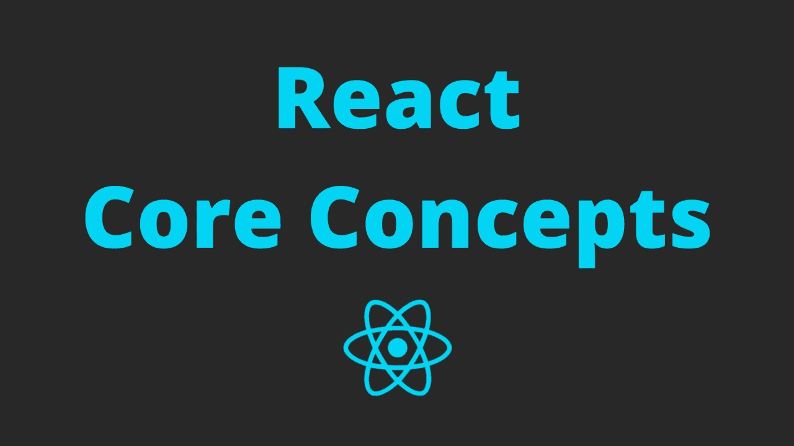

# 每个 Web 开发人员都应该理解的 3 个核心概念

> 原文：<https://javascript.plainenglish.io/3-core-react-concepts-every-web-developer-should-understand-17c85648247b?source=collection_archive---------6----------------------->

## 掌握这些将有助于你更容易地深入这个框架



在 React 中，您将学到许多概念。以下是你无论如何都应该理解的三个重要的核心概念。

让我们开始吧。

# 1.组件生命周期

组件生命周期是 React 框架的核心概念。

React 应用程序由许多单独的组件组成。像这个世界上的所有东西一样，每个 React 组件都有自己的生命周期。这意味着他们出生，开始生活，然后在某个时候死去。

组件生命周期的每个部分都被定义为一个方法。当组件存在时，它们在不同的阶段被调用。

根据你正在处理的阶段，你将做特定的任务来达到特定的目的。

那么，这些阶段是什么？

**1。componentWillMount()**

在呈现之前调用此方法。在屏幕上显示任何 UI 元素之前，使用这个方法来做好一切准备。

组件尚未安装。这个阶段没有 DOM。您不应该使用`this.setState()`进行任何异步操作或更改数据。不用急，下一阶段你会全部做完的。

**2。componentidmount()**

第一次`render()`完成后，`componentDidMount()`功能将被执行。这是变化可能发生的时候。

现在，您可以从 API 获取数据或更新状态。

要在这个阶段修改数据，可以使用`setState()`方法，这将触发另一个渲染。

**3。componentwillreceiveprops()**

这个阶段发生在道具更新之后，在执行下一个`render()`之前*。*

**4。shouldComponentUpdate()**

您可以使用此方法来确定组件是否应该更新。默认值为`true`。

为了性能，如果你确定一个组件不需要更新，那么就返回`false`。这样，它将保持与先前的状态相同，没有渲染发生。

**5。componentWillUpdate()**

此方法将在呈现前调用。

6。componentDidUpdate()

渲染后，将调用此方法。

您也可以在这个阶段更新 DOM。但是请记住检查先前状态的属性更改，以确保不会出现无限循环。

7。componentWillUnmount()

当组件从 DOM 中卸载时，这个方法将被调用。

如果你想释放任何资源，你应该使用这个方法。

# 2.setState()

React 应用程序初始化 UI 后，`setState()`是唯一合法的更改 UI 的方式。

假设我们有一个按钮，每次点击它的时候都需要更新标签。

```
class Button extends React.Component {
  constructor(props) {
    super(props) this.state = {
      buttonLabel: ‘On’
    };
  } render() {
    return (
      <div>
        <button>{this.state.buttonLabel}</button>
      </div>
    )
  }
}
```

按钮标签的初始值是`On`，赋给`this.state.buttonLabel`。我们将添加一个名为`toggleButton()`的函数，并使用`setState()`来更新`buttonLabel`的值。

```
toggleButton() {
  this.setState({ buttonLabel: this.state.buttonLabel === ‘On’ ? ‘Off’ : ‘On’ });
}
```

然后我们在`render()`函数中处理按钮的点击事件。

```
<button onClick={this.toggleButton.bind(this)}>
  { this.state.buttonLabel }
</button>
```

整个实现应该如下所示:

```
class Button extends React.Component {
  constructor(props) {
    super(props) this.state = {
      buttonLabel: ‘On’
    };
  } toggleButton() {
    this.setState({ buttonLabel: this.state.buttonLabel === ‘On’ ?   
                    ‘Off’ : ‘On’ });
  } render() {
    return (
      <div>
        <button onClick={this.toggleButton.bind(this)}>
          { this.state.buttonLabel }
        </button>
      </div>
    )
  }
}
```

当我们点击按钮时，会调用`toggleButton()`功能。然后执行`setState()`函数来更新`buttonLabel`的值，这将触发 UI 的改变。

你也可以传递一个函数给`setState()`而不是一个对象。

```
toggleButton() {
  this.setState((prevState, props) => {
    return {
      buttonLabel: prevState.buttonLabel === ‘On’ ? ‘Off’ : ‘On’}
    }
  );
}
```

那么为什么要传递函数而不是对象呢？对象不是更简单吗？

是的，一个对象更简单。

但是你必须明白`setState()`不会立即更新状态。它是异步的。为了获得更好的性能，React 将把多个`setState()`调用批处理成一个更新。因此，依赖当前状态可能会导致意想不到的结果。

例如:

```
increase() {
  // Initialize this.state.counter = 1
  this.setState({counter: this.state.counter + 1});
  this.setState({counter: this.state.counter + 1});
}
```

调用`increase()`后你期待什么结果？`this.state.counter === 3`对吧？但事实并非如此。`this.state.counter`的实际结果是`2`，因为这两个`setState()`调用是异步运行的。

要修复它，请将一个函数传递给`setState()`。该函数将以前的状态作为参数，并将对`setState()`调用进行排队，以便它们按顺序运行。

```
increase() {
  // Initialize this.state.counter = 1
  this.setState((prevState, props) => {
    return { counter: prevState.counter + 1 }
  }); this.setState((prevState, props) => {
    return { counter: prevState.counter + 1 }
  });
}
```

这一次，`this.state.counter`果然是`3`。

所以，当你像上面两个例子一样使用当前状态来设置新状态时，你应该传递一个函数。否则，为 simpler 传递一个对象。

# 3.高阶组件

您可能会在函数式编程中听到高阶函数的概念。它是一个以其他函数作为参数并返回一个函数作为结果的函数。

说到反应，我们有一个类似的概念，高阶分量。这是一个接受一个组件并返回一个新组件的函数。

这个概念为您提供了基于现有组件创建新的扩展组件的能力，我们将保留它们的原始逻辑。

例如:

```
// LoadingHOC.jsx
const addLoader = (data) => (WrappedComponent) => {
  return class LoadingIndicator extends React.Component {
    render() {
      return data === null 
             ? <Loader /> 
             : <WrappedComponent { ...this.props }/>
    }
  }
}// UserList.jsx
class UserLoader extends React.Component {
  render() {
    return (
      <UserListWithLoadingIndicator users={this.state.users} />
    );
 }
}const UserList = ({ users }) => {
  return (
    <div>
      { /* show users */ }
    </div>
  );
}const UserListWithLoadingIndicator = addLoader(‘users’)(UserList);
```

在上面这个简单的例子中，我们检查了`data`是否可用。如果它是空的，我们显示一个装载指示器，直到数据被更新。

HOC 非常有用，因为它允许我们通过添加额外的特性来扩展现有的组件。这就像给基于 Wordpress 的博客添加插件的最小版本。

# 结论

那么，以上几点你都懂了吗？

它们是 React 中的基本概念，在深入研究这个框架之前，您应该清楚地理解它们。

最后但同样重要的是，保持与官方文档的同步更新，因为它会不断变化。甚至一些生命周期方法现在也遭到了反对。自从 2016 年我第一次进入这个伟大的框架以来，它一直在不断发展和壮大。现在更成熟了。

喜欢这篇文章吗？如果有，通过 [**订阅获取更多类似内容解码，我们的 YouTube 频道**](https://www.youtube.com/channel/UCtipWUghju290NWcn8jhyAw?sub_confirmation=true) **！**

## 进一步阅读

[](https://medium.com/javascript-in-plain-english/11-javascript-concepts-every-web-developer-should-know-to-take-their-skills-to-the-next-level-37ef6693111a) [## 每个 Web 开发人员都应该知道的 11 个 JavaScript 概念，让他们的技能更上一层楼

### 不了解这些概念，就无法掌握 JavaScript。

medium.com](https://medium.com/javascript-in-plain-english/11-javascript-concepts-every-web-developer-should-know-to-take-their-skills-to-the-next-level-37ef6693111a)