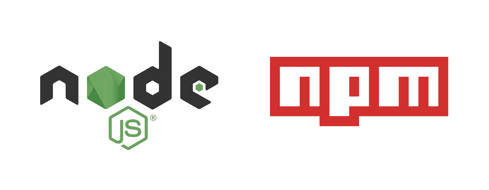

# 您应该尝试的 3 个非常有用的 Node.js 包

> 原文：<https://javascript.plainenglish.io/3-incredibly-useful-node-js-packages-that-you-should-try-3f9f8c427795?source=collection_archive---------1----------------------->

## 在 NPM，你可以找到数以千计的 Node 软件包，其中一些真的可以确保你再也不想没有它们了。这里有几个特别实用的



Each of them needs the other ❤

Node.js 已经成为其中不可或缺的一部分。有了自己的包管理器 NPM，Node 可以发现许多非常有用的库和框架。在这篇文章中，我将向你展示几个例子，它们将会给你更多的可能性来用 Node.js 构建复杂的动态应用程序。

# 1.)Chalk——设计终端的输出

尤其是在开发一个新的 Node.js 应用的时候， **console.log** 是必不可少的。
如果我们使用它来输出错误、系统数据或函数和 co 的输出，这并不重要。但是，它确实有点令人困惑，因为 console.log 函数默认在终端中输出纯白色文本。
粉笔改变了这一点，你保留了概貌。

刚刚安装它像往常一样从[https://www.npmjs.com/package/chalk](https://www.npmjs.com/package/chalk)与 **npm 安装粉笔**，你就可以走了。

这是一个代码示例，下面是它在我的终端中的真实样子。

```
const chalk = require(‘chalk’)*// just blue font* console.log(chalk.blue(‘this is lit’))*// blue & bold font, red background (bg = background)* console.log(chalk.blue.bgRed.bold(‘Blue & Bold on Red’))*// blue font, red background* console.log(chalk.blue.bgRed(‘Regular Blue on Red’))*// combining multiple font colors* console.log(chalk.blue(‘Blue’) + ‘ Default’ + chalk.red(‘ Red’))*// Underlining text* console.log(chalk.red(‘There is an ‘, chalk.underline(‘Error’)))*// Using RGB-colors* console.log(chalk.rgb(127, 255, 0).bold(‘Custom green’))
```

它认为这段代码没什么好解释的。如果有，就在评论里把你的问题落下，没问题:)

**输出:**


Looks pretty cool, hm?

# 2.)Morgan —记录来自 HTTP 请求的所有重要信息

这也是在应用程序开发中特别有用的东西。因为 HTTP 请求是数字世界的心跳——这就是为什么在你的应用中完全控制影响它们的一切是如此重要。
摩根提供了这方面的重要信息。

像往常一样，通过 **npm 安装摩根**从[https://www.npmjs.com/package/morgan](https://www.npmjs.com/package/morgan)处获取

在 morgan 中，我们可以将我们想要获得的信息定义为关于请求的信息。
正如文档中所描述的，只需将它传递到 morgan 中间件中，因此我们将在下面提供这个代码示例。

```
const express = require(‘express’)
const morgan = require(‘morgan’)const app = express()app.use(
morgan(
 ‘:method :url :status :response-time ms’
))app.get(‘/’, function(req, res) {
  res.send(‘hello, world!’)
})app.listen(8080)
```

因此，我们希望获得关于传入 HTTP 请求的以下细节:方法、请求的 URL、请求的状态以及响应花费的时间。

当我们在浏览器中打开我们的站点时，运行这段代码应该会产生以下输出:


也没有真正的惊喜。当我们在浏览器中打开页面时，它总是向服务器发出 GET 请求，因为我们请求了“/”，morgan 也会显示这个，以及我们的“hello，world！”站点已成功交付，这意味着状态代码为 200。整个执行过程花费了大约 2.3 毫秒，这是相当快的速度。但是我们不仅请求了我们的网站，而且浏览器也总是请求一个 favicon。找不到—错误状态 404。

让我们来衡量一个实验:我们改变代码，以便在每次响应之前有 200 ms 的停顿。下面是代码中的变化:

```
app.get(‘/’, function(req, res) {
  setTimeout(function() {
    res.send(‘hello, world!’)
  }, 200)
})
```

现在，当我们再次在浏览器中请求该页面时，morgan 将对此进行记录:


现在，响应时间超过了 200 毫秒——正如我们所希望的那样。
但最终，页面再次成功送达。
除了我们仍然没有的 favicon。并且只花了几毫秒，因为我们只延迟了对“/”路由的请求。

# 3.)Cheerio——用类似 jQuery 的语法操作服务器上已经存在的 DOM

尤其是当我们交付的不是静态的 HTML 文件而是动态的网站时，Cheerio 是非常实用的。我们可以在客户端不知道的情况下，直接在浏览器的请求和响应之间修改请求的 HTML 代码。由于类似 jQuery 的语法，这尤其容易。
当然你也可以用 Cheerio 来抓取和做很多其他的事情。

用 **npm 安装 cheerio** 从[https://www.npmjs.com/package/cheerio](https://www.npmjs.com/package/cheerio)安装

因此，通过 Cheerio，我们可以获得关于 HTML 结构和内容的信息:

```
const template = `
  <div id=”main”>
    <h1 id=”message”>Welcome on our site</h1>
  </div>
`const $ = cheerio.load(template)console.log($(‘h1’).text()) // Welcome on our site
```

将 HTML 添加到现有模板:

```
let template = `
  <div id=”main”>
    <h1 id=”message”>Welcome on our site</h1>
  </div>
`const $ = cheerio.load(template)$(‘div’).append(‘<p class=”plum”>Paragraph</p>’)template = $.html()
```

这是模板:

```
<div id="main"> 
  <h1 id="message">Welcome on our site</h1>   
  <p class="plum">Paragraph</p>
</div>
```

但是 Cheerio 最常用的一种情况可能是随后将内容写入模板:

```
let template = `
  <div id=”main”>
    <h1 id=”message”></h1>
  </div>
`const $ = cheerio.load(template)$(‘h1’).append(‘New welcome message!’)template = $.html()
```

这是现在的模板:

```
<div id=”main”> 
  <h1 id=”message”>New welcome message!</h1> 
</div>
```

你可以用 Cheerio 做更多的事情。看看文件就知道了！

## [加入我的邮件列表，保持联系](http://eepurl.com/hacY0v)

# **关于我，作者:)**

嗨！再次感谢您的阅读，我叫路易斯，是一名来自德国的 18 岁学生。我热爱 Web 开发，包括后端和前端。我最喜欢的技术是 React、Vue、React Native 和 node . js
记得关注我，了解更多与这些相关的内容，并随时查看我的 IG @ Louis . jsx&@ codingcultureshop
祝您愉快！