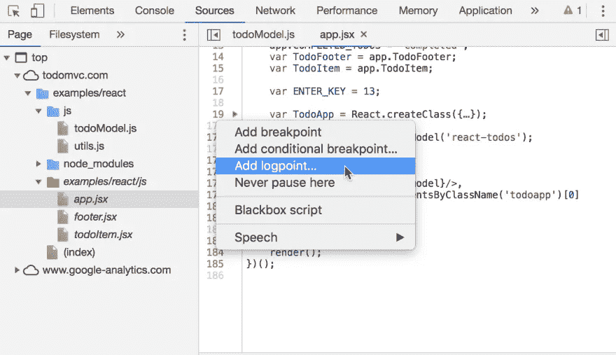
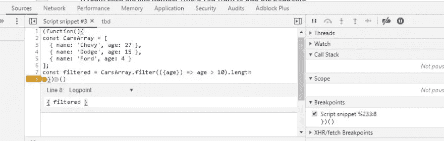
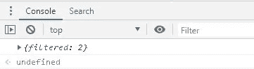
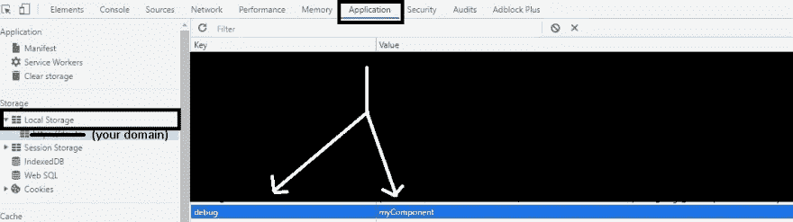
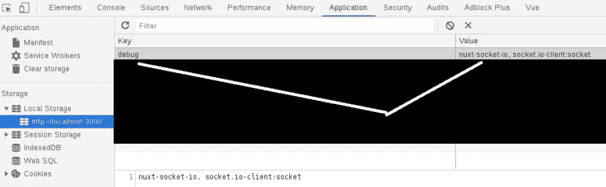
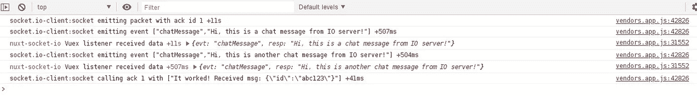
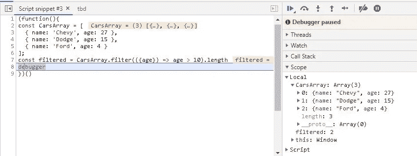
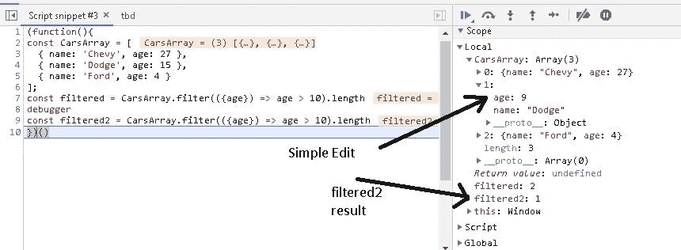

# 3 种您不知道已有的微创增压 JS 调试工具

> 原文：<https://javascript.plainenglish.io/3-minimally-invasive-supercharged-js-debug-tools-you-didnt-know-you-had-e374974f5bae?source=collection_archive---------5----------------------->


LocalStorage debug setup (Cover Image)

让我先描述以下行为，然后让我知道这听起来是否像你。您有如下代码:

```
const result = await getSomeData().catch(handleErr)
console.log('result', result)
```

但是，您有一个大的应用程序，所以您至少要重复这个片段一百次。代码的其他部分依赖于`result`，当这些其他部分看起来不正确时，您会恐慌并疯狂地开始添加更多的`console.log`语句，因为“代码应该在昨天完成”:

```
console.log('result.id', result.id)
console.log('typeof result.id', typeof result.id)
...
```

希望您不要练习上述行为，因为在所有这些地方都有调试语句，您必须记住清除它们。幸运的是，有更简单的方法来调试您的代码，而不需要您认为可能需要的所有努力。

我会尽我最大的努力保持这篇文章*的简洁*并从简单到简单的组织这篇文章，因为我知道当你疯狂地试图调试某件事的时候，你想要尽快得到答案。

# 1)监视变量。

首先，如果您必须绝对监视给定的变量，请停止这样做:

```
console.log('someVariable', someVariable)
```

是的，上面很容易做到，而且我对那个坏习惯感到内疚，但下面更容易:

```
console.log({ someVariable })
```

然而，还有比以上更简单的事情。如果你有 Chrome 开发工具，你可以创建一些叫做“logPoints”的东西(就像 [@nickytonline](https://dev.to/nickytonline) [提到的](https://dev.to/nickytonline/comment/kd2n)；另请参见 [logpoints](https://developers.google.com/web/updates/2019/01/devtools#logpoints) 。它们完全像断点，但不是中断，消息被记录在这些行中:(使用他引用的图像)



Reference: developers.google.com

具体来说，这是我今天早些时候做的一些简单的事情，来帮助一个新的开发朋友。我刚刚启动了 Chrome 开发工具代码片段编辑器，创建了代码片段，设置了 logPoint(在“断点”下组织)，并运行了代码:



导致:



因此，我能够消除键入“console . log”(11 个字符)的需要；我的调试工作变得更有效率了。此外，我可以很容易地禁用(但保留)日志点，只需取消选中复选框。由于日志点都组织在一个地方，这使得很容易禁用所有日志记录，或者如果日志点引脚在无数的地方，则很容易启用所有日志记录！但是等等，我们可以做得更好！

# 2)T2 模块。

TL；灾难恢复—是的，您可以在浏览器中使用它！
TL；DR2 可以，您可以`import`购买！

检查您的“节点 _ 模块”文件夹中的“调试”文件夹！考虑到这个模块每周被下载 5600 万次以上，很有可能你已经在你的机器上安装了它！即使你没有把它列为一个依赖项，因为很多项目都在使用它，很可能至少有一个依赖项附带了它。比如说，如果/当你安装了`socket.io-client`，你*也*安装了[调试模块](https://www.npmjs.com/package/debug)却没有意识到！

虽然我非常确信您可能已经使用它来调试您的服务器端代码，如下所示:

`server.js`

```
const debug = require('debug')('server')
```

终端:

```
DEBUG="server" node server.js
```

你可能不知道的是，调试模块*也可以*在浏览器中使用！

您不仅可以在浏览器中使用它，还可以使用您熟悉的`import`语法*导入*调试模块:

`myComponent.js`:

```
import Debug from 'debug'
const debug = Debug('myComponent')...
const result = await getSomeData().catch(handleError)
debug({ result })
...
```

然后，为了在浏览器的控制台日志中实际查看调试语句，您不需要设置任何环境变量，而是只需在`localStorage`中设置*调试*变量。但是...无论您做什么，避免在您自己的代码中设置该变量！在你的 Chrome 开发工具中设置它要安全得多！这样，您的代码就不会意外地启用调试日志记录。



所以现在，当您设置了该变量后，所有的调试语句都将记录到控制台的`myComponent.js`中。如果你想调试多个文件，每个文件可以得到它自己的或共享的调试字符串，在这种情况下`localStorage.debug`变量只需要是逗号分隔的字符串或通配符(' * '):

```
localStorage.debug = 'myComponent, otherComponent' // logs for both componentslocalStorage.debug = '*' // all debug log statements in browser will log to console
```

许多依赖于调试模块*的模块已经有了*调试字符串，它们用来帮助自己(和你)调试*它们的*模块发生了什么。两个这样的模块是`socket.io-client`和`nuxt-socket-io`。这意味着当你想调试 IO 进出组件的每个部分时，你不需要写一个单独的`console.log`语句！您只需将`localStorage.debug`变量设置为正确的字符串:

```
localStorage.debug = 'socket.io-client:socket' // Monitor socket.io-clientlocalStorage.debug ='nuxt-socket-io, socket.io-client:socket' // debug even more... // Then, when it is desired to mute the logs...simply make debug undefined:
localStorage.debugX ='nuxt-socket-io, socket.io-client:socket' // debug nothing just by putting an X there (or whatever you like!)
```

因此，当我将`localStorage.debug`设置为:



LocalStorage debug setting (Zoom in, if needed)

我得到的日志是这样的:



然而，当我编写调试语句时，我只需编写:

```
debug('some message', { data })
```

但是……日志条目包含其他有用的信息，我不必考虑编码，例如:生成日志条目的文件和行，以及调试语句之间的时间间隔。如果日志变得很长，Chrome dev tools 可以通过右键单击和菜单选择来轻松保存控制台日志。

# 3)[“调试器”](https://developer.mozilla.org/en-US/docs/Web/JavaScript/Reference/Statements/debugger)关键字。

通常，在浏览器中运行的代码是源代码的一个巨大的丑化版本。试图将断点的一根针插入到一个非常杂乱的干草堆中是非常耗时的。幸运的是，语言内置了“debugger”关键字，可以用来打断感兴趣的地方:

```
function myCodeAintWorkin(arrrrgggh) {
  let thisThing;
  debugger; // <-- runtime will break at this point! (even if this line is buried in the uglified code at line 1112442)
  // Some buggy code here
}
```

所以，回到最初的`CarsArray`片段，我也可以像这样调试`filtered`变量:



因此，虽然我不必键入“console . log”(11 个字符)，但我必须键入“debugger”(8 个字符)，但我得到的额外好处是，只需向右看几英寸，我就能够立即看到*局部范围*，并根据我的需要修改属性。所有这些*都不需要*再写几个`console.log`语句:



在上面的图片中，我将道奇的“年龄”属性设置为不到 10 年，尝试了第二个`filtered2`语句。如果我怀疑我的第一个`filtered`声明，我可以尝试改变属性，断言新的超过 10 年的汽车列表中少了一辆车。

尽管“debugger”关键字很酷，但当您的代码准备合并到您团队的代码库中时，删除该行可能是一个非常好的主意，因为您的团队很可能不希望*他们的*代码在*您的*调试语句上中断。

# 结论

“工具”这个术语是否适用于上面提到的所有三种调试方法，我认为还有待商榷。第一种方法利用了 JS 对象结构，您可以将它作为一种工具来监视变量(`console.log({ someVar }`)。第二种方法使用 JS 生态系统中最流行的调试工具之一，结合 Chrome 开发工具来帮助您在浏览器中调试。最后，第三种方法是“debugger”关键字，它与 Chrome 开发工具一起使用，就像一种工具，可以用来判断代码中给定行的应用程序状态。

我尽最大努力按易用性来订购工具。某种调试方法有多“容易”当然是主观的。我个人认为第二种方法是最容易的，但是更多的人可能认为第三种方法是最容易的。不管怎样，即使你是一个有经验的开发者，我希望这篇文章对你有所帮助。