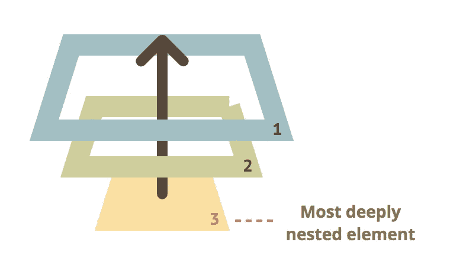
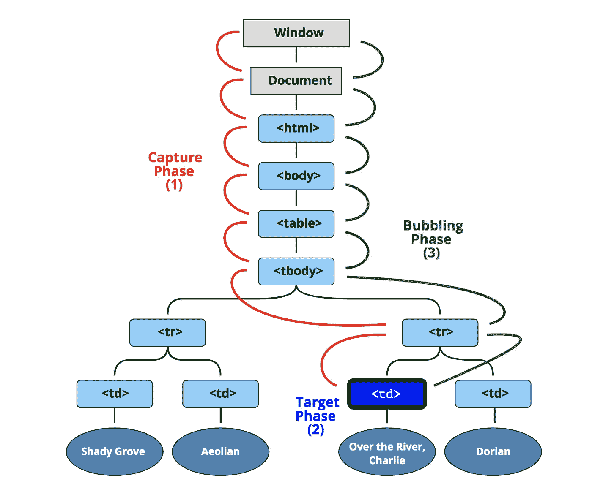

# JavaScript 事件的 3 个阶段

> 原文：<https://javascript.plainenglish.io/3-phases-of-javascript-event-2ff09aa76b03?source=collection_archive---------5----------------------->

## 冒泡、瞄准和捕获

## 测试自己对 DOM 事件流的了解程度

下面两个代码块的输出是什么？

## 简单的问题

*   如你所料，点击“我是 div”文本将在控制台上显示“div1 clicked”

> *容易吧？下一个例子怎么样？*

## 困难的问题

*   即使我们单击了 id 为“div2”的 div，结果也保持不变，并显示“我是 div1”
*   事件冒泡也称为**事件传播或事件委托**发生！

## 两种方法



1.  事件冒泡(**内部** → **外部**)
2.  事件捕捉(**外** → **内**)

## 三个阶段

1.  捕获阶段(第一个听众)
2.  目标阶段(触发两次；在捕获和冒泡阶段)
3.  冒泡阶段(第二个监听器)

## 阅读这篇文章的三点收获

1.  你会明白这张图( **DOM 事件流**)


2.事件属性**目标，当前目标，事件阶段**

3.你将学习**停止传播**对**停止立即传播**

## 为什么您应该关注 JavaScript 事件捕获和冒泡

```
*Even though you will be rarely scratching your head because you accidentally specified* ***true*** *instead of* ***false*** *in your* ***addEventListener*** *call, You still need to care about 2 JS Events because*
```

*   前端开发人员每天都在使用 **JS 事件(addEventListener，event function)** ，你需要深入了解你每天都在使用什么
*   有一些具体的案例显示了你在事件捕捉和冒泡方面的深厚知识

## 例如:

1.  您希望覆盖一些内置/默认的浏览器行为，例如当您单击滚动条或将焦点放在文本字段上时

2.您在两个阶段都有多个事件处理程序，并且您希望只关注捕获或冒泡阶段的事件处理程序

3.当鼠标悬停在嵌套菜单上时，会显示子菜单

3.第三方组件/控件库有自己的事件逻辑，而您想避开它来实现自己的自定义行为

# 1.DOM 事件流



## DOM 事件流[事件总是从我们文档的根开始]

*   从根开始，事件通过 DOM 的狭窄路径，在触发事件 **< td > (** 称为**事件目标)**的元素处停止——我们将在后面讨论这一点
*   我们的事件采用的路径是直接的，但是它确实令人讨厌地通知了沿着这条路径的每个元素。如果有一个事件处理程序与这个路径上的元素相关联，并且与当前经过的事件相匹配，那么这个事件处理程序将被调用
*   现在，一旦我们的事件到达它的目标，它不会停止
*   该事件通过回溯其步骤并返回到根来继续进行
*   事件路径上的每个元素在向上返回时都会收到关于其存在的通知

## 标准 DOM 事件描述了事件传播的 3 个阶段

(1)捕获阶段—事件深入到元素

(2)目标阶段—事件到达目标元素

(3)冒泡阶段—事件从事件中冒泡

## 例如

*   **【捕获阶段】**:点击< td >，事件首先通过祖先链向下到达元素
*   **【目标阶段】**:到达目标触发
*   **【冒泡阶段】**:它返回调用它的处理程序

## 事件冒泡和捕获

*   我们经常使用事件**冒泡**(默认)，很少使用事件**捕获**(使用事件**捕获**没有太大的好处)
*   出于调试目的，知道这两个事件流仍然是好的

`capture`选项有两个可能的值:

*   如果**为假**(默认)，则为冒泡阶段
*   如果**为真**，则进入捕捉阶段

## 示例中的三个阶段:

如果您点击`<p>`，那么顺序是

1.  **HTML** → **正文** → **表单** → **DIV** (抓取阶段【第一个监听器】)
2.  **P** (目标阶段，触发 2 次，(一次捕捉，一次冒泡)
3.  **DIV**→**FORM**→**BODY**→**HTML**(冒泡阶段【第二个听众】)

## 关于事件冒泡要知道的事情

*   几乎所有事件都会冒泡:除了少数例外，大多数事件都会冒泡。例如，**焦点**事件不会冒泡

## 关于事件捕获要知道的事情

*   很少使用捕获阶段。通常我们看不见它

# 2.事件属性目标，当前目标，事件阶段

## 目标与当前目标(this)

**目标**

*   指触发事件的 DOM
*   它不会在冒泡过程中发生变化

**当前目标(本)**

*   参考事件侦听器正在侦听的 DOM

## 示例中的目标和当前(本)

*   如果我们有一个单独的处理程序 **form.onclick** ，那么它可以“捕捉”表单中的所有点击
*   无论点击发生在哪里，它的气泡直到 **<形成>** 并运行处理程序

在这个例子中，

*   **event . current target**(**this**):**<形成>** 元素，因为处理程序在上面运行
*   **event.target** 是表单中被点击的实际元素

## 事件阶段

> *无= 0，捕捉= 1，目标= 2，冒泡= 3*

*   eventPhase 事件属性返回一个数字，该数字指示当前正在评估事件流的哪个阶段

该数字由 4 个常数表示:

1.  **无**
2.  **capture _ PHASE**:事件流处于 capture 阶段
3.  **AT_TARGET** :事件流处于目标阶段，即正在事件目标处进行评估
4.  **冒泡 _ 阶段**:事件流处于冒泡阶段

# 3.中断事件

## 停止传播

*   **停止传播**方法对**事件**的对象是防止我们的事件传播**(冒泡)**
*   一个事件并不能保证在它的起点和终点都有充实的生活
*   有时，阻止我们的事件变得古老和快乐实际上是可取的
*   事件对象在回调函数中作为参数提供
*   **但通过调用**停止事件的是**不建议**；在大多数时间，它是没有用的，它可能会带来意想不到的副作用；有时最好让它 *️ 〰️流向〰️*

## stopImmediatePropagation()

*停止传播同胞关系中的事件*

*   如果一个元素在一个事件上有多个事件处理程序，那么即使其中一个停止冒泡，其他的仍然会执行
*   换句话说，**event . stop propagation()**停止向上移动，但是在当前元素上，所有其他处理程序都将运行
*   为了停止冒泡并防止当前元素上的处理程序运行，有一个方法**event . stop immediatepropagation()**

## 停止起泡的底线

> *不要无需要就停止冒泡！！*

*   冒泡很方便。不要在没有真正需要的情况下停止它:显而易见的，架构上考虑周详的
*   有时**事件. stopperopagement()**会产生隐藏的陷阱，这些陷阱以后可能会成为问题
*   通常没有防止冒泡的实际需要

> 快乐编码

## **来自 JavaScript 的普通英语注释**

我们也有兴趣帮助推广高质量的内容。如果您有一篇文章想提交给我们的任何出版物，请通过电子邮件发送至[**submissions @ plain English . io**](mailto:submissions@plainenglish.io)**并使用您的 Medium 用户名，我们会将您添加为作者。另外，请告诉我们您想添加到哪个出版物中。**

****

**Photo by [Fotis Fotopoulos](https://unsplash.com/@ffstop?utm_source=medium&utm_medium=referral) on [Unsplash](https://unsplash.com?utm_source=medium&utm_medium=referral)**