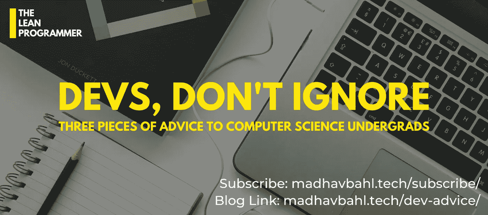

# 给计算机科学本科生的 3 条建议

> 原文：<https://javascript.plainenglish.io/3-pieces-of-advice-for-computer-science-undergrads-5240b75de6a3?source=collection_archive---------12----------------------->

## 有抱负的软件开发人员，不要忽视这一点！

大学生活是一种幸福，当我们身处其中时，我们很少认为大学生活会结束，但令人悲伤的事实是，3-4 年过得很快。

当你还在大学的时候，重要的是开心，交朋友，享受，那些日子一去不复返了。但是，开始思考你的未来并采取行动也很重要。

所以在这篇博客中，我将告诉你三件你在大学期间绝对应该考虑的事情。这个博客不是你在大学期间应该做的事情的清单，我有一个完整的 1 小时的 YouTube 视频，这个博客只是专注于 3 个简单的提示，如果你是一个 CS 学生，你应该记住。

# 1.不要听信谣言

计算机科学是一个充满谣言的领域，我打赌你可能遇到过很多。这些谣言的不好之处在于，它们让我们对自己做出的决定感到困惑。

让我们来看看我在大学时经常听到的一些

*   不做竞争性编程是找不到工作的
*   Web 开发正在自动化，不要去追求它
*   程序员是书呆子
*   数据科学只适合数学好的人
*   学区块链，是未来
*   不学机器学习就找不到工作
*   ML/AI 会杀死所有 SDE 人的工作
*   PHP 已经死了

还有更多(现在一想起它们，我就觉得好笑)

## **有什么区别，怎么处理？**

虽然每个谣言都有一些与之相关的故事和一些真相，但根据这些谣言做出决定和形成偏见可能会对你的未来和职业生涯造成灾难性的影响。

你不会因为有人散布谣言说吃“晚餐”会让你变胖，就放弃吃东西或吃晚餐。你会吗？

虽然这可能有一定的道理，但是晚上暴饮暴食可能会增加你的身体脂肪，但这并不意味着你应该停止吃晚餐。

同样，在你不断听到的计算机科学谣言中，总会有一些真实的背景故事。所以，不要相信谣言并做出不理智的决定，试着从谣言相关的地方找到故事，分析场景，然后做出决定。

以下是一些简单的步骤:

1.  当你从某人那里听到谣言时，问问他们是从哪里听到的
2.  仔细检查来源
3.  问谷歌，关注最新消息
4.  关注你感兴趣领域的思想领袖(他们通常会分享行业的更新和最新趋势)
5.  衡量“它对你的影响有多大”
6.  然后，做决定。

## 让我们举一个例子

让我们考虑一下最流行的谣言“PHP 已死”。

如果你看看这个行业，PHP 和 WordPress 开发人员仍然有很多工作机会，但是最近我们已经看到了从传统技术到现代语言的巨大转变，我们已经看到 React 开发人员、节点开发人员等工作机会的巨大增长。这些通常是高薪的。

所以，说“PHP 已死”是完全错误的，但是说“现代语言正在慢慢垄断这个行业”也不会错。

现在，如果你是一名 PHP 开发人员，不要听信这些谣言，放弃你花了这么多时间学习的语言，你可以这样做

1.  找一份工作/继续你目前的工作，将你的 PHP 技能货币化
2.  接受新的/现代语言已经出现的事实
3.  看看趋势，找出哪种技能对你有益
4.  开始一起学习吧

如果你想的话，这会让你为转变做好准备。

希望这个例子有意义，从现在开始你会深入挖掘，做出理性的决定，而不会在听到任何谣言时浪费太多时间在混乱中。

# 2.品尝一切

大学是探索事物的最佳时间，一旦大学生活结束，你的责任将会不断增加。

所以当你还在上大学的时候，试着尽可能多的学习，试着探索尽可能多的新领域，新领域，新的职业机会，新的旅行地点。

虽然这个建议在很多情况下都是有效的，但是我想缩小范围，记住我们在这里谈论的是计算机科学。

## 以下是方法

> 做一个万事通，精通一门(或几门的结合)

我认为“如果人们探索许多事情，他们就不能成为其中一个的大师”的思维模式已经过时了。

我跑题了，就算你成为“一”的高手抛开其他一切，

*   不会很无聊吗？
*   你和其他精于此道的人之间的区别因素是什么？

我们可以探索多种事物，但仍然(高度)擅长其中几种的组合，这就是旅程如此激动人心，让我们的技能独一无二的原因。

以我自己为例，我已经探索了许多领域/工作

*   Android 开发
*   iOS 开发(尽管非常少)
*   后端开发
*   前端 web 开发
*   机器学习
*   区块链(同样非常少)
*   博客
*   技术内容写作
*   自助写作
*   播客
*   演讲

诸如此类…

当我在大学探索所有这些领域时，我可以清楚地发现一些对我很有用的东西，我很喜欢它们，它们是前端网络开发、博客和公共演讲。

所有这些，加上对我自己风格的品味，使我的技能独一无二，这就是你如何成为“一个万事通，一个大师(或几个大师的组合)”

# 3.不要忽视 DSA/解决问题的重要性

不，不要误会我的意思，我不是要求你成为一个铁杆的竞技程序员，不是每个人都可以成为一个，不是每个人都喜欢它。

像数据结构和算法这样的主题是计算机科学的核心，如果你不是专家完全没问题，但是不要忽视它们的重要性。

很多学生(包括我在第二学期的时候)忽视了这个话题的重要性，在最后一年的实习中面临困难。

即使你没有参加实习，而是想加入某个特定领域的初创公司(比如说，作为一名前端开发人员)，你也不知道什么时候你可能会在工作中用到这些概念。

*   大学校园实习非常注重测试你解决问题的能力
*   科技巨头的招聘也取决于你在这方面的技能
*   另外，对数据结构和算法有很好的了解可以帮助你提高代码的效率

如果你不太喜欢竞争性编程，这很好，但是要保持你的基本知识清晰。

## 但是我觉得很无聊，怎么办？

别担心，很多人都会遇到这种情况，这里有一些你可以采取的简单步骤

1.  理解它的重要性(不是说它是绝对必要的，但是它可以让你的生活更轻松)
2.  每隔一天(或每三天)在你的日历上划出一个小时来学习
3.  在这“1 小时”里，确保没有分心的事，集中精力学习新东西或练习编码问题

这样做可以在更长的时间内(比如 6 个月或一年)产生巨大的影响。另外，这并不困难，即使你非常忙，你也可以很容易地每隔一天或三天花一个小时在这上面。

如果你有兴趣看看我列出的你在大学期间应该做的事情，看看这个 YouTube 视频——“如何充分利用你的大学生活”

就这样，谢谢你一直读到最后，我希望你喜欢这篇文章。如果这对你有帮助，请告诉我。

如果你想讨论什么，随时联系我，:D

如果您能发送您的反馈和建议，我将非常高兴。
此外，我喜欢交新朋友，我们可以成为朋友，只要给我发电子邮件。

*You can contact me in case if you need any assistance:
Web:* [*http://madhavbahl.tech/*](http://madhavbahl.tech/) *Instagram:* [*https://www.instagram.com/theleanprogrammer/*](https://www.instagram.com/theleanprogrammer/) *LinkedIn:* **https://www.linkedin.com/in/madhavbahl/* *Github:* **电子邮件: thele***