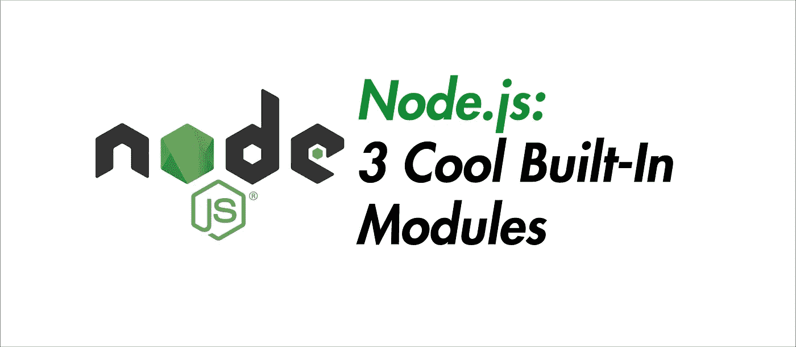

# 3 个非常酷的内置 Node.js 模块

> 原文：<https://javascript.plainenglish.io/3-pretty-cool-built-in-node-js-modules-c2c3283276e6?source=collection_archive---------4----------------------->

## 让我们使用 Node.js 读取用户输入，执行终端命令并运行一个 JS 虚拟机！



Source: The Author

**在我们开始之前:**这是第二部分，对于 4 个更实用的内置模块你可以看看这里:

[](https://medium.com/better-programming/4-very-useful-built-in-node-js-modules-b734e140174c) [## 4 个非常有用的内置 Node.js 模块

### 深入了解 perf_hooks、fs、os 和 URL

medium.com](https://medium.com/better-programming/4-very-useful-built-in-node-js-modules-b734e140174c) 

# Node.js 中有哪些内置模块？

Node.js 有一些所谓的*内置模块*。这意味着，尽管这些模块像我们可以安装的其他模块一样工作，例如，通过 NPM，然后包括使用`require`或`import`语法，顾名思义，内置模块已经安装，因此总是可用的。

当然，它们是由 Node.js 背后的开发团队维护的，所以一切都是最新的，我们可以放心地使用这些模块。

不推荐使用的模块特性可以在官方文档中找到。

所以，有充分的理由来看看这些模块，并在我们的下一个项目中使用它们。

# 1.从键盘等输入流中读取数据(readline)

诚然，有许多库提供了从控制台读取和处理输入的能力。但是 **readline** 模块也有一些非常酷的特性，我们现在就可以看看。

## 在控制台中提示和处理输入

```
const readline = require('readline')const rl = readline.createInterface({
  input: process.stdin,
  output: process.stdout,
})*console.log('Enter a number, Node will double it for you')**rl.question('Your Number: ', (number) => {
  console.log(parseInt(number) * 2)
  rl.close()
})*
```

**重要提示:**控制台中的输入总是被这个模块
捕获为字符串，此外，我们总是必须首先使用 **createInterface** 函数创建 **rl** ，如上所述。在下面的代码中，我将省略这一点。

## 输出用户用 Enter 确认的任何输入

```
rl.on('line', (input) => {
  console.log('You entered: ${input}')
})
```

它的工作方式类似于 **rl.question** ，但是没有问题。
如果我们愿意，我们当然可以在这里用 **rl.close()** 和 **readline** 的所有其他函数随时停止读取用户输入。

## 如果用户想用 ctrl-C 终止程序，请注册

```
rl.on('SIGINT', (input) => {
  console.log('you exited')
  process.exit()
})
```

**注意:**这只是一个监听器，所以程序必须由例如 process.exit()终止，否则用户不能用 ctrl-C 自己终止程序。

此外，我们实际上可以将此与 **rs.question** 结合起来，要求用户输入。这样，如果用户输入“*是*或者“ *y* ”，我们就可以按照他们的要求终止程序。

```
rl.on(‘SIGINT’, (input) => {
  rl.question(‘Are you sure you want to exit? ‘, (answer) => {
    *if* (answer.match(/*^*y(es)?*$*/i)) process.exit()
    *else* console.log(‘glad you stay’)
  })
})
```

这样，您可以双重确保用户没有无意中按下 ctrl-c。

# 2.使用 Node (child_process)运行 shell 命令

**child_process** 模块可以用于许多不同的事情，但是本质上它是关于它的名字所说的。或多或少在后台运行的进程。

我现在将向您展示如何使用它来执行不会中断 Node.js 应用程序的 shell 命令。

## 使用 ls 列出更高级目录的内容

```
const { exec } = require(‘child_process’)exec('cd .. && ls', (error, output) => {
  *if* (error) *throw* error
  console.log(output)
})
```

理论上没有限制，在 Windows 和 Linux 上都可以用“ **& &** ”将终端命令串在一起，从而可以一个接一个地执行各种命令。

您可以非常流畅地将 exec 集成到 Node 应用程序的流程中，从而也可以将 Express.js 文件中的内容作为 HTTP 响应发送给用户。当然这只是为了说明。

```
app.get(‘/’, (req, res) => {
  exec(‘cat test.txt‘, (error, output) => {
    res.send(output)
  })
})
```

# 3.在虚拟机的 Node.js (vm)中运行 JavaScript 代码

我个人认为 vm 是最有趣的模块之一，因为有太多东西可以尝试。
让我们从一小段代码开始。

1.  我们将“x”定义为一个全局变量。没什么特别的，但是记住这一点。
2.  然后，我们将变量 x 放入虚拟机的上下文中，我们用 **createContext** 来完成。
3.  我们的代码变量就是我们想要在虚拟机中执行的 JavaScript 代码。这里我们访问了 **x** ，而没有在代码中创建它。 **x** 之所以可用，是因为我们将它传递给了**上下文**。
4.  我们还创建了另外两个变量。重要提示:如果我们以后想在 VM 之外访问 VM 上下文中的变量，它们显然不能作为 **let** 或 **const** 使用，我们必须使用 **var** 关键字。
5.  最后，使用 **runInContext** 我们可以将从全局范围借用的变量 **x** 和要在 VM 中执行的代码集合在一起并执行我们的上下文。

## 好了，让我们来看看虚拟机:

每当我们想要访问我们的 VM 上下文中的变量，也就是说，**代码**，我们可以使用**上下文**对象:

```
console.log(context.x) *// 41* console.log(context.y) *// 17*
```

我们看到一切都在意料之中。由于 **x** 是全局 1，我们在 VM 中加了 40，所以它现在在 VM 41 中。
但是如果我们想在全局范围内访问变量 **x** ，它是不变的:

```
console.log(x) *// 1*
```

当然，我们可以从虚拟机内部执行该功能:

```
console.log(context.hello()) *// “from the VM”*
```

## JavaScript 用简单的英语写的一个注释:

我们已经推出了三种新的出版物！请关注我们的新出版物，表达对它们的爱:[**AI in Plain English**](https://medium.com/ai-in-plain-english)[**UX in Plain English**](https://medium.com/ux-in-plain-english)[**Python in Plain English**](https://medium.com/python-in-plain-english)**—谢谢，继续学习！**