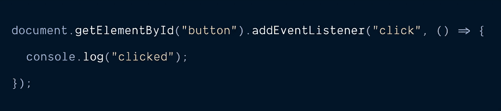
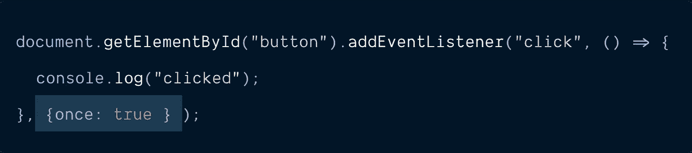
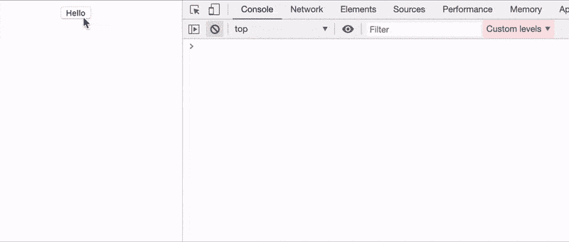
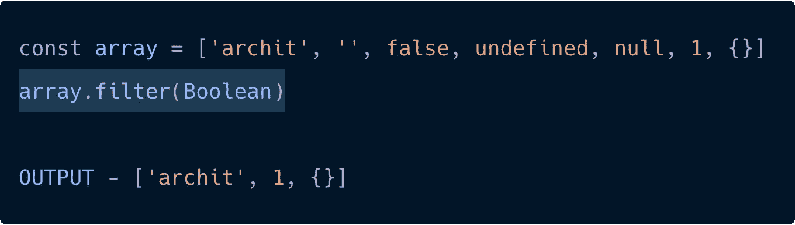
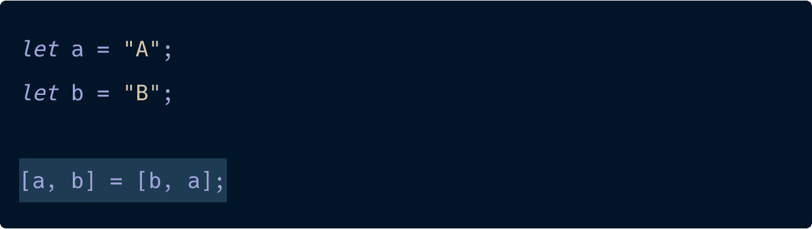
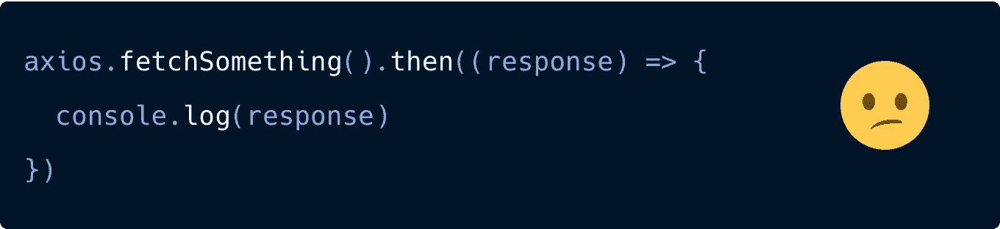

# 3 个快速的 JavaScript 技巧来智胜你的经理

> 原文：<https://javascript.plainenglish.io/3-quick-javascript-hacks-to-outsmart-your-manager-4dd06baa13c6?source=collection_archive---------6----------------------->

> 当你以不平凡的方式做着生活中平凡的事情时，你将会赢得全世界的关注。——乔治·华盛顿·卡弗。

我最近在某处读到它，这很有意义。因此，让我们看看我们如何以不寻常的方式在代码中做普通的事情。

# 1.element . addevent listener()-仅监听一次

您可能已经多次做过类似的事情，将事件侦听器附加到任何 DOM 元素。但是，如果您只想监听那个事件**一次，然后删除那个监听器，该怎么办呢？**

## 这是诀窍😉

## 编辑器、代码、动作🎬

> 在这里，单击按钮后，事件监听器会自动从元素中移除。如果你想知道`getEventListners($0)`在做什么——这是 chrome debugger API，我们用它来知道所有事件监听器都连接到按钮上。如果你想了解更多，我在底部附了一篇文章。

## 2.在一行中包含真实值的过滤器数组😲

Photo by [Andrea Piacquadio](https://www.pexels.com/@olly?utm_content=attributionCopyText&utm_medium=referral&utm_source=pexels) from [Pexels](https://www.pexels.com/photo/woman-in-white-long-sleeve-shirt-using-silver-laptop-computer-3784324/?utm_content=attributionCopyText&utm_medium=referral&utm_source=pexels)

## 3.交换一行中的变量😧

如果你选择`console.log(a,b)`，你会在控制台上看到`B A`。这是通过 JS 中数组析构的概念实现的。想叉更多的 JS 析构？请在评论中告诉我。我很乐意就此再写一篇文章。

## 4.免费赠品！🥭

相反，您可以直接传递 console.log，因为它也是一个函数。

这只是一个承诺的例子，但是你也可以在订阅 observables 的时候做同样的事情。

*关于 getEventListeners($0)的更多信息请点击此处—*[*https://developers . Google . com/web/updates/2015/05/get-and-debug-event-listeners*](https://developers.google.com/web/updates/2015/05/get-and-debug-event-listeners)

如果你在这篇文章中发现了有趣或令人兴奋的东西，请在下面的评论区告诉我。既然我们一起度过了美好时光，我不想让你再成为陌生人，请在 Twitter 上给我发一条 DM—[**thearchtgar**](https://twitter.com/thearchitgarg)

## **简明英语团队的笔记**

你知道我们有四份出版物和一个 YouTube 频道吗？你可以在我们的主页[**plain English . io**](https://plainenglish.io/)上找到所有这些——关注我们的出版物并 [**订阅我们的 YouTube 频道**](https://www.youtube.com/channel/UCtipWUghju290NWcn8jhyAw) **来表达你的爱吧！**