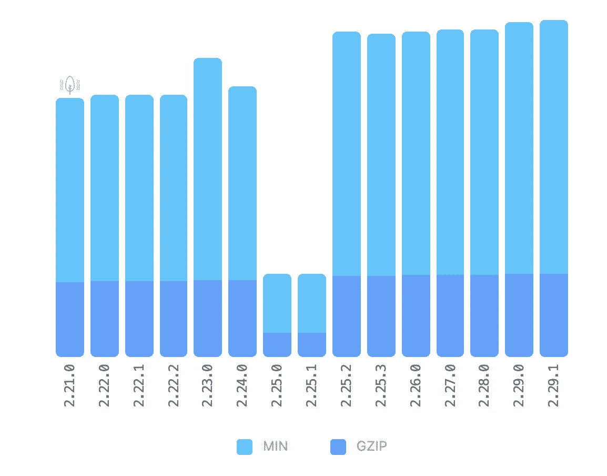
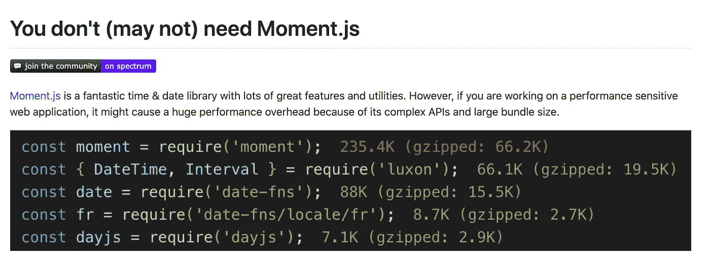
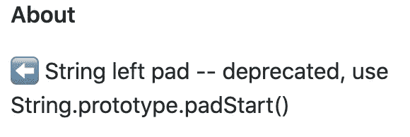

# 少用 JavaScript 库的 3 个理由

> 原文：<https://javascript.plainenglish.io/3-reasons-to-use-fewer-javascript-libraries-7226b64868a4?source=collection_archive---------6----------------------->

## 你的 package.json 不应该比你的代码长


Dependencies of styled-components, [Source](https://npm.anvaka.com/#/view/2d/styled-components)

如果没有 NPM 和库，整个现代 JavaScript 世界会是什么样子？并非没有好的理由，有许多迷因每隔几秒钟就会出现一个新的库或框架。

但是像我们一样使用这么多的库也有一些缺点。我们在一个巨大的、错综复杂的依赖网络上构建我们的应用程序。你可以在标题图片中看到这一点——它可视化了流行的库 **styled-components** 构建在哪些包上。

甚至直接使用这么多的库也会成为一个问题——不仅仅是子依赖关系。

这里有三个我们不应该使用这么多库的好理由。

# 性能差

在 web 开发领域，有一条黄金法则:向用户交付尽可能少的代码:代码越少，页面加载越快。

这也是至少几乎所有人都认为他们应该遵守的规则——在网站开发期间，我们都喜欢查看 Chrome Devtools，看看每个文件有多大——以及向用户发送了什么。

但是当我们看到我们收录的某个库相当大的时候，往往也只是接受。

Moment.js 就是一个很好的例子——仅在 NPM，该软件包每周就有近 1500 万次下载。尽管这个库是一个巨大的 **288.4 kb** 的缩小版。

当然，这个图书馆有它的合理性——但是许多人只是选择了第一个做这项工作的最好的图书馆。

一旦库被包含进来，它就会被不时地更新——有了 NPM，你可以很容易地更新所有的依赖项；如果你不使用 NPM，你甚至可以拥有一个最新版本的 CDN。



Size of Moment.js. [Source](https://bundlephobia.com/result?p=moment@2.25.0)

唯一的问题是代码可能会发生巨大的变化。

Moment.js 在最近的版本中变得更大——突然之间，灯塔的分数看起来与以前完全不同。

图中显示了尺寸在最新版本中的变化。

在 Moment.js 的例子中，GitHub 官方网站甚至说在使用 Moment 之前你应该三思。

毕竟，有许多替代方案，这些方案要小得多，而且在大多数情况下，可能已经足够了。



Source: [GitHub](https://github.com/you-dont-need/You-Dont-Need-Momentjs/blob/master/README.md)

说到性能，不仅要考虑大小，还要考虑执行本身的性能——不能保证库是优化的，而且由于抽象，它们几乎总是比找到问题的定制解决方案慢。

一个很好的例子是**风格的组件**。与纯 CSS 相比，它要慢得多(没有 SSR)——但使用起来仍然非常舒适。

# 易受伤害的

与此同时，有许多关于个别 NPM 套餐的具体丑闻。太有趣了，我写了一篇关于它们的文章。

[](https://medium.com/javascript-in-plain-english/the-biggest-scandals-of-npm-d739c11a2406) [## NPM 最大的丑闻

### JavaScript 世界中巨大的依赖树使得开发变得非常愉快。但有时它会压倒…

medium.com](https://medium.com/javascript-in-plain-english/the-biggest-scandals-of-npm-d739c11a2406) 

我提到的丑闻的一个例子是包**事件流**。

拥有每周近 200 万次下载的库的所有者对它失去了兴趣，并放弃了它。他把所有权让给了一个陌生人，这个陌生人通过邮件联系了他。

在新所有者的领导下，对库只有一个提交:他添加了一个新的依赖项。一些人立刻注意到有些不对劲——他们是对的。

新的依赖关系包含恶意软件，当使用事件流库时，该恶意软件将在受害者的机器上运行。

直到今天，甚至不清楚新的所有者是否有意将有害的依赖项添加到库中，或者可能甚至不知道它包含什么。

我们应该记住的问题很简单——来自第三方的任何包或库通常可以包含几乎任何类型的代码。毕竟，代码是由犯错误甚至怀有恶意的人编写的。

特别关键的一点是，我们通过 NPM 安装的几乎每个包都有自己的依赖项——例如，Express.js 包含 30 个包。我们都使用了大量来自第三方的代码，却没有注意到或知道实际发生了什么。

# 弃用和错误

像所有其他东西一样，包和库也会老化。尤其是如果它们没有得到精心维护的话。

它们会以两种方式变得陈旧/多余

*   它们是多余的，因为有原生特征。
*   代码不再有效。

Left Pad 是一个很小的 JavaScript 库，可以用来对字符串执行操作。它从左侧用空白填充字符串，如示例所示:

```
leftPad("foo", 5)
=> "  foo"leftPad("foo", 7)
=> "    foo"leftPad("foooo", 5)
=> "foooo"
```

您可能认为任何需要这种功能的 JavaScript 开发人员都会很快自己实现代码——但事实并非如此。我们都已经变得太习惯于简单地用库解决所有问题。因此，NPM 的 left-pad 每周仍有 460 万次下载——尽管它现在已经过时了。



[https://github.com/left-pad/left-pad](https://github.com/left-pad/left-pad)

随着时间的推移，JavaScript 的变化越来越多，新的特性也随之而来。例如，**左键**现在被上面显示的原生函数所取代。

所以现在你可以为自己节省额外的代码——使用 **左键**就不那么悲惨了，因为这个库很小。

但是还有更糟糕的情况——如果代码不是多余的，只是不再工作了怎么办？
这可能有两个原因:

*   该代码不再有效，因为它所基于的内容不再受支持。
*   库代码中有一个错误。

幸运的是，对于 javascript 代码，这种情况并不经常发生。大多数进化的编程语言仍然是向后兼容的。因此，旧的功能仍然有效，即使它们已经过时。

像 Vue、React.js 和 Angular 这样的框架更容易出现这个问题——它们经常发生根本性的变化，突然间它们不再支持以前易于使用的整个概念。

如果一个包完全基于此，它可能会有问题。尽管像 React.js 这样的框架和库并不难使用，但是有一些包可以使这些特性变得更容易。

例如，在 React.js 中，使用门户，然后是生命周期方法或使用状态。

## 来自第三方的代码不一定是没有错误的

一个众所周知的例子是**is-promise**——一个名副其实的包。在 NPM，该软件每周有 940 万次下载。因此是许多大型项目的组成部分。

但是后来发生在每个程序员身上的事情——一个错误发生了。
对代码进行了修改，修改被接受并发布了——但是它包含了一个错误，这个错误立即导致了所有系统的问题。

其中 **firebase-tools** 、 **angular-cli、**以及 **create-react-app** 都有 **is-promise** 作为依赖——所以那天每个只想创建一个新 react 应用的人都受到了影响。

最终，来自第三方的 NPM 包和代码总是只有人。通常甚至只有那些利用空闲时间开发这些库的人——当然，这可能会出错。

但是当这样的错误发生时，全世界的开发人员都会陷入困境——他们中的大多数人都不知道错误是什么。

# 总结

坏消息是，特别是当使用更大的包时，比如 CLI 或框架本身的代码，你不能回避所有的小依赖。然而，好消息是，在 NPM 可用的大型项目，如 firebase、express & create-react-app，有望得到负责任的维护。

尤其是过去的事件应该呼吁这一点。

即使直接使用库，也有一些事情我们可以做得更好。询问 Google 是否有库 x 的替代品总是一个好主意——通常你会找到一个更小但仍然满足你需求的库。

关于贬值的问题，看看 NPM 或者 GitHub 的页面是很有用的。在那里你可以看到谁在维护这个项目，以及它是否还在定期更新。一些迫在眉睫的灾难可以通过在那里的讨论及早发现。

最后，你能在网上找到的一些最流行的库很小——它们只有一两个功能，帮助完成最少的任务。遗憾的是，我们不敢自己编写这样的程序——相反，我们经常依赖于一个库。

我特别的弱点是像 **js-cookie** 这样的包，它们使得在浏览器中使用 cookie 更加容易。尽管这个库很小，但在我的许多项目中，它实际上是完全没有必要的——不依赖于库，你通常会学到全新的东西。

[**加入我的简讯保持联系**](http://eepurl.com/hacY0v)