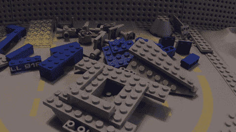
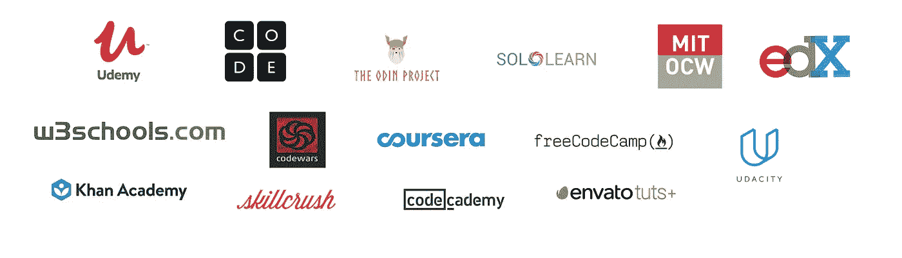
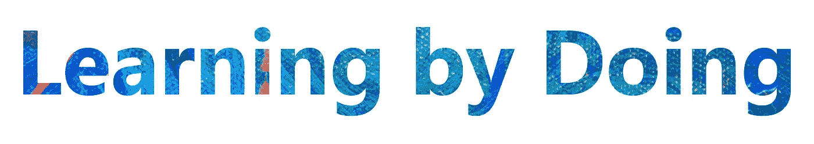
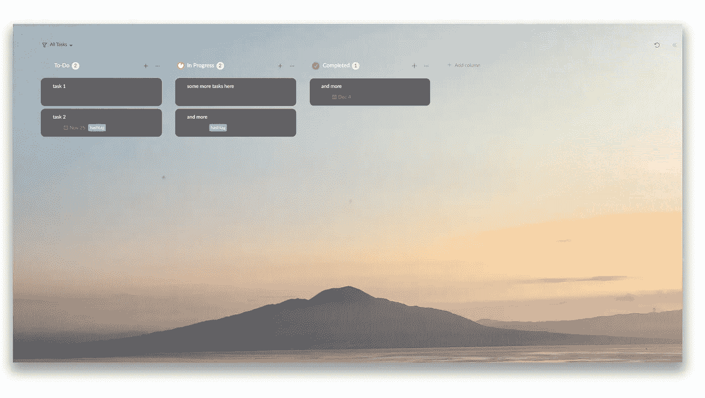
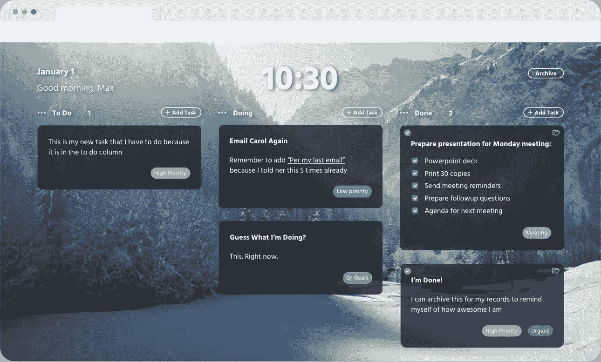
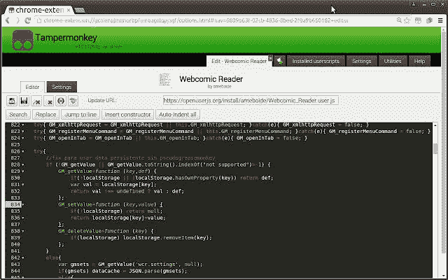
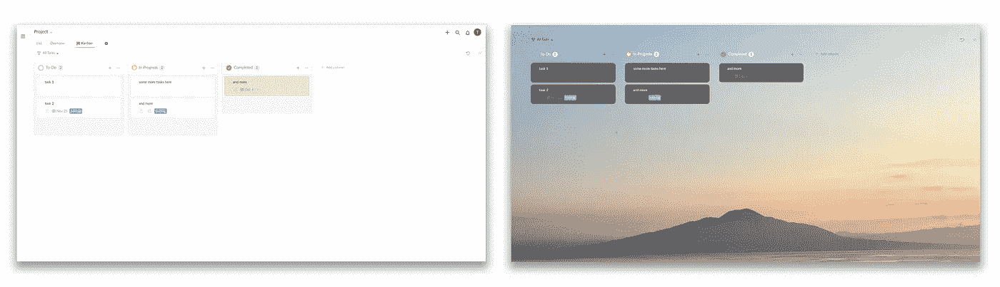
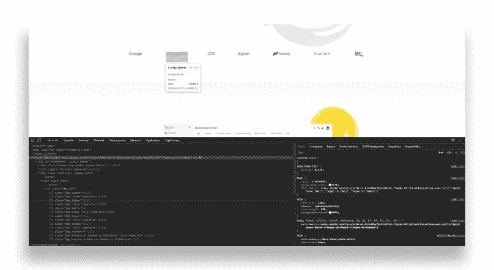

# 成功完成第一个编码项目的 3 个步骤

> 原文：<https://javascript.plainenglish.io/3-steps-to-successfully-complete-your-first-coding-project-2db4b1ed7e26?source=collection_archive---------12----------------------->



Image from [vintagelegobuilder, gfycat.](https://gfycat.com/meanchillyindianrhinoceros-spaceship-lego)

在整个疫情，你可能会被家人或朋友问到: ***“我怎样才能学会编码？”*** 或者你自己有问， ***“我应该学会编码。你实际上是如何开始的？”***

**简单的答案是项目和心态。大多数受过正规教育或自学成才的程序员会告诉你，虽然了解术语和概念也很重要——可以从在线阅读、课堂、YouTube 上获得——但他们日常使用的工作知识来自于他们对项目的投入。**

## “学习编码”市场如何证明你的道路(糟糕)


Image from [Quang, Pexels](https://www.pexels.com/photo/boy-playing-on-slide-in-playground-2143761/)

即使你的孩子想探索，你仍然让你的家“对儿童安全”,以确保你的孩子是安全的，并且可以在下楼梯或撞到沙发上，或者做任何孩子们做的事情时，度过一段充满挑战但又值得的时光。同样，为想进入编码领域的个人建立“游戏场/沙箱”也很重要。



Sample of Popular Online Coding Sites. Image by Author.

不幸的是，虽然许多在线课程确实向学习者传授了有价值的知识，但许多人受到“儿童防护”方法的困扰，这种方法使用分步作业，让学习者感到无聊和困惑，不知道他们为什么要学习手头的主题。鉴于这些课程是在线的，并且为学习者提供了在任何时间点开始学习的灵活性，这种“儿童防护”的方法仍然是需要的。

然而，当你完成这一章/项目时，这种方法不会产生真正的兴奋或奖励——这就像是在父母的指导下建造一个游乐场，在那里，你被手牵着，在一个净化的环境中人为地制造每个小障碍。



Image by Author.

## 儿童保护和边做边学

在这篇文章中，我将展示一种方法，在你完成一个项目时，既能防止儿童误操作，又能保持兴奋的感觉。这种方法并不依赖于儿童安全的游乐场本身，而是帮助你建立一种心态，知道你应该如何接近游乐场。

> 你将自己的兴趣和目标与你所追求的项目相匹配的能力与项目完成的可能性以及你从完成项目中获得的满足感相关。

了解如何进行故障诊断，当你有问题时去哪里找，以及当你被难住时主动参与社区(在线或面对面)也有助于保证项目的成功以及你学习能力的效率。

在这篇文章中，我将展示一个 ***“制定战略，评估，然后全力以赴”*** 的方法:1)选择你的第一个项目；2)我最近的一个副业的一步一步分解(下面截图)。



To-Do list hacked together with Quire and Tampermonkey. Image by Author.

# 基本原则:选择一个项目，尝试一下


Image from [NESA by Makers, Unsplash](https://unsplash.com/photos/IgUR1iX0mqM)

真正的挑战不是学习编码——挑战是选择、管理和跟进一个项目。

几个月前，我做了一个关于:**今年夏天开始你自己的编码项目**的演讲，演讲对象是大 DC 都会区**的学生。**TL；dr 版本是:

1.  **想想你对什么感兴趣**——如果一个项目主题不能引起你的兴趣，你就不会完成它。
2.  理解你为什么想要承担一个项目,“我想学习如何编码”是不够的。如果你精通编码，你会做什么，你想做什么？研究告诉我们，如果你把它写在一张纸上，你实际去做的可能性会增加 1.2 到 1.4 倍。
3.  和你的朋友谈论你的想法——和别人一起集思广益比呆在筒仓里要好。如果可能的话，找一个你身边的人，如果你陷入困境，你可以随时去找他。陷入困境——真的陷入困境——而边做边学是艰难的；永远有一个导师或朋友。如果没有人在你的个人网络中，那么 Medium 和 Stack Overflow 上的社区就是你的盟友。
4.  **一旦你建立了这个基础，阅读 Github 上的**到[牛逼列表](https://github.com/EthicalML/awesome-production-machine-learning)，浏览 Adafruit 或其他创客网站上的[传感器，探索来自 Reddit 线程或媒体的链接，比如这个](https://www.adafruit.com/category/35) [Python wiki](https://www.reddit.com/r/learnpython/wiki/index) 或[这个线程](https://www.reddit.com/r/learnprogramming/comments/ge37nr/how_to_start_a_coding_project/)。然后，把这些具体的项目和开源代码与自己的目标和兴趣匹配起来。


Image from [Mirko Blicke, Unsplash](https://unsplash.com/photos/V_y81v_lI4k)

我们有效地做到了:1)通过将你的个人兴趣/目标与你所做的项目相匹配，创造了一个坚实的基础。2)创建了一个面对面的支持网络，以交流想法和排除故障。3)将项目的范围限制在可管理的水平——你将在网上看到的许多开源项目将不会是杂乱无章的企业级代码，而是将只完成一件或几件事情，这意味着它们将有助于限制雄心勃勃的第一次编码者的想象力。

# 一旦你有了一个项目:3 个严肃的步骤



Screenshot of [Scrumptious, a Chrome extension](https://www.scrumptioustab.com/)

我想到了一个项目。它是可管理的，有一个具体的目标，我知道我必须用一些 Javascript 来实现它。我们的目标是让“美味”——一个当你在浏览器上打开一个新标签时弹出的看板仪表板——保存跨设备的任务。以下是实现这一目标的步骤。

> 提示:虽然下面包含要复制和粘贴的代码。看提示本身。这完全取决于你的心态和你周围的资源。

## 1.研究并与朋友聊天

在阅读了关于构建 Chrome 扩展的文章并了解了它们的工作原理和限制之后，我联系了我的朋友 Uros Randelovic，一位全栈开发人员。我们一致认为，最好的方法是，甚至在深入研究 Chrome 的[存储 API/localStorage](https://developer.chrome.com/extensions/storage) 之前，我们应该发布到[扩展的 Github repo。](https://github.com/maxwfreu/ScrumptiousTab)

在我们等待回购回应的同时，我也开始研究其他看板生产率平台，发现了 [Quire](https://quire.io/) ，它反映了使用中的美味，有一个很棒的移动应用程序，并在简单但强大的部门中引起轰动。然而，它缺少美味的氛围。

## 2.收集工具并构建



Image from [Tampermonkey Chrome Web Store](https://chrome.google.com/webstore/detail/tampermonkey/dhdgffkkebhmkfjojejmpbldmpobfkfo)

对于这样一个快速的项目，我们的目标是尽快得到一个日常使用的功能版本。为此，我找到了一个用户脚本管理器 [TamperMonkey](https://chrome.google.com/webstore/detail/tampermonkey/dhdgffkkebhmkfjojejmpbldmpobfkfo?hl=en) (你可以在这里和[这里](https://hibbard.eu/tampermonkey-tutorial/)了解更多信息)，它可以让我们注入小的 JavaScript 代码片段来改变网站的行为。

通过谷歌搜索“CSS 编辑 Tampermonkey”，我发现了这个帖子:[如何在 Tampermonkey 内编辑 CSS](https://sinister.ly/Thread-Tutorial-How-To-Edit-CSS-within-TamperMonkey-Edit-Sites-CSS)。

```
// add additional css styling to the page
function addGlobalStyle(css) {
   var head, style;
   head = document.getElementsByTagName('head')[0];
   if (!head) { return; }
   style = document.createElement('style');
   style.type = 'text/css';
   style.innerHTML = css;
   head.appendChild(style);
}// add specific css snippets to inject here
addGlobalStyle('body { color: white; }');
```

这段代码片段是我对 Quire 外观进行编辑的基础。



Left: Quire before Tampermonkey. Right: Quire after. Image by Author.

使用 Tampermonkey 默认模板，并在 Quire 中使用 CSS(了解如何检查和编辑站点上的元素[这里是](https://developers.google.com/web/tools/chrome-devtools/css))，我为特定的仪表板添加了全局变量，以激活这些 CSS 片段和用作背景的图像。您可以将完整的代码复制到 Tampermonkey 中，用于您自己的 Quire dashboard。



Playing with CSS elements on Chrome. Image by Author.

每个 Tampermonkey 脚本开始时的默认设置:

```
// ==UserScript==
// [@name](http://twitter.com/name)         Quire Pretty
// [@namespace](http://twitter.com/namespace)    [http://tampermonkey.net/](http://tampermonkey.net/)
// [@version](http://twitter.com/version)      0.1
// [@description](http://twitter.com/description)  Make Quire like scrumptious
// [@author](http://twitter.com/author)       T
// [@match](http://twitter.com/match)        [https://quire.io/w/to_do_/415/task?board=Kanban&filter=all](https://quire.io/w/to_do_/41/be_serene?board=Kanban&filter=all)
// [@grant](http://twitter.com/grant)        none
// ==/UserScript==
```

设置所需的两个全局变量:您想要用作背景的照片和适用于它的 Quire 项目(在 quire.io url 中找到)。

```
var url_in = '[https://images.unsplash.com/photo-1560861293-84835c7b92e7?ixlib=rb-1.2.1&ixid=eyJhcHBfaWQiOjEyMDd9&auto=format&fit=crop&w=1267&q=80'](https://images.unsplash.com/photo-1560861293-84835c7b92e7?ixlib=rb-1.2.1&ixid=eyJhcHBfaWQiOjEyMDd9&auto=format&fit=crop&w=1267&q=80');
var parent_section = /to_do/;// set background to your image
(function () {
    if (parent_section.test(window.location.href)) {
        if (window.getComputedStyle(document.body, null).getPropertyValue("background-color") == "rgb(255, 255, 255)") {
            console.log("Setting new background color...");
            document.body.setAttribute("style", `background-image: url(${url_in});background-size: cover;`);
        }
    } else {
        console.log('not the page');
    }
})();
```

将 css 片段注入到站点中。

```
// add css styles into the page
function addGlobalStyle(css) {
    var head, style;
    head = document.getElementsByTagName('head')[0];
    if (!head) { return; }
    style = document.createElement('style');
    style.type = 'text/css';
    style.innerHTML = css;
    head.appendChild(style);
};
```

在下面设置您的 CSS 编辑。

```
// css injections below
// tab header transparency
addGlobalStyle('.board-status-header { background-color: #796c6c00 !important; border-color: #ededed00 !important ; box-shadow: none !important}');
// status name
addGlobalStyle('.status-name { color: #ffffff !important; }');
// tabs
addGlobalStyle('.board-status-body { border-style: hidden; !important ; background-color: #fff0 !important; border-color: #ededed00 !important}');
// card color
addGlobalStyle('.task-card-row { background-color: #282829a8 !important; border-color: #ededed00 !important ; border-radius: 12px !important ;}');
addGlobalStyle('.task-card-content { color: #ffffff !important; }');
addGlobalStyle('.board .list-card-item.selected>.task-card-row { border-color: #b3f4ffc7 !important; }');
// hide header
addGlobalStyle('.header-wrap.navbar.navbar-default { max-height: 0px !important; }');
addGlobalStyle('#header { visibility: hidden !important; }');
// text edit box
addGlobalStyle('.task-input { background-color: #69696900 !important; color: #ffffff !important; border-radius: 6px; }');
// pull everything up
addGlobalStyle('#wrap { padding-top: 40px !important;}');
```

## 3.沿途故障排除

虽然我的日常工作围绕着 AI 和 90%的 Python，10%的其他编码语言(例如 C/C++)，但我之前并没有真正接触过 JavaScript。我遇到的一个问题是添加图像 url 作为全局变量。在谷歌搜索了一番后，我问[乌罗斯·兰德洛维奇](https://medium.com/u/5ab61f9f9e53?source=post_page-----2db4b1ed7e26--------------------------------)，他建议我调查[倒签](https://stackoverflow.com/questions/1408289/how-can-i-do-string-interpolation-in-javascript)——有道理……学到了一些新东西，好吧……进入下一件事。JavaScript 函数的语法？Mozilla 来了[救援。在拓宽问题之前，总是要搜索精确的问题，如果你真的被难住了，尽快问朋友或在 Stack Overflow 上发帖，这样你就可以更快地到达下一个障碍。](https://developer.mozilla.org/en-US/docs/Web/JavaScript/Reference/Functions)

# 快餐外卖

与许多“深入编码”的文章不同，我提倡制定策略，评估，然后深入编码。Quire+Tampermonkey 项目非常快，你可能会说它甚至不是一个完整的应用程序——事实上，它只是一个花哨的皮肤。

然而，这是浪费时间吗？我认为不是。这种方法的目标是**最大化首次编码人员的项目完成率，**让他们了解我们认为理所当然的编码 101(例如，如何解决问题和搜索什么)，并帮助他们探索 ***为什么*** 他们想要编码，以及**当他们可以点击他们已经完成的内容时的成功感**。

对于非编码人员来说，重要的是要注意这个项目是如何布局的。同样重要的是**设定明确的项目目标**，因为它是顺其自然的。如果你只是简单地*“学习编码”，*没有目标，只有地平线。通过谷歌和 Stack Overflow 进行自我学习，与比你更有知识的人交流——无论是在 Github repo 上发帖还是向朋友寻求建议——之间的流动性也很重要。

对于程序员来说，可以把这种方法想象成一个视频游戏教程，让用户在完成培训课程的同时，仍然感觉很有力量。编码中需要掌握的最重要的技能之一是解决问题，而达到这一点的唯一方法是通过试错——为什么不让试错沙箱变得有价值呢？

*本文由 Theo G 和 Uros Randelovic 合著*

> **关于 Theo:**Basil Labs 的创始人，Basil Labs 是一家大数据消费者智能初创公司，帮助组织量化消费者的去向和价值。
> 
> **关于 Uros:** 全栈开发者白天架构海量支付系统，晚上用 React 和 Node 制作 web apps。
> 
> 热衷于让计算机科学和数据科学变得更容易理解。更多文章，在 [medium 上找我。](https://uros-randelovic.medium.com/)