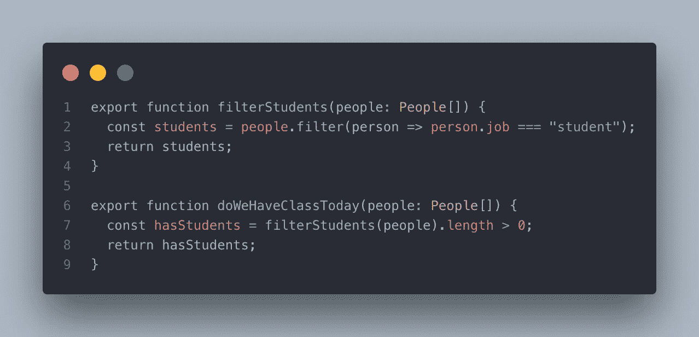
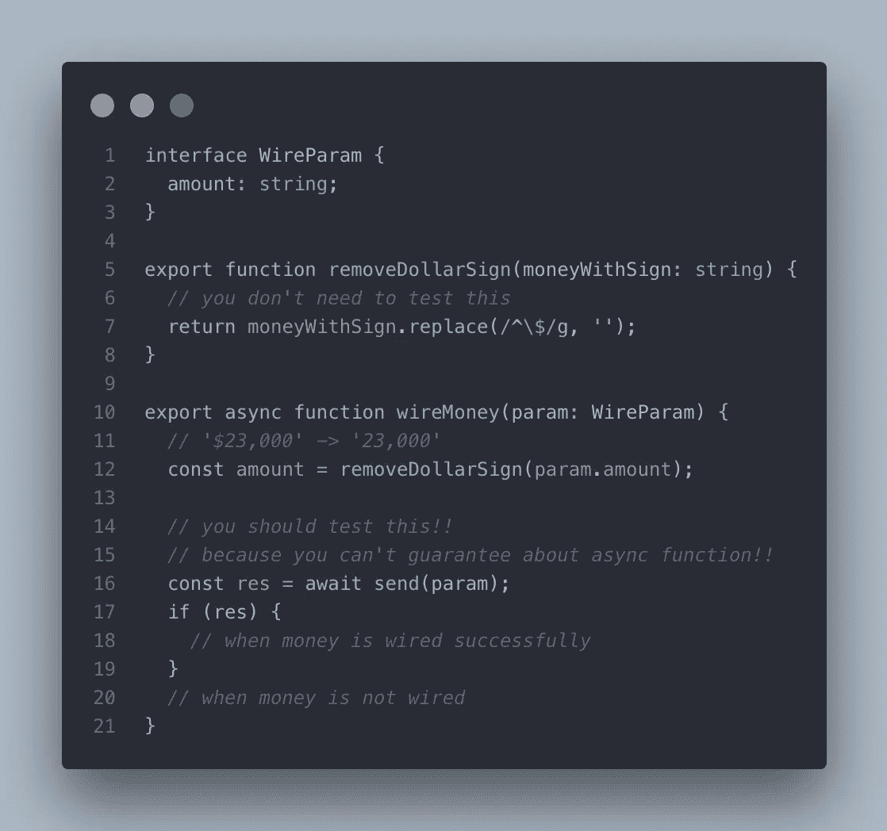
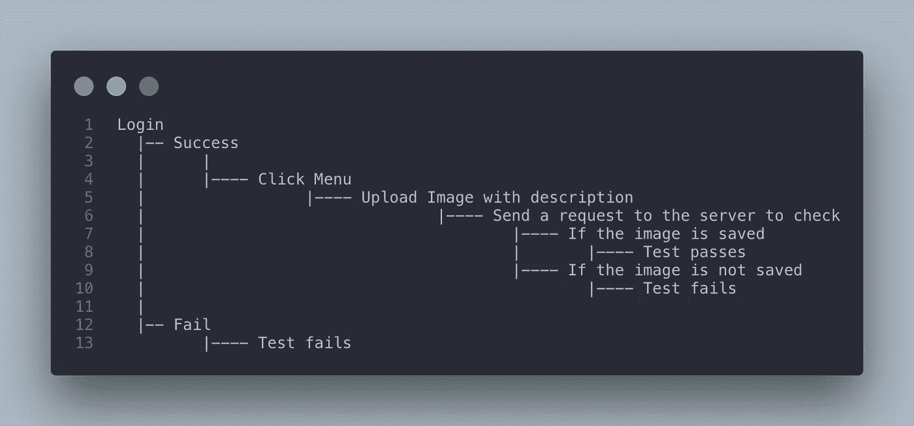

# 我从 JavaScript 测试中学到的 3 件事

> 原文：<https://javascript.plainenglish.io/3-things-i-learned-from-testing-in-javascript-94f295db2df7?source=collection_archive---------2----------------------->

## JavaScript 测试

## 我试图在我的工作项目中编写测试代码。这个帖子讲的是我从测试中学到的东西。

Photo by [Mometrix Test Prep](https://unsplash.com/@mometrixtestprep?utm_source=medium&utm_medium=referral) on [Unsplash](https://unsplash.com?utm_source=medium&utm_medium=referral)

答几个月前，我和我的团队启动了一个项目，花了四个多月才完成。它给了我教训，但也让我头疼。在我发布项目之后，回想起来，我学到了一些关于测试和编程的东西。这篇文章将谈论我从我参与的项目中的测试经验中学到的和发现的东西。

> D **isclaimer**
> 这个项目我没有做 TDD。在发布项目后，我编写了测试代码。为什么？因为我不知道测试是什么样的，测试代码应该是什么样的。是的，这是我第一次尝试写测试代码。

# 在告诉你测试代码之前，我应该让你知道我的项目环境。

在 JavaScript 测试中，有各种各样的库可供选择。摩卡、杰斯特、西农，不一而足。我的团队一直使用 Jest 作为测试库。Jest 是这一年中最受开发者欢迎和喜爱的测试库。

当然，您还有其他选择，每个库都有自己的特点。因此，你应该看看它们，为你的项目做出正确的决定。

NPM download trends — showing download counts about testing libraries

## 测试环境

*   Jest——Jest 再次成为目前最流行的测试库。我们看不出有任何理由不选择 Jest。
*   TypeScript — TypeScript 是一种由微软开发和管理的开源编程语言。TypeScript 可以减少人为的错误或失误，主要是在你通过传递参数来处理很多函数的时候。
*   puppet eer——puppet eer 是一个了不起的节点库，它允许你通过 Devtool 协议控制 Chrome 或 Chrome。我用木偶师做 E2E 测试。

## 我做了什么测试？

*   单元测试——单元测试是一种测试单元的方法。它通常用于测试项目的最小部分；例如，它们可以是函数。如果您有连接字母和将数字转换为字符串的函数，您可能想知道这些函数是否正常工作。那么你应该运行单元测试。
*   集成测试——集成测试是单元测试的下一步。如果您的两个函数`convertNumToStr`和`concatLetters`成功地通过了单元测试，现在您想知道当它们一起工作时是否也能工作。为什么我们需要集成测试是因为即使功能通过了单元测试，也不意味着它们也能通过集成测试。
*   E2E 测试——作为测试旅程的最后一步，我做了 E2E 测试。E2E 代表端到端，所以当你在 Web 中做 E2E 测试时，这意味着你测试你的场景，比如从登录到退出。在这个例子中，场景可以包括登录、将数字转换为字符串时连接字母，以及注销。

# 第一课。纯函数的重要性

回想起来，单元测试不容易的原因之一是函数的工作方式。

> 如果你不了解 TypeScript 接口，[这里是文档](https://www.typescriptlang.org/docs/handbook/interfaces.html)。

所以，看看这个例子。函数`filterStudents`接受一个`People`类型的数组，检索工作是 student 的学生，并返回该数组。

看起来还好，但是有个问题，很大的问题。当参数中没有学生时，将执行第 12 行，全局变量将被赋予不同的值。当你写一个函数的时候，你不应该在它的范围之外改变参数或者其他变量。在这种情况下，`classForToday`就不在功能范围内了。当其他函数试图接近它而不知道新值已被赋给它们时，给任何不在该范围内的变量赋一个新值都会产生副作用。

纯函数应该总是返回一个仅由其输入值决定的值。它们不应影响其范围之外的任何其他变量或状态。使用纯函数的一个好处是，你总是可以从它们那里得到返回值的类型。

 [## 理解 Javascript 变异和纯函数

### 通过更好地理解 JS 中的变异和纯函数来提升你的应用性能

blog.bitsrc.io](https://blog.bitsrc.io/understanding-javascript-mutation-and-pure-functions-7231cc2180d3) 

> 上面的帖子在解释什么是纯函数，如果你想了解更多关于纯函数的知识，你可以查看那个帖子！

所以函数应该像下面这样。

现在我们可以通过调用`doWeHaveClassToday`来检查我们今天是否有一个类，而不用改变任何不必要的变量。

# 第二课。"然而，我们为什么需要测试？"

当我告诉我的同事我想尝试编写测试代码时，我多次从他们那里听到这个问题。

> 我们不能亲自点击按钮吗？我明白测试很重要，但我怀疑它对我们是否有必要。

老实说，当我开始尝试的时候，我并没有认真对待测试。显然，当我的同事问我这个问题时，我无法回答。我觉得有人用一把结实的锤子敲了我的后脑勺。

我开始思考为什么要写测试代码，需要多少测试代码。然后很快，我意识到在测试时有两种类型的函数。我应该测试的功能和我不必测试的功能。那么是什么决定了哪个功能应该测试，哪个功能不应该测试呢？在我看来，这完全取决于你的项目是关于什么的。

[The creator of Socket.io](https://twitter.com/rauchg) left the tweet about testing

问题:*好的，但是我们为什么需要测试代码呢？*

假设您的项目中没有测试代码。您没有看到任何错误。一个月后，您的团队雇佣了一名新的开发人员，而她，这位新员工，想要探索这个项目。对她来说，掌握这个项目并不容易，因为她不知道哪些功能与主要功能相关。她努力学习代码，最后，在加入团队三个月后，她很好地掌握了这个项目。又一次，一个新的男性工人加入了这个团队，现在他必须做她做了三个月的事情来抓住这个项目。

这就是为什么测试很重要。当然，它主要是让你找出代码的边缘案例，但也让你更容易管理项目。如果团队有一个测试环境，那两个新员工就不需要花费如此多的时间和精力去查看代码。

# 第三课。E2E 测试很昂贵

在我编写了单元测试和集成测试的测试代码之后，我认为我可以继续以这种速度前进。但这是我的大错误。我不知道 E2E 是什么。我为 E2E 做的第一件事就是下载`puppeteer`。幸运的是，我知道如何使用`puppeteer`，我曾经在我的个人项目中使用它。这可能是为什么我低估了 E2E 的成本，因为我认为我知道如何使用`puppeteer`和如何使用 Jest。

没过多久，我就意识到自己是小池塘里的一条鱼。我甚至不是一条大鱼。

例如，这是我运行的 E2E 流程。

首先，我必须进入登录页面，填写表格并点击按钮。当登录失败时，测试应该立即失败。然后，下一步是单击菜单将图像上传到服务器。我把虚拟数据放在输入框里。因为我们已经为 dev-server 建立了一个数据库，所以我向服务器发送了 API 请求，将图像存储在数据库中。如果图像存储成功，测试将通过，否则将失败。

哇，一、二、三……这是一段只有六行的文字，解释了我的 E2E 故事是什么！但是不要尖叫。我有 300 行只是为了上传和检查图像。

我觉得很奇怪。尽管这是我第一次写 E2E，但它应该有更少的代码行。在这之后，我读了许多关于测试的文章，包括 E2E，并对如何做 E2E 做了研究。后来我发现我没有错。E2E 本身比其他测试需要更多的时间。

那我应该把 E2E 扔进垃圾桶吗？没有。当然，我不会在项目中到处写 E2E 代码，因为这会占用我太多的资源。昂贵的功能；这意味着它们与业务逻辑相关，值得进行测试。

# 下一步是什么？

如果评价我自己的测试技能，我觉得我是一个低中级测试员。我仍然对测试充满热情。从现在开始，我想学习一下测试工具，比如 Cypress 或者 TestCafe。

如果你正在考虑是否应该在你的项目中编写测试代码，我想说你可以从明天开始。尽管编写测试代码可能会让你感到疲劳和无聊，但拥有它们将是一次很棒的经历。

# 参考

*   [写测试，不要太多](https://kentcdodds.com/blog/write-tests)
*   [谷歌测试博客](https://testing.googleblog.com/2015/04/just-say-no-to-more-end-to-end-tests.html)