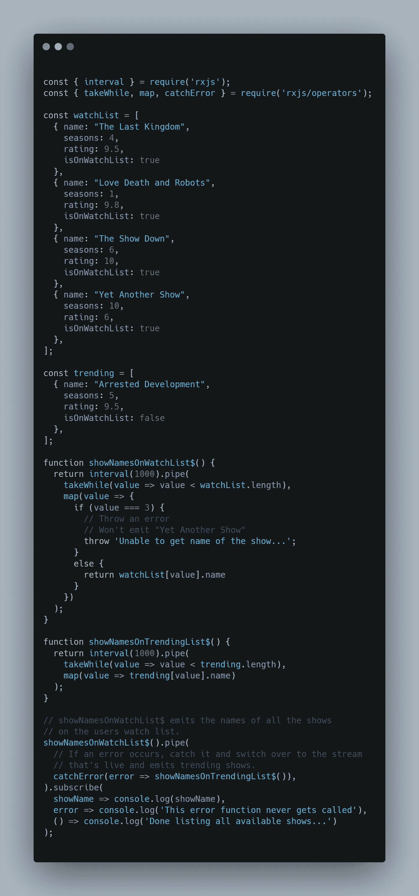
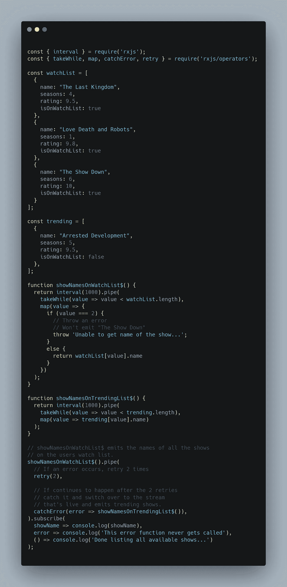
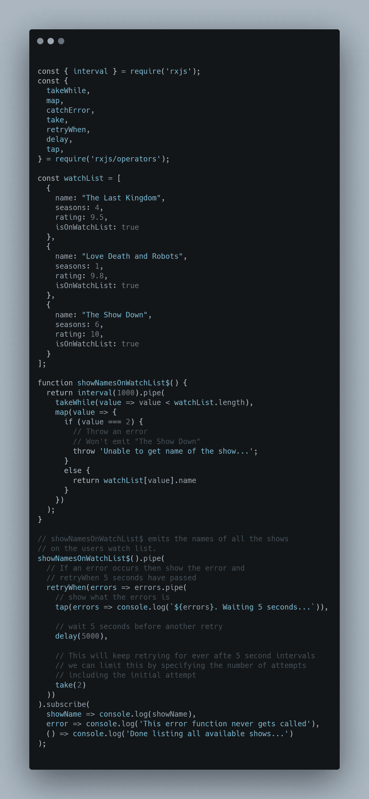

# RxJs 中处理错误的 3 种方法

> 原文：<https://javascript.plainenglish.io/3-ways-to-handle-errors-in-rxjs-97a04f2ecdc?source=collection_archive---------3----------------------->

## 反应式编程

## 使用 catchError、retry 和 retryWhen 运算符

# 介绍

在[上一篇文章](https://medium.com/javascript-in-plain-english/rxjs-explained-in-plain-english-9d2daa329f34?source=friends_link&sk=35b463907a24785e81bc0067b1824a42)中，我们讨论了术语和一些你在 RxJs 中应该知道的常用运算符。所以如果你不确定术语或者不太理解剧中不同的角色，一定要先读一下。

这个帖子是关于在 RxJs 中处理错误的。我们将使用 RxJs 提供的以下三个操作符深入研究何时以及如何处理它们:

*   捕捉错误
*   重试
*   重试时间

不再拖延，让我们直接开始吧。

**注意:** *你可以在* [*这个 Git 资源库*](https://github.com/Haseeb90/rxjs-error-handling) *中找到所有的代码示例。*

# 发生错误时会发生什么

正如我们在[上一篇文章](https://medium.com/javascript-in-plain-english/rxjs-explained-in-plain-english-9d2daa329f34?source=friends_link&sk=35b463907a24785e81bc0067b1824a42)中所提到的，一个可观察对象会发出一连串的值。在发出值时，可能会发生并发出错误。观察者应该能够处理发出的任何错误。

但是一旦可观察对象发出一个错误，该流将被终止，并且不会发出更多的项目。如果流被终止，应用程序将需要某种方式来处理它，否则它将崩溃。

反应式编程的核心原则之一是应用程序应该具有弹性。也就是说，我们应该能够在错误到达观察者之前处理它们。因为，如果在观察器上调用了错误函数，就意味着流被终止。

太晚了。

那么，有没有一种方法可以在 错误到达观察者之前拦截错误 ***并对其采取措施，使数据流不会被终止？或者，即使流被终止，有没有办法切换到一个可用的流？***

你猜对了。`catchError()`、`retry()`和`retryWhen()`操作符允许我们以不同的方式处理错误，根据您的用例，您可以使用这些操作符中的一个或组合。

让我们详细看看每一个。

# catchError 运算符

在 观察者得到错误之前，在 ***中截取错误。***

这里有一个类比来帮助理解:

我订阅了《网飞》。我按月付费。如果由于某种原因，网飞不能从我的信用卡中扣除费用，我会收到一封电子邮件，告诉我出了问题。

网飞发出了一个错误。

我，订户，可以在 之前处理那个错误 ***我的家人，观察者，看到它并且不能*观察*他们的内容。***

这里有一个具体的例子，演示了如何在 到达观察者之前从一个流 ***捕获错误，并切换到另一个流，以便观察者可以继续做它需要做的事情。***

Example of how to use the catchError Operator in RxJs

**注:** *上面显示的代码示例称为捕捉和替换策略。*

# 重试运算符

第三次是幸运符。

他们这么说。

真的是这样吗？或者他们，不管“他们”是谁，只是希望你继续努力，直到你得到你想要的东西。

但是一个人在放弃之前只能尝试这么多次。我忘了是谁说的了，但是他们把精神错乱定义为一遍又一遍地做同样的事情，却期望得到不同的结果。

`retry`操作符允许我们在放弃之前将*重新订阅*到源可观测值的指定次数。

所以，你给它下的定义有多疯狂，它就有多疯狂😉

让我们来看看在我们之前的例子中会是什么样子。

Example showing the retry Operator from RxJs

在这个例子中，我使用了`retry`操作符来捕捉错误，并使用*再次订阅*源可观察值两次。如果错误仍然出现，使用`catchError`操作符切换到另一个流。

**注:** *这将在* *初次尝试失败后再重试两次* ***。***

# retryWhen 运算符

`retry`操作员不耐烦了。固执。它不能相信某个东西失败了，只想马上再试一次。

另一方面,`retryWhen`算子允许我们等待，重拾信心，然后再试一次。如果你知道你尝试的服务需要一段时间才能恢复，立即尝试`retry`可能并不理想。

这就是所谓的延迟重试策略。

Example showing the retryWhen Operator in RxJs

# 结论

这个帖子到此为止。

现在，您应该对使用 RxJs 时如何以及何时进行错误处理有了一些了解。您还应该了解`catchError`、`retry`和`retryWhen`操作符是如何工作的。

**注意:** *如果你想了解更多关于这些操作符的知识，一定要查看这篇文章的参考资料部分。*

在 RxJs 的土地上还有更多的内容要介绍，但这应该会让您了解正在发生的事情。

如果您还没有阅读，请务必阅读本系列的第一部分:

 [## RxJs 用简单的英语解释

### 您应该知道的 7 个最常用的运算符

medium.com](https://medium.com/javascript-in-plain-english/rxjs-explained-in-plain-english-9d2daa329f34) 

下次再见，✌️和平

# 资源

 [## RxJS

### 正式文档

rxjs-dev.firebaseapp.com](https://rxjs-dev.firebaseapp.com/api/operators/catchError)  [## RxJS

### 重试官方文档

rxjs-dev.firebaseapp.com](https://rxjs-dev.firebaseapp.com/api/operators/retry)  [## RxJS

### 正式文档时重试

rxjs-dev.firebaseapp.com](https://rxjs-dev.firebaseapp.com/api/operators/retryWhen)  [## RxJs 错误处理:完全实用指南

### 错误处理是 RxJs 的重要组成部分，因为我们在编写的任何反应式程序中都需要它。错误…

blog.angular-university.io](https://blog.angular-university.io/rxjs-error-handling/)